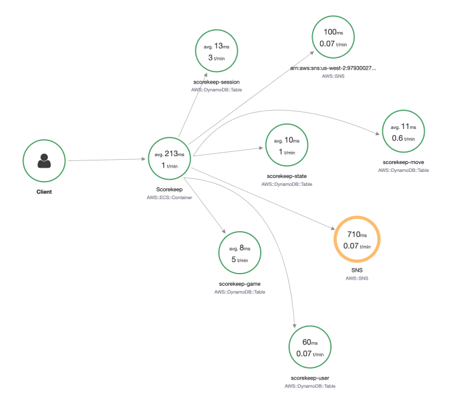
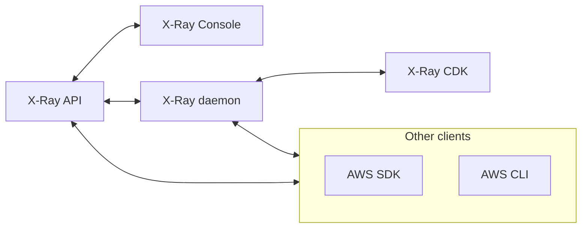
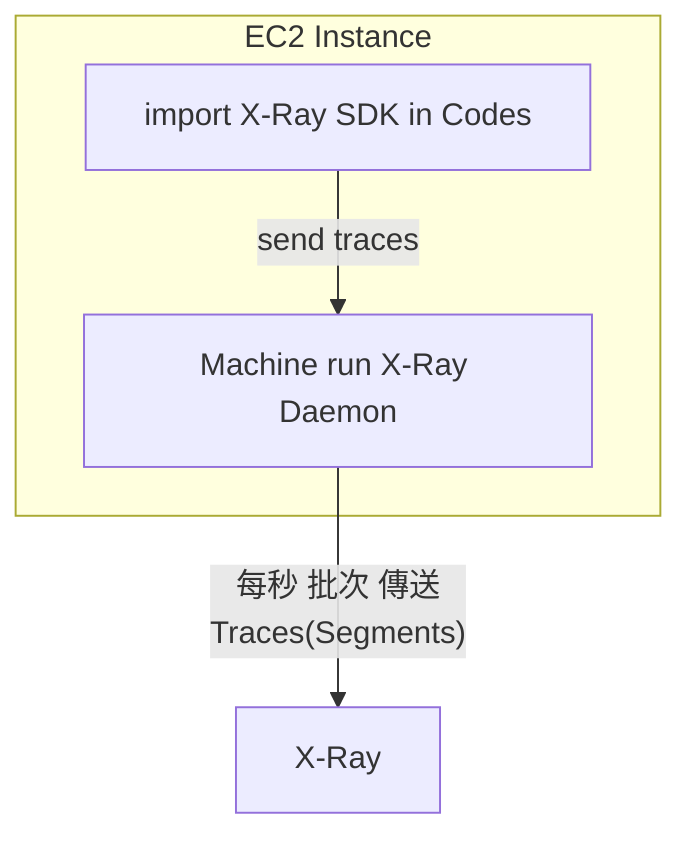

# X-Ray

- [What is AWS X-Ray?](https://docs.aws.amazon.com/xray/latest/devguide/aws-xray.html)
    - 視覺化 Request 近來到 APP 以後, 整個後端的資料流
- Tracing && Visual analysis for APP
    - 對於 Distributed System 排查很有幫助
    - 它會在我們的 Request 塞 "trace" 這神奇的東西
        - Trace: segments collected together to form an end-to-end trace
        - trace 裡頭由一系列的 `segments` 所構成
        - segment 又由一系列的 `subsegments` 所構成
        - 知道上面這細節概念的話, 對於 x-Ray 在 Coding 有幫助...
    - 而這 Request 發送到 AWS Resources 上頭, Resources 可針對 trace 做一些識別, 最終得出一個 Service Map
        - 
- Charge: 針對送到 X-Ray 的資料計費
    - X-Ray Sampling Rules(採樣規則) - 協助節省傳送到 X-Ray 的流量
        - 預設 X-Ray SDK 會紀錄:
            - 每秒鐘第一筆 Request
            - 該秒內其餘 5% 的 Request
        - Custom Sampling Rules
            - 可自行配置 (in Web Console, 改後無需重啟服務, 無需動 Code)
                - reservoir(池, 水庫) : ex: 10, 則表示每秒鐘蒐集前十筆
                - rate               : ex: 50%, 表示蒐集該秒內 幫我蒐集一半的請求
                    - 會花很多錢... 不過對於排查很有幫助
                - (還有其他...)
- [AWS X-Ray API](https://docs.aws.amazon.com/xray/latest/devguide/xray-api.html)
- Old way for debugging in production
- 可直接在 local test, 並 log -> anywhere
- 可對 分散式系統的 log 彙整, 並提供 UI, 可在 **X-Ray** Console 看到 Service Performance Status
- Use Cases:
    - 用來對 Performance 做 troubleshooting(bottlenecks)
    - pinpoint service issue
    - review request behavior




# X-Ray 使用方式

## 1. import SDK in Code 

```js
import AWS X-Ray SDK
```

- 動作上只需要加入少數的 Codes, ex:
    - Django
        - 需在 settings.py 增加 X-Ray 配置, 參考 [Configuring the X-Ray SDK for Python](https://docs.aws.amazon.com/xray/latest/devguide/xray-sdk-python-configuration.html)
    - Beanstlk
        - 配置 `/.ebextensions/xray-daemon.config`, 或是
        - 在` X-Ray Console` enable `X-Ray`
            ```yaml
            option_settings:
                aws:elasticbeanstalk:xray:XRayEnabled: true
            ```
    - ECS (有 3 種模式可使用)
        - ECS Cluster EC2 Type, 分別在 EC2 上頭運行一個 `X-Ray Daemon Container`
        - ECS Cluster EC2 Type, 裡頭運行的 Container, 都要有 `X-Ray Sidecar`
        - Fargate Cluster, ECS Cluster 裡頭, 每個 `Fargate Task` 裡頭的 `APP Container` 都需要再掛一個 `X-Ray Sidecar`
        - 上述的這些 sidecar, 都使用 Container 裡頭的 2000 port UDP 來做通訊
- (進階)或是如果要更加 客製化 的話, 則會有底下的議題:
    - annotations : Key Value pairs used to index traces and use with filters
    - interceptors
    - filters
    - handlers
    - middleware
    - subsegments (如果想要 segments 裡頭有更多細節的話)


## 2. Enable X-Ray

- EC2 Type - 需要 `install && run X-Ray Daemon`
- Farget Type - 需要 `enable X-Ray AWS Integration`

不管哪種方式, 都必需有適當的 IAM Role : `AWSX-RayWriteOnlyAccess`



- 支援底下的 Programming Language:
    - Java
    - Python
    - Go
    - Node.js
    - .Net
