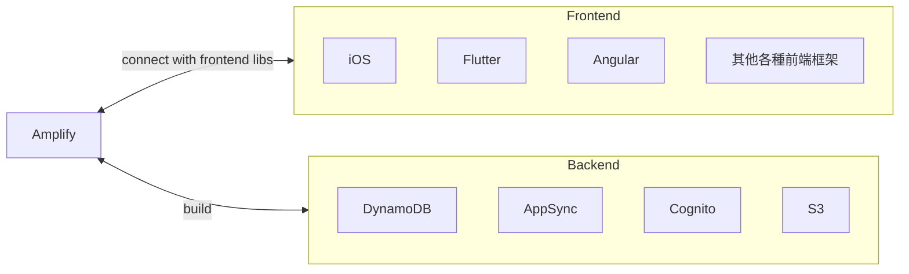
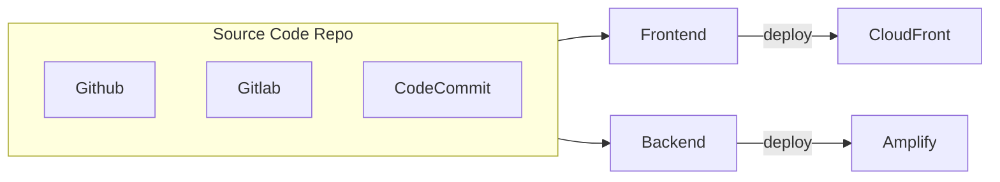

# Amplify

- [Deploy a Web App on AWS Amplify 101](https://aws.amazon.com/getting-started/guides/deploy-webapp-amplify/?nc1=h_ls)
- [Getting started](https://docs.amplify.aws/start/)
- 可視為用來建 mobile APP && web APP 的 beanstalk
- serverless
- 整合了各種 AWS serverless services

---


---

Amplify Hosting




# CLI

```bash
### init Amplify project
amplify init


### (尚未知)
amplify add hosting


### 新增 Auth
amplify add auth
    
### 新增 REST/GraphQL API
amplify add api


### Deploy API
amplify push


### Check Amplify's status
amplify status
##    Current Environment: dev
##    
##┌──────────┬───────────────┬───────────┬─────────────────┐
##│ Category │ Resource name │ Operation │ Provider plugin │
##└──────────┴───────────────┴───────────┴─────────────────┘
## 輸出


### 
amplify console api
```
