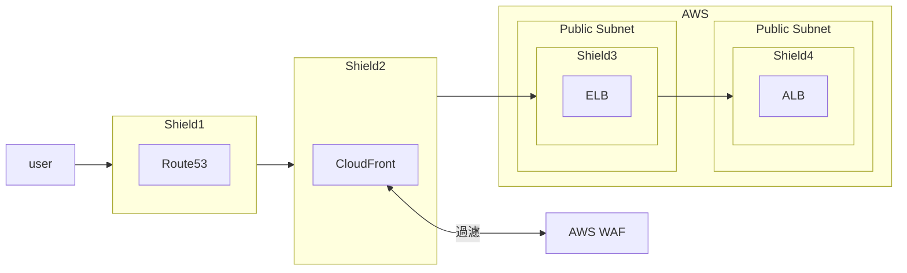
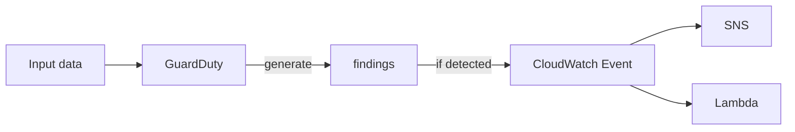
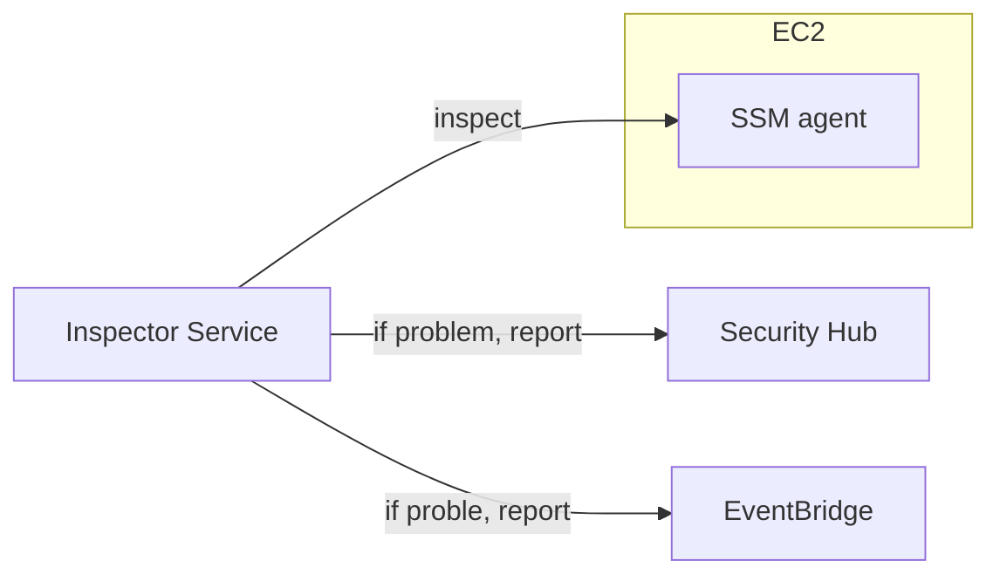
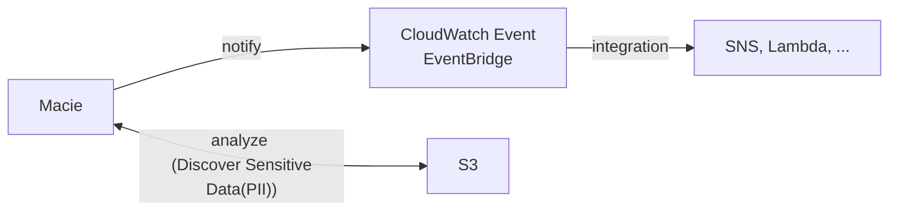

# AWS Security Group (AWS SG)

- 使用 AWS Console 增加 rules 需要注意的是, 別直接在 old rule 去修改, 而是直接新增新的(再砍舊的)
    - 因為這邊有個小坑 XD
    - (ex: 由 allow 0.0.0.0:80 改成 allow 其他 ALB, 點選下拉清單會找不到 ALB 選項)
- Naming: 無法使用 `sg-` 開頭

# WAF, Web Application Firewall

- [AWS WAF](https://docs.aws.amazon.com/waf/latest/developerguide/waf-chapter.html)
- 可用於保護底下這些 http(s) endpoints:
    - Amazon CloudFront distribution
    - Amazon API Gateway REST API
    - Application Load Balancer, ALB
    - AWS AppSync GraphQL API
    - Amazon Cognito user pool
- L7 Only
- 防護 CloudFront, ApiGw, ALB
- 可以設定 Web ACL 來做防護
    - 可以針對 IP, Header, Body, Uri 制定 rules
    - 可作 SQL Injection, Cross-Site Scripting(XSS) 防護
    - 可作 Size constraints, geo-match (屏蔽特定 Country IP)
    - Rate-based rules, 避免 DDoS

# AWS Shield

- Shield 分成 Standard 及 Advanced
    - Shield Standard
        - 預設已於 Route53, CloudFront 啟用
        - Free
        - 基礎的 SYN/UDP Floods, Reflection attacks, L3/L4 attacks, DDoS
    - Shield Advanced
        - 每個月 3000 美
        - DDoS mitigation service
        - 為 NLB, ApiGw, EC2, Global Accelerator, CloudFront, Route53 做進階防護
        - 24*7 access to AWS DDoS response team(DRP)
        - 可免除 DDoS 期間 ELB 流量暴增所造成的流量費用

# Penetration testing

- 如果使用 AWS 來跑服務, 對於底下的 Services 做滲透測試時, 不須知會 AWS (可自行測爆他)
    - EC2
    - RDS
    - CloudFront
    - Aurora
    - API Gateway
    - Lambda & Lambda Edge Function
    - Lightsail
    - Elastic Beanstalk

# [GuardDuty](https://docs.aws.amazon.com/guardduty/latest/ug/what-is-guardduty.html)

- AWS GuardDuty 是個 Security Monitoring Service
    - Foundational data sources(基礎資料來源) 方面:
        - CloudTrail managed events 及 event logs
        - VPC flowlogs
        - DNS logs
    - Features 方面:
        - Kubernetes audit logs
        - RDS login activity
        - S3 logs
        - EBS volumes
        - Runtime monitoring
        - Lambda network activity logs
- 幫你找出 AWS Account 的髒東西 / 惡意威脅 / 惡意 IP / 異常活動
    - by leveraging ML
- 用 ML && 3rd data, 來看 user account 是否 under attack
- Input data 包含了:
    - VPC Flow Logs
    - DNS Logs
    - EKS Audit Logs
    - EBS Volume data
    - CloudTrail Events Logs
        - CloudTrail Management Events
            - 從 *CloudTrail Event logs* 取 data, 來判斷是否有 unusual API call
        - CloudTrail S3 Data Events
- Charge: 30 天免費..

# [Inspector](https://docs.aws.amazon.com/inspector/latest/user/what-is-inspector.html)

- 用途
    - AWS 的 自動化漏洞管理, 幫你的 AWS 做健診
    - AWS Inspector 會持續不斷的 inspect(ONLY when Needed) AWS 工作負載, 來尋找 軟體漏洞 && 網路風險
- 能做些什麼, 範例:
    - EC2, Lambda, ECR, 用來做 **軟體的 near-real time 的 漏洞偵測** && **unintended network exposure**
    - 針對 **Centrally manage software bill of materials (SBOM)** 做 exports 管理
    - Inspector 會做風險分析, 可用來作為修復的優先級別依據
    - 
- Inspector 只能 inspect(檢測) 底下這些東西 ONLY:
    - EC2 
        - leverage *AWS System Manager (SSM) agent*, 分析異常流量 && OS 漏洞
        - database of vulnerabilities (CVE)
    - ECR Image
        - 當有人 docker push 就去評估 image/Container
    - Lambda Function
- 容易與 [Guardduty](#guardduty) 搞混
    - Inspector 比較像是主動去探測潛在威脅
    - Guardduty 比較偏向事後針對 log 找漏洞
- reporting & integrating with *AWS Security Hub*, 若發現問題會送到 *Amazon EventBridge*

# [Macie](https://docs.aws.amazon.com/macie/latest/user/what-is-macie.html)

- SaaS 的 Data Security & Privacy
    - ML && Pattern matching to discover && protect sensitive data
    - 也用來協助 identify && alert sensitive data, ex: personally identifiable information, PII
    - 標的主要是 data security && data privacy service
    - 容易與 [GuardDuty](#guardduty) 搞混

# AWS Security Hub

- Central Security tool, 用來管理 security, cross AWS accounts & automate security checks
- Charge: 燒錢~~
- 可將底下的服務集中到 Security Hub (但需要先 enable *AWS Config Service*)
    - GuardDuty
    - Inspector
    - Macie
    - IAM Access Analyzer
    - AWS System Manager
    - AWS Partner Network Manager

# Amazon Detective

- 因應 Security, 可用 GuardDuty, Macie, SecurityHub, ...
- 但如果要找出因果關係, 可使用 *Amazon Detective*
- 啟用後, 會自動蒐集底下這些, 來建立 view (用來呈現)
    - VPC Flows Logs
    - CloudTrail
    - GuardDuty

# AWS Abuse

> Report suspected AWS Resources used for abusive or illegal purposes

- 用來跟 AWS 反映違規使用的 Service
