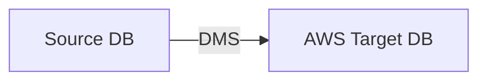
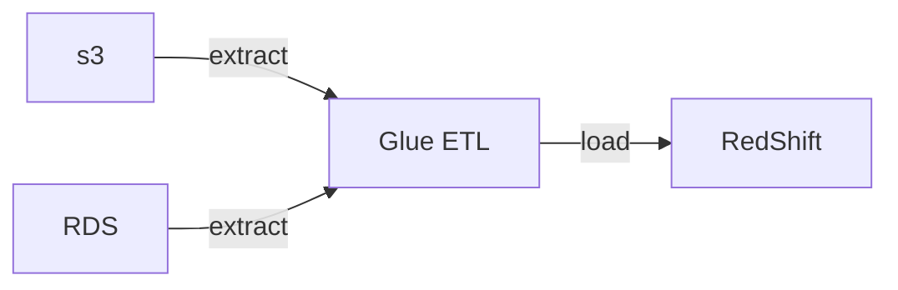

AWS Certificated Cloud Practitioner Course

CLF-C01

---------

# Type of Cloud Computing

On Premise    | IaaS | Paas | SaaS
------------- | ---- | ---- | -----
Application   | V    | V    | -
Data          | V    | V    | -
Runtime       | V    | -    | -
Middleware    | V    | -    | -
OS            | V    | -    | -
Visualization | -    | -    | - 
Servers       | -    | -    | - 
Storage       | -    | -    | - 
Networking    | -    | -    | - 

- 租機器 : EC2
- 存 data : EBS, EFS, S3
- 做 Load Balance : ELB
- 做 Scaling : ASG


# IAM: Identity and Access Management
    
- Group 只能有 Users, 不能 Group in Group
- assign Policy -> User/Group
    - Policy 內由 Permissions 組成 
- assign Role -> Resource
- IAM Policy Structure 裡頭要有這些:
    - Effect: "Deny" 或 "Allow"
    - Principle: 此 Policy 所附加的 account/user/role
    - Action: 此 Policy 作用的 action
        - ex: "s3:GetObject"
    - Resource: 此 action 附加的 Resource
        - ex: "arn:aws:s3:::mybucket"
- 又例如 Policy example: AdministratorAccess
    - Policy ARN: "am:aws:iam::aws:policy/AdministratorAccess"
    - ```json
      {
          "Version": "2012-10-17",
          "Statement": [
              {
                  "Effect": "Allow",
                  "Action": "*",
                  "Resource": "*"
              }
          ]
      }
      ```
- IAM Roles 重點:
    - users, services 存取 Resources, 都需要有對應的 Permission(Policy)
        - ex: *EC2 Instance Roles*, *Lambda Function Roles*, *Roles for CloudFormation*
- IAM Security Tools
    - IAM Credential Report (account level)
        - 帳號下所有用戶
    - IAM Access Advisor (user level)
        - IAM user 被授予了哪些 permissions &  哪個 permission 最近用過的時間                


# EC2, Elastic Compute Cloud

- 系列主機
    - t, General Purpose
    - c, Compute Optimized : ML, ...
    - r, Memory Optimized : RDB
    - m, Storage Optimized : OLTP, NoSQL, ...
- 常見訪問問題
    - timeout, 必然是 SG Issue
    - connection refused, app error 或 not launched
- EC2 Instance Connect, 目前未必每個 Region 都有此功能
    - 可直接使用 Web Console 做 login
- IAM Roles
    - 不要把 AWS EC2 credentials 放到 EC2, 要用 **IAM Roles**
    - 把特定 Roles assign 給 EC2 來提供 Credentials
    - 作法:
        - EC2 > Actions > Security > Modify IAM Role
- EC2 Instance 購買的 Options
    - On-Demand
    - Reserved
        - 1 or 3 年, 預付省更多
        - 分成:
            - Reserved Instance
                - 可省錢達 72%, 提前退租可在 **AWS Marketplace** 賣掉
            - Convertible Reserved Instance
                - 可省錢達 66%, 可改變 instance type, family, os, scope, tenancy
    - Savings Plans
        - 1 or 3 年, 預付省更多
        - 可省錢達 72%
        - 告知定期花費一定金額, 目的是為了長期使用 & 彈性省錢
            - ex: 承諾將來每月花 $300
    - Spot Instances
        - 短期使用, 超便宜, 但可能隨時 loss instance
            - 若自己的 max price < current stop price, 則失去 instance
        - 較適用於 batch job, data analysis, image processing, cc attack, ...
    - Dedicated Host
        - 直接訂閱實體機
    - Dedicated Instances
        - 非共用硬體
    - Capacity Reservations
        - 對特定 az 保留 capacity
        - 不做使用承諾, 但可保有 reserved capacity
        - 短期任務 && 重要(不可中斷), 適合用這種
- Instance 重點在於:
    - *on-demand*, *spot*, *reserved* 這 3 種, 搭配 *Standard*, *Convertable*, *Scheduled*
    - *Dedicated Host* vs *Dedicated Instance*


## EC2 Image Builder

- 用來自動化 create/maintain/validate/test
- AMI, container for EC2 instance
- 服務免費, 只對 Resource 收費
- 需要 allow **Image Builder** access Resources, 需要有 3 個 IAM Role
    - EC2InstanceProfileForImageBuilder
    - EC2InstanceProfileForImageBuilderECRContainerBuilder
    - AmazonSSMManagedInstanceCore
- 建立流程如下, 過程是情況, 可能花上數十分鐘
    ```mermaid
    flowchart LR
        ec2ib["EC2 Image Builder"];
        bec2i["Builder EC2 Instance"];
        ami[New AMI];
        tec2i[Test EC2 Instance];
        dAMI[Distribute AMI to multi-az];

        ec2ib -- create --> bec2i;
        bec2i -- create --> ami;
        ami --> tec2i;
        tec2i -- publish --> dAMI;
    ```
- 會依序建立 EC2 instance 來 Building, 之後還會建另一個來 Testing
- 若要刪除 instance, 需 terminate instance && Deregister AMI && Delete EBS snapshot


## EC2 Instance Store

- 相較於 EBS 快很多, 因為直接使用硬體
- 為 ephemeral storage, instance terminate 資料會消失
- 長久保存的話, 建議使用 EBS


# EBS, Elastic Block Storage

- 為 Network Device
    - 只能同時掛載到一台 Instance
        - 早期的 io1, io2 可同時掛載到多個 EC2
    - 只能存在於 az, 無法跨 az
        - 若要跨 az/region, 可藉由 snapshot
            - 做 EBS snapshot, 不需要 detatch, 但建議


# EFS, Elastic File System

- 可 attach 到 EC2 Instance 的 NFS
    - 可跨 az
- 若有成本考量, 可使用 **EFS-IA Lifecycle Policy**
    - EFS-IA, EFS Infrequent Access
    - 可省達 92%


# Amazon FSx

- 可使用 3rd 的 FS
    - AWS FSx for Luster (Linux & Cluster)
    - AWS FSx for Windows File Server
    - AWS FSx for NetApp ONTAP


# ELB, Elastic Load Balancing & ASG, Auto Scaling Group

- HA 通常與 Horizontal Scaling 共存 & 存在於多個 az
- Horizontal Scaling 方式
    - 增加 Instance & 使用 ASG & 使用 ELB
- 名詞解釋比較
    - Scalability: 藉由 scale up, scale out 來因應大流量
    - Elasticity: 若系統為 Scalability, Elasticity 指系統可因目前 load 來 auto-scaling 達成本最佳化
    - Agility: 指雲服務, 只需透過點點點, 就可以快速有資源來操作


# ELB, Elastic Load Balancer

- Load Balancer: 用來 轉發/分攤 流量的 server
- AWS 提供的 Load Balancer
    - L7 : application
    - L4 : TCP & ultra-high performance
    - Classic Load Balancer : 同時有 L7 & L4 功能. 舊時代產物
    - Gateway Load Balancer
        - 2020/11 新增, 但這個與 VPC 較相關
- 配置 ELB, 後面必須要有 **Target Groups** & 對此設定他的 **Security Group** 來 allow traffic


# Database & Analytics

## RDS, Relational DataBase

- 需 run on EC2 (非 Serverless)
- AWS RDS, SaaS, Serverless. 有幾個常見的 DB:
    - MS SQL
    - MySQL
    - PostgreSQL
    - ...
    - Aurora (AWS 針對底下的 distribution 做了優化)
        - MySQL (5X 倍速優化)
        - PostgreSQL (3X 倍速優化)
- 東西存放在 EBS
- RDS 最多可配置 5 個 Read Replicas (scalability)
    - 可 Cross AZ
        - multi-az -> HA
        - multi-region -> read-replication scalability (但仍可作為 backup)
    - 可 Auto-Scaling, 一次 10~64 GB
- 可配置 Multi-Region Read
    - 不過 Cross-Region Replication 的流量費用要留意
    - App 就近讀取


### Aurora

- 比原生(OpenSource) 的還貴上 20% 以上, 但效能較強
- 此為 AWS Cloud Native Servie


### ElasticCache

- 有兩種
    - Redis
    - Memcache
- 需 run on EC2 (非 Serverless)


### DynamoDB

- HA + Cross 3 AZ replication 的 NoSQL
    - Key-Value
- Serverless DB
- Auto-Scaling 成本低
- 可依照訪問頻率選擇底下的儲存模式的 Table Class
    - Standard
    - Infrequent Access, IA
- 本身並無 Create Database 的概念
    - 動作為 Create Table, 如下範例
    - ```
      TableName: Products
  
      Primary Key
          Partition Key (needed)
          SortKey (optional)
  
      Attributes
          name
          age
          ...
          (每筆資料的欄位都可不同)
      ```
- DynamoDB - Global Table
    - 可作 active-active r/w replication


#### DynamoDB Accelerator, DAX

- DynamoDB fully managed in-memory cache
    - DynamoDB 專用的快取
    - 10x performance improvement


### RedShift

- RedShift 為 *Columnar Storage* (非 row based)
- Data WareHoust
    - OLAP
- 可下 SQL
- 基於 PostgreSQL 的 DB, 但非 OLTP(Online Transaction Processing)
    - Note: OLAP(Online Analytical Processing)
- 用來做 analyze 及 data warehouse
    - 10x performance
- Massively Parallel Query Execution, MBP Engine
- 可下 SQL, 並整合 BI
    - ex: QuickSight, Tableau, ...


### Amazon EMR, Elastic MapReduce

- 用來建 Hadoop Cluster
    - Hadoop ecosystem: Apache Spark, HBase, Presto, Flink, ...
- EMR 用來管 EC2 Instances, config, ...
    - 可 Auto-Scaling
    - 可用 Spot Instance (可能 loss instance)
- Use Case:
    - ML, Data Processing, Web Indexing, Big Data, ...


### Amazon Athena

- Serverless query service to perform analytics against s3 objects
    - 可下 SQL 對 S3 查詢
- 支援 csv, json, ORC, Avor, Parquet(built on Presto)
- Charge: USD $5/TB second
    - 因為 by scan 量收費, 若 data 有做 Compress 或 columnar 方式儲存, 可省下 $$
- Use Case:
    - ```mermaid
        flowchart LR;
        User -- load data --> s3;
        s3 -- Query & Analyze --> Athena;
        Athena -- Report & Dashboard --> QuickSight;
      ```
    - BI / analytics / reporting, analyze & query VPC Flow Logs, ELB Logs / CloudTrail trails, serverless SQL analyze S3, ...


### AWS QuickSight

- Serverless ML powered BI service to create interactive dashboard.
- 可 Auto-Scaling, auto embeddable
- 整合了 RDS, Aurora, Athena, RedShift, S3, ...
- Use Case:
    - Business analytics, Create Visualization, Perform ad-hoc analysis, Get Business insights using data, ...


### Document DB

- Aurora 為 AWS 基於 PostgreSQL/MySQL 的實作
- Document (同上)    MongoDB 的實作
- Replication 為 Cross 3 AZ
    - HA


### Amazon Neptune

- Graph DB
- Use Case: social network relation, ...
- Replication Cross 3 AZ
    - 可高達 15 個 Read Replicas


### Amazon QLDB, Quantum Ledger Database

- 可下 SQL
- 量子記帳本 DB
    - Financial Transactional Ledger
- 非去中心化 (de-centralize, 此仍為 Centralization)
- Serverless, HA
- Replication 3 AZ
- 可看到所有 Data 變更的 History (Ledger)
    - 資料皆為 Immutable (無法刪除)
    - 資料具備 Cryptographic Signature, 確保資料不會被刪除
- 相較於 Common Ledger Blockchain framework, 快上 2~3 倍


### Amazon Managed Blockchain

- de-centralization, 去中心化唷
- 可執行 Transaction without the need of trust
- 常被拿來與 Hyperledger Fabric, Etherenum 比較


## DMS, Database Migration Services



- Migration 過程可離線, 但建議離線 or 避免寫入, 以確保資料一致


## AWS Glue



- AWS managed extract, transform and load service(ETL)
    - Data Catalog Service
- Serverless
- 家族服務:
    - Glue Data Catalog
        - catalog of databases
        - 可整合 Athena, RedShift, EMR