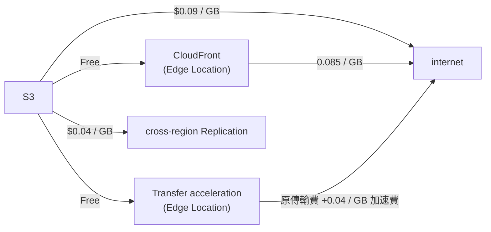
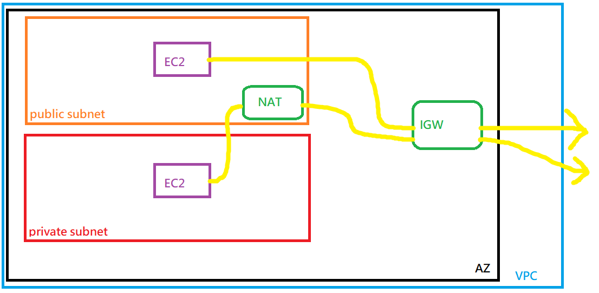

AWS Certificated Cloud Practitioner Course

CLF-C01


# Type of Cloud Computing

- Cloudshell 為 aws cli 的 Web Console 替代品
    - 但並非每個 Region 都有支援

On Premise    | IaaS | Paas | SaaS
------------- | ---- | ---- | -----
Application   | V    | V    | -
Data          | V    | V    | -
Runtime       | V    | -    | -
Middleware    | V    | -    | -
OS            | V    | -    | -
Visualization | -    | -    | - 
Servers       | -    | -    | - 
Storage       | -    | -    | - 
Networking    | -    | -    | - 

- 租機器 : EC2
- 存 data : EBS, EFS, S3
- 做 Load Balance : ELB
- 做 Scaling : ASG


# IAM: Identity and Access Management
    
- Group 只能有 Users, 不能 Group in Group
- assign Policy -> User/Group
    - Policy 內由 Permissions 組成 
- assign Role -> Resource
- IAM Policy Structure 裡頭要有這些:
    - Effect: "Deny" 或 "Allow"
    - Principle: 此 Policy 所附加的 account/user/role
    - Action: 此 Policy 作用的 action
        - ex: "s3:GetObject"
    - Resource: 此 action 附加的 Resource
        - ex: "arn:aws:s3:::mybucket"
- 又例如 Policy example: AdministratorAccess
    - Policy ARN: "am:aws:iam::aws:policy/AdministratorAccess"
        ```jsonc
        {
            "Version": "2012-10-17",
            "Statement": [
                {
                    "Effect": "Allow",  // "Allow" 或 "Deny"
                    "Principle": {},  // 此 Policy 附加的對象, ex: 「{"AWS": ["arn:aws:iam:...:root"]}」
                    "Action": "*",  // 或為 []
                    "Resource": "*",  // 或為 []
                    "Condition": []  // (optional)
                }
            ]
        }
        ```
- IAM Roles 重點:
    - users, services 存取 Resources, 都需要有對應的 Permission(Policy)
        - ex: *EC2 Instance Roles*, *Lambda Function Roles*, *Roles for CloudFormation*
- IAM Security Tools
    - IAM Credential Report (account level)
        - Web Console > IAM > Access Reports > Credential Report
        - 帳號底下的所有 users
    - IAM Access Advisor (user level)
        - Web Console > IAM > Users > (選 user) > Access Advisor
        - 特定 User 有權限 access 的 AWS Resources && 最近訪問的時間, 方便日後追蹤 && 修訂 權限


# EC2, Elastic Compute Cloud

- [EC2](./EC2.md)


# ELB, Elastic Load Balancing & ASG, Auto Scaling Group

- HA 通常與 Horizontal Scaling 共存 & 存在於多個 az
- Horizontal Scaling 方式
    - 增加 Instance & 使用 ASG & 使用 ELB
- 名詞解釋比較
    - Scalability: 藉由 scale up, scale out 來因應大流量
    - Elasticity: 若系統為 Scalability, Elasticity 指系統可因目前 load 來 auto-scaling 達成本最佳化
    - Agility: 指雲服務, 只需透過點點點, 就可以快速有資源來操作


## ELB, Elastic Load Balancer

- Load Balancer: 用來 轉發/分攤 流量的 server
- AWS 提供的 Load Balancer
    - L7 : application
    - L4 : TCP & ultra-high performance
    - Classic Load Balancer : 同時有 L7 & L4 功能. 舊時代產物
    - Gateway Load Balancer
        - 2020/11 新增, 但這個與 VPC 較相關
- 配置 ELB, 後面必須要有 **Target Groups** & 對此設定他的 **Security Group** 來 allow traffic


## ASG, Auto Scaling Group

- 可手動調整規模 OR 配置相關參數, 來做 auto scaling
    - Minimum Size
    - Actual Size/Desired Capacity
    - Maximum Size
- 調整的策略可以是 by CPU 或 by Network in/out 或 ...
- 而這些 scaling 的 strategy, 可以是 manual, 或是 dynamic:
    - Simple/Step Scaling - ex: CPU > 70%, then +1 台機器 && CPU < 30%, then -1 台機器 (這樣則是兩條策略規則 )
    - Target Tracking Scaling - ex: 設定  ASG CPU
    - Scheduled Scaling
    - Predictive Scaling


# S3, Simple Storage Service

- 物件儲存, 本身 Cross Region
    - Object Size Limit : 5 GB
    - 雖說 Bucket Name 跨 Region, 但 Bucket 仍須給定 Region
- Object file, ex: `s3://BucketName/123/456/orz.txt`
    - Key         : `123/456/orz.txt` (Object Paths)
    - Prefix      : `/123/456/`
    - Object Name : `orz.txt`
- Security
    - User Based
        - allow 特定有權限的 IAM access
    - Resource Based
        - Bucket Policy : Cross IAM. ex: Public Access
        - Object ACL
        - Bucket ACL
    - 若要訪問, 上述兩著需要其一 Vaild && 不存在 Deny


## AWS Snow Family

- highly secure && portable devices
    - 跨平台, collect/process data, 並做 edge computing && migrate into/out of AWS
- Data migration 家族成員
    - Snowcone      : 小型裝置(2.1 KG), 8TB
        - 資料塞進去後, 可寄回 AWS 或使用 **AWS DataSync**(裡頭已經安裝好 `DataSync agent` 了)
    - Snowball Edge : 有點大台的裝置, 適合 TBs && PBs 量級的資料 
        - Charge: 依照每次 data transfer job 計費
        - Object Storage (compatible with S3)
        - Spec:
            - Snowball Edge Stroage Optimized : 80 TB
            - Snowball Edge Compute Optimized : 42 TB
        - 可組成 Cluster (15 nodes)
    - Snowmobile    : 實體卡車這麼大, 一台 ~100PB, 適合 EB 量級
- Edge Computing
    - 若因特定因素, ex: 沒網路/在海上漂泊/在地底/荒郊野外..., 若要蒐集資料, 可用此家族裝置來做 edge computing
    - 家族成員
        - Snowcone      : 2 CPUs && 4GB && && 8TB && USB-C
        - Snowball Edge
            - Compute Optimized : 52 vCPUs && 208 GB RAM && 42 TB
            - Storage Optimized : 40 vCPUs && 80  GB RAM && 80 TB
    - Use Case: preprocess data, ML at edge, Transcode media. 最後再送回 AWS, 上 S3
    - Device 裡頭, 可運行:
        - EC2 instance
        - Lambda Function (using AWS IoT Greengrass)
    - 可租賃設備 1 or 3 年 有優惠
    - PC/client side 安裝 `OpsHub` 後可用 GUI 連入 Device
        - 可做簡易 config/send file/launch instances, monitor, ...
        - 早期只有 CLI


## Storage Gateway

- [saa-StorageGateway](./StorageGateway.md)
- 若要使用 Hybrid Cloud, 本地要 access cloud data, 需使用此服務
- 可針對 Block Storage && File && Object, 藉由 **AWS Storage Gateway** 做 bridge, 讓 On-premise client 使用
    - Block Storage : EBS, EC2 storage
    - File          : EFS
    - Object        : S3, Glacier


# Database & Analytics

## RDS, Relational DataBase

- [RDS 機器規格比較表](https://instances.vantage.sh/rds/)
- 需 run on EC2 (非 Serverless)
- AWS RDS, SaaS, Serverless. 有幾個常見的 DB:
    - MS SQL
    - MySQL
    - PostgreSQL
    - ...
    - Aurora (AWS 針對底下的 distribution 做了優化)
        - Provision Server
        - MySQL (5X 倍速優化)
        - PostgreSQL (3X 倍速優化)
- 東西存放在 EBS
- RDS 最多可配置 5 個 Read Replicas (scalability)
    - 可 Cross AZ
        - multi-az -> HA
        - multi-region -> read-replication scalability (但仍可作為 backup)
    - 可 Auto-Scaling, 一次 10~64 GB
- 可配置 Multi-Region Read
    - 不過 Cross-Region Replication 的流量費用要留意
    - App 就近讀取
- Encryption
    - rest encryption
        - for Oracle / SSMS, 可使用 Transparent Data Encryption, TDE
        - 需要在 launch time 決定啟用
        - Master 沒加密的話, Replica 也無法加密
    - in-flight encryption
        - SSL Certificate 來做上傳期間加密
        - provide SSL options with a trust certificates when ocnnecting to DB and will establish an SSL connection
        - 若要 force SSL
            - for PostgreSQL : 需要對 console Parameter Group 設定 `rds.force_ssl=1`
            - for MySQL : 需做 `GRANT USAGE ON *.* TO 'USER'@'%' REQUIRE SSL;`
- Security
    - Network Security : 使用 SG
    - Access Management : 
        - 使用 IAM 做規範
        - 若為 MySQL/PostgreSQL RDS, 也可使用 IAM-based authentication, 否則使用帳密認證
            - *authentication token*(15 mins) via IAM & RDS API call
            - EC2 也可藉由 **IAM Role** 來取得 RDS *authentication token*
                - 好處是, 流量都做 SSL 加密 && IAM(而非 DB) 管理 users


### Aurora

- 比原生(OpenSource) 的還貴上 20% 以上, 但效能較強
- 此為 AWS Cloud Native Servie


## ElasticCache

- 有兩種
    - Redis
    - Memcache
- 需 run on EC2 (非 Serverless)


## DynamoDB

- HA + Cross 3 AZ replication 的 NoSQL
    - Key-Value
- Serverless, Auto-Scaling 成本低
- 可依照訪問頻率選擇底下的儲存模式的 Table Class
    - Standard
    - Infrequent Access, IA
- 本身並無 Create Database 的概念
    - 動作為 Create Table, 如下範例
        ```
        TableName: Products

        Primary Key
            Partition Key (needed)
            SortKey       (optional)

        Attributes
            name
            age
            ...
            (每筆資料的欄位都可不同)
        ```
- DynamoDB - Global Table
    - 可作 active-active r/w replication
- [saa-dynamodb](./cert-SAA_C02.md#dynamodb)


### DynamoDB Accelerator, DAX

- DynamoDB fully managed in-memory cache
    - DynamoDB 專用的快取
    - 10x performance improvement


## RedShift

- RedShift 為 *Columnar Storage* (非 row based)
- Data WareHoust
    - OLAP
- 基於 PostgreSQL 的 DB, 但非 OLTP(Online Transaction Processing)
    - Note: OLAP(Online Analytical Processing)
- 用來做 analyze 及 data warehouse
    - 宣稱 10x performance than 其他 Warehouse
- Massively Parallel Query Execution, MBP Engine
- 可下 SQL, 並整合 BI, ex: QuickSight, Tableau, ...


## Amazon EMR, Elastic MapReduce

- 用來建 Hadoop Cluster
    - Hadoop ecosystem: Apache Spark, HBase, Presto, Flink, ...
- EMR 用來管 EC2 Instances, config, ...
    - 可 Auto-Scaling
    - 可用 Spot Instance (可能 loss instance)
- Use Case:
    - ML, Data Processing, Web Indexing, Big Data, ...


## Amazon Athena

- Serverless query service to perform analytics against s3 objects
    - 可下 SQL 對 S3 查詢做分析
- 支援 csv, json, ORC, Avor, Parquet(built on Presto)
- Charge: USD $5/TB second
    - 因為 by scan 量收費, 若 data 有做 Compress 或 columnar 方式儲存, 可省下 $$
- Use Case:
    - BI / analytics / reporting, analyze & query VPC Flow Logs, ELB Logs / CloudTrail trails, serverless SQL analyze S3, ...
        ```mermaid
        flowchart LR;
        User -- load data --> s3;
        s3 -- Query & Analyze --> Athena;
        Athena -- Report & Dashboard --> QuickSight;
        ```


## AWS QuickSight

- Serverless ML powered BI service to create interactive dashboard.
- 可 Auto-Scaling, auto embeddable
- 整合了 RDS, Aurora, Athena, RedShift, S3, ...
- Use Case:
    - Business analytics, Create Visualization, Perform ad-hoc analysis, Get Business insights using data, ...


## DocumentDB

- MongoDB
- Replication 為 Cross 3 AZ
    - HA


## Amazon Neptune

- Graph DB
- Use Case: social network relation, ...
- Replication Cross 3 AZ
    - 可高達 15 個 Read Replicas


## Amazon QLDB, Quantum Ledger Database

- 可下 SQL
- 量子記帳本 DB
    - Financial Transactional Ledger
- 非去中心化 (de-centralize, 此仍為 Centralization)
- Serverless, HA
- Replication 3 AZ
- 可看到所有 Data 變更的 History (Ledger)
    - 資料皆為 Immutable (無法刪除)
    - 資料具備 Cryptographic Signature, 確保資料不會被刪除
- 相較於 Common Ledger Blockchain framework, 快上 2~3 倍


## Amazon Managed Blockchain

- de-centralization, 去中心化唷
- 可執行 Transaction without the need of trust
- 常被拿來與 Hyperledger Fabric, Etherenum 比較


## DMS, Database Migration Services

- [saa-DMS](./cert-SAA_C02.md#database-migration-service-dms)


- Migration 過程可離線, 但建議離線 or 避免寫入, 以確保資料一致


## AWS Glue

- [saa-Glue](./DatabaseAndStorage.md#aws-glue)


# Other Compute Services: ECS, Lambda, Batch, Lightsail

## ECS, Elastic Container Service

- [ECS](./ECS.MD)
- 用來 Launch Container
    - 需自行維護 EC2, ECS 則用來 start/stop Container
- 可整合至 ALB(Application Load Balancer)


## Fargate

- Serverless
- 同 ECS 用來 Launch Container, 但不需要自行維護 Infra


## ECR, Elastic Container Registry

- Private Registry
- 用來存 ECS/Fargate 所運行的 image


## Lambda

- 最初最初, 雲服務最早的 Serverless 為 AWS Lambda, 當時是 `Serveless == FaaS`
- 目前 Runtime 並非任何語言任何版本都有, 僅部分語言有支援
    - 目前無 Docker Runtime
- Charge: Pay per request and compute time
    - charge by call & running duration
    - Free tier: 每月 100w 次 && 40w GB Compute Time
        - 約 40w sec (with 1G RAM)
        - 約 320w sec (with 128G RAM)
    - 超過免費額度, 後續 60w GB/sec for $1
- Event-Driven
- 可藉由 CloudWatch 來做 monitoring
- 每個 Lambda Function 可設定打 10GB RAM
- 比較特別的是, Lambda Container Image
    - 可用 Lambda 運行容器服務, 但是 Image 需要實作 Lambda Runtime API
- Use Case
    - User 上傳 png -> S3, 背後 trigger 把 png 縮小後, 另外儲存, 可用 Lambda
    - Serverless CRON Job. 藉由 **CloudWatch** 或 **EventBridge** Event 來 trigger Lambda FN


## API Gateway

- [API Gateway](./APIGateway.md)
- Serverless & Scalable
    - RESTful API
    - WebSocket API


## API Batch

- 背後會起 EC2 或 Spot Instance 來運行 Batch job
    - 因此非 Serverless
- Batch Job 背後其實是個 Docker Image, 運行在 ECS (用來跑 Batch Job)


## Compare Batch and Lambda

catalog      | Batch                      | Lambda
------------ | -------------------------- | ----------------
timeout      | No                         | Yes, 15 mins
Runtime      | Any                        | Specific
Storage      | EBS, instance storage, ... | Limited
infra        | 背後為 ECS & EC2            | Serverless


## AWS Lightsail

- Lightsail 是個 Virtual Server
    - Storage, DB, Networking (我忘了這邊在寫啥了)
- 此為 EC2, RDS, ELB, EBS, R53, ... 的替代方案
    - lightsail 是個 Standalone Service
- Cloud Beginner 可用這個
    - 很像 Synology 上頭的服務... 點點點就起服務了
    - UI 導向
- 可用來做 Dev, Test Envir
- 有 HA, 但無 Auto-Scaling
- 幾乎無法與其他 AWS Services 整合 (幾乎自成一體)


# Deployments, Managing Infrastructure at Scale

- 各種部署到 AWS 的方式 & 服務


## CloudFormation

- User 定義 Template, 並藉由 Tempalte(JSON, YAML) 建立 Stack
    - AWS 則在背後 提供 Resources
- IaaS
    - 可只用來管 Infra
- JSON, YAML config, 告知 SG, EC2, S3 (if ELB), 它會建立 Resource
    - 若要刪除 Resources, 也可由 CloudFormation 來刪除. 他會一併刪除依賴 
- Infra 內的 Resources, 都有相同的 tag(方便辨識)
- 可用 **CloudFormation Template**, 協助估 Cost
- 例如 Dev Env
    - 可設定 08:00 ~ 17:00 開 Env, 其餘時間關閉. 可 Cost Down
- 幾乎支援 All AWS Services


## AWS CDK, Cloud Deployment Kit

- 可用各種程式語言來定義 infra, CDK 會將此 compile 成 CloudFormation 所需要的 JSON/YAML
    - 感覺很像是給 Developer 玩的=.=
- 因此可用 CDK 來一口氣 Deploy: Infra && Your Code


## AWS Beanstalk

- 給純 Developer 用的
    - PaaS
    - 如果 Dev 懶得 config Server, 懶得 config DB, ...
        - 但仍可控制架構
- Charge: Beanstalk is free, charge for AWS Resources
- Monitoring
    - 有 BeansTalk 自己的 Monitoring, 叫做 **Health Agent**, 他用來 push metrics 到 **CloudWatch** && publish **Health Events**
- Beanstalk 背後會去使用 CloudFormation
- Example, 有個 3-tier APP
    ```mermaid
    flowchart LR;

    subgraph asg
    az1["EC2"];
    az2["EC2"];
    end

    User --> elb["ELB \n (Multi-AZ)"];
    elb --> asg;
    asg --> ElasticCache;
    asg --> RDS;
    ```


## AWS CodeDeploy

## AWS CodeBuild

## AWS Pipeline

## AWS CodeArtifact

- 用來管理 Code 依賴. code dependencies, artifact management, ...
    - 也稱為 Code Dependencies
    - CodeBuild 可到 CodeArtifact 拉 dependencies
- Work with: Maven, pip, yum, npm, NuGet, Gradle, yarn, twine, ...


## AWS CodeStar

- 用來管理 Development Activities 的 UI
- Developer 快速建造 CI/CD 的好幫手
- 用來整合 **CodeCommit** && **CodeBuild** && **CodePipeline**
- 用這東西背後會一併 Create (反過來說, 如果不用 **CodeStar** 的話, 底下這些都需要自行處理):
    - CodeCommit
    - CodeBuild
    - CodeDeploy
    - CodePipeline
    - monitoring
    - Elastic Beanstalk
    - EC2
    - Cloud9
- 若要刪除 Project 的話, 先刪除 **Cloud9**, 再來刪除 **CodeStar** Project


## AWS Cloud9

- Cloud IDE
- edit the code "in-the-cloud"


## AWS SSM, Systmes Manager

- Hybrid. 可管 EC2 && On-Premise instances
- 用來做
    - automative patching
    - enhance compliance
    - 對整個 EC2 fleets 下指令(有點像 ansible...)
    - 協助儲存 param configuration
        - by **SSM Parameter Store**
- For Win & Mac & Linux
- 機器需安裝 *SSM Agent* (某些類型的 EC2 預設已安裝)


### SSM Session Manager - Systems Manager

- 用來 access EC2 的一種方式
    - by *SSM Session Manager* (免開 ssh port)
- 也會 send log -> **S3** or **CloudWatch**
    - 需要有合適的 IAM Role: `AmazonSSMManagedInstanceCore`


## AWS OpsWorks

- 此為 AWS 魔改 Chef & Puppet
    - 若上 AWS 前已在使用, 則可接續使用 **AWS OpsWorks**
    - 用來配置主機
- 讓 ops 用來管理 cloud/on-premise instance
- `AWS OpsWorks = Managed Chef & Puppet`
    - AWS OpsWork 為 SSM 另一套替代品


# Global Infrastructure Section

- Cloudfront (CDN), Edge Locations, 也稱為 Points of Presence
- S3 Transfer Acceleration, 加速 upload/download
- AWS Global Accelerator, 加速 App availability & performance
- AWS 的網路流量, 僅對 outbound 收費, 如下




## Route53

- 分成四種 routing policy
    - Simple Routing Policy
        - 路由到標的 Server 不做 Security Check
    - Weighted Routing Policy
        - 路由到標的 Server, 會排除掉 unreachable 的機器
    - Latency Routing Policy
        - 依 TTL, Routing 到最快的 Node
    - Failover Routing Policy
        - 可設定 Primary Node 與 Failover Node
        - 之前用到的 DNSPod 也有這樣的配置


## CloudFront

- CDN
- 其中一個功能可做 DDoS Protection
- 整合 Shield, AWS Web Application Firewall (WAF)
- by using CloudFront's *Origin Access Identity(OAI)* to enhance security
    ```mermaid
    flowchart LR;

    User --> Edge;
    Edge -- private --> S3;
    S3 -- OAI --> oia["Origin Access Identity + S3 Bucket Policy"]
    ```
- Cloudfront 可作為 ingress(入口), 來上傳 file -> S3
    ```mermaid
    flowchart LR;

    subgraph origin
    S3;
    http["HTTP Server"];
    end

    client --> cloudfront["Cloudfron(Local Cache)"];
    cloudfront --> origin;
    ```


## S3TA, S3 Transfer Acceleration

- 用來加速 file 上傳到 S3
- Charge: +0.04 ~ 0.08 / GB
- 速度可能 + 50 ~ 500%
- S3 -> CloudFront, 傳輸免費. 不過再由 CloudFront -> Internet, 則為 0.085 / GB


## AWS Global Accelerator

- 利用 Edge Location 優化 AWS Global Network 來改善 *availability* && *performance*
    - 用戶訪問 AWS Edge, 再由 Edge 走 private network 到 後端服務(ex: ALB)
        - 藉由 static IP(Anycast IP)
- *AWS Global Accelerator* && *CloudFront* 皆使用 AWS private network 來優化效能
    - 兩者多多少少皆能抵擋 DDoS


## AWS Outposts

- *Outposts Rack*(此為 server rack), AWS 租/賣 硬體給公司, 用來供應 AWS Cloud Service
    - 而這個硬體, 基本上等同於公司內部使用的 private AWS 服務
    - 簡單的說, 把 AWS 私有化放自家
- 目的是, deploy AWS to Local


## AWS WaveLength

- *AWS WaveLength Zones* 為 infra deployments embedded within the telecommunications providers' datacenter at the edge of the 5G network.
- Charge: 沒有額外費用. 針對 Service agreements for using WaveLength 收費


## AWS Local Zones

- 此為把 EC2, RDS, ECS, EBS, ... 放到離 user 很近的地方(AZ)
- 可擴展 VPC 來跨 Region, 來讓 Service 靠近 Users
    - 讓 Region 裡頭的 AZ, 與 Region 外部的 *Local Zone*, 納入到同一個 VPC
        ```
        ------------ Region ------------
        |                              |   
        |  ---------- VPC ----------   |
        |  |                       |   |
        |  |    az1          az2   |   |
        |  |                       |   |
        ---|                       |----
            |                       |
            |      Local Zone       |
            |                       |
            -------------------------
        ```
- 並非所有的 Region 都支援此功能


# Cloud Monitoring

- [CloudWatch](./CloudWatch.md#aws-cloudwatch)
- CloudWatch 為所有的 AWS Services 提供 metrics
    - metric is a variable to monitor
    - 可到 **CloudWatch Dashboard** 查看監控結果
- Metrics example:
    - EC2: CPU Utilization, Status, Network'
    - EBS Volume: Disk R/W
    - S3 Buckets : BucketSizeBytes, NumberOfObjects, AllRequests
    - Billing : Total Estimated Charge (僅 us-east-1 有這功能)
- 預設來說, metric 為 5 mins 一筆
    - 可調整, 但越細越貴


## CloudWatch Alarms 適合

- 對 metrics 設 threshold, 來 trigger notification


## Amazon CloudWatch Logs

- 用來蒐集 log files
    - 須在監控端安裝 `cloudwatch log agent`
    - 用來做即時監控, 並可做永久保存
- 可將主機的 log file, 配置適當的 *IAM Permission*, 即可由此服務來監控
- 此為 Hybrid Service


## CloudWatch Events

- 用來對應 AWS Events 的其中一種方式
    - Use Cases:
        - scheduled scripts -- trigger(by CloudWatch Event) --> Lambda Function
        - 用 CloudWatch Event 來監控 root account 是否被登入


## Amazon EventBridge

- 基本上可以把它視為 **CloudWatch Event** 的新一代產品
- 有個 Default Event Bus
    - AWS Services && CloudWatch Events 產生的 events
- 可建立 *Parent Event Bus*, 也可為 APP 建立 *Custom Event Bus*
    - Parent Event Bus, 從 SaaS Service 或 Application 收到 Events
- EventBridge 附帶(come with) *Schema Registry*, 此為 *user model event schema*
- 可用來做 Event-Driven App at scale
    - 由 Developer 開發的 APP 丟出 Event
- Serverless, *Serverless Application Model, SAM* (不知為何講師突然冒出這句話)
    - 也就是背後的東西, 基本上都是 Serverless 搞出來的架構
    - 似乎在說背後是 API Gateway, Lambda, DynamoDB


## AWS CloudTrail

- [CloudTrail](./CloudWatch.md#aws-cloudtrail)
- CloudTrail is a way to get governance, compliance and audit for your AWS Account.
- 可取得 AWS Events & API call 的 history & log
    - 因此可將 log -> CloudWatch Logs 或 S3
    - AWS CloudTrail can be used to audit AWS API calls
- Use Case:
    - 可查看誰把 EC2 關了


- CloudTrail Events
    - 預設保留 90 days
    - 分成 3 種
        - Management Events (Free)
            - 對 AWS Resources 的操作
            - 分成 Read, Write
        - Data Events
            - ex: lambda funcation call, access S3, ...
            - 分成 Read, Write
        - CloudTrail Insights Events
            - WTF?


- 上圖流程, 事件發生, 直到 CloudWatch Web Console 看得到資料, 可能 > 10 mins


### CloudTrail Insights

- 用來在大量 log 中找出 unusual activities
    - ex: 達到某種 limit, Resource 配置不正確, 違反 AWS IAM action, ...
- 可對日常維運建立 baseline.
    - *Management Events* 會被 CloudTrail Insights 分析


## AWS X-Ray

- [What is AWS X-Ray?](https://docs.aws.amazon.com/xray/latest/devguide/aws-xray.html)
- [X-Ray](./CloudWatch.md#aws-x-ray)
- Old way for debugging in production
- 可直接在 local test, 並 log -> anywhere
- 可對 分散式系統的 log 彙整, 並提供 UI, 可在 **X-Ray** Console 看到 Service Performance Status
- Use Cases:
    - 用來對 Performance 做 troubleshooting(bottlenecks)
    - pinpoint service issue
    - review request behavior


## Amazon CodeGuru

- 藉由 ML
- CodeGuru Reviewer
    - Code Review
    - Static Code Analysis
- CodeGuru Profiler
    - performance Analysis (效能)
    - runtime behavior
    - consuming excessive CPU
    - heap summary
    - Anomaly Detection
- 混合雲服務
- 已整合了 GitHub, CodeCommit, BitBucket


## AWS Status - Service Health Dashboard

- all regions && all services, 可看目前狀態
- 支援 RSS


## Personal Health Dashboard, PHD

- alert, remediation, proactive, scheduled activities
- 由 AWS 主動告知(Web Console 右上角小鈴鐺) Service 狀態


# VPC(Virtual Private Network) && Networking



- 有非常多名詞必須記得
    - VPC && Subnet
        - 一個 VPC 只能有一個 IGW (反之亦然)
    - IGW(Internet Gateway) && NAT Gateway
        - IGW 要透過 *Route Table* 來連結到 Subnet
    - SG(Security Group) && NACL(Network ACL)
        - SG 與 NACL 都是 firewall
        - SG 只能做 ALLOW ; NACL 可 ALLOW/DENY (必須指名為 ALLOW 才能訪問)
        - NACL 為控制流量往返 ENI/EC2 的重要機制
        - SG, stateful; response 自動 Allow
        - NACL, stateless; response 必須 explicity 設為 Allow
        - NACL 需要 attach 到 subnet
            - 流量從外面進來(to EC2) 的第一道防線為 NACL, 之後才是 SG
            - SG 為 EC2 Level ; NACL 為 Subnet Level
            - 控制 subnet 的 traffic rules
            ```mermaid
            flowchart TB
            subgraph VPC
                subgraph Public Subnet
                    subgraph SG
                        EC2
                    end
                    EC2 <--> NACL
                end
            end
            ```


# Machine Learning

## Amazon Rekognition

- [Amazon Rekognition Documentation](https://docs.aws.amazon.com/rekognition/?id=docs_gateway)
- 用來辨識 images && videos
- Use Case
    - Labeling
    - Content Moderation
    - Text Detection
    - Face Detection and Analysis 
    - Face Search and Verification
    - Celebrity Recognition
    - Pathing


## Amazon Transcribe

- [What is Amazon Transcribe?](https://docs.aws.amazon.com/transcribe/latest/dg/what-is.html)
- Speech -> Text
    - 與 Amazon Polly 相反


## Amazon Polly

- [What Is Amazon Polly?](https://docs.aws.amazon.com/polly/latest/dg/what-is.html)
- Text -> Speech
    - 與 Amazon Transcribe 相反


## Amazon Translate

- [What is Amazon Translate?](https://docs.aws.amazon.com/translate/latest/dg/what-is.html)
- Website 之類的大量文章翻譯


## Amazon Lex + Connect

- [Amazon Lex](https://docs.aws.amazon.com/lex/?id=docs_gateway)
    - chatbot 或 call center bot
    - Automatic Speech Recognition(ASR) Speech to Text
    - 懂語意
- [Amazon Connect](https://docs.aws.amazon.com/connect/?id=docs_gateway)
    - Cloud-based virtual contact center
    - 接收 calls && create contact flow
    - CCaS, contact center as a service
    - 可整合 CRM
    - No upfront payment
        - 比起 traditional contact center solution 節省 80%


## Amazon Comprehend

 - [What is Amazon Comprehend?](https://docs.aws.amazon.com/comprehend/latest/dg/what-is.html)
- Natural Language Processing, NLP
- by ML, 文字中找到 insight && relations
- Serverless


## Amazon SageMaker

- [What Is Amazon SageMaker?](https://docs.aws.amazon.com/sagemaker/latest/dg/whatis.html)
- 相較於其他的 ML, 這服務比較不那麼聚焦於特定用途, 而是可以 create 自己的 ML model
    - Building Machine Learning models


## Amazon Forecast

- [What Is Amazon Forecast?](https://docs.aws.amazon.com/forecast/latest/dg/what-is-forecast.html)
- 用來做預測
- data -> S3 -> Amazon Forecast


## Amazon Kendra

- [What is Amazon Kendra?](https://docs.aws.amazon.com/kendra/latest/dg/what-is-kendra.html)
- document search service
    - 針對許多文件檔案做 文件分析 的 ML
    - 據此來建立 knowledge index


## Amazon Personalize

- [What is Amazon Personalize?](https://docs.aws.amazon.com/personalize/latest/dg/what-is-personalize.html)
- build apps with real-time personalized recommendations
- 針對個人化的行銷建議, 推薦系統
- S3 或 real-time data -> Amazon Personalize


## Amazon Textract

- [What is Amazon Textract?](https://docs.aws.amazon.com/textract/latest/dg/what-is.html)
- 針對文件掃描後 extract text
    - ex: 駕照掃描後建立相關資料


# Account Management, Billing & Support

## Organizations


- Service Control Policy, SCP
    - 在 Organization 底下, 用來管控 IAM actions *群組劃分* 的權限控管
        - 群組劃分, ex: by 服務, Business Unit, 環境, ... 
- Organization 的 logging 管控
    - all accounts 都使用 CloudTrail 來將 logs 發送到 *central S3 account*
    - all CloudWatch Logs 都集中到 Logging Account


## AWS Control Tower

- 依照 Best Practice, 來設定 multiple accounts 的相關權限架構


## Pricing Model && Savings Plan

## Costing Tools && Estimate & Tracking & Monitoring Cost

- 關於 AWS 的 Billing 以及 Cost, 有下列的對應服務可以使用
    - 預估使用成本, 可使用 **Pricing Calculator** 
    - 追蹤服務成本, 可使用 **Billing Dashboard** && **Cost Allocation Tags** && **Cost and Usage Reports** && **Cost Explorer**
    - 監控成本計畫, 可使用 **Billing Ararms** && **Budgets**


## AWS Trusted Advisor

- [saa-TrustedAdvisor](./cert-SAA_C02.md#whitepaper-section-introduction)
- 依照底下的 5 個分類, 以 high level AWS Account assessment 來做建議
    - Cost optimization
    - Performance
    - Security
    - Fault tolerance
    - Service limits


## AWS Support Plans

- Pricing
    - Basic              : 免錢啦
    - Developer          : > $29    or (略)...
    - Business           : > $100   or (略)...
    - Enterprice On-Ramp : > $5,500 or (略)...
    - Enterprice         : > $15000 or (略)...


# Other AWS Services

## Amazon WorkSpaces

- Managed Desktop as a Service, DaaS
- 提供 VDI, 供 user 連入


## Amazon AppStream 2.0

- Desktop Application Streaming Service
- Stream a Desktop 或 Web Browser (不需連 VDI)


## Amazon Sumerian

- VR, AR, 3D


## AWS IoT Core

- IoT


## Amazon Elastic Transcoder

- 雲轉碼 - media transcoding in the cloud


## AWS Device Farm

- 用來模擬各種 Devices
    - Phone
    - GPS
    - wifi
    - bluetooth
- 用作 Dev && Test


## AWS Backup

- [saa-backup](./cert-SAA_C02.md#aws-backup)


## Disaster Recovery Strategy

- [saa-dr](./cert-SAA_C02.md#disaster-recovery--migrations)
- 費用由上到下越來越貴
    - Backup & Restore - 存 S3
    - Pilot Light - 開 EC2 (low spec), 用來存放 Core Function
    - Warm Standby - 開 EC2 (low spec), 存放 full version of APP
    - Multi-Site/Hot-Site - 開 EC2 (完整 SPEC), full version, 因應 Disaster


## AWS Elastic Disaster Recovery, DRS

- 過去命名為 *CloudEndure Disaster Recovery*
- 可快速 Recover 本地 Service -> AWS


## AWS DataSync

- [saa-DataSync](./cert-SAA_C02.md#datasync)
- Online data transfer service
    - simplify && auto && accelerate moving data between storage systems and services
    - 地端需安裝 `AWS DataSync Agent`
- 可在底下的各種 服務/儲存系統 之間作移動
    - NFS
    - SMB
    - HDFS
    - Object storage systems
    - S3
    - EFS
    - Glacier
    - Snowcone
    - AWS FSx


## AWS Fault Injection Simulator, FIS

- 進階的測試工具, 用來測 Infra 之中的某個 Service Failure 的後果 及 Simulation


