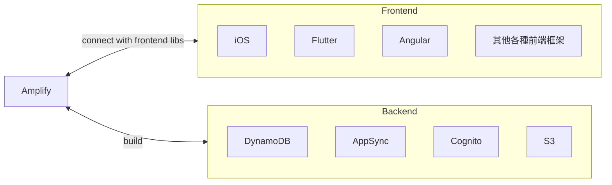
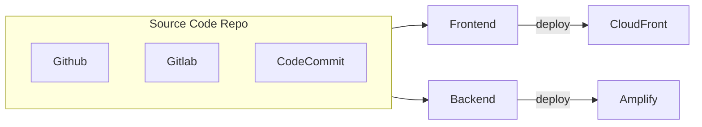
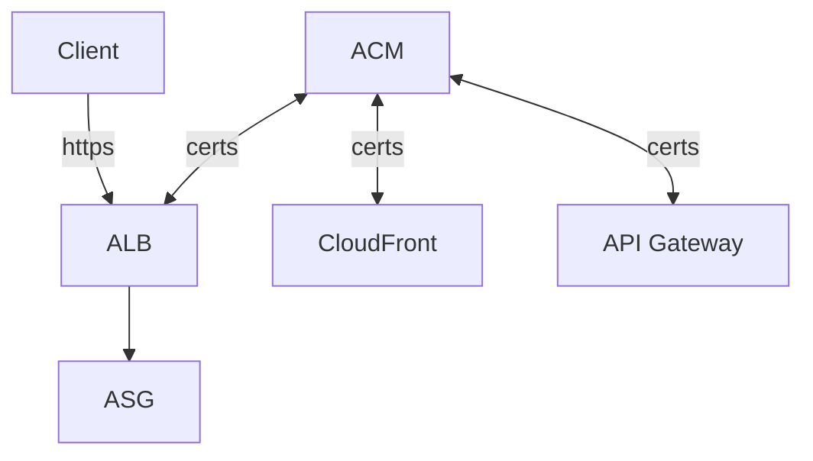
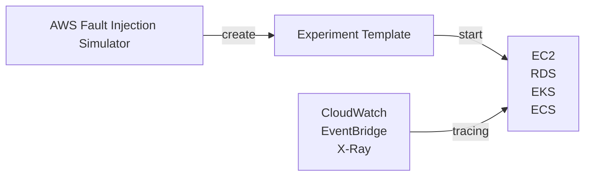

# AWS CLI, SDK, IAM Roles & Policies

## API Rate Limits

- AWS 對於 API call 有軟性限制, ex:
    - EC2 DescribeInstances API, 100次/sec
    - S3 GetObject API, 5500次/sec
- 如果收到 5XX && `ThrottlingException`, 就表示遇到 API Rate Limit 了
    - 如果 code 裡頭有 retry 機制, 會被帶入 *Exponential Backoff*
        - 因此 retry 需要使用 *Exponential Backoff Strategy*
        - 遇到此情況, 1 sec 內無法重複請求, 若再次遇到, 則需等 2 sec, 若再次則 4 sec, 再來 8 sec, 16 sec, ...
    - 如果遇到 4XX 就不要再為難 Server 了, 好好檢討自己吧XD
- 解法: request an API throttling limit increase


## Service Limits

- AWS 對於服務有些軟性限制, ex: EC2 的 On-Demand 規格, 只能開到 1152 vCPU
    - 如果要增加使用需求:
        - 開 Issue
        - 使用 Service Quotas API


# Container - Docker, ECS, EKS, ECR, Fargate

## ECS, Elastic Container Services

- [ECS](./ECS.MD)


## EKS, Elastic Kubernetes Services

- EKS 支援
    - EC2 - to deploy worker nodes
    - Fargate - to deploy serverless containers


## ECR, Elastic Container Registry

- [clf-ECR](./cert-CLF_C01.md#ecr-elastic-container-registry)
- [saa-ECR](./cert-SAA_C02.md#ecr-elastic-container-registry)
- Amazon ECR 也有 Public Repository - [Amazon ECR Public Gallery](https://gallery.ecr.aws)
- ECR 皆由 IAM 做存取訪問管控
- ECR 背後是 S3

```bash
### login to ECR
$# REGION=ap-northeast-1
$# ACCOUNT_ID=
$# aws ecr get-login-password \
    --region ${REGION} | docker login \
    --username AWS \
    --password-stdin \
    ${ACCOUNT_ID}.dkr.ecr.${REGION}.amazonaws.com
Login Succeeded

Logging in with your password grants your terminal complete access to your account. 
For better security, log in with a limited-privilege personal access token. Learn more at https://docs.docker.com/go/access-tokens/
$# 
```


# Elastic Beanstalk

- [clf-Beanstalk](./cert-CLF_C01.md#aws-beanstalk)
- [Beanstalk](./Beanstalk.md)


# AWS CICD

## CodeCommit

- private git repo, 支援 3 種協定
    - HTTPS
    - SSH        - 如果使用 root account 登入到 Console, 看不到這個(講師說的)
    - HTTPS(GRC) - 似乎是 AWS 自行實作的協定
- 權限
    - AWS Console > IAM > Users > USER > Security Credentials > SSH Keys for AWS CodeCommit
        - 把 Public Key 丟到這~~
    - AWS Console > IAM > Users > USER > HTTPS Git credentials for AWS CodeCommit
        - 要從這邊申請一組 credentials (git repo 使用的帳號密碼)
- 可針對 repo 設定各種 events notification(比較像是一些 description 的變更之類的), 發送到:
    - SNS
    - AWS Chatbot (Slack)
- 針對 git event, 可設定對應的 trigger, 目前支援:
    - Lambda
    - SNS
- Charge:
    - 5 active users free/month


## AWS CodePipeline

- 用來組織 CodeCommit, CodeBuild (做 CI/CD 啦)
    - AWS CI/CD 的核心服務
    - Code -> Build -> Test -> Profision -> Deploy
- CodePipeline Orchestration
    - CodeCommit -> CodeBuild -> CodeDeploy -> ... (ex: Elastic Beanstalk, ...)
- 可 fast delivery, rapid update


## AWS CodeBuild

- [CodeBuild](./CICD/CodeBuild.md)


## AWS CodeDeploy

- [CodeDeploy](./CICD/CodeDeploy.md)


## AWS CodeArtifact

- [clf-CodeArtifact](./cert-CLF_C01.md#aws-codeartifact)
- 各種套件管理員的套件管理倉庫 - artifact management
- 其實做了幾件事情
    - 幫 Code 代理抓 dependencies (增強安全性)
    - 快取 dependencies (不知道是不是存到 S3)
    - 可讓 CodeBuild 拉 dependencies 的時間大大加速


## AWS CodeStar

- [clf-CodeStar](./cert-CLF_C01.md#aws-codestar)
- Charge: Service Free. 針對 Resources 收費
- 專案管理整合 - Jira / GitHub Issues


## AWS Cloud9

- [clf-Cloud9](./cert-CLF_C01.md#aws-cloud9)


## [AWS CodeGuru](./cert-CLF_C01.md#amazon-codeguru)


# Monitoring & Audit : CloudWatch, X-Ray, CloudTrail

- [CloudWatch](./CloudWatch.md#aws-cloudwatch)
- [X-Ray](./CloudWatch.md#aws-x-ray)
- [CloudTrail](./CloudWatch.md#aws-cloudtrail)


# AWS Intergration & Messaging - SQS, SNS, Kinesis

- [SQS](./SQS.md)
- [SNS](./SNS.md)
- [Kinesis](./Kinesis.md)


# Amazon Cognito Section


# Other Serverless Section

## AWS Step Functions

- [What is AWS Step Functions?](https://docs.aws.amazon.com/step-functions/latest/dg/welcome.html)
    - 用來整合 Lambda 及 一系列 AWS Services
    - 可使用流程圖的方式, 並基於 state machines && tasks 來做展示


## AWS AppSync

- GraphQL api
- real-time WebSocket/MQTT for WebSocket
- 一開始需要先定義 `GraphQL schema`
- 權限及安全性存取方面, 需要至少有底下之一的權限:
    - API_KEY
    - AWS_IAM
    - OPENID_CONNECT
    - AMAZON_CONGNITO_USER_POOLS


## AWS Amplify

- 可視為用來建 mobile APP && web APP 的 beanstalk
- serverless
- 整合了各種 AWS serverless services
- 專案基本指令:
    - amplify init
    - amplify add auth
    - amplify add api
    - amplify add hosting

---


---

Amplify Hosting




# AWS Other Services

## AWS SES, Simple Email Service

- Sending Email using SMTP interface 或 AWS SDK
- Receiving Email, 並整合了: S3, SNS, Lambda
- 收發信都需要 IAM Permission


## AWS Serverless Application Repository, AWS SAR

- 可用來儲存 Serverless APP 的 Repository


## Amazon Certificate Manager, ACM

- provision / manage / deploy / renewal SSL/TLS Certificates
    - public  : Free
    - private
- in-flight encryption
- 




## AWS Cloud Map, CloudMap

- [What Is AWS Cloud Map?](https://docs.aws.amazon.com/cloud-map/latest/dg/what-is-cloud-map.html)
    - 
    - 因為會主動探索服務位置, 因此也有監控功能
    - 也可協助做 CICD, 做不同版本的切換
    - 讓 APP 能夠藉由 AWS SDK, API call, DNS query 等各種方式, 去 discover Web-based service
- [AWS Cloud Map FAQs](https://aws.amazon.com/cloud-map/faqs/)
- Cloud Map 已與 ECS 及 EKS 做了深度整合. 因此使用這兩種服務時, 會自動使用 CloudMap
- Serverless, Resource Discovery or Service Discovery
- 用來建立 需要依賴於 後端 services/resources 的一層類似轉接器/窗口 的服務
    - 讓 Frontend 不用依賴於後端特定版本, 而是藉由訪問 **Cloud Map**, 來取得後端 服務位置(URL)
    - developer 使用 api -> Cloud Map, 來更新版本. ex: v1 -> v2
    - frontend 便會 動態的查找(Dynamic lookup) v2 location. 之後再直接連到 v2
        - 免改 frontend code
- 服務本身會做 Health check, 避免發送到後端不健康的 endpoint
- 可使用 SDK, API, DNS query
    - 與 Route53 做整合


## AWS Fault Injection Simulator, FIS

- Based on Chaos Engineering
- 進階的測試工具, 用來測 Infra 之中的某個 Service Failure 的後果 及 Simulation
    - 支援模擬 EC2, ECS, EKS, RDS, ... 掛掉的情境
- 進階的 Monitoring + Debugging Tool


