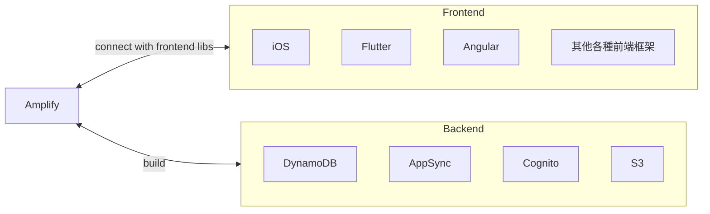
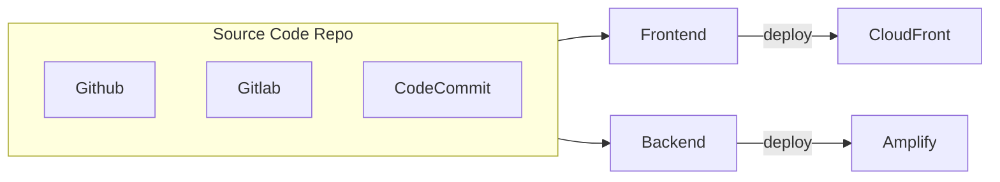
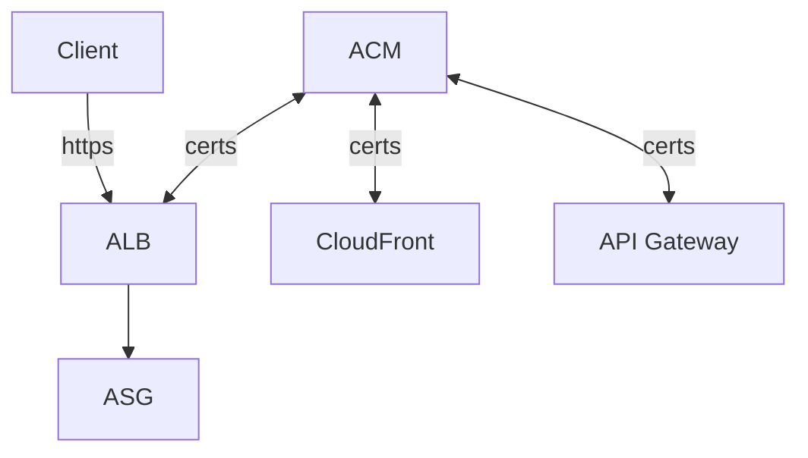
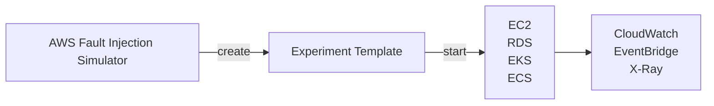

# AWS CLI, SDK, IAM Roles & Policies

## API Rate Limits

- AWS 對於 API call 有軟性限制, ex:
    - EC2 DescribeInstances API, 100次/sec
    - S3 GetObject API, 5500次/sec
- 如果收到 5XX && `ThrottlingException`, 就表示遇到 API Rate Limit 了
    - 如果 code 裡頭有 retry 機制, 會被帶入 *Exponential Backoff*
        - 因此 retry 需要使用 *Exponential Backoff Strategy*
        - 遇到此情況, 1 sec 內無法重複請求, 若再次遇到, 則需等 2 sec, 若再次則 4 sec, 再來 8 sec, 16 sec, ...
    - 如果遇到 4XX 就不要再為難 Server 了, 好好檢討自己吧XD
- 解法: request an API throttling limit increase


## Service Limits

- AWS 對於服務有些軟性限制, ex: EC2 的 On-Demand 規格, 只能開到 1152 vCPU
    - 如果要增加使用需求:
        - 開 Issue
        - 使用 Service Quotas API


# Container - Docker, ECS, EKS, ECR, Fargate

## ECS, Elastic Container Services

- [ECS](./ECS.MD)


## EKS, Elastic Kubernetes Services

- EKS 支援
    - EC2 - to deploy worker nodes
    - Fargate - to deploy serverless containers


## ECR, Elastic Container Registry

- [clf-ECR](./cert-CLF_C01.md#ecr-elastic-container-registry)
- [saa-ECR](./cert-SAA_C02.md#ecr-elastic-container-registry)
- Amazon ECR 也有 Public Repository - [Amazon ECR Public Gallery](https://gallery.ecr.aws)
- ECR 皆由 IAM 做存取訪問管控
- ECR 背後是 S3

```bash
### login to ECR
$# REGION=ap-northeast-1
$# ACCOUNT_ID=
$# aws ecr get-login-password \
    --region ${REGION} | docker login \
    --username AWS \
    --password-stdin \
    ${ACCOUNT_ID}.dkr.ecr.${REGION}.amazonaws.com
Login Succeeded

Logging in with your password grants your terminal complete access to your account. 
For better security, log in with a limited-privilege personal access token. Learn more at https://docs.docker.com/go/access-tokens/
$# 
```


# Elastic Beanstalk

- [clf-Beanstalk](./cert-CLF_C01.md#aws-beanstalk)
- 幾乎所有 Web APP 架構都會用到 ELB, ASG, 因此這兩者已經直接納入到 Beanstalk
    - Beanstalk 的 APP 一旦建立以後, 無法再修改它的 ELB
        - 因此若有此需求, 需要重建
- Beanstalk 可將節點分成:
    - Web Server Tier, 用來放快速回應的 request
    - Worker Tier, 處理耗時請求
        - 使用 [SQS](./cert-SAA_C02.md#sqs-sns-kinesis-activemq)
        - 裡頭放置 `cron.yaml` 來讓節點去 poll jobs
    ```mermaid
    flowchart LR

    subgraph web["Web Tier = ELB + EC2"]
        ALB --> asg1["ASG"]
    end
    subgraph worker["Worker Tier = SQS + EC2"]
        SQS --> asg2["ASG"]
    end
    asg1 -- PUT --> SQS
    Client -- request --> ALB
    ```
- Beanstalk 有他專屬的 CLI, 有需要再找 `EB cli` (更為簡易使用)
- 對於 Beanstalk 的環境變數 && 依賴服務, 可放在專案目錄下的:
    - `/.ebextensions/*.config`, 可定義環境變數 && 依賴的 AWS Services
        - 但需要非常留意!!! 如果裡面有放 DB, 那如果 Beanstalk APP 移除的話, 相關資源也會消失
            - Beanstalk Decouple RDS 的議題, 底下為 migration 建議方式
                - 先到 RDS 建立 snapshot (保險起見)
                - RDS console > protect the RDS database from deletion
                - 建立新的 Beanstalk Environment (without RDS)
                - CNAME swap
                - Terminate OLD environment
                    - RDS 會因為剛剛上了保護機制, 因而無法移除
                    - 後續移除動作也會跟著失敗
                - 後續手動到 CloudFormation 移除相關 stack (處於 `DELETE_FAILED state` 的這些資源)
                    - Beanstalk 背後是 CloudFormation
- Beanstalk Lifecycle Policy
    - Beanstalk 最多只能有 1000 APP Versions
        - 可善用 *lifecycle policy* 來清理, 或保存到 S3
- Beanstalk in Docker
    - 需要定義 `Dockerfile` && `Dockerrun.aws.json`
        - 後者, 告知 Image 位置 && Volume && Port && Logging && ...
    - 建立 APP Environment 的 Platform 的選則:
        - Docker running on ... (Single Docker Container)
            - 不會使用到 ECS
        - Multi-Container Docker
            - `Dockerrun.aws.json` 裡頭定義 **ECS task definition**
            - 會自動建立相關資源:
                - ECS Cluster
                - EC2 instances, 可用作 ECS Cluster
                - Load Balancer (in HA mode)
                - Task definition && execution
- Beanstalk with HTTPS
    - via ELB console 上傳證書
    - via Beanstalk 的 `/.ebextensions/securelistener-alb.config` 給證書
    - via [ACM](https://aws.amazon.com/certificate-manager/?nc1=h_ls) 託管證書
    - via ALB 的 http 301 https
    - via 程式端的 redirect, [https-redirect](https://github.com/awsdocs/elastic-beanstalk-samples/tree/main/configuration-files/aws-provided/security-configuration/https-redirect)
- 關於 Beanstalk 更新時的選項, 分成底下幾種:
    - All at once
        - 一次更新所有 instances 到 New Version
        - 最快速, 但會有 downtime
    - Rolling
        - 針對現有 instances, 逐批(bucket) 更新 instances
        - 更新期間的可用規模, 會略小於平常的時候 (因為隨時都有機器在更新)
    - Rolling with additional batches
        - 針對現有 instances 先不動
        - 建新一批(bucket) instances 跑 New Version
        - 之後再陸續更新 現有 instances 到 New Version
        - 更新期間的可用規模, 與平常規模一樣
    - Immutable
        - 建一批 (new temp ASG) 跑 New Version
        - 完成後 migrate 到 Old ASG
        - 若沒問題, Terminate Old Version instances
        - 若有問題, Terminate New Version instances
    - Blue/Green (非 Beanstalk 直接議題, 但可實作)
        - 建立多個 Environment
        - 藉由 DNS 改變解析到不同版本的環境
            - 此為 `Beanstalk swap URLs`
            - 就算 New Version 有問題, Rollback 非常快
                - 改 DNS CNAME 即可 (Beanstalk 裡頭直接切換)
        - New Version 剛部署完成時, 藉由 DNS 將少量流量導入來測試
    - Traffic Splitting
        - Canary Testing 金絲雀部署
- Beanstalk 進階問題
    - 如果需要 Beanstalk 不支援的 Language 且 不使用 Docker
        - 使用 `Platform.yaml` 來定義 AMI, 建立 Custom Image
    - 如果需要特殊的 Platform (OS, additional Software, Scripts to run)
        - 使用 **Packer software** 來建立 entirely new Beanstalk Platform


# AWS CICD

## CodeCommit

- private git repo, 支援 3 種協定
    - HTTPS
    - SSH        - 如果使用 root account 登入到 Console, 看不到這個(講師說的)
    - HTTPS(GRC) - 似乎是 AWS 自行實作的協定
- 權限
    - AWS Console > IAM > Users > USER > Security Credentials > SSH Keys for AWS CodeCommit
        - 把 Public Key 丟到這~~
    - AWS Console > IAM > Users > USER > HTTPS Git credentials for AWS CodeCommit
        - 要從這邊申請一組 credentials (git repo 使用的帳號密碼)
- 可針對 repo 設定各種 events notification(比較像是一些 description 的變更之類的), 發送到:
    - SNS
    - AWS Chatbot (Slack)
- 針對 git event, 可設定對應的 trigger, 目前支援:
    - Lambda
    - SNS
- Charge:
    - 5 active users free/month


## AWS CodePipeline

- 用來組織 CodeCommit, CodeBuild (做 CI/CD 啦)
    - AWS CI/CD 的核心服務
    - Code -> Build -> Test -> Profision -> Deploy
- CodePipeline Orchestration
    - CodeCommit -> CodeBuild -> CodeDeploy -> ... (ex: Elastic Beanstalk, ...)
- 可 fast delivery, rapid update


## AWS CodeBuild

- Serverless, Scalable, HA
- 可在 Cloud 做 Build Code
    - compile, test, 產生 package
- Charge: 只對 Build Time 收 $$
- 需要建立 root file : `buildspec.yml` (等同於 `Dockerfile`)
- local dev 測試使用, 需安裝 *CodeBuild Agent*
    - [Run builds locally with the AWS CodeBuild agent](https://docs.aws.amazon.com/codebuild/latest/userguide/use-codebuild-agent.html)
- CodeBuild 的環境變數, [Environment variables in build environments](https://docs.aws.amazon.com/codebuild/latest/userguide/build-env-ref-env-vars.html)
- CodeBuild Container
    - 因安全性因素(ex: 未必很清楚 Image 究竟幹了些啥), Container 跑在 VPC 外部
    - 但如果要做整合測試 或需要授權訪問 AWS Resources, 則可做底下配置, 便可讓 *CodeBuild Container* 跑在 VPC 裡頭:
        - VPC ID
        - Subnet IDs
        - Security Group IDs


## AWS CodeDeploy

- 部署目標, 可用 EC2 或 On-Premise Server, Lambda, ECS
    - 機器上面必須安裝 *CodeDeploy Agent*
- 不依賴於 CloudFormation && Beanstalk
- Deploy 會需要 `appspec.yml` (等同於 `.drone.yml`)
    - 避免與 `buildspec.yml` 搞混
- CodeDeploy Service 會到 *S3* 或 *GitHub* 拿取要 deploy 的 artifacts 來做 deploy
- 權限需求, 需要事先 create 2 個 Roles:
    - Service Role for CodeDeploy
        - CodeDeploy Agent 去操作其他相關的 AWS Resources 的權限
    - EC2 Instance Profile(Role)
        - 如果使用 EC2 來 deploy, 要讓 EC2 能夠 read S3 (ReadOnly 即可)
- 原始碼
    - 來源目前只能可以是 *S3* 或 *GitHub*
- CodeDeploy 主要元件:
    - Application
        - a unique name functions as a container (不知道這在說啥, 可能只是在講部署的服務名稱吧)
    - Compute Platform (要部署到哪邊啦~)
        - EC2 / On-Premise Server
        - Lambda
        - ECS
    - Deployment Configuration - a set of deployment rules for success/failure (應該是在說, 如何做好 deploy 的流程吧)
        - if EC2/On-Premise, 此 Deployment 裡頭, 最起碼應該有多少個 healthy instances
        - if Lambda/ECS, 此 Deployment 裡頭, traffic 如何 route to NEW Version
    - Deployment Group - group of tagged EC2 instances (不是很懂)
        - ex: dev, test, prod
    - Deployment Type - 指如何 deploy to *Deployment Group* 的方法 (應該是講如何做 rolling update 吧?)
        - In-place Deployment   : 支援 EC2 / On-Premise
        - Blue/Green Deployment : (借助 Load Balancer) EC2 / Lambda, ECS (無 On-Premise)
    - [IAM instance Profile](./IAM.md#tips)
    - [Service Role](./IAM.md#tips), 等同於 *IAM Role*
        - Deployed APP access 相關 AWS Resources 的相關必要權限
    - Application Revision
        - APP Code + `appspec.yml` = APP Revision
    - Target Revision
        - 要 deploy 到 *Deployment Group* 的 Revision
- [AppSpec File structure](https://docs.aws.amazon.com/codedeploy/latest/userguide/reference-appspec-file-structure.html)
    - 其中幾個重要階段
        - ValidateService : deploy 以後的 verify 流程
- CodeDeploy Rollback (回滾)
    - 可使用 Auto(借助 *CloudWatch Alarm*) 或 Manual
    - rollback 本身是 re-deploy 最近一個正常版本, 而非 restore OLD Version
        - 有點 `git revert` 的感覺~


## AWS CodeArtifact

- [clf-CodeArtifact](./cert-CLF_C01.md#aws-codeartifact)
- 各種套件管理員的套件管理倉庫 - artifact management
- 其實做了幾件事情
    - 幫 Code 代理抓 dependencies (增強安全性)
    - 快取 dependencies (不知道是不是存到 S3)
    - 可讓 CodeBuild 拉 dependencies 的時間大大加速


## AWS CodeStar

- [clf-CodeStar](./cert-CLF_C01.md#aws-codestar)
- Charge: Service Free. 針對 Resources 收費
- 專案管理整合 - Jira / GitHub Issues


## AWS Cloud9

- [clf-Cloud9](./cert-CLF_C01.md#aws-cloud9)


## AWS CodeGuru

- [clf-CodeGuru](./cert-CLF_C01.md#amazon-codeguru)


# Monitoring & Audit : CloudWatch, X-Ray, CloudTrail

- [CloudWatch](./CloudWatch.md#aws-cloudwatch)
- [X-Ray](./CloudWatch.md#aws-x-ray)
- [CloudTrail](./CloudWatch.md#aws-cloudtrail)


# AWS Intergration & Messaging - SQS, SNS, Kinesis

- [SQS](./SQS.md)
- [SNS](./SNS.md)
- [Kinesis](./Kinesis.md)


# Amazon Cognito Section


# Other Serverless Section

## AWS Step Functions

- [What is AWS Step Functions?](https://docs.aws.amazon.com/step-functions/latest/dg/welcome.html)
    - 用來整合 Lambda 及 一系列 AWS Services
    - 可使用流程圖的方式, 並基於 state machines && tasks 來做展示


## AWS AppSync

- GraphQL api
- real-time WebSocket/MQTT for WebSocket
- 一開始需要先定義 `GraphQL schema`
- 權限及安全性存取方面, 需要至少有底下之一的權限:
    - API_KEY
    - AWS_IAM
    - OPENID_CONNECT
    - AMAZON_CONGNITO_USER_POOLS


## AWS Amplify

- 可視為用來建 mobile APP && web APP 的 beanstalk
- serverless
- 整合了各種 AWS serverless services
- 專案基本指令:
    - amplify init
    - amplify add auth
    - amplify add api
    - amplify add hosting

---


---

Amplify Hosting




# AWS Other Services

## AWS SES, Simple Email Service

- Sending Email using SMTP interface 或 AWS SDK
- Receiving Email, 並整合了: S3, SNS, Lambda
- 收發信都需要 IAM Permission


## Amazon Certificate Manager, ACM

- provision / manage / deploy / renewal SSL/TLS Certificates
    - public  : Free
    - private
- in-flight encryption
- 




## AWS Cloud Map, CloudMap

- Serverless, Resource Discovery or Service Discovery
- 用來建立 需要依賴於 後端 services/resources 的一層類似轉接器/窗口 的服務
    - 讓 Frontend 不用依賴於後端特定版本, 而是藉由訪問 **Cloud Map**, 來取得後端 服務位置(URL)
    - developer 使用 api -> Cloud Map, 來更新版本. ex: v1 -> v2
    - frontend 便會 動態的查找(Dynamic lookup) v2 location. 之後再直接連到 v2
        - 免改 frontend code
- 服務本身會做 Health check, 避免發送到後端不健康的 endpoint
- 可使用 SDK, API, DNS query
    - 與 Route53 做整合


## AWS Fault Injection Simulator, FIS

- Based on Chaos Engineering
- 進階的測試工具, 用來測 Infra 之中的某個 Service Failure 的後果 及 Simulation
    - 支援模擬 EC2, ECS, EKS, RDS, ... 掛掉的情境
- 進階的 Monitoring + Debugging Tool


