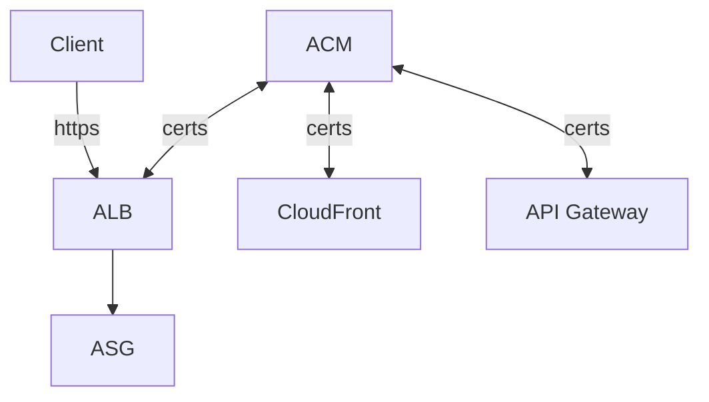
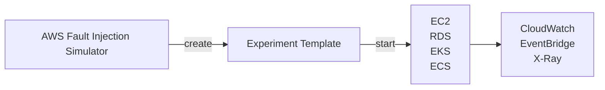

# AWS Other Services

## AWS SES, Simple Email Service

- Sending Email using SMTP interface 或 AWS SDK
- Receiving Email, 並整合了: S3, SNS, Lambda
- 收發信都需要 IAM Permission

## Amazon Certificate Manager, ACM

- provision / manage / deploy / renewal SSL/TLS Certificates
    - public  : Free
    - private
- in-flight encryption
- 

## AWS Cloud Map

- Serverless, Resource Discovery or Service Discovery
- 用來建立 需要依賴於 後端 services/resources 的一層類似轉接器/窗口 的服務
    - 讓 Frontend 不用依賴於後端特定版本, 而是藉由訪問 **Cloud Map**, 來取得後端 服務位置(URL)
    - developer 使用 api -> Cloud Map, 來更新版本. ex: v1 -> v2
    - frontend 便會 動態的查找(Dynamic lookup) v2 location. 之後再直接連到 v2
        - 免改 frontend code
- 服務本身會做 Health check, 避免發送到後端不健康的 endpoint
- 可使用 SDK, API, DNS query
    - 與 Route53 做整合

## AWS Fault Injection Simulator, FIS

- Based on Chaos Engineering
- 進階的測試工具, 用來測 Infra 之中的某個 Service Failure 的後果 及 Simulation
    - 支援模擬 EC2, ECS, EKS, RDS, ... 掛掉的情境
- 進階的 Monitoring + Debugging Tool

