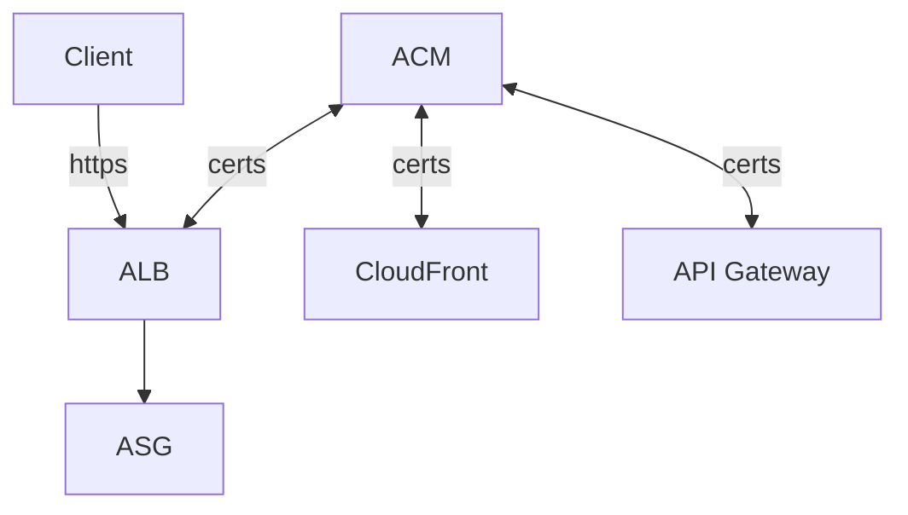
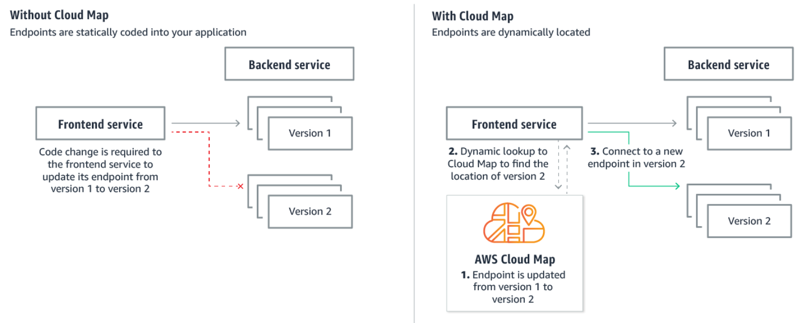
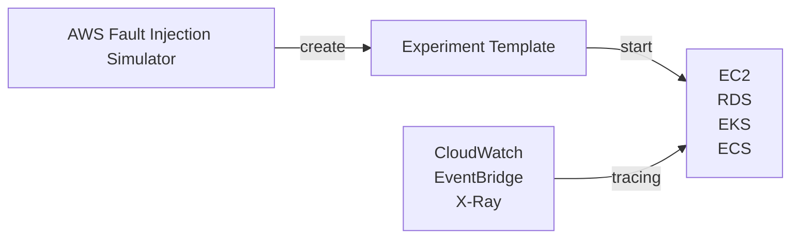

# AWS CLI, SDK, IAM Roles & Policies

## Service Limits

- AWS 對於服務有些軟性限制, ex: EC2 的 On-Demand 規格, 只能開到 1152 vCPU
    - 如果要增加使用需求:
        - 開 Issue
        - 使用 Service Quotas API

# Container - Docker, ECS, EKS, ECR, Fargate

## EKS, Elastic Kubernetes Services

- EKS 支援
    - EC2 - to deploy worker nodes
    - Fargate - to deploy serverless containers

# Elastic Beanstalk

- [clf-Beanstalk](./cert-CLF_C01.md#aws-beanstalk)
- [Beanstalk](./Beanstalk.md)

# AWS CICD

## CodeCommit

- [CodeCommit](./CICD/CodeCommit.md)

## AWS CodePipeline

- 用來組織 CodeCommit, CodeBuild (做 CI/CD 啦)
    - AWS CI/CD 的核心服務
    - Code -> Build -> Test -> Profision -> Deploy
- CodePipeline Orchestration
    - CodeCommit -> CodeBuild -> CodeDeploy -> ... (ex: Elastic Beanstalk, ...)
- 可 fast delivery, rapid update

## AWS CodeBuild

- [CodeBuild](./CICD/CodeBuild.md)

## AWS CodeDeploy

- [CodeDeploy](./CICD/CodeDeploy.md)

## AWS CodeArtifact

- [clf-CodeArtifact](./cert-CLF_C01.md#aws-codeartifact)
- 各種套件管理員的套件管理倉庫 - artifact management
- 其實做了幾件事情
    - 幫 Code 代理抓 dependencies (增強安全性)
    - 快取 dependencies (不知道是不是存到 S3)
    - 可讓 CodeBuild 拉 dependencies 的時間大大加速

## AWS CodeStar

- [clf-CodeStar](./cert-CLF_C01.md#aws-codestar)
- Charge: Service Free. 針對 Resources 收費
- 專案管理整合 - Jira / GitHub Issues

## AWS Cloud9

- [clf-Cloud9](./cert-CLF_C01.md#aws-cloud9)
- 用來管理 Development Activities 的 UI
- Developer 快速建造 CI/CD 的好幫手
- 用來整合 **CodeCommit** && **CodeBuild** && **CodePipeline**
- 用這東西背後會一併 Create (反過來說, 如果不用 **CodeStar** 的話, 底下這些都需要自行處理):
    - CodeCommit
    - CodeBuild
    - CodeDeploy
    - CodePipeline
    - monitoring
    - Elastic Beanstalk
    - EC2
    - Cloud9
- 若要刪除 Project 的話, 先刪除 **Cloud9**, 再來刪除 **CodeStar** Project
- Charge:
    - 無需針對 CodeStar 計費
    - 不過 CodeStar Project 會開一台 EC2...
    - 此外, 會針對額外使用的資源計費, Lambda, EBS, S3
    - 按量計費

# Monitoring & Audit : CloudWatch, X-Ray, CloudTrail

- [CloudWatch](./CloudWatch.md#aws-cloudwatch)
- [X-Ray](./CloudWatch.md#aws-x-ray)
- [CloudTrail](./CloudWatch.md#aws-cloudtrail)

# AWS Intergration & Messaging - SQS, SNS, Kinesis

- [SQS](./SQS.md)
- [SNS](./SNS.md)
- [Kinesis](./Kinesis.md)

# Amazon Cognito Section

# Other Serverless Section

## AWS Step Functions

- [What is AWS Step Functions?](https://docs.aws.amazon.com/step-functions/latest/dg/welcome.html)
    - 用來整合 Lambda 及 一系列 AWS Services
    - 可使用流程圖的方式, 並基於 state machines && tasks 來做展示

## AWS AppSync

- [What is AWS AppSync?](https://docs.aws.amazon.com/appsync/latest/devguide/what-is-appsync.html)
- GraphQL api
- real-time WebSocket/MQTT for WebSocket
- 一開始需要先定義 `GraphQL schema`
- 權限及安全性存取方面, 需要至少有底下之一的權限:
    - API_KEY
    - AWS_IAM
    - OPENID_CONNECT
    - AMAZON_CONGNITO_USER_POOLS
- 即時 && 跨裝置, Store && Sync data
    - 支援了 Offline data sync (類似產品 [Cognito](./cognito.md))
- 使用 GraphQL (mobile tech from FB)
- 整合了 DynamoDB/Lambda

# AWS Other Services

## AWS SES, Simple Email Service

- Sending Email using SMTP interface 或 AWS SDK
- Receiving Email, 並整合了: S3, SNS, Lambda
- 收發信都需要 IAM Permission

## AWS Serverless Application Repository, AWS SAR

- 可用來儲存 Serverless APP 的 Repository

## Amazon Certificate Manager, ACM

- provision / manage / deploy / renewal SSL/TLS Certificates
    - public  : Free
    - private
- in-flight encryption
- 

## AWS Cloud Map, CloudMap

- [What Is AWS Cloud Map?](https://docs.aws.amazon.com/cloud-map/latest/dg/what-is-cloud-map.html)
    - 
    - 因為會主動探索服務位置, 因此也有監控功能
    - 也可協助做 CICD, 做不同版本的切換
    - 讓 APP 能夠藉由 AWS SDK, API call, DNS query 等各種方式, 去 discover Web-based service
- [AWS Cloud Map FAQs](https://aws.amazon.com/cloud-map/faqs/)
- Cloud Map 已與 ECS 及 EKS 做了深度整合. 因此使用這兩種服務時, 會自動使用 CloudMap
- Serverless, Resource Discovery or Service Discovery
- 用來建立 需要依賴於 後端 services/resources 的一層類似轉接器/窗口 的服務
    - 讓 Frontend 不用依賴於後端特定版本, 而是藉由訪問 **Cloud Map**, 來取得後端 服務位置(URL)
    - developer 使用 api -> Cloud Map, 來更新版本. ex: v1 -> v2
    - frontend 便會 動態的查找(Dynamic lookup) v2 location. 之後再直接連到 v2
        - 免改 frontend code
- 服務本身會做 Health check, 避免發送到後端不健康的 endpoint
- 可使用 SDK, API, DNS query
    - 與 Route53 做整合

## AWS Fault Injection Simulator, FIS

- Based on Chaos Engineering
- 進階的測試工具, 用來測 Infra 之中的某個 Service Failure 的後果 及 Simulation
    - 支援模擬 EC2, ECS, EKS, RDS, ... 掛掉的情境
- 進階的 Monitoring + Debugging Tool

