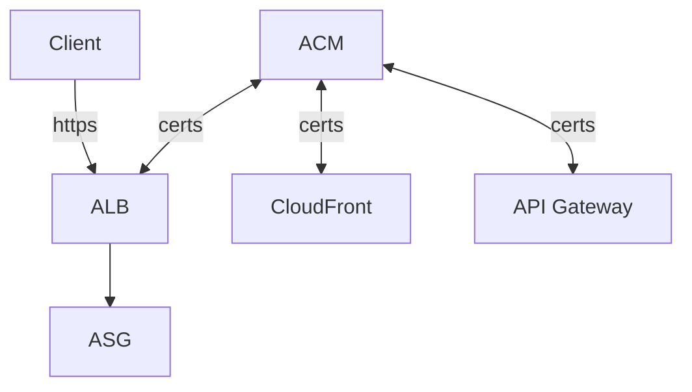
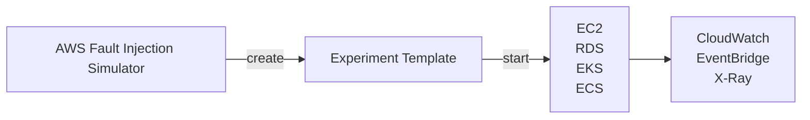

# AWS CLI, SDK, IAM Roles & Policies

## API Rate Limits

- AWS 對於 API call 有軟性限制, ex:
    - EC2 DescribeInstances API, 100次/sec
    - S3 GetObject API, 5500次/sec
- 如果收到 5XX && `ThrottlingException`, 就表示遇到 API Rate Limit 了
    - 如果 code 裡頭有 retry 機制, 會被帶入 *Exponential Backoff*
        - 因此 retry 需要使用 *Exponential Backoff Strategy*
        - 遇到此情況, 1 sec 內無法重複請求, 若再次遇到, 則需等 2 sec, 若再次則 4 sec, 再來 8 sec, 16 sec, ...
    - 如果遇到 4XX 就不要再為難 Server 了, 好好檢討自己吧XD
- 解法: request an API throttling limit increase

## Service Limits

- AWS 對於服務有些軟性限制, ex: EC2 的 On-Demand 規格, 只能開到 1152 vCPU
    - 如果要增加使用需求:
        - 開 Issue
        - 使用 Service Quotas API

# AWS CICD

## CodeCommit

- private git repo, 支援 3 種協定
    - HTTPS
    - SSH        - 如果使用 root account 登入到 Console, 看不到這個(講師說的)
    - HTTPS(GRC) - 似乎是 AWS 自行實作的協定
- 權限
    - AWS Console > IAM > Users > USER > SSH Keys for CodeCommit
        - 把 Public Key 丟到這~~
    - AWS Console > IAM > Users > USER > HTTPS Git credentials for AWS CodeCommit
        - 要從這邊申請一組 credentials (git repo 使用的帳號密碼)
- 可針對 repo 設定各種 events notification(比較像是一些 description 的變更之類的), 發送到:
    - SNS
    - AWS Chatbot (Slack)
- 針對 git event, 可設定對應的 trigger, 目前支援:
    - Lambda
    - SNS

## CodePipeline

## CodeBuild

## CodeDeploy

# AWS Other Services

## AWS SES, Simple Email Service

- Sending Email using SMTP interface 或 AWS SDK
- Receiving Email, 並整合了: S3, SNS, Lambda
- 收發信都需要 IAM Permission

## Amazon Certificate Manager, ACM

- provision / manage / deploy / renewal SSL/TLS Certificates
    - public  : Free
    - private
- in-flight encryption
- 

## AWS Cloud Map

- Serverless, Resource Discovery or Service Discovery
- 用來建立 需要依賴於 後端 services/resources 的一層類似轉接器/窗口 的服務
    - 讓 Frontend 不用依賴於後端特定版本, 而是藉由訪問 **Cloud Map**, 來取得後端 服務位置(URL)
    - developer 使用 api -> Cloud Map, 來更新版本. ex: v1 -> v2
    - frontend 便會 動態的查找(Dynamic lookup) v2 location. 之後再直接連到 v2
        - 免改 frontend code
- 服務本身會做 Health check, 避免發送到後端不健康的 endpoint
- 可使用 SDK, API, DNS query
    - 與 Route53 做整合

## AWS Fault Injection Simulator, FIS

- Based on Chaos Engineering
- 進階的測試工具, 用來測 Infra 之中的某個 Service Failure 的後果 及 Simulation
    - 支援模擬 EC2, ECS, EKS, RDS, ... 掛掉的情境
- 進階的 Monitoring + Debugging Tool

