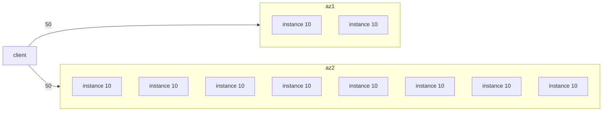
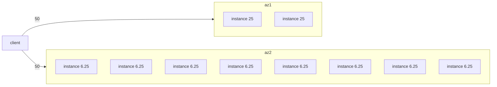
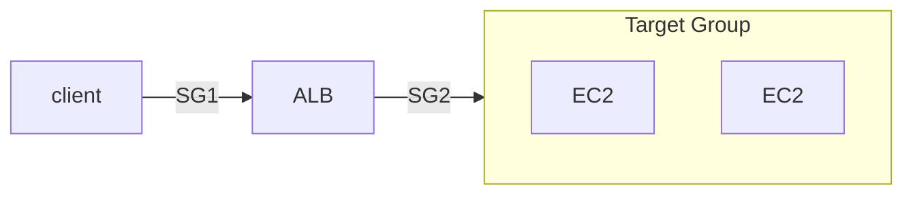
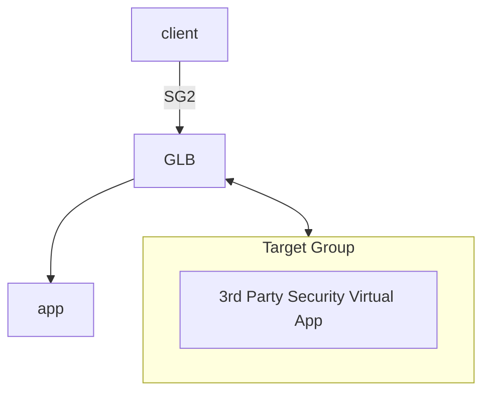
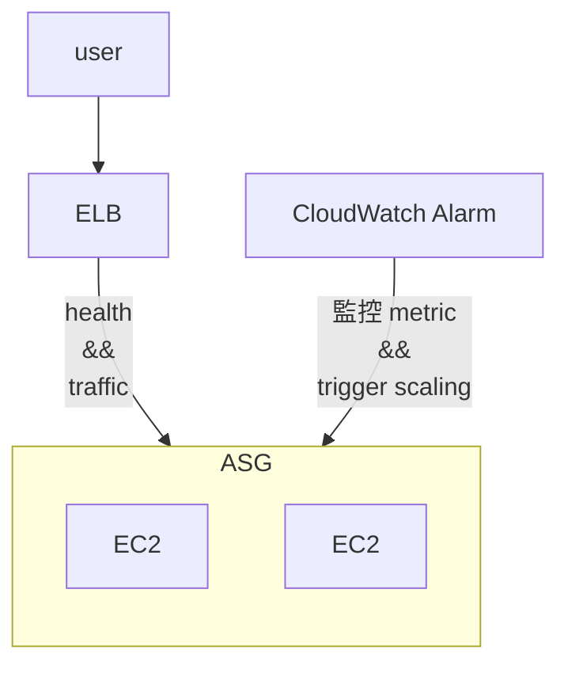
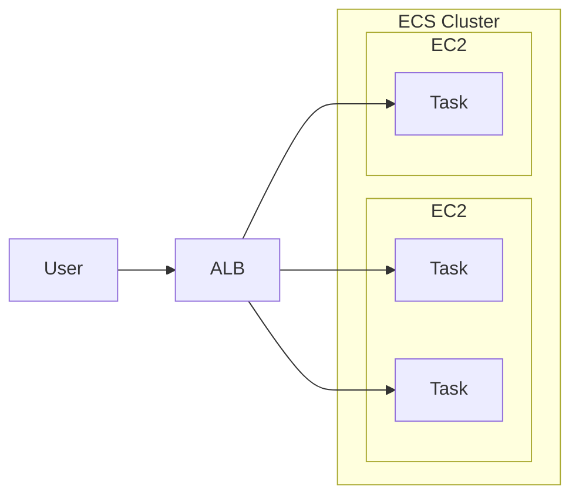
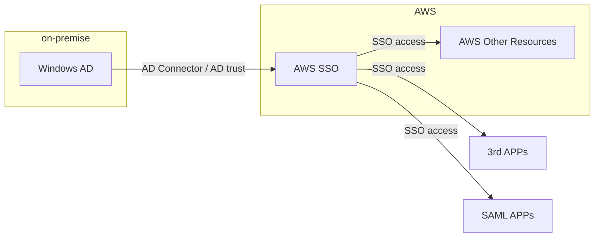

AWS Certificated Solutions Architect Associate

SAA-C02


# EC2


## EC2 Hibernate

- 有點像是, 把 Instance Stop, 就像一般電腦睡眠一樣, RAM state 被保留
    - 加速下次開機時間(OS never stop)
- cross OS
- hibernation period < 60 days (無法長久 hybernate)


# HA && Scalability: ELB && ASG

- ELB 的 Sticky Session(Session Affinity) 相關問題
    - ALB, CLB 皆可處理此情境
    - client by `cookie`
        - Application-based Cookie
            - APP(a.k.a. Target) 自行產生, 可有任意客制屬性
            - Target Group 必須為此 Cookie Name 自行取名字, 但底下名字保留不可使用:
                - AWSALB, AWSALBAPP, AWSALBTG
        - Duration-based cookie (Load balancer generated cookie)
            - LB 產生特定時間到期的 Cookie, Cookie name 為
                - AWSALB for ALB
                - AWSELB for CLB
- ELB - Cross Zone Load Balancing
    - ALB
        - 預設 enabled, 且無法 disabled (always on)
        - AZ 內資料傳輸免錢
    - NLB
        - 預設 disabled
        - 若啟用, AZ 內傳輸要課金
    - CLB
        - 預設 disabled
        - AZ 內資料傳輸免錢


### With Cross Zone Load Balancing




### Without Cross Zone Load Balancing




## Elastic Load Balalnce, ELB

- 目前有 4 種 Load Balance
    - Classic Load Balancer, CLB (Since 2009)
        - L4 && L7 : HTTP, HTTPS, TCP, SSL(secure TCP)
    - Application Load Balancer, ALB (Since 2016)
        - L7 : HTTP, HTTPS, WebSocket, HTTP/2
        - ALB 後為 *Target Group*(也會處理 *Health Check*), 裡面可以放置:
            - EC2 instances
            - ECS tasks
            - Lambda functions
            - private IP (可以是 On-premise Data Center Servers)
        - Target 接收到 Request 後, 可由 Header 中的
            - `X-Forwarded-For` && `X-Forwarded-Port` && `X-Forwarded-Proto` 
            - 看到用戶真實 IP && Port && Protocol
        - 可依照不同的 *routing tables(hostname)* && *query string* && *HTTP Header*
            - 將請求送往後端不同的 Target Groups
            - CLB 則無此功能(需要設很多 CLB, 才能做對應流量轉發)
        - 對於 ECS 支援 dynamic port mapping
    - Network Load Balancer, NLB (Since 2017)
        - L4 : TCP, UDP, TLS(secure TCP)
        - high performance, latency ~= 100ms (相較於 ALB ~= 400ms)
        - 配置以後, 同時提供 *DNS Name* && *Elastic IP* 來訪問
            - 相較之下, CLB && ALB, 只有 *DNS name*
        - NLB 後面的 *Target Group*, 裡頭可以是:
            - EC2 Instance
            - private IP Address
            - ALB
        - 細節
            - NLB 在每個 AZ 都有個 static IP (也可支援 assign Elastic IP)
            - 需要課金才能使用
            - NLB 僅作流量轉發, 因此後端的 SG 看到的請求皆來自 Client (而非NLB), 因此需要 allow HTTP 0.0.0.0
    - Gateway Load Balancer, GWLB (Since 2020)
        - deploy / scale / manage 第三方 network virtual app in AWS
        - L3 : IP
        - GENEVE protocol : port 6081
        - 結合了 2 種功能
            - Transparent Network Gateway
            - Load Balancer
- AWS Load Balancer 整合了一堆 AWS Services:
    - EC2, EC2 ASG, ECS, ACM, CloudWatch, Route53, AWS WAF, AWS Global Accelerator, ...
- 兼具 Health Check 功能





### SSL/TLS for ELB

- client 與 LB 之間的 in-flight encryption
- Public Certificate Authorities, CA
    - Comodo, Symantec, GoDaddy, GlobalSign, Digicert, Letsencrypt, ...
- LB 使用 X.509 certificate (SSL/TLS server certificate)
    - 可使用 ACM, AWS Certificate Manager 來託管


#### SNI, Server Name Indication

- 解決了 loading multiple SSL Certs onto one web server (也就是一台主機提供多個站點啦)
- 此為新一代的 protocol, 客戶需告知 hostname of the target server in the initial SSL handshake
    - AWS 僅 ALB && NLB && CloudFront 支援
- LB 上頭使用 SNI 的話, 可以對應不同 TG, 使用不同的 SSL
    - 相對來說, 一個 CLB 只能使用一個 SSL


### ELB - Connection Draining

- 對於即將進行 maintenance 或 scale down 的 instance, 在此狀態下, 可避免立即下線 && 避免新流量進入此 instance
    - 可藉由 *draining connection parameter* 調整, 1~3600 secs. 預設 300 secs
- 有不同的稱呼
    - 使用 CLB, 稱之為 Connection Draining
    - 使用 ALB && NLB, 稱之為 Deregistration Delay


## Auto Scaling Group, ASG

- 針對後端 instance 做 scale out 或 scale in
    - 自動對後端的 Load Balancer 註冊新的 instance
    - ASG 對後端有問題的 instance 執行 terminate (if unhealthy)
        - ALB 則是幫忙做 health check (取代原有的 EC2 status check)
            - 若不健康, ALB 標記為 unhealthy, ASG 再來 terminate && create
- 服務免費, 對後端 Resource 收費
- ELB 能對 ASG 內的 instance 做 Health Check 
    - (疑問, 這個不是 Target Group 做的嗎?)
- 建立 ASG 時, 需先建立 *Launch Template* (舊名詞為 *Launch Configuration*, 但已 Deprecated)
    - 裡頭包含了建立 EC2 instances 的相關必要資訊
        - AMI, Instance Type, EC2 User Data, EBS Volumes, SG, SSH Key, Network, ELB info, ...
    - 需配置 Min Size && Max Size && Initial Capacity && Scaling Policies
        - ASG Scaling Policy 依賴於 **CloudWatch Alarms**
            - 監控特定的 Metrics
    - 比較 *Launch Template* && *Launch Configuration*
        - 兩者一樣都是用來定義 EC2 建置時的必要參數
        - 舊版的 *Launch Configuration* 
            - ex: 修改裡頭參數時, 都需要 重建 instance
        - 新版的 *Launch Template* 
            - 可有不同版本
            - 配置可做 partial configuration(可繼承). 建立 parameter subsets
            - 支援 On-Demand && Spot instance
- 有兩種 Scaling 的機制
    - Dynamic Scaling Policies, 又有分為 3 種:
        - Target Tracking scaling
            - 最簡單. 只需設定個 baseline
            - ex: 直接設定 average ASG CPU 都維持在 50%
        - Simple Scaling / Step Scaling
            - 藉由 **CloudWatch Alarm** 來做 trigger
            - ex: ASG CPU < 40% 執行 scale in && ASG CPU > 70% 執行 scale out
        - Scheduled Actions
            - 設定特定時段來做 scaling out && scaling in
    - Predictive Scaling
        - auto-scaling service 會持續監控 loading, 預測趨勢來做 scaling
        - 背後借助 ML, 因此可免人工配置相關準則...
- Scaling Policy 還有個叫做 *Cooldown* 的機制, 預設 300 secs. 避免 scaling 機制接連被觸發
- ASG 的 Default Termination Policy(最單純)
    - 會找出不同 AZ 之間, 裡頭最多 instance 的地方, 對裡頭最舊的 instance 做 terminate
- [ASG Lifecycle Hooks](https://docs.aws.amazon.com/autoscaling/ec2/userguide/lifecycle-hooks-overview.html)
    - ASG 針對 Instance 做 scale (create 或 terminate), 我們可以針對他作業的 Lifecycle 去做 hook
    - 基本流程為:
        - scale out : Pending --> (Pending:Wait --> Pending:Proceed) --> InService
        - scale in  : Terminating --> (Terminating:Wait --> Terminating:Proceed) --> Terminated
    - ex: 機器關機之前, 要把裡頭的配置取出來 OR 機器建置時, 要再額外安裝東西...




# SQS, SNS, Kinesis, ActiveMQ

## SQS, Simple Queue Service

- 服務特色
    - Queue Model. Producer Send && Consumer poll
    - 無 messages 的數量限制
    - Latency < 10 ms
    - message 可能會被 read > 1 次
    - 可重複 Deliver Message (因此, coding 時應考慮這個)
    - 盡力而為的維持 Message 順序, 但不保證, 除非使用 FIFO SQS
    - Consumer 一次可拉 10 個 messages
    - message 可存活 1 min ~ 14 days
    - 每個 message 最大 256 KB
    - SQS 可搭配 ASG (讓 EC2(Consumer) in it), 來達到 Auto Scaling
        - **CloudWatch Metric** 監控 **SQS Queue**
            - Queue Length (`ApproximateNumberOfMessages`)
            - Queue Length / Number of Instances
        - **CloudWatch Metric** Alarm for breach **CloudWatch Alarm**, 來對 ASG 做 Auto Scaling
        - 需設定兩條規則, 分別做 Scaling up && Scaling down
    - SQS - Queeu Access Policy
        - 類似 S3 的 Resource Policy
    - SQS - Message Visibility Timeout (預設 30s)
        - 如果 Consumer 無法在既定時間內完成的話, 可考慮調大它
        - Consumer 在此時間內處理不完的話, 會再次放回 SQS, 因此 Message 可能被多次 Read
            - 若 Read 次數過多, 應考慮使用 SQS - Dead Letter Queue, DLQ
        - 使用 `ChangeMessageVisibility API` 調整 timeout
    - SQS - Dead Letter Queue, DLQ
        - 藉由調整 Source SQS Queeu 的 `MaximumReceives`, 超過此 Read time, 則放入此
        - 後續 Developer 在針對此裡頭的 Message debugging
        - 需要給 SQS Queue permission 來 write
    - SQS - DelayQueue
        - default: 0 (max 15 mins)
        - 過多久後再傳送到 Queue
    - SQS - Long Polling
        - default: 0 (range 0 ~ 20 s)
        - Consumer 可設定此參數, 減少 API call 的次數
        - 可在兩個地方設定　
            - Queue Level
            - API Level (設定 `WaitTimeSeconds`)
    - SQS - Request-Response System
        - Producer 送 Message 可告知 Reply 位置, 將來 Consumer 處理完後, 會放到 Reply 指定的 SQS Queue
    - SQS - FIFO Queue
        - 保證 FIFO, 但有限制:
            - 300 Messagess/sec (without Batching)
            - 3000 Messages/sec
        - 具備 *Exactly-once send capability* (一次性發送, 可去除重複)
        - Naming 需要 ".fifo" 結尾
        - 可設定兩個參數來去除重複
            - Message Group
            - Message Deduplication
- Encryption
    - in-flight Encryption: 傳輸 message 的過程, 預設已有加密(HTTPS API). 
    - Server Side Encryption: 也可額外設定這個, 來再次加密
        - by "KMS key"
- Access Control
    - by IAM Policies
    - by SQS Access Policies
        - 等同於 S3 Bucket Policy
        - 可 Cross Account
            - SQS Policy 需 allow action: `["SQS:ReceiveMessage"]`
        - 可 Cross AWS Services
            - ex: SNS, S3 events, 來寫入 Message -> SQS
                - 檔案上傳到 S3 以後, 自動 trigger, SendMessage -> SQS
                    - SQS Policy 需 allow action: `["SendMessage"]`
- API
    - Producer 藉由 
        - SendMessage API 發送 Message
    - Consumer 藉由 
        - ReceiveMessage API 拉 Message
        - DeleteMessage API 將已處理好的 Message 移除
- 使用範例
    - ```mermaid
        flowchart TD;
        api[API request];
        app["Web App(with ASG)"];
        trans["Video Transcoding App(with ASG)"];

        api -- request --> app;
        app -- SendMessageAPI --> sqs;
        sqs -- ReceiveMessageAPI --> trans;
        trans -- Store --> S3;
        ```


## SNS, Simple Notification Service

- 不同於 SQS, 可設定多個 Receivers
- Pub/Sub Pattern
- up to 1250w 個 Subscribers
- up to 10w 個 Topics / account
- 基本資訊可參考[CLF-SNS](./cert-CLF_C01.md)
- 一堆 AWS Services 都可 publish 到 SNS (using SDK)
- SNS 可 publish 到
    - AWS Services
    - HTTP(S)
    - SMS && mobile Notification
    - Emails
- Security
    - 同 SQS, 傳輸中加密, 也可額外設定 Server Side Encryption
    - Access Control, 核心為 IAM
    - SNS Access Policy
        - 同 S3, SQS. 也可設定 Resource Policy, Cross Account && Cross AWS Services
    - 搭配 SQS, 做 fan out
        - SQS 需 allow SNS write
        - ```mermaid
            flowchart TD;
            buy["Buying Service"];
            f["Fraud Service"];
            s["Shipping Service"];

            buy -- pub --> SNS;
            SNS <-- sub --> SQS1;
            SNS <-- sub --> SQS2;
            SQS1 -- Receive --> f;
            SQS2 -- Receive --> s;
          ```
    - SNS 也可直接整合 AWS **Kinesis Data Firehose, KDF**
        - load streams into S3, RedShift, OpenSearch(前身 ElasticSearch)
    - SNS 也可做 FIFO
        - 可去重複
        - 具有 content-based ID && deduplication ID 來設定唯一
        - naming 結尾 ".fifo"
        - 至今只有 SQS FIFO 可 Read SNS FIFO
    - SNS - Message Filtering
        - 讓 SNS Topic subscription 用來 filter message 的 JSON Policy
            - 只允許取得特定欄位給訂閱者 (而非全部欄位都給)


## Kinesis

- 即時 collect && process && analyze Streaming data
    - ex: app logs, metrics, Web Click streams, IOT telemetry data
    - 用來即時 蒐集, 處理, 分析 串流資料
- Kinesis 用 Partition ID 作為 PK
    - 相同的 Partition ID 資料, 會進入到相同的 Shard
- Kinesis 家族服務:
    - Kinesis Data Streams
        - capture, process, store data streams
    - Kinesis Data Firehose
        - load sata stremas -> AWS data stores
    - Kinesis Data Analytics
        - analyze data streams with SQL or Apache Flink
    - Kinesis Video Streams
        - capture, process, store video streams


### Kinesis Data Streams, KDS

- 名詞術語: https://docs.aws.amazon.com/streams/latest/dev/key-concepts.html
    - KCL, Kinesis Client Library
    - KPL, Kinesis Produce Library
- 構成
    - 一個 **Kinesis Data Stream** 由一系列的 Shards 所構成
        - 每個 Shard 可有 1 MB/s 的傳輸 or 1000 Messages/s
        - 每個 Shard 都有一個 sequence of data records
            - 每個 Data Record 都會被 Kinesis Data Streams 賦予一個 Sequence Number
    - 每個進入 KDS 的 Record 裡頭有 *Partition Key* && *Data Blob(up to 1MB)*
    - 每個由 KDS 出去的 Record 裡頭有 *Partition Key* && *Sequence no* && *Data Blob*
        - 可有 2 種 throughputs
            - 2 MB/s (shared), Per Shard all consumers
            - 2 MB/s (enhanced), Per Shard per consumers  (燒錢)
- 特性
    - 可保留 1 ~ 365 天
    - 可 reprocess(replay) data
    - 資料一但進 Kinesis, 無法刪除(immutable)
    - capacity 有 2 種 mode (若無規劃, 使用 B; 若能事先規劃, 使用 A)
        - A. provisioned mode(historic capacity mode)
        - B. on-demand mode(neuro mode)
- data stream producers
    - app, client, SDK, KPL, Kinesis Agent, ...
- data stream consumers
    - app(SDK, KCL), Lambda, Kinesis Data Firehose, Kinesis Data Analytics


### Kinesis Data Firehose, KDF

- 此為 Serverless
- Store data into Destination
- 可送入 KDF 的 data stream 有
    - data stream producers
    - kinesis data streams
    - CloudWatch Logs & CloudWatch Events
    - AWS IOT
- kDF 本身支援 AWS Lambda
- KDF 可 batch write to...
    - 3rd
        - Data Dog, Splunk, MongoDB, ...
    - AWS Services
        - s3, RedShift, OpenSearch, ...
    - Custom
        - HTTP Endpoint (API)
- Charge: Pay for data going through Firehose
- 此為半即時, 最起碼 delay 60s
    - 因 batch write
    - 最小 32MB 傳輸(可再調整)

Kinesis Data Streams                | Kinesis Data Firehose
----------------------------------- | -------------------------------
需要自幹 consumer & producer         | Fully managed
delay 200 ms                        | 有 buffer, 最小 delay 60s
自行 Scale(shard splitting/merging)  | Auto-Scaling
data store 1 ~ 365 days             | no data store
用於取 巨量資料                       | load streaming data to store
可 replay                           | 無法 replay


### Kinesis Data Analytics, KDA

- KDS, KDF 資料進入到 KDA 做分析
- KDA 支援 SQL
- 之後資料又可輸出到
    - KDS
        - 接 lambda 處理 or 客制 program
    - KDF
        - 接 S3, RedShift, ...
- 特色
    - real-time analytics
    - fully-managed, serverless
    - Auto-Scaling
    - by SQL
- Charge: by streams out of real-time queries
- Use Case:
    - Time-Series analytics
    - Real-Time Dashboards
    - Real-Time Metrics


## ActiveMQ

- 需要有 Dedicated Machine 跑 AmazonMQ
    - 支援 HA
- ActiveMQ 可有 queues (類似 SQS) && 可有 topics (類似 SNS)
- 不同 Region 的 ActiveMQ Broker, 可掛載相同的 EFS 來達到 HA


## SQS, SNS, Kinesis, ActiveMQ 其他摘要比較

SQS                          |     SNS                        |     Kinesis
---------------------------- | ------------------------------ | -------------------------
Queue                        | Pub/Sub                        | Real-time Streaming (Big Data)
consumer pull                | push to subscribers            | 
consume 後 delete data       | 一但未 delivered, data loss     | 可能可以 reply data (但 x 天候資料消失)
workers(consumer) 未限制      | 1250w subscribers & 10w topics | 
不用鳥 throughputs            | 不用鳥 throughputs              | standard: 2M/shard & enhances: 2M/consumer
僅在 FIFO 保證順序             |                                | 在 Sharded Level 決定 ordering


# Containers: ECS, Farget, ECR, EKS

## ECS, Elastic Container Service

- 名詞定義:
    - Task:
        - The lowest level building block of ECS - Runtimes instances
    - Task Definition: 
        - Defines how to create ECS task
        - Templates for your *Tasks*, 定義 image 來源, Memory, CPU, 等
            - 像是 版本升級, 則須改這個, 來拉新版本 image
    - Container(EC2 Only)
        - Virtualized instance that run Tasks.
        - 如果運行 Farget Mode 的話, 我們在意的只有 Task (沒有 Container 的概念)
    - Cluster
        - EC2 - A group of Containers which run Tasks
        - Farget - A group of Tasks
- 有 2 種的 Launch Types, 但都可用 EFS 作為儲存:
    - EC2 Launch Type
        - 需自行維護 EC2, 裡頭需要有 `ECS Agent`
        - 此模式運行在 EC2 內的多個 **Task**, 他們可能被賦予了不同的 **EC2 Instance Profile Role**
        - 需要在 **ECS Service** 裡頭, 定義 **Task Role**
    - Farget Launch Type
        - Serverless
        - Launch 時, 可決定 CPU && RAM
        - Scaling 時, 決定 tasks number 即可
    - Service
        - Task management system, 用來確保有多少個 tasks are up and running
- 權限
    - 若 Task 需要 access AWS Resources, 則需給 **Task Role**
- Run **ECS Task** on **ECS Cluster**
- Use Case:
    - Hybrid Environment
    - Batch Processing
    - Scale Web Applications
- Auto Scaling
    - 用來 scale *Number of ECS Tasks*
    - 有 3 個 metric 可作為依據 (QQQ)
        - CPU Utilization
        - Memory Utilization
        - ALB Request Count Per Target
            - 由 ALB 來的 Metric
    - 有不同種類的 Auto Scaling
        - Target Tracking - 依照 CloudWatch 特定 Metric
        - Step Scaling - 依照 CloudWatch Alarm
        - Scheduled Scaling
    - Scaling *Task Level of ECS* != Scaling number of instances(EC2 launch type)
    - 如果是 EC2 Launch Type 的話, Auto Scaling 有 2 種做法:
        - Auto Scaling Group Scaling
            - 依照 (QQQ) 來 +- EC2 instances
        - ECS Cluster Capacity Provider
            - 比較聰明, 但須與 ASG 共同運作
- ECS Rolling Update
    - 滾動式更新(服務不中斷), 需要設定兩個參數
        - Minimun Healthy Percent
            - 最少需存活多少 Nodes
        - Maximum Percent
            - 最多開到多少 Nodes


### ECS - Load Balancer

- Application Load Balancer
    - 適用多數情況
- Network Load Balancer
    - high throughput 情境使用
    - 可搭配 **AWS Private Link**
- Classic Load Balancer
    - 別用就是了




## ECR, Elastic Container Registry

- 不解釋


## EKS, Amazon Elastic Kubernetes Service

- 類似於 ECS, 但使用不同的 API
- 此為 OpenSource, 相對於 ECS, 純 AWS
- 與 ECS 一樣, 也支援 2 種 launch mode:
    - EC2 mode
        - deploy on EC2
    - Farget mode
        - Serverless
- EKS Pods, 有點類似於 ECS Tasks
- 如果要 Expose EKS Service, 則需要設定 **Load Balancer**


## Cognito

- 即時 && 跨裝置, Store && Sync data (同 [APPSync](#aws-appsync))

> Provides authentication && authorization && user management for your web and mobile apps. Your users can sign in directly with a user name and password, or through a third party such as Facebook, Amazon, Google or Apple.
> 
> Offers user pools and identity pools. User pools are user directories that provide sign-up and sign-in options for your app users. Identity cagnito pools provide AWS credentials to grant your users access to other AWS services.


# Databases && AWS Storage Extras

- [Databases and Storage](./DatabaseAndStorage.md)


# CloudFront && Global Accelerator

- [CloudFront](./CloudFront.md)


## Global Accelerator

- 要來解決 Service 在 Single Region, 但請求來自世界各地的長途路由問題
- Charge: 需要摳摳
    - 固定設定費用 + 資料傳輸費用
- 必要網路知識:
    - Unicast IP : 一台 Server 有一個 IP
    - Anycast IP : 所有 Servers 有相同 IP && client 就近訪問其中一台
- **Global Accelerator** 使用了 **Anycast IP**
    - 不管 client 在哪邊, 都將請求送往鄰近的 Edge, 之後再走 AWS internal network 到後端 Server
    - work with *Elastic IP*, *EC2 instance*, *ALB*, *NLB*, ... (private && public)
    - 會拿到 2 組 Anycast IP for APP
    - intelligent routing && fast regional failover
    - 不存在 client cache 的問題 (因為東西都往後端丟)(proxy)
    - health check
    - DDos protection (by Shield)
    - Improve performance
        - 如果 APP != HTTP, 像是 UDP, MQTT, VoIP, ... 表現都不錯
        - 如果 APP == HTTP, 需要一組 static IP 或 一組 failover regional 可快速切換
- 容易與 [S3 Transfer Acceleration](./S3.md#s3---baseline-performance--kms-limitation) 搞混


# AWS Monitoring & Audit: CloudWatch, CloudTrail & Config

## CloudWatch

- [CloudWatch](./CloudWatch.md)


## CloudTrail

- Enable governance, compliance, operational auditing, and risk auditing of AWS account.
    - 資料保存 90 天
        - 可把資料 log 到 S3
        - 紀錄關於 SDK && CLI && Console && IAM Users && IAM Roles 的操作
- 3 種 CloudTrail Events:
    - Management Events
        - 免費, 預設啟用
        - 針對 AWS Account 資源的增刪改, 都會被記錄
            - ex: EC2 的 Start, Stop ; Create IAM Role, ...
        - Events 區分為 *Read Events* && *Write Events*
    - Data Events
        - 資料龐大, 預設不紀錄(因為資料量很龐大)
        - 針對 AWS Account 裡頭資源的調用
            - ex: call Lambda, 上傳到 S3, 讀取 S3 Object, ...
        - Events 區分為 *Read Events* && *Write Events*
    - CloudTrail Insights Events
        - 需要課金
        - 紀錄 AWS Account 裡頭 非常規的活動
            - ex: 資源配置不正確, 資源使用達到 limits, user behavior, ...
        - Events 僅針對 *Write Events* 做紀錄
        - ```mermaid
            flowchart LR;

            me["Management Events"]
            cti["CloudTrail Insights"]
            ie["Insights Events"]

            me -- Continous analysis --> cti;
            cti -- generate --> ie;
            ie --> cc["CloudTrail Console"]
            ie --> S3
            ie --> ebe["EventBridge Event"]
          ```
- Event History 可能要花上 15 分鐘才會有資料


## AWS Config

- 用途
    - 衡量 AWS Resources 之間的關係
    - 確保 AWS Resources 符合公司的 compliances
        - 後續可由 **SSM Documentation** 來對這些資源做 Remediation(整治/補救)
            - ex: `AWSConfigRemediationRevokeUnusedIAMUserCredentials`, 用來 deactivate 已過 compliance duration 的 IAM Access Key
    - 追蹤 AWS Resources configurations 的變更 (背後可藉由其他服務做相對因應 or 有問題時 Rollback)
        - 可設定為 定期檢查 or 變更事件
    - 
- Charge: 
    - no free tier. 需要課金
- 若有多個 Region, 則需逐一啟用並配置
- User 啟用 AWS Config 以後, 可設定 **rules** 來針對特定 AWS Resources 做 auditing && compliance && tracking
    - by using `DescribeResource` && `ListResource` API
        - 將之結果彙整於 *Configuration Item*, 裡頭包含了:
            - metadata, attribute, relationship, related event, ..., 將結果保存到 S3
    - Config Rules 可有底下幾種方式
        - AWS managed config rules (> 75)
        - custom config rules (必須在 *AWS Lambda* 裡頭定義)
            - config rules 可以定義像是:
                - S3 bucket 需要是 encrypted, versioned, not public access, ...


# Other AWS Services

## Cloudformation

- 對於 SAA 來說似乎不是重點..
- [saa-CloudFormation](./CloudFormation.md)
- IaaS, declarative


## AWS Step Functions (易與 SWF 搞混)

- 用來一口氣管理一堆 **Lambda Function**
    - 具備了一堆特色: sequence, parallel, conditions, timeouts, error handling, ...
    - 除了 Lambda 以外, 也可與像是 EC2, ECS, API Gateway 等服務整合(但較少)
- *JSON state machine*
- 


## Simple Workflow Service, SWF (老東西, 已經不支援了)

- 與 **Step Function** 有點像, 但運行在 EC2
- Runtime 最長為 1 年
- *activity step* && *decision step* && *built-in intervention step*
- 除非有底下需求, 不然建議改用 Step Function
    - 需要 external signals 來干預目前 processes
    - 需要 child process 回傳結果給 parent process


## Amazon Elastic MapReduce, EMR

- Auto-scaling && integrated with **Spot Instances**
- 相關關鍵字: Hadoop, Big Data, ML, Web indexing, data processing, ...
    - Support: Apache Spark, HBase, Presto, Flink, ...


## AWS Opsworks

- [clf-opsworks](./cert-CLF_C01.md#aws-opsworks)
- AWS 的世界中, `AWS Opsworks == Managed Chef & Puppet`
- Chef & Puppet - 協助 perform server configuration automatically 或 repetitive actions
    - Chef   : Recipes
    - Pupuet : Manifest
- 功能有點類似 **AWS SSM**, **Beanstalk**, **CloudFormation**
- CaaS
- Linux & Windows


## AWS WorkSpaces

- managed, Secure Cloud Desktop
- 減少本地 VID(Virtual Desktop Infrastrucure) 的管理
- Charge: 用多久, 收多少
- 整合 Windows AD


## AWS AppSync

- 即時 && 跨裝置, Store && Sync data
    - 支援了 Offline data sync (類似產品 [Cognito](#cognito))
- 使用 GraphQL (mobile tech from FB)
- 整合了 DynamoDB/Lambda


## Cost Explorer

- Billing Service 底下其中一個小服務
- 支援 **Savings Plan** 的選擇
- monthly/yearly cost 組成 && 視覺話


## ElasticTranscoder

- Saas
- Media(video, music) converter service into various optimized formats (雲轉碼)


## SSO, Single Sign On

- 會有個集中化的 Portal
    - 集中化管理 permission
    - 可得知 user login (via CloudTrail)
- support *SAML 2.0 markup*, 整合了 SAML && on-premise *Active Directory*

