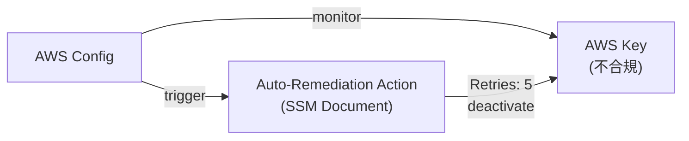
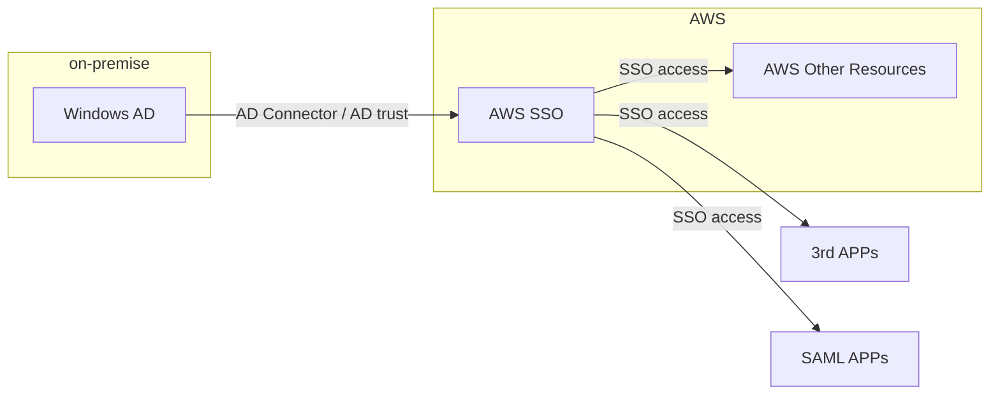
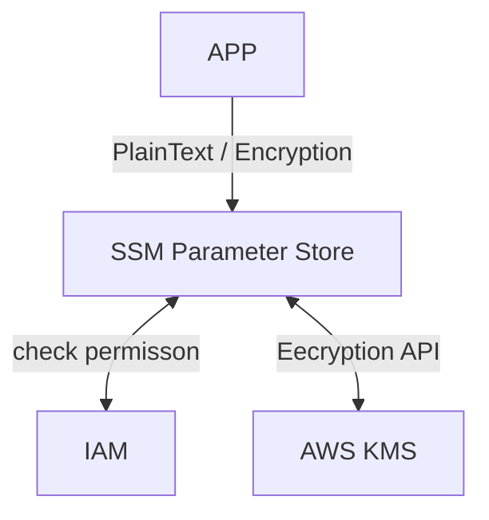
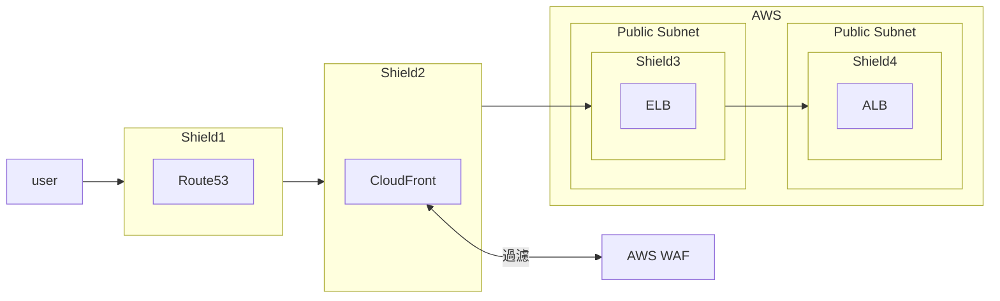
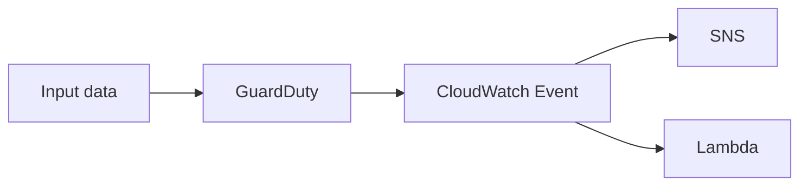
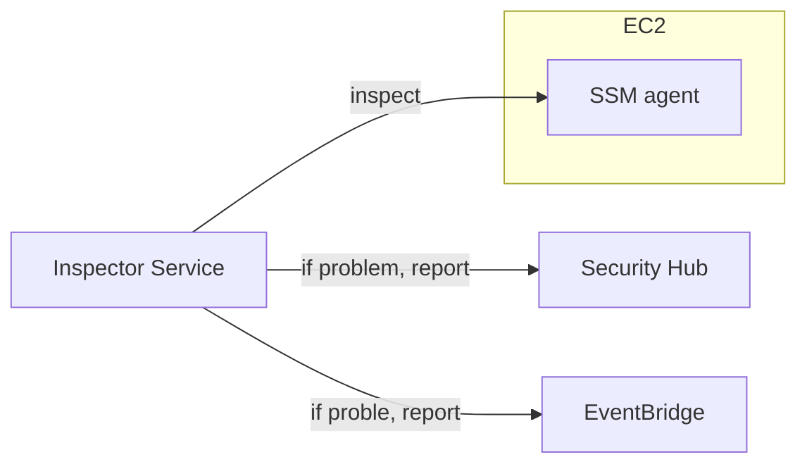
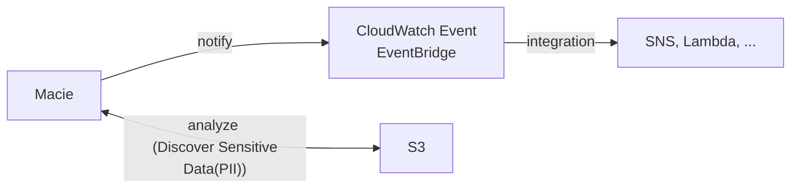
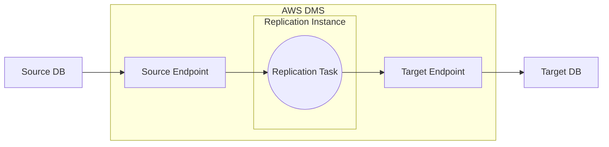
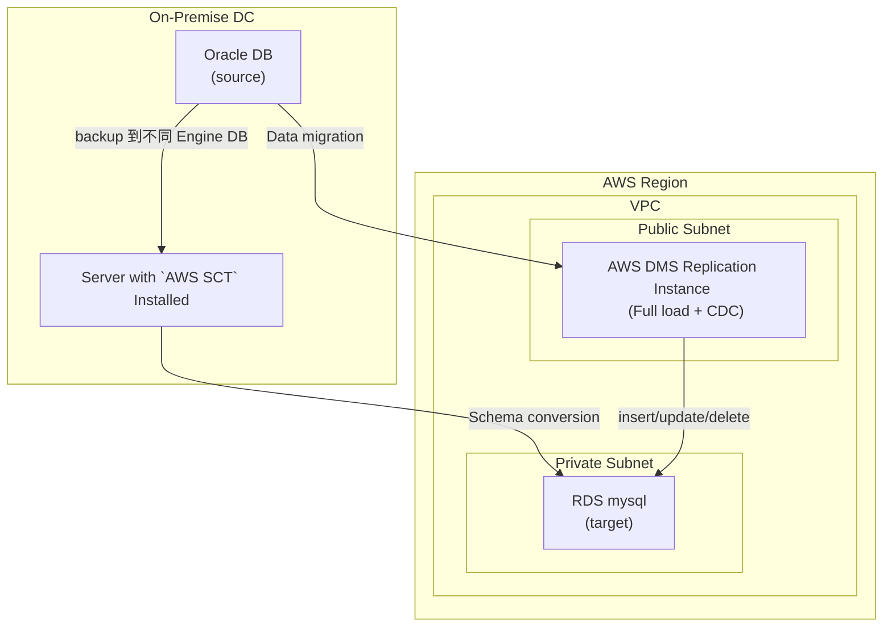
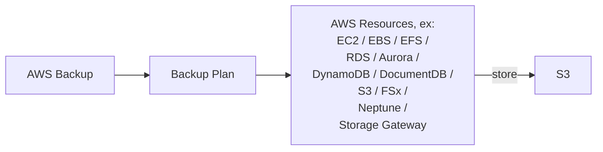

AWS Certificated Solutions Architect Associate, SAA-C02

- HIPAA : Health Insurance Portability and Accountability Act


# EC2

- [EC2](./EC2.md)


# HA && Scalability: ELB && ASG

- [ELB](./ELB.md)
- [ASG](./ASG.md)


# SQS, SNS, Kinesis, ActiveMQ

- [SQS](./SQS.md)
- [SNS](./SNS.md)
- [Kinesis](./Kinesis.md)

## Compare

SQS                          |     SNS                        |     Kinesis
---------------------------- | ------------------------------ | -------------------------
Queue                        | Pub/Sub                        | Real-time Streaming (Big Data)
consumer pull                | push to subscribers            | 
consume 後 delete data       | 一但未 delivered, data loss     | 可能可以 reply data (但 x 天候資料消失)
workers(consumer) 未限制      | 1250w subscribers & 10w topics | 
不用鳥 throughputs            | 不用鳥 throughputs              | standard: 2M/shard & enhances: 2M/consumer
僅在 FIFO 保證順序             |                                | 在 Sharded Level 決定 ordering


## ActiveMQ

- 需要有 Dedicated Machine 跑 AmazonMQ
    - 支援 HA
- ActiveMQ 可有 queues (類似 SQS) && 可有 topics (類似 SNS)
- 不同 Region 的 ActiveMQ Broker, 可掛載相同的 EFS 來達到 HA


# Containers: ECS, Fargate, ECR, EKS

## ECS, Elastic Container Service

- [ECS](./ECS.MD)


## EKS, Amazon Elastic Kubernetes Service

- 類似於 ECS, 但使用不同的 API
- 此為 OpenSource, 相對於 ECS, 純 AWS
- 與 ECS 一樣, 也支援 2 種 launch mode:
    - EC2 mode
        - deploy on EC2
    - Fargate mode
        - Serverless
- EKS Pods, 有點類似於 ECS Tasks
- 如果要 Expose EKS Service, 則需要設定 **Load Balancer**


## [Cognito](./Cognito.md)


# Databases && AWS Storage Extras

- [Databases and Storage](./DatabaseAndStorage.md)


# CloudFront && Global Accelerator

- *CloudFront* 與 *Global Accelerator* 比較?
    - 兩者都使用 AWS Private Network
    - 兩者都整合 AWS Shield 來因應 DDoS
    - Performance:
        - CloudFront         - 由 Edge Location 快取 靜態資源 & 動態資源
        - Global Accelerator - 將請求 proxied 回源, 不做快取, 背後的 listener 由 TCP/UDP 來加速


## CloudFront

- [CloudFront](./CloudFront.md)


## Global Accelerator

- 用來解決 Service 存在於 Single Region, 但 Request 來自世界各地的 長途路由 問題
- Charge: 需要摳摳
    - 固定設定費用 + 資料傳輸費用
- 必要網路知識:
    1. Unicast IP : 一台 Server 有一個 IP
        ```mermaid
        flowchart LR

        client --> srv1["Server A \n 1.2.3.4"]
        client --> srv2["Server B \n 5.6.7.8"]
        ```
    2. Anycast IP : 所有 Servers 有相同 IP && client 就近訪問其中一台
        ```mermaid
        flowchart LR

        client --> srv1["Server A \n 1.2.3.4"]
        client --> srv2["Server B \n 1.2.3.4"]
        ```
- **Global Accelerator** 使用了 **Anycast IP**
    - 不管 client 在哪邊, 都將請求送往鄰近的 *Edge Location*, 之後再走 AWS internal network 到後端 Server
    - work with *Elastic IP*, *EC2 instance*, *ALB*, *NLB*, ... (private && public)
    - 會拿到 2 組 Anycast IP for APP
    - intelligent routing && fast regional failover
    - 不存在 client cache 的問題 (IP doesn't change)
    - health check
    - DDos protection (by Shield)
    - Improve performance
        - 如果 APP != HTTP, 像是 UDP, MQTT, VoIP, ... 表現都不錯
        - 如果 APP == HTTP, 需要一組 static IP 或 一組 failover regional 可快速切換
- 容易與 [S3 Transfer Acceleration](./S3.md#s3---baseline-performance--kms-limitation) 搞混
- Global Accelerator 配置:
    - Listener       - 
    - Endpoint Group - 後端資源(ALB/NLB/EC2/EIP) 所在的 Region
    - 配置完成後, 需要等一陣子(不知道多久), Health Status 才會變為 Healthy
- Charge:
    - 依照 Global Accelerator 建立後, per hour 或 partial hour 計費 (建立後就要開始燒錢了)
    - 資料傳輸費用


# AWS Monitoring & Audit: CloudWatch, CloudTrail & Config

## CloudWatch

- [CloudWatch](./CloudWatch.md)


## AWS Config




- 衡量 AWS Resources 之間的關係, 確保它們符合公司的 compliances
    - 可針對 not compliance 的 Resources, 由 [AWS-Managed Automation Documentation](https://docs.aws.amazon.com/systems-manager/latest/userguide/sysman-ssm-docs.html) 或 [Custom Automation Documents] 來對這些資源做 Remediation(整治/補救)
        - ex: [AWSConfigRemediation-RevokeUnusedIAMUserCredentials](https://docs.aws.amazon.com/systems-manager-automation-runbooks/latest/userguide/automation-aws-revoke-iam-user.html), 用來 deactivate 已過 compliance duration 的 IAM Access Key
- 可對於特定資源, 做 定期/事件 來做監控
- Charge: no free tier. 需要課金
- 若有多個 Region, 則需逐一啟用並配置
- Use Case:
    - 不合規 config => EventBridge
    - config 遭異動 => SNS
- User 啟用 AWS Config 以後, 可設定 **rules** 來針對特定 AWS Resources 做 auditing && compliance && tracking
    - by using `DescribeResource` && `ListResource` API
        - 將之結果彙整於 *Configuration Item*, 裡頭包含了:
            - metadata, attribute, relationship, related event, ..., 將結果保存到 S3
    - Config Rules 可有底下幾種方式
        - AWS managed config rules (> 75)
        - custom config rules (必須在 *AWS Lambda* 裡頭定義)
            - config rules 可以定義像是:
                - S3 bucket 需要是 encrypted, versioned, not public access, ...


# Other AWS Services

## Cloudformation

- 對於 SAA 來說似乎不是重點..
- [saa-CloudFormation](./CloudFormation.md)
- IaaS, declarative


## AWS Step Functions (易與 SWF 搞混)

- 用來一口氣管理一堆 **Lambda Function**
    - 具備了一堆特色: sequence, parallel, conditions, timeouts, error handling, ...
    - 除了 Lambda 以外, 也可與像是 EC2, ECS, API Gateway 等服務整合(但較少)
- *JSON state machine*
- 


## Simple Workflow Service, SWF (老東西, 已經不支援了)

- 與 **Step Function** 有點像, 但運行在 EC2
- Runtime 最長為 1 年
- *activity step* && *decision step* && *built-in intervention step*
- 除非有底下需求, 不然建議改用 Step Function
    - 需要 external signals 來干預目前 processes
    - 需要 child process 回傳結果給 parent process


## Amazon Elastic MapReduce, EMR

- Auto-scaling && integrated with **Spot Instances**
- 相關關鍵字: Hadoop, Big Data, ML, Web indexing, data processing, ...
    - Support: Apache Spark, HBase, Presto, Flink, ...


## AWS Opsworks

> AWS OpsWorks provides a simple and flexible way to create and manage stacks and applications. With AWS OpsWorks, you can provision AWS resources, manage their configuration, deploy applications to those resources, and monitor their health.

- AWS 認證考試的觀念: `AWS Opsworks == Managed Chef & Puppet`
    - AWS 魔改 Chef & Puppet
    - 若上 AWS 前已在使用, 則可接續使用 **AWS OpsWorks**
- 協助 perform server configuration automatically 或 repetitive actions
    - Chef   : Recipes
    - Pupuet : Manifest
- 功能有點類似 **AWS SSM**, **Beanstalk**, **CloudFormation**
- CaaS
    - Linux & Windows
    - 用來配置主機
    - 讓 SysOps 用來管理 cloud/on-premise instance
    - AWS OpsWork 為 SSM 另一套替代品


## AWS WorkSpaces

- [clf-WorkSpace](./cert-CLF_C01.md#amazon-workspaces)
- managed, Secure Cloud Desktop
- 減少本地 VDI(Virtual Desktop Infrastrucure) 的管理
- Charge: 用多久, 收多少
- 整合 Windows AD


## Cost Explorer

- Billing Service 底下其中一個小服務
- 支援 **Savings Plan** 的選擇
- monthly/yearly cost 組成 && 視覺話


## ElasticTranscoder

- Saas
- Media(video, music) converter service into various optimized formats (雲轉碼)


## SSO, Single Sign On

- 會有個集中化的 Portal
    - 集中化管理 permission
    - 可得知 user login (via CloudTrail)
- support *SAML 2.0 markup*, 整合了 SAML && on-premise *Active Directory*




# Security & Encryption

- [KMS, Key Management Service](#kms,-key-management-service)
- [SSM Parameter Store](#ssm-parameter-store)
- [Secret Manager](./SecretManager.md)
- [CloudHSM](#cloudhsm-hardware-security-module)
- [WAF & Shield](#waf--shield)
- [GuardDuty](#guardduty)
- [Inspector](#inspector)
- [Macie](#macie)


## Encryption

- encryption in-flight
    - 資料傳送過程中加密, HTTPS
    - ensure no MITM(man in the middle attack)
- encryption at rest
    - Server 接收到以前皆已完成加密
- client side encryption
    - Client 自行加密後再傳送, Server 永遠不知道自己收到的是殺小
    - Could leverage *Envelop Encryption*


## KMS, Key Management Service

- [AWS Key Management Service](https://docs.aws.amazon.com/kms/latest/developerguide/overview.html)
    - KMS 使用 硬體安全模組(HSM), 依照 FIPS 140-2 Cryptographic Module Validation Program 來保護及驗證 `AWS KMS keys`
    - KMS 也有和 CloudTrail 做整合, 用以滿足 auditing, regulatory, and compliance needs
        - 可使用 CloudTrail 來查看 KMS 的使用
- KMS 常被拿來與 [CloudHSM](#cloudhsm-hardware-security-module) 做比較
- Charge: `$0.03/10000` call KMS API
- API call > 4KB data 須借助 *envelop encryption*
- *KMS Key* 無法 cross region 傳送
- Key policies are the primary way to control access to KMS keys. Every KMS key must have exactly one key policy.
    - 其次也可使用 IAM
- 2 types of KMS:
    - Symmetric Keys
        - AES-256
        - CMK, Customer Master Key, 又分成 3 種:
            - AWS Managed Service Default CMK (AWS owned CMK)
                - Free
            - User Keys created in KMS (AWS managed CMK)
                - 一把 Key : 1/month
            - User Keys imported (Customer managed CMK)
                - 一把 Key : 1/month
                - 必須為 256 bit symmetric key
        - envelop encryption
        - user call API to use Key
    - Asymmetric Keys
        - RSA & ECC key pairs
        - user CAN NOT call API to see private key
- [Deleting AWS KMS keys](https://docs.aws.amazon.com/kms/latest/developerguide/deleting-keys.html)
    - 因為 KMS Key 太過敏感且重要, 為了防止誤砍, 給予了 waiting period 的機制
    - 點選刪除後, Key 會進入 *Pending deletion* (可自行設定 7~30 days, default 30 days)
    - 可在此期間內還原, 但如果超過此期間就 GG 了
        - AWS 會連帶刪除與此相關的 Resources


## SSM Parameter Store

- [clf-SSM](./cert-CLF_C01.md#aws-ssm-systmes-manager)
- Securely store your configuration && secrets
    - 有 Versioning
    - 可使用 KMS 來將參數加密
- 相較於 Secret Manager, 此服務比較舊, 且以 儲存參數 的功能為導向
- Name 得以 Path 的形式來做命名, ex: "/my-app/dev/db-url"
- 與 *CloudFormation*, *CloudWatch Events* 整合
- 其他 AWS Services 在使用此服務時, 需要經常留意 IAM 的權限
    - 若有加密, Lambda 需要解密後取用時, 也需要留意 KMS 權限
- Parameter Store 區分為
    - Standard Tier(Free)
    - Advanced Tier(Charge)
        - 可制定 Parameter Policy




## CloudHSM, Hardware Security Module

- 常被拿來與 [AWS KMS](#aws-kms-key-management-service) 做比較
- Charge: 不便宜..
- CloudHSM 與 Secret Manager 相比較的話:
    - Secret Manager : AWS manage  software for encryption
    - CloudHSM       : AWS provide hardware for encryption
        - user 自行管理 keys
        - 需額外安裝 `CloudHSM client`
            - 使用上, 須留意 IAM permission 要開給 Client CRUD && 軟體面, 要維護 Keys & Users
            - 相較 KMS, 則全由 IAM 管理
- SaaS, HA
- 與 Redshift 有高度整合
- Good option for SSE-C Encryption
- 安全防護規格 `FIPS 140-2 Level 3 compliance` (看看就好...)
- *Master Key* 方面, 僅支援 [Customer Managed CMK](#aws-kms-key-management-service)
- CloudHSM deployed in VPC, 不過可 cross Region (by VPC sharing)


## WAF & Shield

- AWS Shield 分成 2 種模式:
    - Standard (預設啟用)
        - Charge: Free, 
        - 基礎的 SYN/UDP Floods, Reflection attacks, L3/L4 attacks, DDoS
    - Advanced
        - Charge `$3000/month`
        - DDoS mitigation service
        - Protect: EC2, ELB, CloudFront, Global Accelerator, Route53
        - 24*7 access to AWS DDoS response team(DRP)
        - 可免除 DDoS 期間 ELB 流量暴增所造成的流量費用
- WAF, Web Application Firewall
    - L7, Deploy on(only): 
        - ALB & API Gateway (Regional)
        - CloudFront (Global)
    - 需要自行配置 Web ACl, Web Access Control List
    - Protect:
        - XSS, Cross-Site Scripting
        - SQL injection
        - 設定訪問流量限制(size constraint)
        - 藉由 Geometric 屏蔽特定國家 IP
        - DDoS (by rate-based rule)
- AWS Firewall Manager
    - 用來管理 AWS Organization 所有 accounts 的 access rules

> AWS Firewall Manager is a security management service that allows you to centrally configure and manage firewall rules across your accounts and applications in AWS Organizations.
> 
> It is integrated with AWS Organizations so you can enable AWS WAF rules, AWS Shield Advanced protection, security groups, AWS Network Firewall rules, and Amazon Route 53 Resolver DNS Firewall rules.




## [GuardDuty](https://docs.aws.amazon.com/guardduty/latest/ug/what-is-guardduty.html)

- perform intelligent threat discovery in order to protect your AWS account
- 正如其名, 持續監控找出 AWS Account 的髒東西 & 惡意威脅 & 惡意 IP & 由 CloudTrail logs 找出異常活動
    - by leveraging ML
- 用 ML && 3rd data, 來看 user account 是否 under attack
- 後續動作像是, 偵測異常後, 藉由 *EventBridge Rules* -> Lambda/SNS
- Protect *CryptoCurrency attacks*(WTF?)
- 容易與 [Macie](#macie) 搞混
- 容易與 [Inspector](#inspector) 搞混
    - Inspector 由 settings && configurations 來找 **APP** 的潛在威脅
    - Guardduty 找出 **AWS Account, Data Store, Workload** 方面的潛在威脅
- Input data 包含了:
    - [VPC Flow Logs](./VPC.md#vpc-flow-logs)
    - DNS Logs
    - EKS Audit Logs
    - EBS Volume data
    - CloudTrail Events Logs
        - CloudTrail Management Events
            - 從 *CloudTrail Event logs* 取 data, 來判斷是否有 unusual API call
        - CloudTrail S3 Data Events
- Charge: 30 天免費..




## Inspector

- 讓 user automated security assessment for your AWS infra
    - 幫你的 AWS 做健診
- Inspector 只能 inspect:
    - EC2 - leverage *AWS System Manager (SSM) agent*, 分析異常流量 && OS 漏洞
        - database of vulnerabilities (CVE)
    - ECR - 當有人 docker push 就去評估 image/Container
- 容易與 [Guardduty](#guardduty) 搞混
    - Inspector 比較像是主動去探測潛在威脅
    - Guardduty 比較偏向事後針對 log 找漏洞
- reporting & integrating with *AWS Security Hub*, 若發現問題會送到 *Amazon EventBridge*




## [Macie](https://docs.aws.amazon.com/macie/latest/user/what-is-macie.html)

- Fully managed data security && data privacy service, by using:
    - ML && Pattern matching to discover && protect sensitive data
    - 也用來協助 identify && alert sensitive data, ex: personally identifiable information, PII
    - 標的主要是 data security && data privacy service
    - 容易與 [GuardDuty](#guardduty) 搞混
- SaaS




## AWS Security Hub

- Central Security tool, 用來管理 security, cross AWS accounts & automate security checks
- Charge: 燒錢~~
- 可將底下的服務集中到 Security Hub (但需要先 enable *AWS Config Service*)
    - GuardDuty
    - Inspector
    - Macie
    - IAM Access Analyzer
    - AWS System Manager
    - AWS Partner Network Manager


## Amazon Detective

- 因應 Security, 可用 GuardDuty, Macie, SecurityHub, ...
- 但如果要找出因果關係, 可使用 *Amazon Detective*
- 啟用後, 會自動蒐集底下這些, 來建立 view (用來呈現)
    - [VPC Flows Logs](./VPC.md#vpc-flow-logs)
    - [CloudTrail](#cloudtrail)
    - GuardDuty


## AWS Abuse

> Report suspected AWS Resources used for abusive or illegal purposes

- 用來跟 AWS 反映違規使用的 Service


# VPC

- [VPC](./VPC.md)


# Disaster Recovery & Migrations

- [Disaster recovery options in the cloud](https://docs.aws.amazon.com/whitepapers/latest/disaster-recovery-workloads-on-aws/disaster-recovery-options-in-the-cloud.html)


## Disaster Recovery in AWS

- DR, Disaster recovery
- 備份還原策略, 關鍵決策的核心要考慮 2 個重點, 後續的備份還原策略, 都基於這兩者:
    - RPO, Recovery Point Objective
        - Disaster 與 RPO 之間, 為 data loss 可接受的範圍
    - RTO, Recovery Time Objective
        - RTO 與 Disaster 之間, 為 downtime 可接受的期間

```
   RPO        Disaster             RTO
    | Data Loss |  Service Downtime |
    v           v                   v
------------------------------------------> time
```

- 常見的 Disaster Recovery Strategies 如下:
    - Backup and Resotre
        - 遇到問題時, restore/recreate from backup
        - high RPO && high RTO
    - Pilot Light
        - 僅將核心資源做線上備份 (critical systems are already up)
        - ex: RDS 隨時與 local DB 做 replication
            - EC2 上頭安裝了與 running APP 一樣的環境 (但關機)
            - 遇到問題時, 改變 Route53 解析, 開 EC2
        - 相較上者, 有較低的 RPO && RTO
    - Warm Standby
        - 隨時都有另一套規格較小的在運行, 作為備源
    - Hot Site / Multi Site Approach
        - 最貴方案, 不過 RPO & RTO 能盡可能降到最低
        - full production scale


## Database Migration Service, DMS

- [What is AWS Database Migration Service?](https://docs.aws.amazon.com/dms/latest/userguide/Welcome.html)
- 如果 backup source 與 restore target 的 DB engine 不一樣, 參考 *AWS SCT*
    - [What is the AWS Schema Conversion Tool?](https://docs.aws.amazon.com/SchemaConversionTool/latest/userguide/CHAP_Welcome.html)
    - AWS Schema Conversion Tool, SCT
    - 反過來說, 如果 source 與 target 相同 Engine, 則不需要 SCT
- Continuous Data Replication, CDC
- 可做轉換的 Data Sources:
    - EC2 上頭的 DB
    - RDS
    - S3
    - DocumentDB






## On-Premises Strategies with AWS

- AWS Application Discovery Service
    - 用來蒐集 On-Premise Servers 資訊, 來做 migration plan
    - Server utilization & dependency mappings
    - Track with AWS Migration Hub
- 除了上述 DMS, Database Migration Service, 可以處理 AWS 與 On-Premise 的 migration 以外, 地端可使用 *AWS Server Migration Service, SMS*
    - 可將 On-Premise DB 做 incremental backup -> AWS


## [DataSync](./DataSync.md)


## Transferring Large Datasets

- local 與 AWS 巨量資料的傳遞
    - 一次性
        - ~~Site-to-Site VPN~~
        - ~~Direct Connect~~
        - [Snowball](./cert-CLF_C01.md#aws-snow-family)
    - on-going
        - [Site-to-Site VPN](./VPC.md#aws-site-to-site-vpn)
        - Direct Connect
        - [DMS](./cert-CLF_C01.md#dms-database-migration-services)
        - [DataSync](#datasync)


## [AWS Backup](https://docs.aws.amazon.com/aws-backup/latest/devguide/whatisbackup.html)
- SaaS, 統一管理 && auto backup across AWS Services
- 無需 custom Scripts, 無需 manual processes
- 支援一堆 AWS Services:
    - EC2 / EBS
    - S3
    - RDS / Aurora / DynamoDB
    - DocumentDB / Neptune
    - EFS / FSx
    - Storage Gateway (Volume Gateway)
- 支援 
    - cross-region && cross-account
    - Continuous backup and point-in-time restore (PITR)
        - 若使用 **Continuous backup**, 要先建立 Full Backup, 之後持續備份 Transaction log
        - 若使用 **Snapshot backup**, 可設定定期(例如每小時), 資料最多可以儲存 100 years,
            - Snapshots can by copied for full or incremental backups(快照可以透過複製方式進行完整或增量備份)
    - on-demand && scheduled backups
    - tag-based backup policy
- backup plans:
    - frequency
    - Backup window
    - Transition -> Code Storage
    - Retention period
- 支援 [Backup Vault Lock](./S3.md#s3-lock-policies--glacier-vault-lock)




# ML, Machine Learning

- [Machine Learning](./cert-CLF_C01.md#machine-learning)


# WhitePaper Section Introduction

- [AWS Well-Architected Framework](https://docs.aws.amazon.com/wellarchitected/latest/framework/welcome.html)
    - 不要去猜測需求規模, 取而代之善用 ASG
    - 使用 Prod 規格來做測試 (因機器可隨時關閉, 別省這點錢, 別偷懶 )
    - 善用 CloudFormation 來重建架構, 方便實驗
    - Drive architecture using data
    - Well Architecture 有幾個重要構面:
        - Operational Excellence
        - Security
        - Reliability
        - Performance Efficiency
        - Cost Optimization
        - Sustainability
- [What is AWS Well-Architected Tool?](https://docs.aws.amazon.com/wellarchitected/latest/userguide/intro.html)
    - Free tool to review architecture
    - 建立一份 Workload 以後, 開始回答一堆問題... AWS 會提出相關的 risk 以及 improvment plan
- [AWS Trusted Advisor](https://docs.aws.amazon.com/awssupport/latest/user/trusted-advisor.html)
    - 依照底下的 5 個分類, 以 high level AWS Account assessment 來做建議
        - Cost optimization
        - Performance
        - Security
        - Fault tolerance
        - Service limits
    - [AWS Trusted Advisor](https://docs.aws.amazon.com/awssupport/latest/user/trusted-advisor.html)
        > Trusted Advisor draws upon best practices learned from serving hundreds of thousands of AWS customers.
        > 
        > Trusted Advisor inspects your AWS environment, and then makes recommendations when opportunities exist to save money, improve system availability and performance, or help close security gaps.
    - 除非有啟用 Enterprise 或 business plan, 否則只有底下部分的 core checks:
        - Cost Optimization
        - Performance
        - Security
        - Fault Tolerance
        - Service Limits
    - [AWS-Github-Samples](https://github.com/aws-samples)
- [Disaster Recovery of Workloads on AWS: Recovery in the Cloud](https://docs.aws.amazon.com/whitepapers/latest/disaster-recovery-workloads-on-aws/disaster-recovery-workloads-on-aws.html)
- [AWS Well-Architected Framework – Updated White Papers, Tools, and Best Practices](https://aws.amazon.com/blogs/aws/aws-well-architected-framework-updated-white-papers-tools-and-best-practices/)