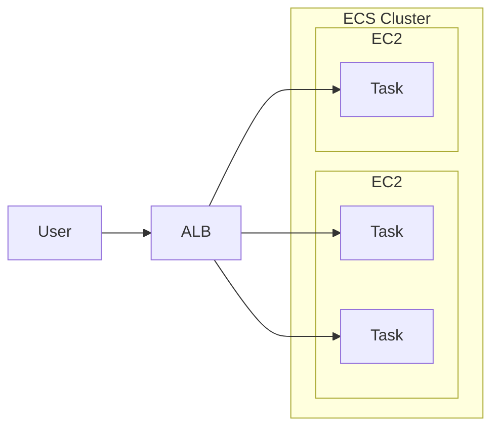

# EC2


# SQS, SNS, Kinesis, ActiveMQ

## SQS, Simple Queue Service

- 服務特色
    - Queue Model. Producer Send && Consumer poll
    - 無 messages 的數量限制
    - Latency < 10 ms
    - message 可能會被 read > 1 次
    - 可重複 Deliver Message (因此, coding 時應考慮這個)
    - 盡力而為的維持 Message 順序, 但不保證, 除非使用 FIFO SQS
    - Consumer 一次可拉 10 個 messages
    - message 可存活 1 min ~ 14 days
    - 每個 message 最大 256 KB
    - SQS 可搭配 ASG (讓 EC2(Consumer) in it), 來達到 Auto Scaling
        - **CloudWatch Metric** 監控 **SQS Queue**
            - Queue Length (`ApproximateNumberOfMessages`)
            - Queue Length / Number of Instances
        - **CloudWatch Metric** Alarm for breach **CloudWatch Alarm**, 來對 ASG 做 Auto Scaling
        - 需設定兩條規則, 分別做 Scaling up && Scaling down
    - SQS - Queeu Access Policy
        - 類似 S3 的 Resource Policy
    - SQS - Message Visibility Timeout (預設 30s)
        - 如果 Consumer 無法在既定時間內完成的話, 可考慮調大它
        - Consumer 在此時間內處理不完的話, 會再次放回 SQS, 因此 Message 可能被多次 Read
            - 若 Read 次數過多, 應考慮使用 SQS - Dead Letter Queue, DLQ
        - 使用 `ChangeMessageVisibility API` 調整 timeout
    - SQS - Dead Letter Queue, DLQ
        - 藉由調整 Source SQS Queeu 的 `MaximumReceives`, 超過此 Read time, 則放入此
        - 後續 Developer 在針對此裡頭的 Message debugging
        - 需要給 SQS Queue permission 來 write
    - SQS - DelayQueue
        - default: 0 (max 15 mins)
        - 過多久後再傳送到 Queue
    - SQS - Long Polling
        - default: 0 (range 0 ~ 20 s)
        - Consumer 可設定此參數, 減少 API call 的次數
        - 可在兩個地方設定　
            - Queue Level
            - API Level (設定 `WaitTimeSeconds`)
    - SQS - Request-Response System
        - Producer 送 Message 可告知 Reply 位置, 將來 Consumer 處理完後, 會放到 Reply 指定的 SQS Queue
    - SQS - FIFO Queue
        - 保證 FIFO, 但有限制:
            - 300 Messagess/sec (without Batching)
            - 3000 Messages/sec
        - 具備 *Exactly-once send capability* (一次性發送, 可去除重複)
        - Naming 需要 ".fifo" 結尾
        - 可設定兩個參數來去除重複
            - Message Group
            - Message Deduplication
- Encryption
    - in-flight Encryption: 傳輸 message 的過程, 預設已有加密(HTTPS API). 
    - Server Side Encryption: 也可額外設定這個, 來再次加密
        - by "KMS key"
- Access Control
    - by IAM Policies
    - by SQS Access Policies
        - 等同於 S3 Bucket Policy
        - 可 Cross Account
            - SQS Policy 需 allow action: `["SQS:ReceiveMessage"]`
        - 可 Cross AWS Services
            - ex: SNS, S3 events, 來寫入 Message -> SQS
                - 檔案上傳到 S3 以後, 自動 trigger, SendMessage -> SQS
                    - SQS Policy 需 allow action: `["SendMessage"]`
- API
    - Producer 藉由 
        - SendMessage API 發送 Message
    - Consumer 藉由 
        - ReceiveMessage API 拉 Message
        - DeleteMessage API 將已處理好的 Message 移除
- 使用範例
    - ```mermaid
        flowchart TD;
        api[API request];
        app["Web App(with ASG)"];
        trans["Video Transcoding App(with ASG)"];

        api -- request --> app;
        app -- SendMessageAPI --> sqs;
        sqs -- ReceiveMessageAPI --> trans;
        trans -- Store --> S3;
        ```


## SNS, Simple Notification Service

- 不同於 SQS, 可設定多個 Receivers
- Pub/Sub Pattern
- up to 1250w 個 Subscribers
- up to 10w 個 Topics / account
- 基本資訊可參考[CLF-C01 SNS](./cert-CLF_C01.md)
- 一堆 AWS Services 都可 publish 到 SNS (using SDK)
- SNS 可 publish 到
    - AWS Services
    - HTTP(S)
    - SMS && mobile Notification
    - Emails
- Security
    - 同 SQS, 傳輸中加密, 也可額外設定 Server Side Encryption
    - Access Control, 核心為 IAM
    - SNS Access Policy
        - 同 S3, SQS. 也可設定 Resource Policy, Cross Account && Cross AWS Services
    - 搭配 SQS, 做 fan out
        - SQS 需 allow SNS write
        - ```mermaid
            flowchart TD;
            buy["Buying Service"];
            f["Fraud Service"];
            s["Shipping Service"];

            buy -- pub --> SNS;
            SNS -- sub --> SQS1;
            SNS -- sub --> SQS2;
            SQS1 -- Receive --> f;
            SQS2 -- Receive --> s;
          ```
    - SNS 也可直接整合 AWS **Kinesis Data Firehose, KDF**
        - load streams into S3, RedShift, OpenSearch(前身 ElasticSearch)
    - SNS 也可做 FIFO
        - 可去重複
        - 具有 content-based ID && deduplication ID 來設定唯一
        - naming 結尾 ".fifo"
        - 至今只有 SQS FIFO 可 Read SNS FIFO
    - SNS - Message Filtering
        - 讓 SNS Topic subscription 用來 filter message 的 JSON Policy
            - 只允許取得特定欄位給訂閱者 (而非全部欄位都給)


## Kinesis

- 即時 collect && process && analyze Streaming data
    - ex: app logs, metrics, Web Click streams, IOT telemetry data
    - 用來即時 蒐集, 處理, 分析 串流資料
- Kinesis 用 Partition ID 作為 PK
    - 相同的 Partition ID 資料, 會進入到相同的 Shard
- Kinesis 家族服務:
    - Kinesis Data Streams
        - capture, process, store data streams
    - Kinesis Data Firehose
        - load sata stremas -> AWS data stores
    - Kinesis Data Analytics
        - analyze data streams with SQL or Apache Flink
    - Kinesis Video Streams
        - capture, process, store video streams


### Kinesis Data Streams, KDS

- 名詞術語: https://docs.aws.amazon.com/streams/latest/dev/key-concepts.html
    - KCL, Kinesis Client Library
    - KPL, Kinesis Produce Library
- 構成
    - 一個 **Kinesis Data Stream** 由一系列的 Shards 所構成
        - 每個 Shard 可有 1 MB/s 的傳輸 or 1000 Messages/s
        - 每個 Shard 都有一個 sequence of data records
            - 每個 Data Record 都會被 Kinesis Data Streams 賦予一個 Sequence Number
    - 每個進入 KDS 的 Record 裡頭有 *Partition Key* && *Data Blob(up to 1MB)*
    - 每個由 KDS 出去的 Record 裡頭有 *Partition Key* && *Sequence no* && *Data Blob*
        - 可有 2 種 throughputs
            - 2 MB/s (shared), Per Shard all consumers
            - 2 MB/s (enhanced), Per Shard per consumers  (燒錢)
- 特性
    - 可保留 1 ~ 365 天
    - 可 reprocess(replay) data
    - 資料一但進 Kinesis, 無法刪除(immutable)
    - capacity 有 2 種 mode (若無規劃, 使用 B; 若能事先規劃, 使用 A)
        - A. provisioned mode(historic capacity mode)
        - B. on-demand mode(neuro mode)
- data stream producers
    - app, client, SDK, KPL, Kinesis Agent, ...
- data stream consumers
    - app(SDK, KCL), Lambda, Kinesis Data Firehose, Kinesis Data Analytics


### Kinesis Data Firehose, KDF

- 此為 Serverless
- Store data into Destination
- 可送入 KDF 的 data stream 有
    - data stream producers
    - kinesis data streams
    - CloudWatch Logs & CloudWatch Events
    - AWS IOT
- kDF 本身支援 AWS Lambda
- KDF 可 batch write to...
    - 3rd
        - Data Dog, Splunk, MongoDBZ, ...
    - AWS Services
        - s3, RedShift, OpenSearch, ...
    - Custom
        - HTTP Endpoint (API)
- Charge: Pay for data going through Firehose
- 此為半即時, 最起碼 delay 60s
    - 因 batch write
    - 最小 32MB 傳輸(可再調整)

Kinesis Data Streams                | Kinesis Data Firehose
----------------------------------- | -------------------------------
需要自幹 consumer & producer         | Fully managed
delay 200 ms                        | 有 buffer, 最小 delay 60s
自行 Scale(shard splitting/merging)  | Auto-Scaling
data store 1 ~ 365 days             | no data store
用於取 巨量資料                       | load streaming data to store
可 replay                           | 無法 replay


### Kinesis Data Analytics, KDA

- KDS, KDF 資料進入到 KDA 做分析
- KDA 支援 SQL
- 之後資料又可輸出到
    - KDS
        - 接 lambda 處理 or 客制 program
    - KDF
        - 接 S3, RedShift, ...
- 特色
    - real-time analytics
    - fully-managed, serverless
    - Auto-Scaling
    - by SQL
- Charge: by streams out of real-time queries
- Use Case:
    - Time-Series analytics
    - Real-Time Dashboards
    - Real-Time Metrics


## ActiveMQ

- 需要有 Dedicated Machine 跑 AmazonMQ
    - 支援 HA
- ActiveMQ 可有 queues (類似 SQS) && 可有 topics (類似 SNS)
- 不同 Region 的 ActiveMQ Broker, 可掛載相同的 EFS 來達到 HA


## SQS, SNS, Kinesis, ActiveMQ 其他摘要比較

SQS                          |     SNS                        |     Kinesis
---------------------------- | ------------------------------ | -------------------------
Queue                        | Pub/Sub                        | Real-time Streaming (Big Data)
consumer pull                | push to subscribers            | 
consume 後 delete data       | 一但未 delivered, data loss     | 可能可以 reply data (但 x 天候資料消失)
workers(consumer) 未限制      | 1250w subscribers & 10w topics | 
不用鳥 throughputs            | 不用鳥 throughputs              | standard: 2M/shard & enhances: 2M/consumer
僅在 FIFO 保證順序             |                                | 在 Sharded Level 決定 ordering


# Containers: ECS, Farget, ECR, EKS

## ECS, Elastic Container Service

- Task Definition: Defines how to create ECS task
- 有 2 種的 Launch Types, 但都可用 EFS 作為儲存:
    - EC2 Launch Type
        - 需自行維護 EC2, 裡頭需要有 `ECS Agent`
        - 此模式運行在 EC2 內的多個 **Task**, 他們可能被賦予了不同的 **EC2 Instance Profile Role**
        - 需要在 **ECS Service** 裡頭, 定義 **Task Role**
    - Farget Launch Type
        - Serverless
        - Launch 時, 可決定 CPU && RAM
        - Scaling 時, 決定 tasks number 即可
- 權限
    - 若 Task 需要 access AWS Resources, 則需給 **Task Role**
- Run **ECS Task** on **ECS Cluster**
- Use Case:
    - Hybrid Environment
    - Batch Processing
    - Scale Web Applications
- Auto Scaling
    - 用來 scale *Number of ECS Tasks*
    - 有 3 個 metric 可作為依據 (QQQ)
        - CPU Utilization
        - Memory Utilization
        - ALB Request Count Per Target
            - 由 ALB 來的 Metric
    - 有不同種類的 Auto Scaling
        - Target Tracking - 依照 CloudWatch 特定 Metric
        - Step Scaling - 依照 CloudWatch Alarm
        - Scheduled Scaling
    - Scaling *Task Level of ECS* != Scaling number of instances(EC2 launch type)
    - 如果是 EC2 Launch Type 的話, Auto Scaling 有 2 種做法:
        - Auto Scaling Group Scaling
            - 依照 (QQQ) 來 +- EC2 instances
        - ECS Cluster Capacity Provider
            - 比較聰明, 但須與 ASG 共同運作
- ECS Rolling Update
    - 滾動式更新(服務不中斷), 需要設定兩個參數
        - Minimun Healthy Percent
            - 最少需存活多少 Nodes
        - Maximum Percent
            - 最多開到多少 Nodes


### ECS - Load Balancer

- Application Load Balancer
    - 適用多數情況
- Network Load Balancer
    - high throughput 情境使用
    - 可搭配 **AWS Private Link**
- Classic Load Balancer
    - 別用就是了




## ECR, Elastic Container Registry

- 不解釋


## EKS, Amazon Elastic Kubernetes Service

- 類似於 ECS, 但使用不同的 API
- 此為 OpenSource, 相對於 ECS, 純 AWS
- 與 ECS 一樣, 也支援 2 種 launch mode:
    - EC2 mode
        - deploy on EC2
    - Farget mode
        - Serverless
- EKS Pods, 有點類似於 ECS Tasks
- 如果要 Expose EKS Service, 則需要設定 **Load Balancer**


# 