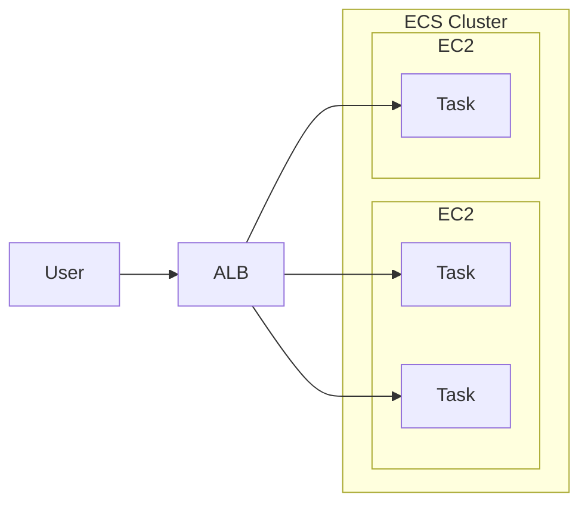
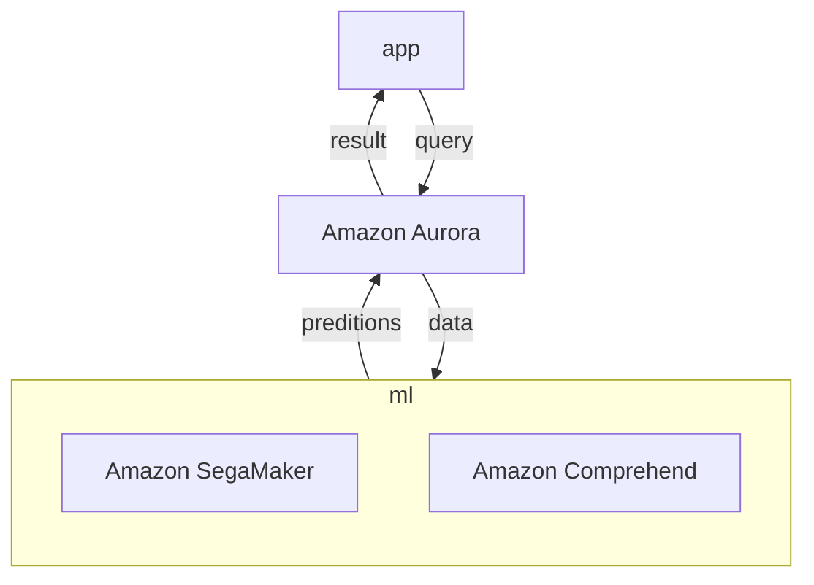
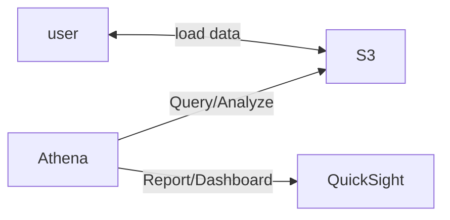
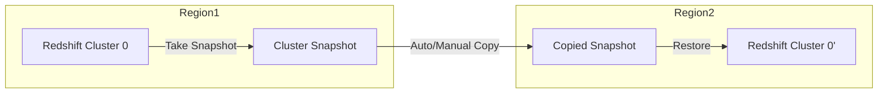
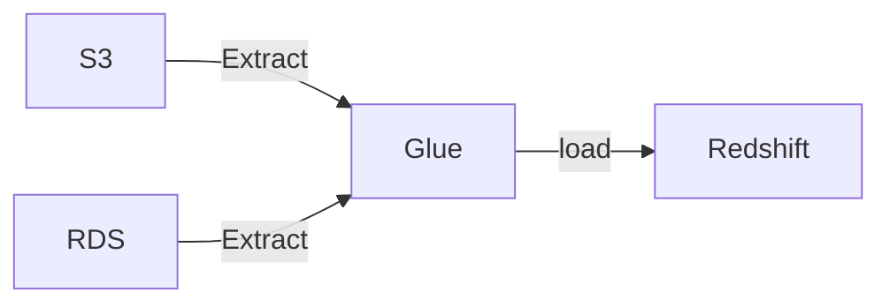
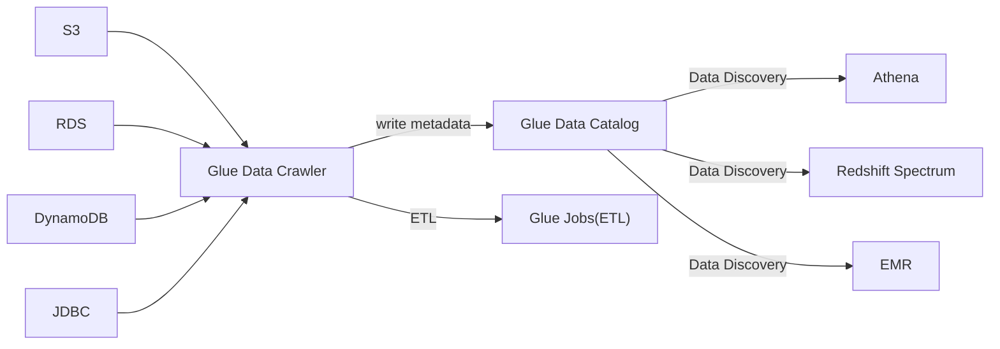

AWS Certificated Solutions Architect Associate

SAA-C02


# EC2


## EC2 Hibernate

- 有點像是, 把 Instance Stop, 就像一般電腦睡眠一樣, RAM state 被保留
    - 加速下次開機時間(OS never stop)
- cross OS
- hibernation period < 60 days (無法長久 hybernate)


# HA && Scalability: ELB && ASG

- Sticky Session 相關問題
- ELB - Cross Zone


## Elastic Load Balalnce, ELB

- 目前有 4 種 Load Balance
    - Classic Load Balancer, CLB
        - L4 && L7 : HTTP, HTTPS, TCP, SSL(secure TCP)
        - Since 2009, 第一代老東西了
    - Application Load Balancer, ALB
        - L7 : HTTP, HTTPS, WebSocket, HTTP/2
        - Since 2016
        - 後面接的東西為 *Target Group*
            - Health Check 是在 *Target Group* 階段處理的
            - *Target Group* 裡頭可以是:
                - EC2 instances
                - ECS tasks
                - Lambda functions
                - private IP (可以是 On-premise Data Center Servers)
        - 可依照不同的 Routing tables, 將請求送往後端不同的 Target Groups 
    - Network Load Balancer, NLB
        - L4 : TCP, UDP, TLS(secure TCP)
        - Since 2017
    - Gateway Load Balancer, GWLB
        - Since 2020
        - L3 : IP
- AWS Load Balancer 整合了一堆 AWS Services:
    - EC2, EC2 ASG, ECS, ACM, CloudWatch, Route53, AWS WAF, AWS Global Accelerator, ...
- 兼具 Health Check 功能


## Auto Scaling Group, ASG


# SQS, SNS, Kinesis, ActiveMQ

## SQS, Simple Queue Service

- 服務特色
    - Queue Model. Producer Send && Consumer poll
    - 無 messages 的數量限制
    - Latency < 10 ms
    - message 可能會被 read > 1 次
    - 可重複 Deliver Message (因此, coding 時應考慮這個)
    - 盡力而為的維持 Message 順序, 但不保證, 除非使用 FIFO SQS
    - Consumer 一次可拉 10 個 messages
    - message 可存活 1 min ~ 14 days
    - 每個 message 最大 256 KB
    - SQS 可搭配 ASG (讓 EC2(Consumer) in it), 來達到 Auto Scaling
        - **CloudWatch Metric** 監控 **SQS Queue**
            - Queue Length (`ApproximateNumberOfMessages`)
            - Queue Length / Number of Instances
        - **CloudWatch Metric** Alarm for breach **CloudWatch Alarm**, 來對 ASG 做 Auto Scaling
        - 需設定兩條規則, 分別做 Scaling up && Scaling down
    - SQS - Queeu Access Policy
        - 類似 S3 的 Resource Policy
    - SQS - Message Visibility Timeout (預設 30s)
        - 如果 Consumer 無法在既定時間內完成的話, 可考慮調大它
        - Consumer 在此時間內處理不完的話, 會再次放回 SQS, 因此 Message 可能被多次 Read
            - 若 Read 次數過多, 應考慮使用 SQS - Dead Letter Queue, DLQ
        - 使用 `ChangeMessageVisibility API` 調整 timeout
    - SQS - Dead Letter Queue, DLQ
        - 藉由調整 Source SQS Queeu 的 `MaximumReceives`, 超過此 Read time, 則放入此
        - 後續 Developer 在針對此裡頭的 Message debugging
        - 需要給 SQS Queue permission 來 write
    - SQS - DelayQueue
        - default: 0 (max 15 mins)
        - 過多久後再傳送到 Queue
    - SQS - Long Polling
        - default: 0 (range 0 ~ 20 s)
        - Consumer 可設定此參數, 減少 API call 的次數
        - 可在兩個地方設定　
            - Queue Level
            - API Level (設定 `WaitTimeSeconds`)
    - SQS - Request-Response System
        - Producer 送 Message 可告知 Reply 位置, 將來 Consumer 處理完後, 會放到 Reply 指定的 SQS Queue
    - SQS - FIFO Queue
        - 保證 FIFO, 但有限制:
            - 300 Messagess/sec (without Batching)
            - 3000 Messages/sec
        - 具備 *Exactly-once send capability* (一次性發送, 可去除重複)
        - Naming 需要 ".fifo" 結尾
        - 可設定兩個參數來去除重複
            - Message Group
            - Message Deduplication
- Encryption
    - in-flight Encryption: 傳輸 message 的過程, 預設已有加密(HTTPS API). 
    - Server Side Encryption: 也可額外設定這個, 來再次加密
        - by "KMS key"
- Access Control
    - by IAM Policies
    - by SQS Access Policies
        - 等同於 S3 Bucket Policy
        - 可 Cross Account
            - SQS Policy 需 allow action: `["SQS:ReceiveMessage"]`
        - 可 Cross AWS Services
            - ex: SNS, S3 events, 來寫入 Message -> SQS
                - 檔案上傳到 S3 以後, 自動 trigger, SendMessage -> SQS
                    - SQS Policy 需 allow action: `["SendMessage"]`
- API
    - Producer 藉由 
        - SendMessage API 發送 Message
    - Consumer 藉由 
        - ReceiveMessage API 拉 Message
        - DeleteMessage API 將已處理好的 Message 移除
- 使用範例
    - ```mermaid
        flowchart TD;
        api[API request];
        app["Web App(with ASG)"];
        trans["Video Transcoding App(with ASG)"];

        api -- request --> app;
        app -- SendMessageAPI --> sqs;
        sqs -- ReceiveMessageAPI --> trans;
        trans -- Store --> S3;
        ```


## SNS, Simple Notification Service

- 不同於 SQS, 可設定多個 Receivers
- Pub/Sub Pattern
- up to 1250w 個 Subscribers
- up to 10w 個 Topics / account
- 基本資訊可參考[CLF-C01 SNS](./cert-CLF_C01.md)
- 一堆 AWS Services 都可 publish 到 SNS (using SDK)
- SNS 可 publish 到
    - AWS Services
    - HTTP(S)
    - SMS && mobile Notification
    - Emails
- Security
    - 同 SQS, 傳輸中加密, 也可額外設定 Server Side Encryption
    - Access Control, 核心為 IAM
    - SNS Access Policy
        - 同 S3, SQS. 也可設定 Resource Policy, Cross Account && Cross AWS Services
    - 搭配 SQS, 做 fan out
        - SQS 需 allow SNS write
        - ```mermaid
            flowchart TD;
            buy["Buying Service"];
            f["Fraud Service"];
            s["Shipping Service"];

            buy -- pub --> SNS;
            SNS -- sub --> SQS1;
            SNS -- sub --> SQS2;
            SQS1 -- Receive --> f;
            SQS2 -- Receive --> s;
          ```
    - SNS 也可直接整合 AWS **Kinesis Data Firehose, KDF**
        - load streams into S3, RedShift, OpenSearch(前身 ElasticSearch)
    - SNS 也可做 FIFO
        - 可去重複
        - 具有 content-based ID && deduplication ID 來設定唯一
        - naming 結尾 ".fifo"
        - 至今只有 SQS FIFO 可 Read SNS FIFO
    - SNS - Message Filtering
        - 讓 SNS Topic subscription 用來 filter message 的 JSON Policy
            - 只允許取得特定欄位給訂閱者 (而非全部欄位都給)


## Kinesis

- 即時 collect && process && analyze Streaming data
    - ex: app logs, metrics, Web Click streams, IOT telemetry data
    - 用來即時 蒐集, 處理, 分析 串流資料
- Kinesis 用 Partition ID 作為 PK
    - 相同的 Partition ID 資料, 會進入到相同的 Shard
- Kinesis 家族服務:
    - Kinesis Data Streams
        - capture, process, store data streams
    - Kinesis Data Firehose
        - load sata stremas -> AWS data stores
    - Kinesis Data Analytics
        - analyze data streams with SQL or Apache Flink
    - Kinesis Video Streams
        - capture, process, store video streams


### Kinesis Data Streams, KDS

- 名詞術語: https://docs.aws.amazon.com/streams/latest/dev/key-concepts.html
    - KCL, Kinesis Client Library
    - KPL, Kinesis Produce Library
- 構成
    - 一個 **Kinesis Data Stream** 由一系列的 Shards 所構成
        - 每個 Shard 可有 1 MB/s 的傳輸 or 1000 Messages/s
        - 每個 Shard 都有一個 sequence of data records
            - 每個 Data Record 都會被 Kinesis Data Streams 賦予一個 Sequence Number
    - 每個進入 KDS 的 Record 裡頭有 *Partition Key* && *Data Blob(up to 1MB)*
    - 每個由 KDS 出去的 Record 裡頭有 *Partition Key* && *Sequence no* && *Data Blob*
        - 可有 2 種 throughputs
            - 2 MB/s (shared), Per Shard all consumers
            - 2 MB/s (enhanced), Per Shard per consumers  (燒錢)
- 特性
    - 可保留 1 ~ 365 天
    - 可 reprocess(replay) data
    - 資料一但進 Kinesis, 無法刪除(immutable)
    - capacity 有 2 種 mode (若無規劃, 使用 B; 若能事先規劃, 使用 A)
        - A. provisioned mode(historic capacity mode)
        - B. on-demand mode(neuro mode)
- data stream producers
    - app, client, SDK, KPL, Kinesis Agent, ...
- data stream consumers
    - app(SDK, KCL), Lambda, Kinesis Data Firehose, Kinesis Data Analytics


### Kinesis Data Firehose, KDF

- 此為 Serverless
- Store data into Destination
- 可送入 KDF 的 data stream 有
    - data stream producers
    - kinesis data streams
    - CloudWatch Logs & CloudWatch Events
    - AWS IOT
- kDF 本身支援 AWS Lambda
- KDF 可 batch write to...
    - 3rd
        - Data Dog, Splunk, MongoDB, ...
    - AWS Services
        - s3, RedShift, OpenSearch, ...
    - Custom
        - HTTP Endpoint (API)
- Charge: Pay for data going through Firehose
- 此為半即時, 最起碼 delay 60s
    - 因 batch write
    - 最小 32MB 傳輸(可再調整)

Kinesis Data Streams                | Kinesis Data Firehose
----------------------------------- | -------------------------------
需要自幹 consumer & producer         | Fully managed
delay 200 ms                        | 有 buffer, 最小 delay 60s
自行 Scale(shard splitting/merging)  | Auto-Scaling
data store 1 ~ 365 days             | no data store
用於取 巨量資料                       | load streaming data to store
可 replay                           | 無法 replay


### Kinesis Data Analytics, KDA

- KDS, KDF 資料進入到 KDA 做分析
- KDA 支援 SQL
- 之後資料又可輸出到
    - KDS
        - 接 lambda 處理 or 客制 program
    - KDF
        - 接 S3, RedShift, ...
- 特色
    - real-time analytics
    - fully-managed, serverless
    - Auto-Scaling
    - by SQL
- Charge: by streams out of real-time queries
- Use Case:
    - Time-Series analytics
    - Real-Time Dashboards
    - Real-Time Metrics


## ActiveMQ

- 需要有 Dedicated Machine 跑 AmazonMQ
    - 支援 HA
- ActiveMQ 可有 queues (類似 SQS) && 可有 topics (類似 SNS)
- 不同 Region 的 ActiveMQ Broker, 可掛載相同的 EFS 來達到 HA


## SQS, SNS, Kinesis, ActiveMQ 其他摘要比較

SQS                          |     SNS                        |     Kinesis
---------------------------- | ------------------------------ | -------------------------
Queue                        | Pub/Sub                        | Real-time Streaming (Big Data)
consumer pull                | push to subscribers            | 
consume 後 delete data       | 一但未 delivered, data loss     | 可能可以 reply data (但 x 天候資料消失)
workers(consumer) 未限制      | 1250w subscribers & 10w topics | 
不用鳥 throughputs            | 不用鳥 throughputs              | standard: 2M/shard & enhances: 2M/consumer
僅在 FIFO 保證順序             |                                | 在 Sharded Level 決定 ordering


# Containers: ECS, Farget, ECR, EKS

## ECS, Elastic Container Service

- Task Definition: Defines how to create ECS task
- 有 2 種的 Launch Types, 但都可用 EFS 作為儲存:
    - EC2 Launch Type
        - 需自行維護 EC2, 裡頭需要有 `ECS Agent`
        - 此模式運行在 EC2 內的多個 **Task**, 他們可能被賦予了不同的 **EC2 Instance Profile Role**
        - 需要在 **ECS Service** 裡頭, 定義 **Task Role**
    - Farget Launch Type
        - Serverless
        - Launch 時, 可決定 CPU && RAM
        - Scaling 時, 決定 tasks number 即可
- 權限
    - 若 Task 需要 access AWS Resources, 則需給 **Task Role**
- Run **ECS Task** on **ECS Cluster**
- Use Case:
    - Hybrid Environment
    - Batch Processing
    - Scale Web Applications
- Auto Scaling
    - 用來 scale *Number of ECS Tasks*
    - 有 3 個 metric 可作為依據 (QQQ)
        - CPU Utilization
        - Memory Utilization
        - ALB Request Count Per Target
            - 由 ALB 來的 Metric
    - 有不同種類的 Auto Scaling
        - Target Tracking - 依照 CloudWatch 特定 Metric
        - Step Scaling - 依照 CloudWatch Alarm
        - Scheduled Scaling
    - Scaling *Task Level of ECS* != Scaling number of instances(EC2 launch type)
    - 如果是 EC2 Launch Type 的話, Auto Scaling 有 2 種做法:
        - Auto Scaling Group Scaling
            - 依照 (QQQ) 來 +- EC2 instances
        - ECS Cluster Capacity Provider
            - 比較聰明, 但須與 ASG 共同運作
- ECS Rolling Update
    - 滾動式更新(服務不中斷), 需要設定兩個參數
        - Minimun Healthy Percent
            - 最少需存活多少 Nodes
        - Maximum Percent
            - 最多開到多少 Nodes


### ECS - Load Balancer

- Application Load Balancer
    - 適用多數情況
- Network Load Balancer
    - high throughput 情境使用
    - 可搭配 **AWS Private Link**
- Classic Load Balancer
    - 別用就是了




## ECR, Elastic Container Registry

- 不解釋


## EKS, Amazon Elastic Kubernetes Service

- 類似於 ECS, 但使用不同的 API
- 此為 OpenSource, 相對於 ECS, 純 AWS
- 與 ECS 一樣, 也支援 2 種 launch mode:
    - EC2 mode
        - deploy on EC2
    - Farget mode
        - Serverless
- EKS Pods, 有點類似於 ECS Tasks
- 如果要 Expose EKS Service, 則需要設定 **Load Balancer**


## Cognito

> Provides authentication && authorization && user management for your web and mobile apps. Your users can sign in directly with a user name and password, or through a third party such as Facebook, Amazon, Google or Apple.
> 
> Offers user pools and identity pools. User pools are user directories that provide sign-up and sign-in options for your app users. Identity cagnito pools provide AWS credentials to grant your users access to other AWS services.


# Databases

- DB Types
    - RDBMS(=SQL/OLTP)
        - RDS, Aurora, MySQL, ...
    - NoSQL
        - DynamoDB (~JSON)
        - ElastiCache (key-value pairs)
        - Neptune (graphs)
    - Object Store
        - S3
        - Glacier
    - Data Warehouse (=SQL Analytics/BI)
        - Redshift (OLAP)
        - Athena
            - Query data on S3
    - Search
        - OpenSearch
    - Graphs
        - Neptune


## RDS, Relational Database Service

- 允許在 RDS 裡頭開 RDB
- RDBMS/OLTP
- 自行準備 EC2 instance && EBS Volume type & size
    - 但無須自行維護機器, OS
    - 因為是需要 Provision EC2, 因此只能做 垂直擴展, 無法水平擴增
    - Storage
        - RDS 具有 storage auto-scaling
            - 可自動偵測 Disk 用量, 並視情況 Scaling EBS
        - use EBS volumes
- 區分成 5 個了解方向:
    - Operations
        - 須自行處理 replicas, ec2 scaling, EBS restore, App Change, ...
    - Security
        - 自行處理 Security Group, KMS, SSL for encryption in transits, IAM Authentication
        - PostgreSQL && MySQL 皆支援 IAM Authentication
    - Reliability
        - 支援 Read-Replica && Multi AZ
    - Performance 依賴於 EC2 && EBS spec
    - Cost
        - based on EC2 && EBS
- Read Replicas
    - RDS Database, 至多可有 5 個 Read Replicas
    - 此為 Async Replication (相較於 Multi-AZ, 使用 Sync Replication)
    - 如果使用的話, Connection String 必須修改
    - Read Replicas 僅需要 Read 權限即可
    - 因 RDS 為 managed service, Same Region && Different AZ, sync Data 不需流量費用
        - 但若跨 Region, 則需要 $$
- Reliability
    - 如果要設定 Multi-AZ 非常簡單, 僅需 Enable 即可. 而且服務可免中斷


### RDS Backups

- Backup (自動)
    - Full      : 每天 
    - Transaction logs : 每 5 分鐘
        - 因此可隨時還原 5 分鐘前資料
    - 預設保留 7 天, 但可增至 35 天
- DB Snapshot (手動觸發)
    - 可自行決定保留多久


### Aurora

- RDS 旗下的其中一款 Engine Type, 地位等同於 RDS MySQL, RDS PostgreSQL, ...
    - AWS 魔改 MySQL/PostgreSQL 以後的 RDBMS
        - CloudNative
    - 可選擇自行 Provision Server 或是 Serverless
    - Operations
        - 可自行選擇是否使用 *Single-master* 或 *Multi-master*
        - 相較於其他 Type, less operations
        - auto scaling storage
        - Auto Scaling
            - 一次 10GB, 最多可擴充達 128 TB
    - Security
        - 同 RDS
        - Encryption at rest by KMS
        - Encryption in-flight uging SSL
        - 可用 IAM token 認證
        - auto backups, snapshots and replicas (皆 encrypted)
    - Reliability
        - AWS 自行幫忙處理好 6 replicas
            - 這 6 個 replication 橫跨了 3 AZ - HA
                - 而他們的背後也是寫入到不同的 Volume(免 user 自管)
            - 具備 Self healing(peer-to-peer replication)
        - auto failover < 30 secs
            - 單一 Cluster 最多可設定 15 Read Replicas (可放在 Auto Scaling)
            - 若超過, 其餘 read replicas 會產生新的 master 來做 write
        - 本身支援 cross replication
        - Global for Disaster Recovery / latency purpose
        - Backtrack: restore data at any point of time without using backups
    - Performance
        - MySQL && Postgresql 效能的 5x && 3x (宣稱)
            - 但是貴了 20%
    - Cost 
        - Pay for use
- Aurora DB Cluster
    - 
    - Load Balancing 發生在 connection level (而非 statement level)
    - *Writer Endpoint* && *Reader Endpoint*
- Deletion
    - 先刪除 Reader Instance
    - 再刪除 Writer Instance
        - 最後刪除 Regional Cluster (又或者, 此會隨著 *Writer Instance* 一同刪除, 不是很確定)
- Auto Scaling for Aurora Replicas
    - 可針對 by CPU 用量 OR by conneciton 數量, 來增加 Read Replicas
    - 增加的 Replicas, 也可產生不同規格的大小
        - 針對 *Aurora DB Cluster* 那張圖, 產生 *Custom Endpoint*(取代掉 *Reader Endpoint*)
- Serverless Aurora
    - Client 連線到 *Proxy Fleet*(而非上述的 *Writer Endpoint* && *Reader Point*)
        - 背後怎麼做 scaling 由 AWS 控制
- Global Aurora
    - 可設定 *Aurora Cross Region Read Replicas*, 但是使用 *Aurora Global Database* 較優
        - 擁有一個 Primary Region(rw)
        - 也可額外設定 5 個 Secondary Region(rr)
            - latency < 1 sec
            - 每個 Secondary Region 有高達 16 Read Replicas
        - 如果原本的 Primary Region 掛了, Promotion 到其他的 Secondary Region < 1 sec
- 整合了 ML




## ElastiCache

- Managed Redis 或 Memcache
- 需要提供 EC2 instance type
- app 在做 DB query 之前, 會先查詢 ElastiCache, 如果有查到資料, 此稱之為 *Cache hit*
    - 反之沒查到, 則稱為 *Cache miss*. 後續動作為 DB query
        - 可對 DB query result, 寫入到 ElastiCache
- Operations
    - 同 RDS
    - load data -> ElastiCache 有三種 pattern:
        - Lazy Loading
            - 所有 read data 皆 cached
        - Write Through
            - 從 DB 來做 add/update
        - Session Store
            - TTL
- Security
    - 自行處理 KMS, Security Group, IAM
    - 關於 IAM authentication
        - ElastiCache 裡頭, 不支援 *IAM authentication*, 這認證僅支援 API-level Security (delete cache, create cache, ...) 
        - if redis
            - 本身無 IAM 驗證, 但可藉由 RedisAuth 做驗證, "password/token"
            - SSL in-flight
        - if memcached
            - SASL-based authentication
- Reliability
    - Clustering, Multi AZ
- Performance
    - 毫秒級快取
- Cost
    - Pay for usage
- ElastiCache 重要比較
    - ElastiCache - Redis
        - 支援 Multi AZ with Auto-Failover
        - Read Replicas scale reads && HA
        - Data Durability using AOF
        - Backup && restore feature
    - ElastiCache - Memcache
        - Multi-node partitioning of data(sharding)
        - 無 HA && 無 persistent && 無 backup && restore
        - Multi-thread architecture
        - pure cache
- 建立時, 可選擇 Cloud 或 On-premise
    - On-premise, 需搭配 **AWS Outpost**


## DynamoDB

同 [CLF-C01 - DynamoDB](./cert-CLF_C01.md#dynamodb)

- store documents, key-value
    - 一筆 400 KB
    - 可配置 RCU && WCU
- Operations
    - Serverless -> 無需 operations
    - Auto Scaling
- Security
    - IAM Policy
    - KMS encryption
    - SSL in flight
- Reliability
    - Multi AZ, Backups
- Performance
    - 毫秒等級 latency
    - 若要 caching, 可搭配 DynamoDB Accelerator, DAX
- Cost
    - Pay for usage


## S3

- Operations
    - Serverless, no operations needed
- Security
    - User based
        - IAM policies
    - Resource Based
        - Bucket Policies
        - Object Access Control List
        - Bucket Access Control List
    - ACL
    - Encryption
        - SSE-S3
        - SSE-KMS
        - SSE-C
        - client side encryption
        - SSL in transit
- Reliability
    - 有多種類型可選擇, 但可用性都很多 9 就對了. 支援 Cross-Region Replication, CRR
        - S3 Standard
        - S3 IA
        - S3 One Zone IA
        - Glacier
        - 等等
- Performance
    - single object size limit 5TB
- Cost
    - Pay for storage usage
    - infinite storage


## Athena

- 實作
    - [How do I analyze my Amazon S3 server access logs using Athena?](https://aws.amazon.com/premiumsupport/knowledge-center/analyze-logs-athena/?nc1=h_ls)
- Query Engine on S3
    - Serverless
    - use SQL query on S3, 用來做分析
        - file 可以是 CSV, JSON, ORC, Avro, Parquet(built on Presto)
        - 後面可以接 **Amazon QuickSight** 來做報表
- Use Case: log analytics
- Operations
    - Serverless, no operations needed
- Security
    - IAM + S3 security
- Reliability
    - use Presto Engine, HA
- Performance
    - Query scale based on data size
- Cost
    - per query / per TB of data scanned




## AWS Redshift

- based on PostgreSQL, use SQL query
    - Columnar Storage (非  row based)
    - Analytics / BI / Data Warehouse
- 為 OLAP, 可用來做 analyze && data warehouse
    - 可達 PB 量級
    - 不適用於 OLTP
    - 整合了 BI tools, ex: **AWS Quicksight** OR **Tableau**
- Redshift Cluster
    - 1 ~ 128 nodes, 每個 node 可達 128 TB
    - Leader Node  : Query planning && aggregating query results
    - Compute Node : Perform queries && return to Leader
- Redshift Spectrum
    - 可直接對 S3 query (免 load)
        - Query -> *Redshift Cluter* 內的 *Leader Node*
        - *Leader Node* 分派給 *Compute Nodes*
        - *Compute Nodes* 再分派給 *Redshift Spectrum*
        - *Redshift Spectrum* 會對 S3 做資料查詢
    - 也就是說, 資料不會進入我們的 Nodes, 會在 *Redshift Spectrum*(AWS Service) 查詢完後回傳結果
- Operations
    - like RDS
- Security
    - 存在於 VPC 之中, using IAM
    - KMS
    - Backup & Restore
    - monitoring
- Reliability
    - 無 Multi AZ
    - 自行對 Cluster 做 cross-region snapshot(point-in-time backup)
        - 可 manual 或 automatically
            - 若 auto, AWS 每隔 8 hrs 或 異動打 5 GB, 會做 snapshot
    - 可藉由配置 auto copy snapshot Cluster 到其他的 Region, 來加強 Disaster Recovery Strategy
- Performance
    - 因 Massively Parallel Query Execution(MPP) Engine, 因而 high-performance
    - 宣稱比其他 10x 於其他 WareHouse
- Cost
    - pay for node provisioned
    - 宣稱僅其他 WareHouse 1/10 Cost
- Redshift Enhanced VPC Routing
    - COPY / UNLOAD COMMAND, 可免藉由 public internet 來 copy data
- 有三種 Load Data -> Redshift 的方式
    - 使用 Kinesis Data Firehose, KDF
        - KDF 由不同 source 蒐集資料, 倒入 Redshift Cluster
        - 藉由 COPY COMMAND, S3 -> Redshift
            - ```
              copy customer
              from 's3://my_bucket/my_data'
              iam_role 'arn:aws:iam::123456887123:role/MyRedshiftRole'
              ```
        - EC2 Instance, JDBC driver
            - EC2 data -> Redshift Cluster
    - By using COPY COMMAND, 可從 S3, DynamoDB, DMS, other DB 來 load data




## AWS Glue

- ETL, Serverless
- Glue Data Catalog - catalog of datasets






## AWS Neptune

- Graph DB
- Use Case
    - Social Network
    - Wikipedia
- Point-in-time recovery
    - 不斷 backup to S3
- Security
    - KMS encryption + HTTPS
- Reliability
    - HA, multi-az, up to 15 read replicas
- Performance
- Cost: Pay per node provisioned (類似 RDS)


## AWS DMS, Data Migration Service

- Data Migration Service
- 地端 DB 上雲端


## OpenSearch

- 可適用於 Big Data
    - Search / Indexing
- 整合了 *Kinesis Data Firehose*, *AWS IoT*, *CloudWatch Logs*, ...
- Operations
    - 類似 RDS
- Security
    - Cognito
    - IAM
    - KMS encryption
    - SSL
    - VPC
- Reliability
    - Multi AZ, Clustering
- Performance
    - Based on ElasticSearch; PB 量級
- Cost
    - Pay per node provisioned (類似 RDS)


# AWS Monitoring & Audit: CloudWatch, CloudTrail & Config

## AWS CloudWatch

- CloudWatch Metrics
- CloudWatch Custom Metrics
- CloudWatch Dashboards
- CloudWatch Logs
- CloudWatch Agent && CloudWatch Logs Agent
- CloudWatch Alarms
- CloudWatch Events
- CloudWatch EventBridge


## AWS CloudTrail

- Enable governance, compliance, operational auditing, and risk auditing of AWS account.


## AWS Config
