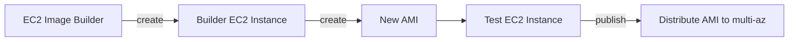

# EC2, Elastic Compute Cloud

- IaaS
- [EC2 機器規格比較表](https://instances.vantage.sh/)
- [Amazon EC2 Instance Types](https://aws.amazon.com/ec2/instance-types/?nc1=h_ls), 分成底下的 Types:
    - General Purpose
    - Compute Optimized : ML, ...
    - Memory Optimized : RDB
    - Accelerated Computing : 
        - 不曉得這個和 Compute Optimized 差在哪邊
    - Storage Optimized : OLTP, NoSQL, ...
    - Instance Features : 
    - Measuring Instance Performance : 
    - 而上述的這些 Types, 有它旗下的 Series:
        - T2, M4, M5, C4, R5, I3 等等, 有著各種方面的優化
    - 範例 :`m5.2xlarge`
        - m       : instance class
        - 5       : generation (硬體規格編號)
        - 2xlarge : size within the instance class
- EC2 Instance Connect, 目前未必每個 Region 都有此功能
    - 可直接使用 Web Console 做 login
        - 似乎 SG 需要開 allow 22 from 0.0.0.0 (只單純允許 MyIP 登不進去)
- IAM Roles
    - 不要把 AWS EC2 credentials 放到 EC2, 要用 **IAM Roles**
    - 把特定 Roles assign 給 EC2 來提供 Credentials
    - 作法:
        - EC2 > Actions > Security > Modify IAM Role
- 初始化 EC2, 使用到 *User data* 的話, 務必寫上 *Shebang Line*, 沒寫會出錯
- Instance 重點在於:
    - *on-demand*, *spot*, *reserved* 這 3 種, 搭配 *Standard*, *Convertable*, *Scheduled*
    - *Dedicated Host* v.s. *Dedicated Instance*
- EC2 Instance Connect
    - EC2 Web Console > 選取主機 > Connect > Instance Connect
        - 目前如果是 Amazon Linux 2 或 Ubuntu, 預設安裝
- access EC2 常見問題
    - timeout, 必然是 SG Issue
    - connection refused, app error 或 not launched
- 不要在 EC2 上面做 `aws configure`, 善用 IAM Role


# EC2 - Burstable

- 因為大多數人開了機器以後, 基本上 EC2 都閒在那邊, 因此有了 t 系列主機, ex: t2.micro
- 這類型機器是與其他人共用實體機器, 藉由 AWS 的 Hypervisor 用來運行 VM, 這就是你的 EC2
    - 這句話是我自己做結論的, AWS 官方並沒有這樣說
- 機器沒在使用(沒有在操 CPU)時, 會累積 credits
    - 等到需要 安裝東西/跑些啥程式/做些有的沒的, 會耗用之前累積的 CPU credits
- 一點的 CPU Credits 大概是:
    - One vCPU at 100% utilization for one minute
    - One vCPU at 50% utilization for two minutes
    - Two vCPUs at 25% utilization for two minutes
- 如果開了 t2.micro 以後, 真的很需要 CPU, 除了調整 instance type 以外, 還可以切換成 `t2 ultimate`


# Instance purchasing options

EC2 選購時, 有底下這一大堆的 purchasing options:

https://docs.aws.amazon.com/AWSEC2/latest/UserGuide/instance-purchasing-options.html

- On-Demand
- Reserved
    - 1 or 3 年, 預付省更多
    - 分成:
        - Reserved Instance
            - 可省錢達 72%, 提前退租可在 **AWS Marketplace** 賣掉
        - Convertible Reserved Instance
            - 可省錢達 66%, 可改變 instance type, family, os, scope, tenancy
    - Reserved Instance 在選購時可選擇底下 2 種 scope:
        - Regional: When you purchase a Reserved Instance for a Region, it's referred to as a regional Reserved Instance.
        - Zonal: When you purchase a Reserved Instance for a specific Availability Zone, it's referred to as a zonal Reserved Instance.
        - 至於 Regional 與 Zonal, 有需要再去研究 [Differences between regional and zonal Reserved Instances](https://docs.aws.amazon.com/AWSEC2/latest/UserGuide/reserved-instances-scope.html)
- [Savings Plans](https://aws.amazon.com/savingsplans/)
    - 1 or 3 年, 預付省更多
    - 可省錢達 72%
    - (保證消費/承諾消費) 一定期間花費一定金額, 目的是為了長期使用 & 彈性省錢
        - ex: 承諾將來每月花 300
- Spot Instances
    - 短期使用, 超便宜, 但可能隨時 loss instance
        - 若自己的 max price < current stop price, 則失去 instance
    - 較適用於 batch job, data analysis, image processing, cc attack, ...
- Dedicated Host
    - 直接訂閱實體機, 對於整台機器(硬體)有完整的使用權限
    - 像是有些 license, 是針對 per-core, per-socket 來收費的話, 用這個會是個不錯的選擇
        - BYOL, Bring Your Own License
- Dedicated Instances
    - 組織內 or 同帳號底下, 可與其他 *non dedicated instance* 共用硬體
    - 除上述以外, 基本上與 *dedicated host* 相差無幾
        - [查看兩者比較](#dedicated-host-vs-dedicated-instancehttpsdocsawsamazoncomawsec2latestuserguidededicated-instancehtmldh-di-diffs)
    - no control over instance placement
- Capacity Reservations
    - https://docs.aws.amazon.com/AWSEC2/latest/UserGuide/ec2-capacity-reservations.html
    - 不做使用承諾, 但可保有 reserved capacity
        - 基本上就是大多數人使用的 EC2 那樣, 不需要就把他 Terminate 掉了
        - 享受不到 Discount
    - 可跨帳號共用這些 Capacity Reservations
        - 但並非 cross Account transferable
- [Dedicated Host v.s. Dedicated Instance](https://docs.aws.amazon.com/AWSEC2/latest/UserGuide/dedicated-instance.html#dh-di-diffs)


## [Placement Group](https://docs.aws.amazon.com/AWSEC2/latest/UserGuide/placement-groups.html)

- 為了增加 EC2 之間的傳輸效能, 可藉由 *placement group* 來控制 EC2 在 AWS infra 之中的位置, 有 3 種佈置策略(strategy):
    - Cluster
        - same Rack, same Hardware, same AZ
        - 目的是盡可能降低 latency
    - Partition (Distributed)
        - 每一台 EC2 都座落於不同的 logical segments / partition
            - 而這些不同的 segments / partition 並不會共用相同的 hardware
        - different Rack
            - 每個 AZ 最多有 7 個 Racks
        - 類似 Spread 策略, 同 AZ 裡頭, 但不同機櫃
        - 適用於 large distributed and replicated workloads
            - ex: Hadoop / Cassandra / Kafka
    - Spread (Critical)
        - 嚴格地將 一個小群組的 EC2 Instances 設置到不同的 機器實體
            - 而這些 機器實體 坐落於同一個 rack(機櫃)
                - Same Network, Same Power Supply
            - 一個 AZ 裏頭最多只能有 7 台 EC2 Instances (using Spread)
                - 因此如果超過 7 台 EC2, 則會座落於 Same Region but cross AZ
        - 為了極小化 failure risk
- User Data
    - 初始化建機器以後所做的 init script, 相關的 log 紀錄在 `/var/log/cloud-init-output.log`
        - 上面這個, 如果是在 EC2 Console 建立的時候不曉得會不會有 log.... 但如果使用 CloudFormation 的 User Data, 能找到上述 log


## EC2 Hibernate

- 若啟用 hibernate 後, 再把 Instance Stop, 就像一般電腦睡眠一樣, RAM state 被保留
    - 這些 *RAM state* 會被寫入到 *root EBS Volume*
        - 而這個 EBS 需要 Encrypted
    - 加速將來 Instance start 的時間
        - 直接從 *root EBS Volume* 來做 init
- cross OS
- 使用限制:
    - 適用於: **On-Demand**, **Reserved**, **Spot**
    - RAM 必須要 < 150 GiB
    - hibernation period < 60 days (無法長久 hybernate)


## EC2 Nitro

- 新一代的 EC2 visualization 技術
    - OLD(current) : EC2 EBS 32000 IOPS
    - Nitro        : EC2 EBS 64000 IOPS


## EC2 - Enhance Networking

- ENA, EC2 Enhanced Networking, (SR-IOV)
    - Networking 支援較高的 bandwidth 及 PPS(packet per second) && lower latency
    - 僅適用於 newer generation EC2 Instances:
        - Elastic Network Adapter, ENA - up to 100 Gbps
        - Inter 82599 VF (legacy, OLD ENA) - up to 10 Gbps (Legacy)
- EFA, Improved ENA for HPC, Elastic Fabric Adapter - (Linux Only)
    - 很適合 distributed computation (相同 Cluster 的 Internal communication)
    - 因藉助 Message Passing Interface(MPI) standard, 可 bypass underlying Linux OS 來 lower latency

```bash
### 查詢 ENA mod 是否已安裝(預設 new generation EC2 Instances 都有安裝)
modinfo ena


### 查看 ENI 使用的 driver
ethtool -i eth0
#driver: xxx  <-- 如果以啟用 Enhanced Networking, 應該看到 ena
# Amazon Linux 2023, 使用 enX0 取代原有的 eth0
```


## AWS ParallelCluster

- open sources cluster management tool to deploy HPC on AWS
- text file
- 自動建立 VPC, subnet, cluster type, instance type
- 可在 cluster 裡頭 enable EFA


## EC2 Image Builder

- 可能會跑上 30+ mins
- 用來自動化 create/maintain/validate/test
- AMI(Amazon Machine Image), container for EC2 instance
- Charge: 只對 Resource 收費(本身免費)
- 需要 allow **Image Builder** access Resources, 需要有 3 個 IAM Role
    - EC2InstanceProfileForImageBuilder
    - EC2InstanceProfileForImageBuilderECRContainerBuilder
    - AmazonSSMManagedInstanceCore
- 建立流程如下, 過程是情況, 可能花上數十分鐘



- 會依序建立 EC2 instance 來 Building, 之後還會建另一個來 Testing
- 若要刪除 instance, 需 terminate instance && Deregister AMI && Delete EBS snapshot


# EC2 - Check

- EC2 的 Health Check 分成 2 種
    - System status checks   - 比較偏重於 infra 相關的檢查, 像是 AWS power, networking, or software systems
    - Instance status checks - 重點在於 Instance OS 是否能夠接收 traffic
- 能夠在 EC2 裡頭查看自己的 metadata
    `curl http://169.254.169.254/latest/meta-data/`


# EC2 Storage

- AWS 似乎有支援 `ceph`(檔案系統), 可支援 `Object Storage` && `Block Storage`

## EC2 Storage - EC2 Instance Store

- 相較於 EBS 快很多, 因為直接使用硬體
    - millions IOPS
- 為 ephemeral storage, 如果機器發生底下事件, 則 data loss:
    - terminate
    - stop
    - hibernate
    - 硬體損毀
- NVME, Non-Volatile Memory Express, 似乎就是 Instance Store 的一種
- 長久保存的話, 建議使用 EBS


## EC2 Storage - Amazon FSx

- 可使用 3rd 的 FileSystem
    - AWS FSx for Lustre (Linux & Cluster)
    - AWS FSx for Windows File Server
    - AWS FSx for NetApp ONTAP


# EC2 metrics

- InstanceLimitExceeded        : 特定 region 的 service quota 達到使用上限
- InsufficientInstanceCapacity : AWS 那邊於 AZ 裡頭已經沒有相關的資源可供開立


# CLI

```bash
### 讓 EC2 找到自身的 meta-data, 但只能在 *Web Console* && *CLI*, 這動作本身不需要權限
curl http://169.254.169.254/latest/meta-data
# https://docs.aws.amazon.com/AWSEC2/latest/UserGuide/instancedata-data-retrieval.html

### CLI 找機器的 meta-data
aws ec2 describe-instances


### 查詢 EC2 Instance 的 ImageID
$# aws ec2 describe-instances \
    --instance-ids $EC2_Instance_ID \
    --region $Region \
    --query 'Reservations[0].Instances[0].ImageId'


### 
```
