# IAM 核心名詞定義

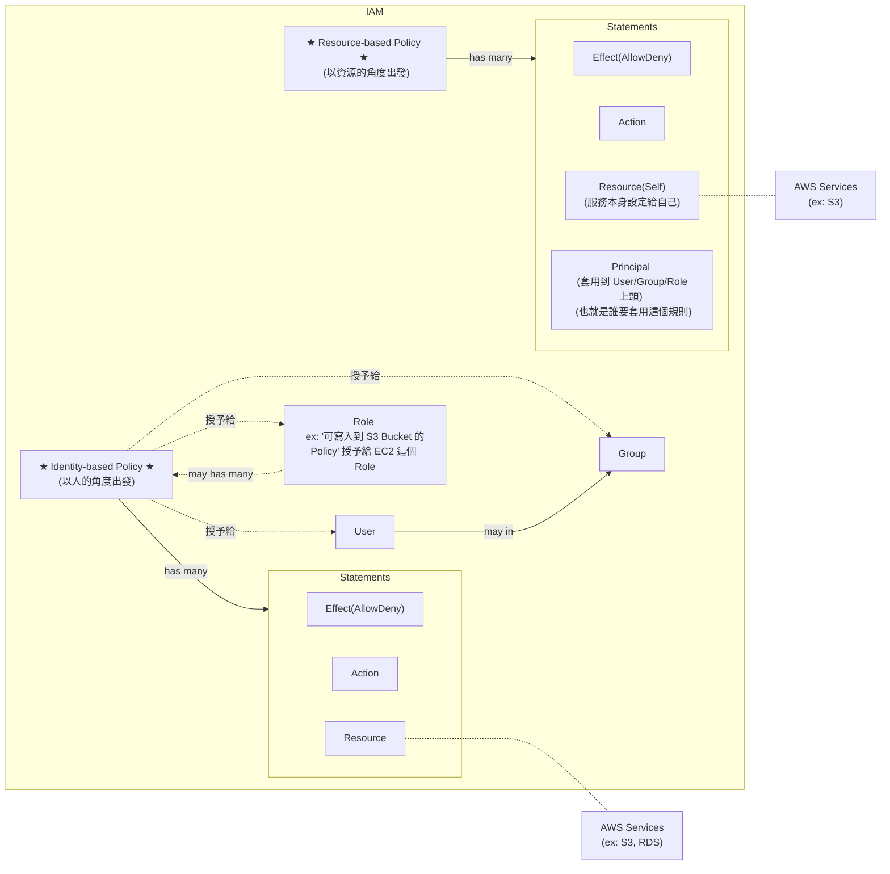

- Polciy
    - 定義 Identity 被 許可/拒絕 針對 Resource 執行特定 Action
    - Policy 區分為 2 個類別:
        - Identity-based policy - 以 People 的角度出發,   宣告某個 People 可以/不能 幹嘛
        - Resource-based policy - 以 Resource 的角度出發, 宣告某個 Resource 可以/不能 被誰怎樣
            - S3 policy
            - key policy
    - 每個 Policy 裏頭, 會有很 1~N 個 Statements
    - 最終會套用給 User / Group / Role (想像成某個擬人的 Service)
- Statement
    - 白話文就是, 許可/拒絕 針對 Resource 做 Action
        - ex: 可以 delete RDS
        - ex: 可以 terminate EC2
        - ex: 不能 edit S3
    - 內部需要有:
        - Effect   : Allow 或 Deny
        - Action   : 執行某個動作
        - Resource : 規範的資源範圍
            - ex: 某個 RDS
            - ex: 某個 S3 Bucket
            - ex: 某台 EC2
- Role
    - 主要目的是要讓 IAM 以外的 `AWS Service`, 能與 `AWS IAM` 做連結
        - 也就是要讓 `非登入用戶以外的 Services`(也可以把它當成是一個人), 來使用 `IAM` 這個服務
    - 再白話文就是, Role 就是使用 `AWS Service` 的 某個東西 (但他不是人)
    - [Roles terms and concepts](https://docs.aws.amazon.com/IAM/latest/UserGuide/id_roles_terms-and-concepts.html)
    - 可以使用 Role 的對象, 包括: 
        - AWS Account : 同帳號 / 跨帳號 皆可
        - AWS 提供的 Resources : ex: EC2 Instance Role
        - 兼容 SAML 2.0 的外部 IdP 所認證過的 external user
        - OpenID Connect
        - custom-built identity broker
- AWS service role for an EC2 instance
    - A special type of service role that an application running on an Amazon EC2 instance can assume to perform actions in your account.
    - EC2 被授予 AssumeARole 的權限, 因此得到相關權限後, 可去訪問對應的 AWS Resources
- AWS service-linked role


# IAM

- IAM
    - AWS 的核心服務, 用來控制 存取 Resources
    - Resources 則是使用者建立的 entities
    - Users 針對 resources 來 perform actions
    - actions 需要依賴於 Policy 上頭授予 Authorization
- `IAM Role` 是個具備特定 permission 的 `IAM Identity`
    - Roles 本身授予自 users/applications/services
- 如何允許 IAM 用戶看帳單 (預設只有 root Account 可看)
    - Billing > Bills > IAM User and Role Access to Bill Information > Edit > Activate IAM Access
        - 
- 若建立了針對特定 Resource 訪問權限的 Policy, 此 Policy 分為:
    - Identity-based Policy
        - 可被指派給 *Users*, *Groups*, *Roles*
    - Resource-based Policy
    - 可參考 [Identity-based policies and resource-based policies](https://docs.aws.amazon.com/IAM/latest/UserGuide/access_policies_identity-vs-resource.html), 來看更多實際範例


## IAM Permission Boundaries

- 此為設計 IAM Permission && IAM Policy 的進階方式
- 可套用到 *User* && *Role*, 但無法套用到 *Group*
- 可先設定好 `IAM Permission Boundary`, 之後如果不小心給錯(多給了)了某些過大的權限, 則這些多給的權限都無效
- 如果再將此 boundary 與 Organization 的 SCP 一同套用, 則屆時 user 的權限僅有
    - SCP && Boundary && Identity-based policy 共同 allow 的權限能做操作
        - 此權限才是真正的 `Effective Permissions`
- 從事任何的 `IAM action` 權限衡量流程 [Policy evaluation logic](https://docs.aws.amazon.com/IAM/latest/UserGuide/reference_policies_evaluation-logic.html), 
    - 摘要記憶方式, 大概就是(但並非這麼單純@@):
        - 不能 explicit Deny
        - Organization SCP
        - Resource-based policy
        - Identity-based policy
        - IAM Permission Boundaries
        - Session Policies

```jsonc
// IAM Polciy Example
{
    "Statement": [
        {
            "Action": "sqs:*",
            "Effect": "Deny",
            "Resource": "*"
        },
        {
            "Action": "sqs:DeleteQueue",
            "Effect": "Allow",
            "Resource": "*"
        }
    ]
}
// ------------------------
// 由此 Policy 可得知, 此為 Identity-based policy (因為無 principal)
// 無法 CreateQueue (因為被 Deny 了)
// 無法 DeleteQueue (即使底下有被明確 Allow, 但此 Role 整體來說, 已經明確的 Deny 了)
// 無法 CreateEC2   (因為沒有取得相關的 Permission)
```


# Policy Reference

- Policy 以 JSON 來規範資源存取權限, 具備底下的幾個重要參數:
    - Statement
    - Effect
    - Principle
    - NotPrinciple
    - Action
    - [NotAction](https://docs.aws.amazon.com/IAM/latest/UserGuide/reference_policies_elements_notaction.html)
        - NotAction with Deny  : 除了 NotAction 所列的動作, 其餘皆 Deny
            - 但是此動作並沒有 Allow anything, 因此仍須自行給額外 Allow
        - NotAction with Allow : 除了 NotAction 所列的動作, 其餘皆 Allow
    - Resource
    - NotResource
    - Condition


# AWS STS, Security Token Service

> AWS provides AWS Security Token Service (AWS STS) as a web service that enables you to request temporary, limited-privilege credentials for AWS Identity and Access Management (IAM) users or for users you authenticate (federated users).

- all AWS Resources 背後的骨幹= =
- STS 為 用來申請 短暫的 credentials 給 *IAM users* or *federated users*
    - by token. 基本上 15~60 mins 到期
    - 並不是非常懂. 不過有點像是, AWS Web Console 登入後, 會取得 token, 再拿去與 AWS Web Console 互動
        - Token 可能藏在 Request Header 的 cookie 或 URL 裏頭吧
- STS 支援了底下這些 actions (還有其他):
    - 1.AssumeRole
        - ex: 若要 Cross Account access, 則需再 Target Account `assume a role` 來 allow action
        - ex: 為了增加多一層的安全性, user 要 delete EC2, 則需 `assume a role` 才可動作, 避免誤砍
    - 2.AssumeRoleWithSAML
        - return creds for users logged in with SAML
        - will be helpful if users are federated through SAML
        - 參考
            - [iam-AssumeRoleWithSAML](./IAM.md#assumerolewithsaml)
            - [AssumeRoleWithSAML](#AssumeRoleWithSAML)
    - AssumeRoleWithWebIdentity
        - return creds for users logged in with an IdP(FB, Google, OIDC compatible...)
        - AWS 建議改為使用 **Cognito**
        - [Identity Federation](#identity-federation)
    - GetSessionToken
        - MFA for users or AWS root Account
        - 如果有使用 MFA, 則需使用此 API 來取得認證碼


### AssumeRole

#### Example: using STS to assume a role

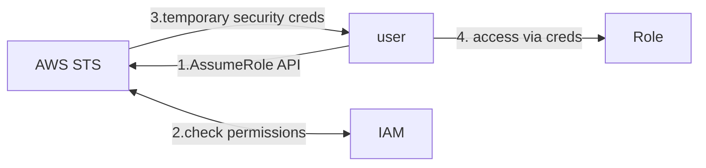


### AssumeRoleWithSAML

- Login Portal 需要自行設定
- 如果有多個 Account 需要逐一設定
- 不要與 [AWS SSO 搞混](./iam#aws-sso)

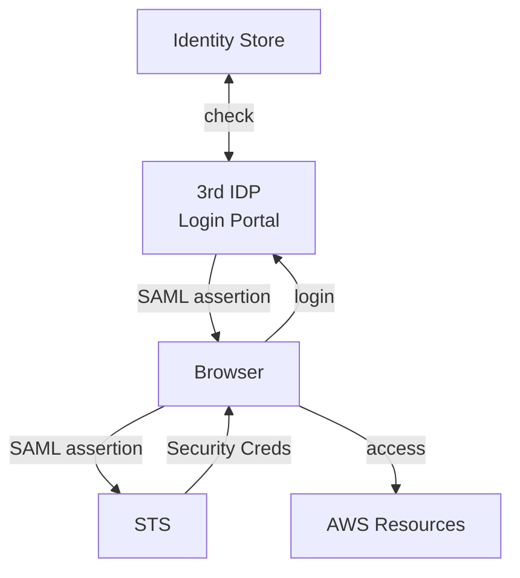


### AWS SSO

- *AWS SSO* 已與 Identity Store 做好整合了, 因此也無須額外設定
    - 從中取得 credentials
- 若有多個 Account 無須逐一設定
- 不要與 [AssumeRoleWithSAML 搞混](./iam#assumerolewithsaml)

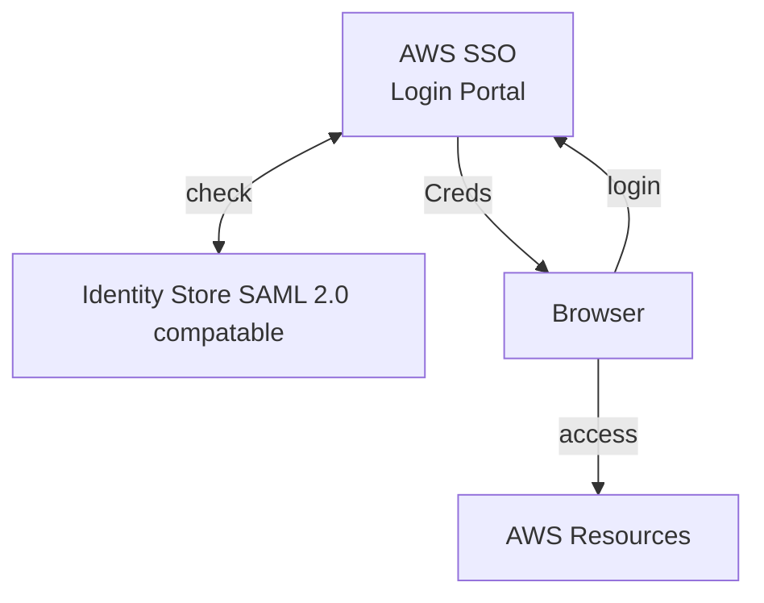


# Identity Federation

- 免在自家管控 users, 可直接讓 *AWS external users*, 直接來 assume temporary Role, 進而存取 AWS Resources
    - 不需要自己 create IAM users
    - 上述的 user, assume identity provided access role
- 可以有各種不同的 Federation 方式:
    - [1. SAML 2.0](#1-saml-20-federation)
    - [2. Custom Identity Broker](#2-custom-identity-broker)
    - Web Identity Federation without Web Identity
        - 如果要用這方法... 算了吧@@, 務必使用 Cognito
        - 需要自行處理一堆外部的 IAM user
    - [3. Web Identity Federation with Web Identity](#3-web-identity-federation-with-web-identity)
        - 建議使用 Cognito
    - [4. AWS Cognito](#4-aws-cognito)
    - Single Sign On, SSO
    - Non-SAML with AWS Microsoft AD

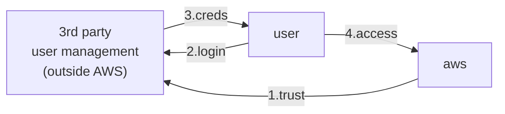


### 1. SAML 2.0 Federation

- *SAML 2.0* 與 *Active Directory FS, ADFS* 有著非常高度的整合
    - 除了 AD 以外, 依舊有其他 directory services 可作選擇
        - 這些 AD 統稱 *SAML 2.0 Federation*
- 需要分別於 `AWS IAM` && `SAML` 雙向設定 trust
- 支援 web-based, cross domain SSO
    - Using STS API: `AssumeRoleWithSAML`
- *SAML Federation*(OLD) 可改用 **Amazon Single Sign On, SSO**(NEW)
    - SSO, 用來建立 Federation 的新方式


---


#### 1-1. by SDK && API

- [SAML-based federation for API access to AWS](https://docs.aws.amazon.com/IAM/latest/UserGuide/id_roles_providers_saml.html)

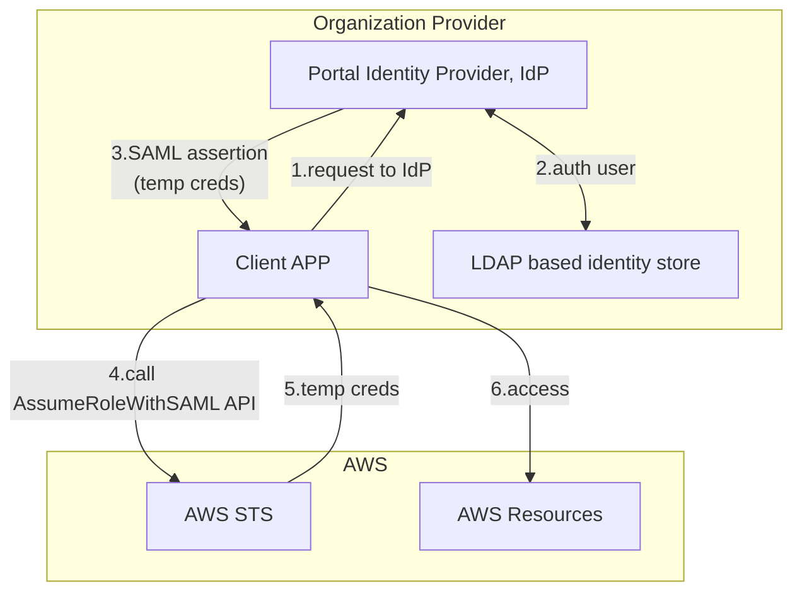
---


#### 1-2. by Web Console

- [SAML-enabled single sign-on](https://docs.aws.amazon.com/IAM/latest/UserGuide/id_roles_providers_enable-console-saml.html)

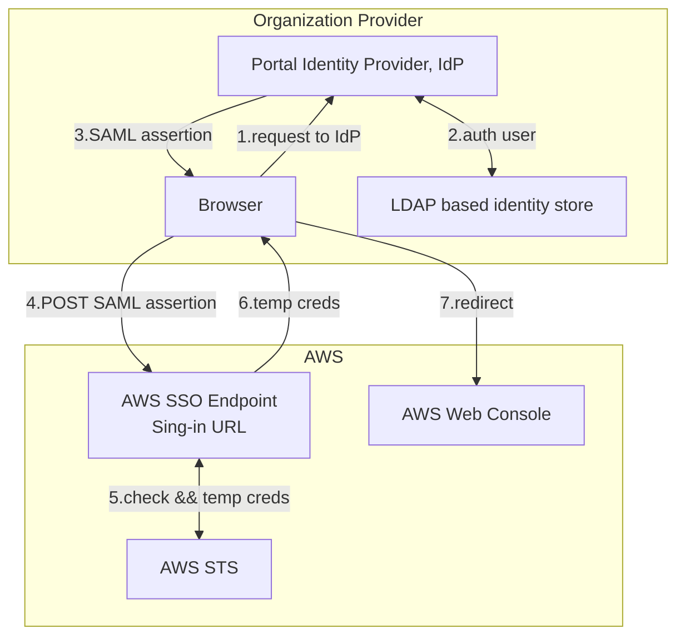
---


#### 1-3. by Active Directory FS, ADFS

- [AWS Federated Authentication with Active Directory Federation Services (AD FS)](https://aws.amazon.com/tw/blogs/security/aws-federated-authentication-with-active-directory-federation-services-ad-fs/)
- 與 SAML 2.0 compatable IdP 流程一樣

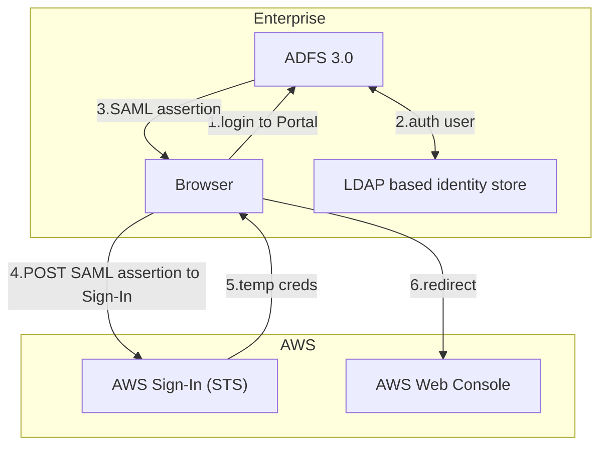
---


### 2. Custom Identity Broker

- 假如 *Identity Provider(on-premise store)* 無法與 SAML 2.0 兼容, 看這看這~~
    - 此時, *Identity Broker* 必須決定適當的 `IAM Policy`
- *Identity Broker* 
- Using API: `AssumeRole` && `GetFederationToken`
- [Providing access to externally authenticated users (identity federation)](https://docs.aws.amazon.com/IAM/latest/UserGuide/id_roles_common-scenarios_federated-users.html)

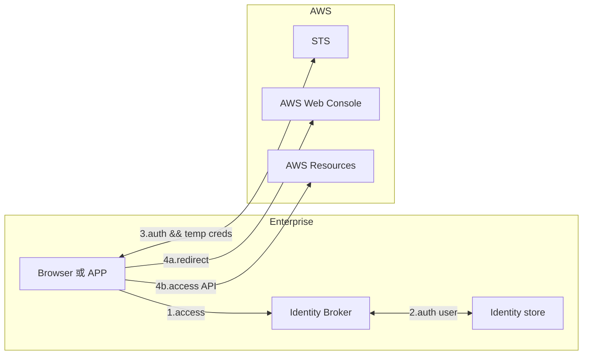


### 3. Web Identity Federation with Web Identity

- [Using web identity federation](https://docs.amazonaws.cn/en_us/amazondynamodb/latest/developerguide/WIF.html)
- 但是建議使用 Cognito

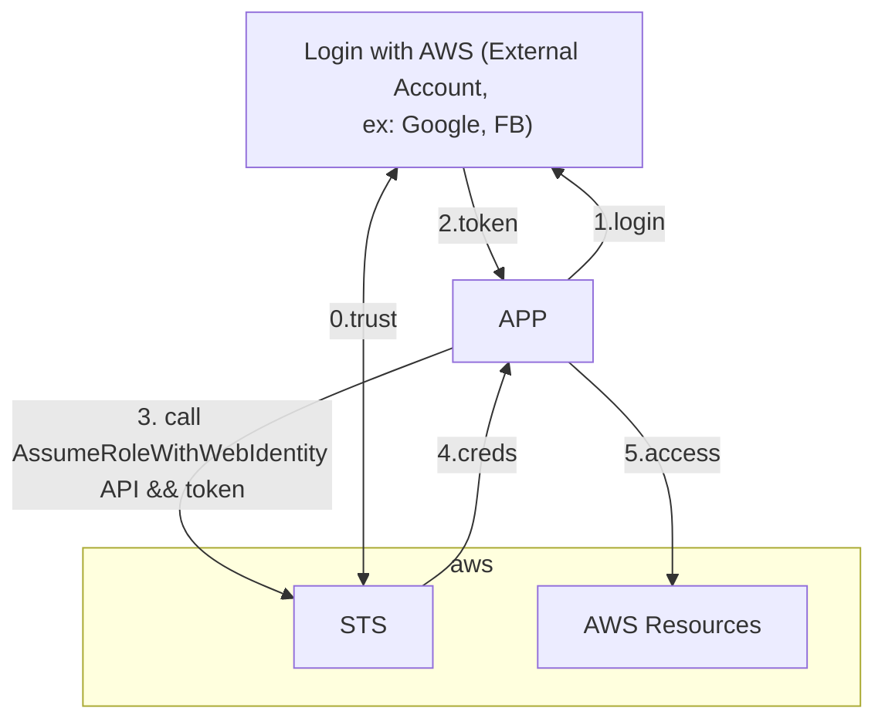


### 4. AWS Cognito

- Goal: 讓 client 直接訪問 AWS Resources (免 create IAM users)
    - ex: 要讓 FB user, 直接使用 S3

> Amazon Cognito provides authentication, authorization, and user management for your web and mobile apps. Your users can sign in directly with a user name and password, or through a third party such as Facebook, Amazon, Google or Apple.

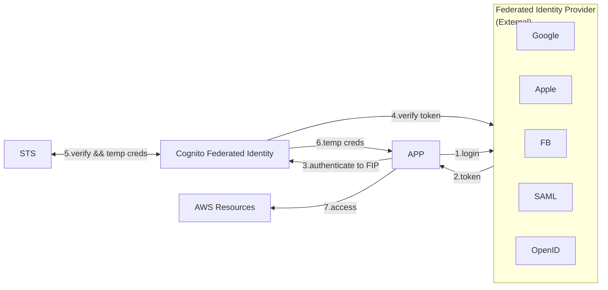


## Directory Service - Microsoft Active Directory, AD

- Windows Server with AD Domain Services. 集中化管理 帳號 && 權限
- database of Objects : User Accounts, Computers, Printers, File Shares, Security Groups
    - Objects 以 trees 的形式來組織
    - Group of trees is a forest   
- AWS 提供了 **AWS Directory Services** 用來在 AWS 建立 AD, 分為底下幾種建立方式:
    - [1.AWS Managed Microsoft AD](#1aws-managed-microsoft-ad)
    - [2.AD Connector](#2ad-connector)
    - [3.Simple AD](#3simple-ad)


### 1.AWS Managed Microsoft AD

- AWS 建立 AD && 本地管理 users
- 支援 MFA
- 建立 trust connections with *on-premise AD*

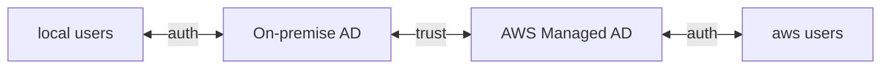


### 2.AD Connector

- Directory Gateway(proxy) to redirect to *on-premise AD*
- 支援 MFA
- *on-premise AD* 管理 users

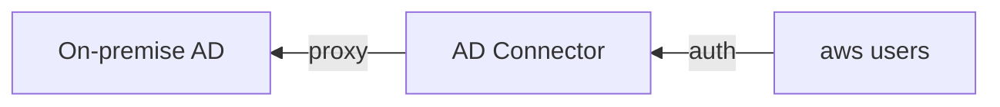


### 3.Simple AD

- 沒有本地 AD, 直接在 AWS 上頭架一個 AD
- AD-compatible 在 AWS 上管理 directory

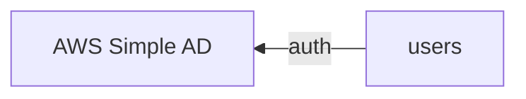


## AWS Organization

- 龐大企業切割帳號, 用 *Master Account* 來統一管理旗下的 *Member Account*
    - Organization Unit, OU 的管理, 可依照 Env 拆分, ex: Dev, Test, Prod, ... 或是依照 Department 拆分
    - *Member Account* 也可能因為公司拆分等因素, 因此有可能會有 migration 的問題 (從 Organization 裏頭移除)
        - 因為一個 Account 一次只能加入一個 Organization, 因此需先退出 Original Org, 再加入倒 New Org
        - 但如果要 migrate *Master Account*, 只能土炮退出所有 *Member Account*, delete org, create new org, 再 invite...
    - 納入 Organization 以後, 也可使用 API 來 create AWS Account
    - 可有 Consolidated Bill, 享有多買多優惠的許多折扣
- OU 裏頭的權限政策, 可自行選擇啟用底下的 Policy:
    - Bucket Polies
    - Service Control Polies, SCP
        - SCP 與 IAM 相互牴觸時, 以 OU 內的 SCP 為主
        - 用來對 IAM action 設立 黑白名單
        - 可套用到 *OU Level* 或 *Account Level*
        - 無法作用到 *Master Account*
        - SCP 會將權限套用到 *Member Account* 底下的所有 users && roles (包含 root account)
            - 不過不包含 *service-linked roles*
        - 假如 OU 已被 deny 某個 action, 而在 OU 底下, 即使是 root 被 allow 某個 action, 也無法執行此 aciton
    - Tag Polies
    - AI Service opt-out policies
- Best Practice:
    - 將 logging 統一到一個 logging Account
    - Bill 上頭可以照 Tag 來找到帳號歸屬
    

# AWS Resource Access Manager, RAM

- 可把目前 AWS Account Resources 分享給 *Other AWS Account*
- 目的是為了避免資源重複創建
- 範例:
    - VPC Subnets:
        - 無法分享 *default VPC* && *Security Group*
        - 可讓 EC2 放在 Organization 內 Other Account 建立的 Subnet
        - 借住在他人 Subnets 底下的 EC2, 可自行操作自己的 Resource, 但無法對不是自己的資源做其他操作
    - [AWS Transit Gateway](./vpc#transit-gateway)
    - Route53 Resolver Rules
    - License Manager Configurations
