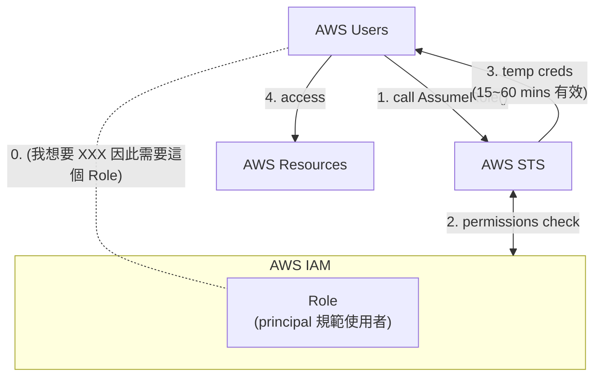
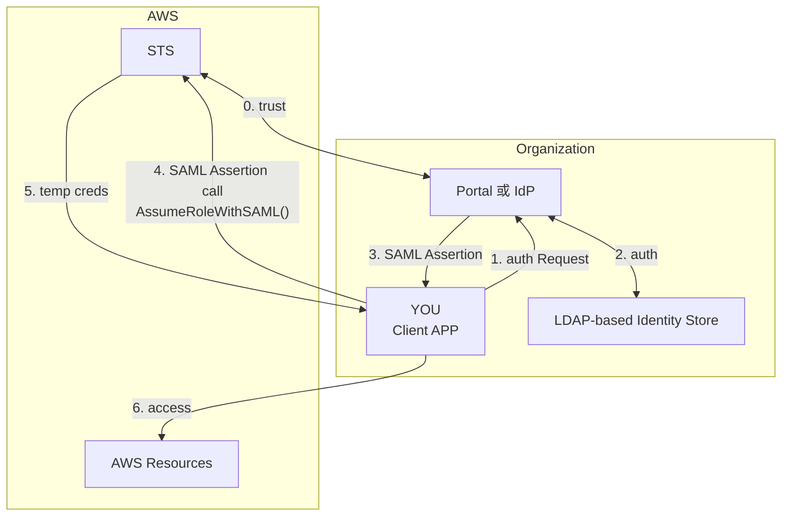
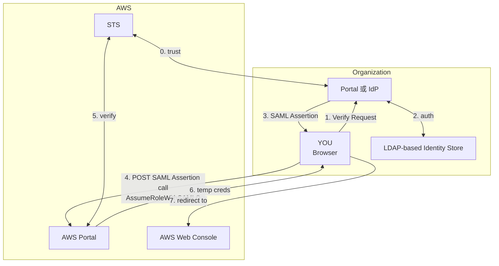
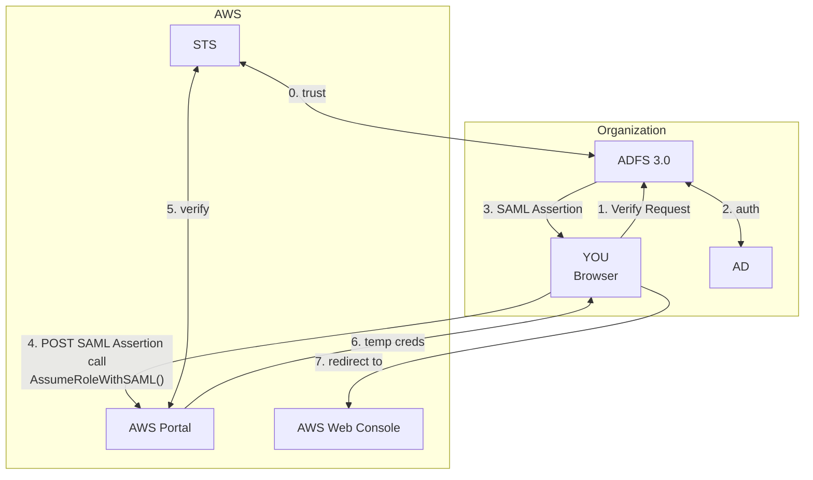
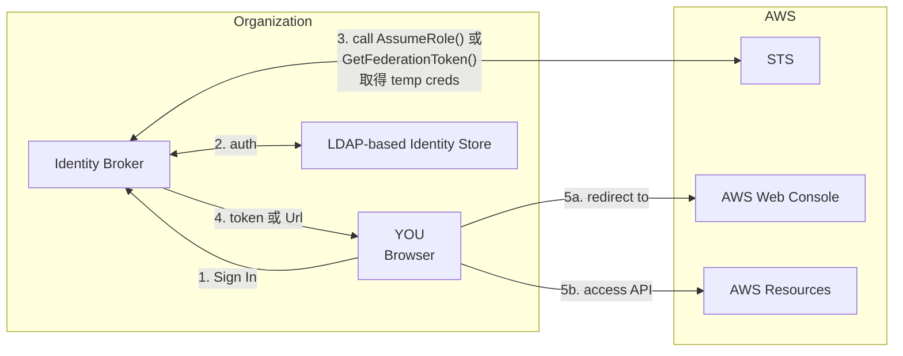
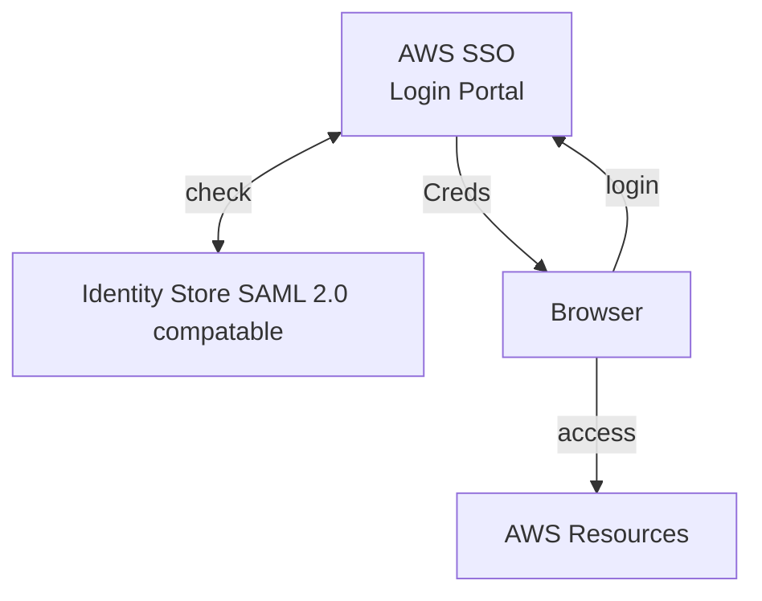
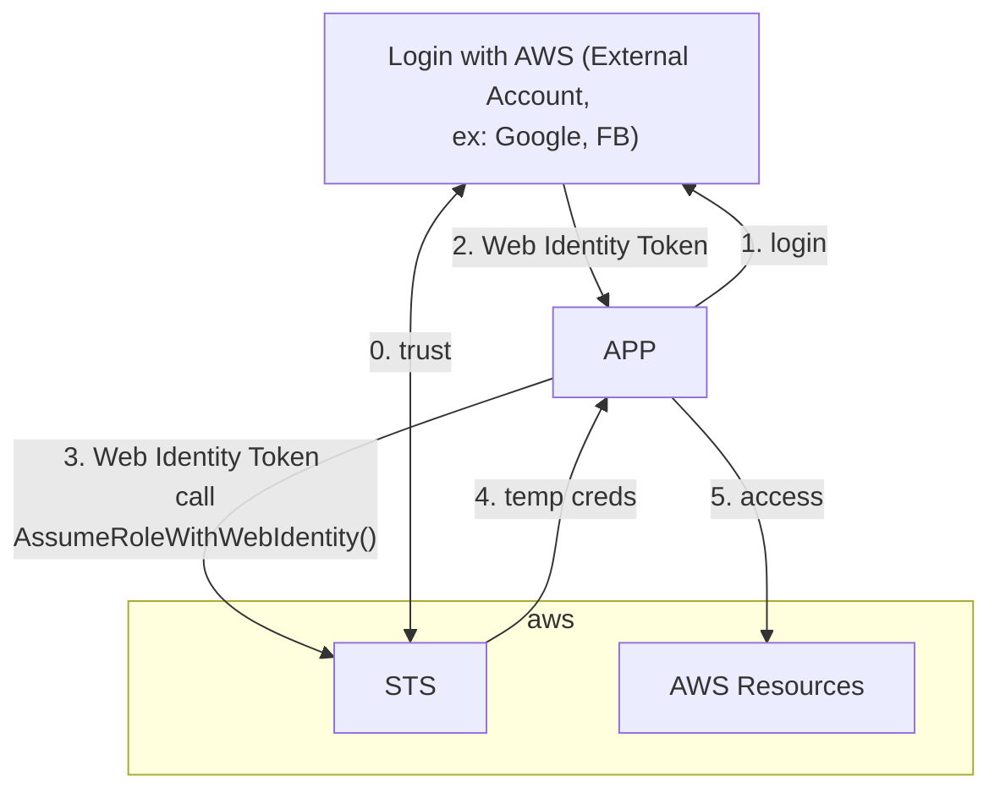
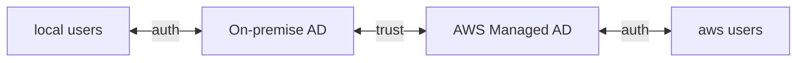
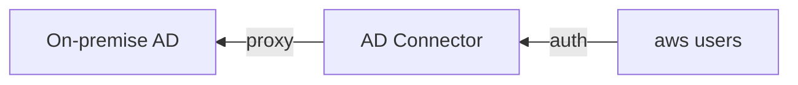
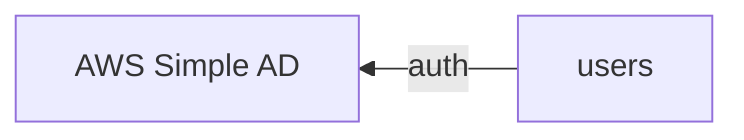

# IAM

- AWS 的核心服務, 用來控制 存取 Resources
- Resources 則是使用者建立的 entities
- Users 針對 resources 來 perform actions
- actions 需要依賴於 Policy 上頭授予 Authorization
- `IAM Role` 是個具備特定 permission 的 `IAM Identity`
  - Roles 本身授予自 users/applications/services
  - 常見的 IAM Roles 有:
    - EC2 Instance Roles
    - ECS Roles
    - Lambda Function Roles
    - Roles for CloudFormation
  - 建立 IAM Role 的時候, 會需要先決定 _Trusted entity type_, 似乎是指, 這個 Role 打算授予的對象(的一個最上層的限制), 有底下這些:
    - AWS Service
      - 最常見的是 EC2, Lambda, S3, ...
    - AWS Account
    - Web identity
      - FB, Google, Amazon Cognito, AWS
    - SAML 2.0 Federation
    - Custom trust policy
- 若建立了針對特定 Resource 訪問權限的 Policy, 此 Policy 分為:
  - Identity-based Policy
    - 可被指派給 _Users_, _Groups_, _Roles_
  - Resource-based Policy
  - 可參考 [Identity-based policies and resource-based policies](https://docs.aws.amazon.com/IAM/latest/UserGuide/access_policies_identity-vs-resource.html), 來看更多實際範例
- MFA
  - Google Authenticator
  - Authy
  - Universal 2nd Factor (U2F) Security Key
    - ex: Yubikey
  - Hardward Key Fob MFA Device
  - Hardward Key Fob MFA Device for AWS GovCloud
- IAM Role 包含了 2 種 Policies:
  - Trust Policy
    - 誰可以 Assume this Role
  - Permission Policy / Permissions Policy
    - 這個 Role 可以做啥

# IAM Policy

- 定義 Identity 被 allow/deny 針對 Resource 執行 actions
- Policy 可區分為底下 6 種 Types(依照常見程度排序):
  - Identity-based policy
    - 以 People 的角度出發, 宣告某個 People 可以/不能 幹嘛
  - Resource-based policy
    - 以 Resource 的角度出發, 宣告某個 Resource 可以/不能 被誰怎樣
  - Permissions boundaries
    - 用來對 Permissions 做進一步約束
  - Organizations SCPs
  - ACLs
  - Session policies
    - 用來對 _AWS CLI_ 或 _assume role_ 或 _federated user_ 制定 advanced session policy
    - Session policies 用來限制 _User 的 Identity-Based Policy_ 或 _Role_ 授予 session 的權限
      - Session policys 限制了 created session 的權限, 但並 grant permissions
- 每個 Policy 裏頭, 會有很 1~N 個 Statements
- 最終會套用給 User / Group / Role (想像成某個擬人的 Service)
- **Trust policies** 定義了哪個 principal entities(accounts/users/role/federated user) can assume the role
- 如果 **IAM User / Role / Group** 要能夠 pass a Role 給特定 AWS Resources, 則此 **IAM User / Role / Group** 需具備 `PassRole` permission
  - 此 `PassRole` permission, 無法用來授予 cross-account permission
- 特殊的 Permissions:
  - `PassRole`
    - App 跑在 EC2 裏頭, App 運行期間會去訪問 AWS Resources
    - 你這個 IAM User, 必須要具備 `PassRole` 的權限, 才能把所需的 Role 交給 EC2
    - 如果像是更進階的議題
      - 身為 AccountA 的 IAM User
      - 如今需要把 AccountA 的 Role 傳遞給 AccountB 的服務, 則:
        - AccountB 須先有 "可從 AccountA assume the role" 的 Role

```jsonc
// 此 policy 授予訪問 「帳號內的 "EC2-roles-for-XYZ-" 開頭的 EC2」的權限
{
  "Version": "2012-10-17",
  "Statement": [
    {
      "Effect": "Allow",
      "Action": ["iam:GetRole", "iam:PassRole"],
      "Resource": "arn:aws:iam::{{ACCOUNT_ID}}:role/EC2-roles-for-XYZ-*"
    }
  ]
}
```

- IAM Policy 裡頭可以使用變數, ex, 需要創建給每個 IAM Users 使用 Bucket 底下的 同(IAM)名 Dir:

```jsonc
{
  "Version": "2012-10-17",
  "Statement": [
    {
      "Action": "s3:ListBucket",
      "Effect": "Allow",
      "Resource": ["arn:aws:s3:::sharedBucket"],
      "Condition": {
        "StringLike": {
          "s3:prefix": ["${aws:username}/*"]
          // 可在自家 list dir
        }
      }
    },
    {
      "Action": ["s3:GetObject", "s3:PutObject"],
      "Effect": "Allow",
      "Resource": ["arn:aws:s3:::sharedBucket/${aws:username}/*"]
      // 可在自家 上傳/查詢 object
    }
  ]
}
```

# IAM Statement

- 白話文就是, 許可/拒絕 針對 Resource 做 Action
  - ex: 可以 delete RDS
  - ex: 可以 terminate EC2
  - ex: 不能 edit S3
- 內部需要有:
  - Effect : Allow 或 Deny
  - Action : 執行某個動作
  - Resource : 規範的資源範圍
    - ex: 某個 RDS
    - ex: 某個 S3 Bucket
    - ex: 某台 EC2

# IAM Role

- 主要目的是要讓 IAM 以外的 `AWS Service`, 能與 `AWS IAM` 做連結
  - 也就是要讓 `非登入用戶以外的 Services`(也可以把它當成是一個人), 來使用 `IAM` 這個服務
- 再白話文就是, Role 就是使用 `AWS Service` 的 某個東西 (但他不是人)
- [Roles terms and concepts](https://docs.aws.amazon.com/IAM/latest/UserGuide/id_roles_terms-and-concepts.html)
- 可以使用 Role 的對象, 包括:
  - AWS Account : 同帳號 / 跨帳號 皆可
  - AWS 提供的 Resources : ex: EC2 Instance Role
  - 兼容 SAML 2.0 的外部 IdP 所認證過的 external user
  - OpenID Connect
  - custom-built identity broker
- [Temporary security credentials in IAM](https://docs.aws.amazon.com/IAM/latest/UserGuide/id_credentials_temp.html)
- `IAM Role` 與 `Instance Profile` 的差異
  - https://medium.com/devops-dudes/the-difference-between-an-aws-role-and-an-instance-profile-ae81abd700d)
  - `IAM Role` : 不管誰(不管是不是真的人啦), assume 這個 Role 的話, 就能做這個 Role 被賦予的 (policies & permissions) Credentials
  - `Instance Profile` : 用來聲明 EC2 具備這個身份. 而這身份唯一的用途就是用來 **assume a role**. 僅止於取得某個 Role 的地位
  - Web Console 操作上, 我們會去 create EC2 Instance Profile, 其實是 2 個動作:
    - 建立一個 Role (裡面有必要的 permissions), 然後讓 EC2 可以扮演這個 Role
    - 建立 Instance Profile, 用途僅僅是, 讓 EC2 可以扮演某個角色 (assume a role)
  - 白話範例:
    - 有個 Role 是總統
    - 然後你被賦予了 assume 總統這個 Role 的 Instance Profile, 你就能幹總統能幹的事情(販賣芒果乾, 買很多免稅菸等等)

## 特殊權限 - iam:PassRole

`iam:PassRole` 是個 special permission, 讓 **Iam User** 可以 associate an **IAM role** 到 **Resource**

例如, **Tony IAM User**, 要建立一個跑在 EC2 上頭的 App, 而這 App 需要能夠「把資料寫入到 S3 的權限」

為了達成此需求, Tony 需要 Pass a Role 給 EC2, 也就是說, Tony 需要有 `iam:PassRole` 的權限

當然, Tony Pass 了一個 Role 給 EC2 以後, 這個 Role 上頭也要有特定的 Permission, 好讓 EC2 可以「把資料寫入到 S3 的權限」, 則不在 PassRole 的範圍內了

- **Passing a role** 意指 **link role to resource**
- 其他範例: IAM User 必須要有 `iam:PassRole` 才能將 Role assign 給 CloudFormation
  - 如果 CloudFormation 操作 Resources 的時候不指定 Role, 預設會使用 IAM User Role (與 `iam:PassRole` 無關, User 多大, CloudFormation 就有多大)
  - 如果 CloudFormation 操作 Resources 的時候指定了 Role, 則作此操作的 IAM User 需要有 `iam:PassRole` 的權限才行
- 細節
  - IAM PassRole 並非 API method (官方歸類上會讓人誤解)
  - IAM PassRole 並非讓你去尻的 Api

```jsonc
// https://rowanudell.com/iam-passrole-explained/
// 具備底下 permission 的 Entity, 可以 PassRole 給 `arn:aws:::123456789012:role/LimitedAccess`
{
  "Effect": "Allow",
  "Action": "iam:PassRole",
  "Resource": "arn:aws:::123456789012:role/LimitedAccess"
}
```

## Special Permission - iam:PassedToService

- https://docs.aws.amazon.com/IAM/latest/UserGuide/id_roles_use_passrole.html

# IAM Principal

- 權限適用的 使用者(account / user / role)
- 如果 policy 裡頭出現 principal, 則此 policy 為 resource-based policy
- AWS service role for an EC2 instance
  - A special type of service role that an application running on an Amazon EC2 instance can assume to perform actions in your account.
  - EC2 被授予 AssumeARole 的權限, 因此得到相關權限後, 可去訪問對應的 AWS Resources

# IAM Permission Boundaries

- 此為設計 IAM Permission && IAM Policy 的進階方式
- 可套用到 _User_ && _Role_, 但無法套用到 _Group_
- 可先設定好 `IAM Permissions Boundary`, 之後如果不小心給錯(多給了)了某些過大的權限, 則這些多給的權限都無效
- 如果再將此 boundary 與 Organization 的 SCP 一同套用, 則屆時 user 的權限僅限於:
  - `Union(SCP, Boundary, Identity-based policy)` 這才是真正的 `Effective Permissions`
- 從事任何的 `IAM action` 權限衡量流程 [Policy evaluation logic](https://docs.aws.amazon.com/IAM/latest/UserGuide/reference_policies_evaluation-logic.html),
  - 摘要記憶方式, 大概就是(但並非這麼單純@@):
    - 不能 explicit Deny
    - Organization SCP
    - Resource-based policy
    - Identity-based policy
    - IAM Permission Boundaries
    - Session Policies

```jsonc
// IAM Polciy Example
{
  "Statement": [
    {
      "Action": "sqs:*",
      "Effect": "Deny",
      "Resource": "*"
    },
    {
      "Action": "sqs:DeleteQueue",
      "Effect": "Allow",
      "Resource": "*"
    }
  ]
}
// ------------------------
// 由此 Policy 可得知, 此為 Identity-based policy (因為無 principal)
// 無法 CreateQueue (因為被 Deny 了)
// 無法 DeleteQueue (即使底下有被明確 Allow, 但此 Role 整體來說, 已經明確的 Deny 了)
// 無法 CreateEC2   (因為沒有取得相關的 Permission)
```

# Policy Reference

- Policy 以 JSON 來規範資源存取權限, 具備底下的幾個重要參數:
  - Statement
  - Effect
  - Principle
  - NotPrinciple
  - Action
  - [NotAction](https://docs.aws.amazon.com/IAM/latest/UserGuide/reference_policies_elements_notaction.html)
    - NotAction with Deny : 除了 NotAction 所列的動作, 其餘皆 Deny
      - 但是此動作並沒有 Allow anything, 因此仍須自行給額外 Allow
    - NotAction with Allow : 除了 NotAction 所列的動作, 其餘皆 Allow
  - Resource
  - NotResource
  - Condition
- IAM Policy Variables
  - 可在 IAM Policy 裡頭的 Condition 或 Resource, 做更有彈性的規範

### Cross AWS Account

- 相同 AWS 帳號 or 跨 AWS 帳號, 都是藉由 `AssumeRole` API 來取得 _temp creds_



### SAML 2.0 Federation - Client APP / API

- https://docs.aws.amazon.com/IAM/latest/UserGuide/id_roles_providers_saml.html
- IdP 事先與 STS 做好(雙向)信任 && APP 與 IdP 認證後, 藉由 `AssumeRoleWithSAML()` API, 取得 _temp creds_



---

### SAML 2.0 Federation - Browser

- https://docs.aws.amazon.com/IAM/latest/UserGuide/id_roles_providers_enable-console-saml.html
- IdP 事先與 STS 做好(雙向)信任 && Browser 與 IdP 認證後, 藉由 `AssumeRoleWithSAML()` API, 取得 _temp creds_



---

### SAML 2.0 Federation - ADFS, Active Directory FS

- https://aws.amazon.com/blogs/security/aws-federated-authentication-with-active-directory-federation-services-ad-fs/
- (同上面的 SAML...), 對於任何 _SAML 2.0 compatible IdP_ 流程都是一樣的



---

### Custom Identity Broker

- 假如 IdP 與 SAML 2.0 不兼容, 看這看這~~
  - 此時, _Identity Broker_ 必須自行決定適當的 `IAM Policy`
- Using API: `AssumeRole` && `GetFederationToken`
- 下圖省略 _Identity Broker_ 與背後的 _Identity Store_, 詳文參考 [Providing access to externally authenticated users (identity federation)](https://docs.aws.amazon.com/IAM/latest/UserGuide/id_roles_common-scenarios_federated-users.html)
- 此時的 Identity Broker 具備 AWS Admin 的權限
  - 由此來決定 YOU 能取得哪種 Role



---

### AWS SSO

- [Enabling Federation to AWS Using Windows Active Directory, ADFS, and SAML 2.0](https://aws.amazon.com/blogs/security/enabling-federation-to-aws-using-windows-active-directory-adfs-and-saml-2-0/)
- _AWS SSO_ 已與 Identity Store 做好整合了, 因此也無須額外設定
  - 從中取得 credentials
- 若有多個 Account 無須逐一設定
- 不要與 [AssumeRoleWithSAML 搞混](./iam#assumerolewithsaml)



---

### [Web Identity Federation with Web Identity](https://docs.amazonaws.cn/en_us/amazondynamodb/latest/developerguide/WIF.html)



---

# Directory Service - Microsoft Active Directory, AD

- Windows Server with AD Domain Services. 集中化管理 帳號 && 權限
- database of Objects : User Accounts, Computers, Printers, File Shares, Security Groups
  - Objects 以 trees 的形式來組織
  - Group of trees is a forest
- AWS 提供了 **AWS Directory Services** 用來在 AWS 建立 AD, 分為底下幾種建立方式:
  - [1.AWS Managed Microsoft AD](#1aws-managed-microsoft-ad)
  - [2.AD Connector](#2ad-connector)
  - [3.Simple AD](#3simple-ad)

### 1.AWS Managed Microsoft AD

- AWS 建立 AD && 本地管理 users
- 支援 MFA
- 建立 trust connections with _on-premise AD_



### 2.AD Connector

- Directory Gateway(proxy) to redirect to _on-premise AD_
- 支援 MFA
- _on-premise AD_ 管理 users



### 3.Simple AD

- 沒有本地 AD, 直接在 AWS 上頭架一個 AD
- AD-compatible 在 AWS 上管理 directory



## AWS Organization

# AWS Resource Access Manager, RAM

- 可把目前 AWS Account Resources 分享給 _Other AWS Account_
- 目的是為了避免資源重複創建
- 範例:
  - VPC Subnets:
    - 無法分享 _default VPC_ && _Security Group_
    - 可讓 EC2 放在 Organization 內 Other Account 建立的 Subnet
    - 借住在他人 Subnets 底下的 EC2, 可自行操作自己的 Resource, 但無法對不是自己的資源做其他操作
  - AWS Transit Gateway
  - Route53 Resolver Rules
  - License Manager Configurations

# IAM Security & Compliance

| compare               | Scope         |
| --------------------- | ------------- |
| IAM Credential Report | Account Level |
| IAM Access Advisor    | User Level    |
| IAM Access Analyzer   | Account Level |

- IAM Security Tools
  - IAM Credential Report (account level)
    - Web Console > IAM > Access Reports > Credential Report
    - 帳號底下的所有 users
  - IAM Access Advisor (user level)
    - Web Console > IAM > Users > (選 user) > Access Advisor
    - 特定 User 有權限 access 的 AWS Resources && 最近訪問的時間, 方便日後追蹤 && 修訂 權限
- Credential Report
  - 可查看 Account 底下所有的 IAM Users 的狀態
- Access Advisor
  - 可查看 IAM User 使用了哪些 Services 的最近時間
  - 用來審視是否授權了不需使用到的 Services
- Access Analyzer
  - 可查看有哪些 AWS Resources 授權了哪些 External Services 來訪問
  - AWS Resources 都可以設定 Resource-based Role 來授權訪問:
    - ex: S3, IAM, KMS, Lambda, SQS, SSM Secrets, ...
    - 有時候會忘了授權了哪些人了 or 用完後, 忘了把該 Role 移除
    - 因此可藉由此 IAM 底下的服務(也可用在 AWS Organization), 還設定一個叫做 **Zone of Trust**
      - 若不在 Zone of Trust 裡頭的, 則會被視為 External Services, 因此可以被 Access Analyzer 偵測到
      - 如果有 External Services, 則這些 AWS Resources 會被標記為 findings
  - 建立 Access Analyzer 時, 回隨之建立 Service Linked Role

# Useful Example

## 1. 僅針對特定 Bucket 開放 access 的權限

- 2022/07
- [Amazon S3: Allows read and write access to objects in an S3 Bucket, programmatically and in the console](https://docs.aws.amazon.com/IAM/latest/UserGuide/reference_policies_examples_s3_rw-bucket-console.html)
- [Writing IAM Policies: How to Grant Access to an Amazon S3 Bucket](https://aws.amazon.com/tw/blogs/security/writing-iam-policies-how-to-grant-access-to-an-amazon-s3-bucket/)

上面 2 篇講的是一樣的東西

如果想要開個特定 IAM (identity-based) Policy, 讓有權限的 Role 可針對特定 Bucket 做 list/get/upload/delete, 可參考這篇

需要留意的是, 權限賦予的過程, 需考慮到 Role 僅需要 CLI/API access? 還是也需要 console access?

如果是後者, 則需要額外給權限

# Service Role v.s. Service-Linked Role

- Service-Linked Role
  - 直接綁定 AWS Resource 的特殊 Role, 即使是 AWS Administrator 也無法修改此權限
  - A unique type of IAM role that is linked directly to an AWS service.
  - An IAM administrator can view, but not edit the permissions for this.
- Service Role
  - A role that an AWS service assumes to perform actions on your behalf.
  - An IAM administrator can create, modify, and delete a service role from within IAM.

# IAM Identity Center

- 我對這不熟
- 用來統一管理:
  - external SAML IdP (AWS 建議用 Identity Center 來取代 SAML federation in IAM)
  - human users
