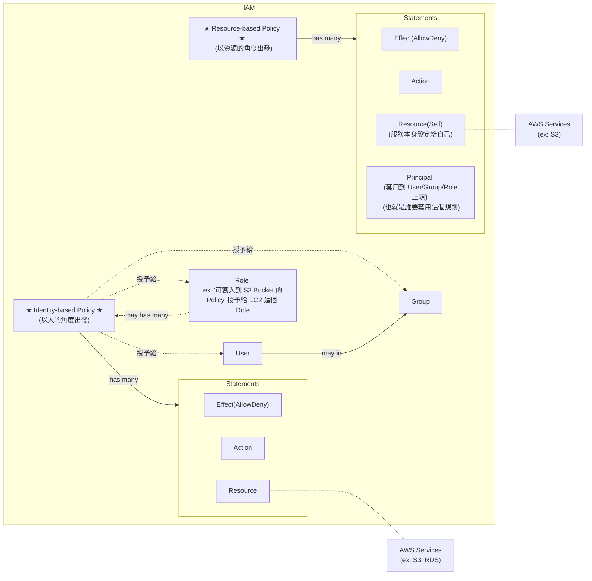
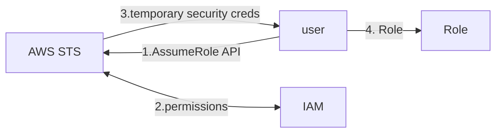
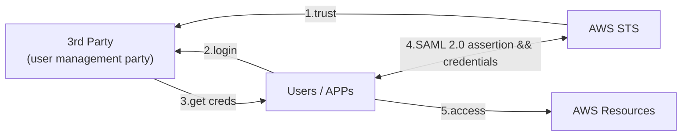
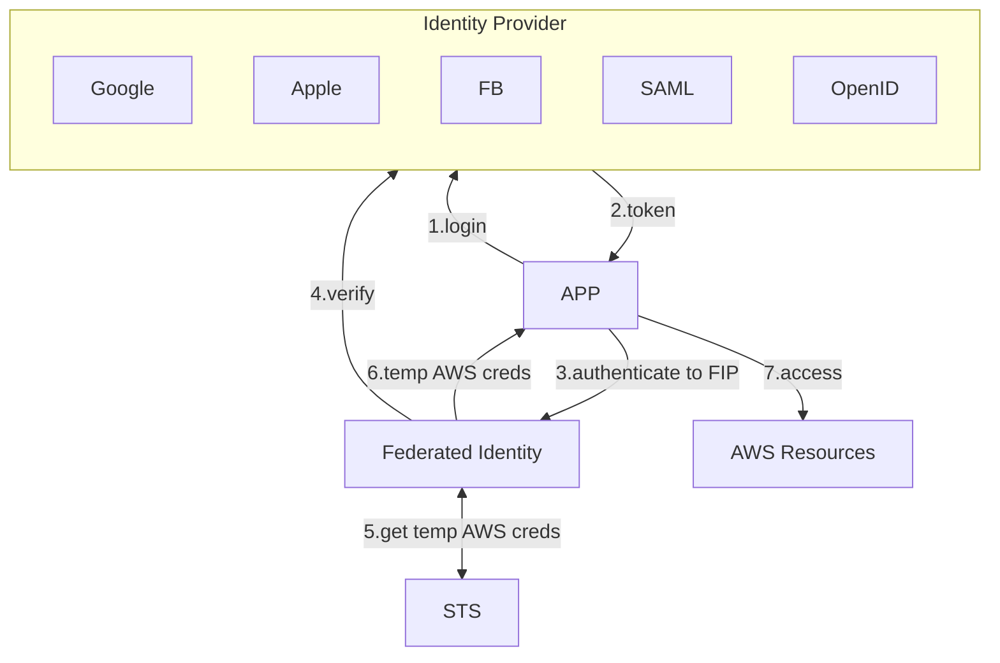

# IAM 核心名詞定義



- Polciy
    - 定義 Identity 被 許可/拒絕 針對 Resource 執行特定 Action
    - Policy 區分為 2 個類別:
        - Identity-based policy - 以 People 的角度出發,   宣告某個 People 可以/不能 幹嘛
        - Resource-based policy - 以 Resource 的角度出發, 宣告某個 Resource 可以/不能 被誰怎樣
    - 每個 Policy 裏頭, 會有很 1~N 個 Statements
    - 最終會套用給 User / Group / Role (想像成某個擬人的 Service)
- Statement
    - 白話文就是, 許可/拒絕 針對 Resource 做 Action
        - ex: 可以 delete RDS
        - ex: 可以 terminate EC2
        - ex: 不能 edit S3
    - 內部需要有:
        - Effect   : Allow 或 Deny
        - Action   : 執行某個動作
        - Resource : 規範的資源範圍
            - ex: 某個 RDS
            - ex: 某個 S3 Bucket
            - ex: 某台 EC2
- Role
    - 主要目的是要讓 IAM 以外的 `AWS Service`, 能與 `AWS IAM` 做連結
        - 也就是要讓 `非登入用戶以外的 Services`(也可以把它當成是一個人), 來使用 `IAM` 這個服務
    - 再白話文就是, Role 就是使用 `AWS Service` 的 某個東西 (但他不是人)


# IAM

- IAM
    - AWS 的核心服務, 用來控制 存取 Resources
    - Resources 則是使用者建立的 entities
    - Users 針對 resources 來 perform actions
    - actions 需要依賴於 Policy 上頭授予 Authorization
- `IAM Role` 是個具備特定 permission 的 `IAM Identity`
    - Roles 本身授予自 users/applications/services
- 如何允許 IAM 用戶看帳單 (預設只有 root Account 可看)
    - Billing > Bills > IAM User and Role Access to Bill Information > Edit > Activate IAM Access
        - 
- 若建立了針對特定 Resource 訪問權限的 Policy, 此 Policy 分為:
    - Identity-based Policy
        - 可被指派給 *Users*, *Groups*, *Roles*
    - Resource-based Policy
    - 可參考 [Identity-based policies and resource-based policies](https://docs.aws.amazon.com/IAM/latest/UserGuide/access_policies_identity-vs-resource.html), 來看更多實際範例
        - 這篇必讀啊!! (2022/06 已讀)


# Policy Reference

- Policy 以 JSON 來規範資源存取權限, 具備底下的幾個重要參數:
    - Statement
    - Effect
    - Principle
    - NotPrinciple
    - Action
    - [NotAction](https://docs.aws.amazon.com/IAM/latest/UserGuide/reference_policies_elements_notaction.html)
        - NotAction with Deny  : 除了 NotAction 被 Allow, 其餘 Resource 都被 Deny
        - NotAction with Allow : 除了 NotAction 被 Deny, 其餘 Resource 都被 Allow
    - Resource
    - NotResource
    - Condition


# AWS STS, Security Token Service

> AWS provides AWS Security Token Service (AWS STS) as a web service that enables you to request temporary, limited-privilege credentials for AWS Identity and Access Management (IAM) users or for users you authenticate (federated users).

- STS 用來申請 短暫的 credentials 給 *IAM users* or *federated users*
    - by token. 基本上 15~60 mins 到期
- STS 支援了底下這些 actions (還有其他):
    - AssumeRole
        - cross account
    - AssumeRoleWithSAML
        - return creds for users logged in with SAML
    - AssumeRoleWithWebIdentity
        - return creds for users logged in with an IdP(FB, Google, OIDC compatible...)
        - AWS 建議改為使用 **Cognito**
    - GetSessionToken
        - for MFA




# Identity Federation

- Federated Identity Provider, FIP
- 免在自家管控 users, 可直接讓 AWS 的外部 users, 直接來 assume temporary Role, 進而存取 AWS Resources
    - 不需要自己 create IAM users
- 可以有各種不同的 Federation 方式:
    - SAML 2.0
    - Custom Identity Broker
    - Web Identity Federation with Amazon Cognito
    - Web Identity Federation without Amazon Cognito
    - Single Sign On, SSO
    - Non-SAML with AWS Microsoft AD

- [SAML-enabled single sign-on](https://docs.aws.amazon.com/IAM/latest/UserGuide/id_roles_providers_enable-console-saml.html)
- [AWS Federated Authentication with Active Directory Federation Services (AD FS)](https://aws.amazon.com/tw/blogs/security/aws-federated-authentication-with-active-directory-federation-services-ad-fs/)


### SAML 2.0 Federation

- 需要分別於 `AWS IAM` && `SAML` 雙向設定 trust
- 支援 web-based, cross domain SSO
- [SAML-based federation for API access to AWS](https://docs.aws.amazon.com/IAM/latest/UserGuide/id_roles_providers_saml.html)
    - Using STS API: `AssumeRoleWithSAML`
- 可改用 **Amazon Single Sign On, SSO** 來取代 *SAML federation*(OLD)
- 如果 *Identity Provider* 不兼容 SAML 2.0, 則 *Identity Broker* 必須決定適當的 `IAM Policy`
    - Using API: `AssumeRole` && `GetFederationToken`
    - [Providing access to externally authenticated users (identity federation)](https://docs.aws.amazon.com/IAM/latest/UserGuide/id_roles_common-scenarios_federated-users.html)
- 若想讓 APP users 來訪問 AWS, 則可使用 *Web Identity Federation-AssumeRoleWithWebIdentity* (但目前 AWS 建議使用 Cognito)
    - 因 Cognito 支援了 anonymous users, data synchorization, MFA
    - [Using web identity federation](https://docs.amazonaws.cn/en_us/amazondynamodb/latest/developerguide/WIF.html)
- 




## AWS Cognito

> Amazon Cognito provides authentication, authorization, and user management for your web and mobile apps. Your users can sign in directly with a user name and password, or through a third party such as Facebook, Amazon, Google or Apple.





## Directory Service - Microsoft Active Directory, AD

- Windows Server with AD Domain Services. 集中化管理 帳號 && 權限
- database of Objects : User Accounts, Computers, Printers, File Shares, Security Groups
    - Objects 以 trees 的形式來組織
    - Group of trees is a forest
    - ```mermaid
        flowchart LR

        local["On-premise AD"]
        aws["AWS Managed AD"]
        u1["local users"]
        u2["aws users"]

        u1 <-- auth --> local <-- trust --> aws <-- auth --> u2;
      ```
    - (不是很懂)
- AWS 提供了 **AWS Directory Services** 用來在 AWS 建立 AD, 分為底下幾種建立方式:
    - AWS Managed Microsoft AD
        - AWS 建立 AD && 本地管理 users, 支援 MFA
        - 建立 trust connections with *on-premise AD*
    - AD Connector
        - Directory Gateway(proxy) to redirect to *on-premise AD*, 支援 MFA
        - *on-premise AD* 管理 users
        - ```mermaid
            flowchart RL

            local["On-premise AD"]
            aws["AD Connector"]
            u2["aws users"]

            u2 -- auth --> aws;
            aws -- proxy --> local;

          ```
    - Simple AD
        - 沒有本地 AD, 直接在 AWS 上頭架一個 AD
            - AD-compatible 在 AWS 上管理 directory
        - ```mermaid
            flowchart LR

            aws["Simple AD"];
          ```

