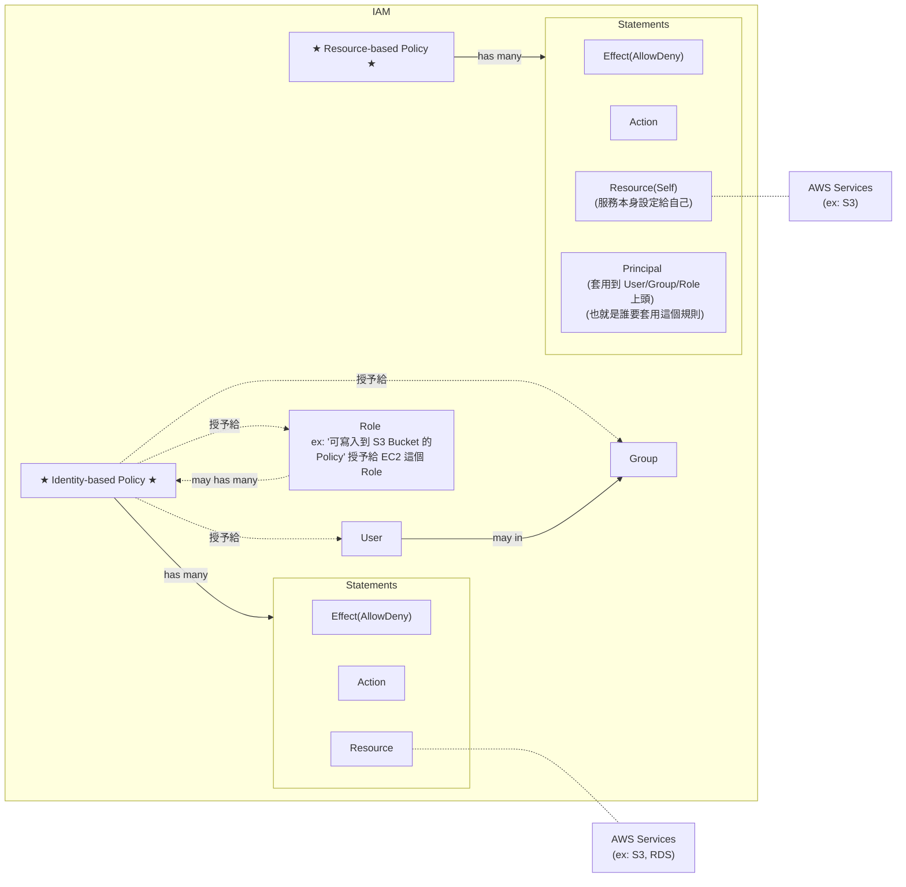

# 核心名詞定義

- Polciy
    - 定義 Identity 被 許可/拒絕 針對 Resource 執行特定 Action
    - Policy 區分為 2 個類別:
        - Identity-based policy - 以 People 的角度出發,   宣告某個 People 可以/不能 幹嘛
        - Resource-based policy - 以 Resource 的角度出發, 宣告某個 Resource 可以/不能 被誰怎樣
    - 每個 Policy 裏頭, 會有很 1~N 個 Statements
    - 最終會套用給 User / Group / Role (想像成某個擬人的 Service)
- Statement
    - 白話文就是, 許可/拒絕 針對 Resource 做 Action
        - ex: 可以 delete RDS
        - ex: 可以 terminate EC2
        - ex: 不能 edit S3
    - 內部需要有:
        - Effect   : Allow 或 Deny
        - Action   : 執行某個動作
        - Resource : 規範的資源範圍
            - ex: 某個 RDS
            - ex: 某個 S3 Bucket
            - ex: 某台 EC2
- Role
    - 主要目的是要讓 IAM 以外的 `AWS Service`, 能與 `AWS IAM` 做連結
        - 也就是要讓 `非登入用戶以外的 Services`(也可以把它當成是一個人), 來使用 `IAM` 這個服務
    - 再白話文就是, Role 就是使用 `AWS Service` 的 某個東西 (但他不是人)

- IAM
    - AWS 的核心服務, 用來控制 存取 Resources
    - Resources 則是使用者建立的 entities
    - Users 針對 resources 來 perform actions
    - actions 需要依賴於 Policy 上頭授予 Authorization
- `IAM Role` 是個具備特定 permission 的 `IAM Identity`
    - Roles 本身授予自 users/applications/services
- 如何允許 IAM 用戶看帳單 (預設只有 root Account 可看)
    - Billing > Bills > IAM User and Role Access to Bill Information > Edit > Activate IAM Access
        - 
- 若建立了針對特定 Resource 訪問權限的 Policy, 此 Policy 分為:
    - Identity-based Policy
        - 可被指派給 *Users*, *Groups*, *Roles*
    - Resource-based Policy
    - 可參考 [Identity-based policies and resource-based policies](https://docs.aws.amazon.com/IAM/latest/UserGuide/access_policies_identity-vs-resource.html), 來看更多實際範例
        - 這篇必讀啊!! (2022/06 已讀)

# Policy Reference

- Policy 以 JSON 來規範資源存取權限, 具備底下的幾個重要參數:
    - Statement
    - Effect
    - Principle
    - NotPrinciple
    - Action
    - [NotAction](https://docs.aws.amazon.com/IAM/latest/UserGuide/reference_policies_elements_notaction.html)
        - NotAction with Deny  : 除了 NotAction 被 Allow, 其餘 Resource 都被 Deny
        - NotAction with Allow : 除了 NotAction 被 Deny, 其餘 Resource 都被 Allow
    - Resource
    - NotResource
    - Condition

