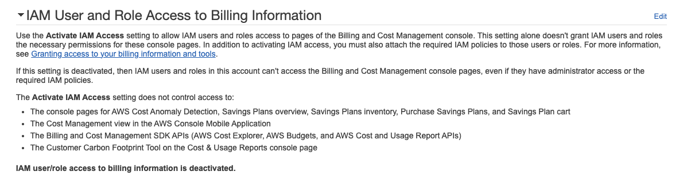

# IAM

- AWS 的核心服務, 用來控制 存取 Resources
- Resources 則是使用者建立的 entities
- Users 針對 resources 來 perform actions
- actions 需要依賴於 Policy 上頭授予 Authorization
- `IAM Role` 是個具備特定 permission 的 `IAM Identity`
    - Roles 本身授予自 users/applications/services
    - 常見的 IAM Roles 有:
        - EC2 Instance Roles
        - ECS Roles
        - Lambda Function Roles
        - Roles for CloudFormation
    - 建立 IAM Role 的時候, 會需要先決定 *Trusted entity type*, 似乎是指, 這個 Role 打算授予的對象(的一個最上層的限制), 有底下這些:
        - AWS Service
            - 最常見的是 EC2, Lambda, S3, ...
        - AWS Account
        - Web identity
            - FB, Google, Amazon Cognito, AWS
        - SAML 2.0 Federation
        - Custom trust policy
- 如何允許 IAM 用戶看帳單 (預設只有 root Account 可看)
    - (右上角) > Account > IAM User and Role Access to Billing Information > Edit > Activate IAM Access
        - 
- 若建立了針對特定 Resource 訪問權限的 Policy, 此 Policy 分為:
    - Identity-based Policy
        - 可被指派給 *Users*, *Groups*, *Roles*
    - Resource-based Policy
    - 可參考 [Identity-based policies and resource-based policies](https://docs.aws.amazon.com/IAM/latest/UserGuide/access_policies_identity-vs-resource.html), 來看更多實際範例
- MFA
    - Google Authenticator
    - Authy
    - Universal 2nd Factor (U2F) Security Key
        - ex: Yubikey
    - Hardward Key Fob MFA Device
    - Hardward Key Fob MFA Device for AWS GovCloud


# IAM Policy

- 定義 Identity 被 許可/拒絕 針對 Resource 執行特定 Action
- Policy 區分為 2 個類別:
    - Identity-based policy - 以 People 的角度出發,   宣告某個 People 可以/不能 幹嘛
    - Resource-based policy - 以 Resource 的角度出發, 宣告某個 Resource 可以/不能 被誰怎樣
        - S3 policy
        - key policy
- 每個 Policy 裏頭, 會有很 1~N 個 Statements
- 最終會套用給 User / Group / Role (想像成某個擬人的 Service)
- Trust policies 定義了哪個 principal entities(accounts/users/role/federated user) can assume the role
- AWS service-linked role
- 如果 **IAM User, Role, Group** 要能夠 pass a Role 給特定 AWS Resources, 則此 **IAM User, Role, Group** 需具備 `PassRole` permission
    - 此 `PassRole` permission, 無法用來授予 cross-account permission

```jsonc
// 若符合底下的 permission, 可用來授予訪問 「帳號內的 "EC2-roles-for-XYZ-" 開頭的 EC2」的權限
{
    "Version": "2012-10-17",
    "Statement": [{
        "Effect": "Allow",
        "Action": [
            "iam:GetRole",
            "iam:PassRole"
        ],
        "Resource": "arn:aws:iam::{{ACCOUNT_ID}}:role/EC2-roles-for-XYZ-*"
    }]
}
```

- IAM Policy 裡頭可以使用變數, ex, 需要創建給每個 IAM Users 使用 Bucket 底下的 同(IAM)名 Dir:
```jsonc
{
    "Version": "2012-10-17",
    "Statement": [
        {
            "Action": "s3:ListBucket",
            "Effect": "Allow",
            "Resource": ["arn:aws:s3:::sharedBucket"],
            "Condition": {
                "StringLike": {
                    "s3:prefix": [ "${aws:username}/*" ]
                    // 可在自家 list dir
                }
            }
        },
        {
            "Action": [
                "s3:GetObject",
                "s3:PutObject"
            ],
            "Effect": "Allow",
            "Resource": ["arn:aws:s3:::sharedBucket/${aws:username}/*"]
            // 可在自家 上傳/查詢 object
        }
    ]
}
```


# Trust policy

> The trust policy defines which principals can assume the role, and under which conditions. A trust policy is a specific type of resource-based policy for IAM roles.
> 
> Trust policies define which principal entities (accounts, users, roles, and federated users) can assume the role. An IAM role is both an identity and a resource that supports resource-based policies. For this reason, you must attach both a trust policy and an identity-based policy to an IAM role. The IAM service supports only one type of resource-based policy called a role trust policy, which is attached to an IAM role.

> 我的理解: `trust policy` 是一種信任的政策, 也是一種 `Resource-based policy`
>
> 例如: trust policy 制定成, `all principals(所有人)` 都可以 `assume the role(申請 用來進入工地用的安全帽)` 
> 
> `IAM role` 既是 `identity`, 同時也是 `resource that supports resource-based policy`
> 
> 上面所說的 `IAM role(安全帽)`, 既是 工人 的概念, 同時也是 具備工地政策的資源(我也開始亂了= =...)
> 
> `IAM 服務` 僅支援唯一一種 `Resource-based policy`, 稱之為 `role trust policy`(這東西附加在 `IAM role` 上頭) 
> 
> 蝦小... 看完之後我居然不知道怎麼做結論....

 ```jsonc
//  像是 AWS IAM: tony, 常常需要授權給其他阿貓阿狗們幹嘛幹嘛的, 那麼就需要像是底下這樣一個 trusted policy:
{
  "Version": "2012-10-17",
  "Statement": [
    {
      "Effect": "Allow",
      "Principal": {
        "AWS": "arn:aws:iam::111122223333:tony"
      },
      "Action": "sts:AssumeRole"
      // 裡面沒有 Resource 是因為 Resource 就是 IAM Role 本身
    }
  ]
}
 ```

 - [How to use trust policies with IAM roles](https://aws.amazon.com/blogs/security/how-to-use-trust-policies-with-iam-roles/)
 
 > A common use case is when you need to provide access to a role in account A to assume a role in Account B. To facilitate this, you add an entry in the role in account B’s trust policy that allows authenticated principals from account A to assume the role through the sts:AssumeRole API call.
 > 
 > Account B 要訪問 Account A 的資源, 則 Account B 的 trust policy 需要增加一個條目, 允許 Account A 受信任的 user 藉由使用 `sts:AssumeRole API` 來 assume the role


# IAM Statement

- 白話文就是, 許可/拒絕 針對 Resource 做 Action
    - ex: 可以 delete RDS
    - ex: 可以 terminate EC2
    - ex: 不能 edit S3
- 內部需要有:
    - Effect   : Allow 或 Deny
    - Action   : 執行某個動作
    - Resource : 規範的資源範圍
        - ex: 某個 RDS
        - ex: 某個 S3 Bucket
        - ex: 某台 EC2


# IAM Role

- 主要目的是要讓 IAM 以外的 `AWS Service`, 能與 `AWS IAM` 做連結
    - 也就是要讓 `非登入用戶以外的 Services`(也可以把它當成是一個人), 來使用 `IAM` 這個服務
- 再白話文就是, Role 就是使用 `AWS Service` 的 某個東西 (但他不是人)
- [Roles terms and concepts](https://docs.aws.amazon.com/IAM/latest/UserGuide/id_roles_terms-and-concepts.html)
- 可以使用 Role 的對象, 包括: 
    - AWS Account : 同帳號 / 跨帳號 皆可
    - AWS 提供的 Resources : ex: EC2 Instance Role
    - 兼容 SAML 2.0 的外部 IdP 所認證過的 external user
    - OpenID Connect
    - custom-built identity broker
- [Temporary security credentials in IAM](https://docs.aws.amazon.com/IAM/latest/UserGuide/id_credentials_temp.html)
- `IAM Role` 與 `Instance Profile` 的差異
    - https://medium.com/devops-dudes/the-difference-between-an-aws-role-and-an-instance-profile-ae81abd700d)
    - `IAM Role`         : 不管誰(不管是不是真的人啦), assume 這個 Role 的話, 就能做這個 Role 被賦予的 (policies & permissions) Credentials
    - `Instance Profile` : 用來聲明 EC2 具備這個身份. 而這身份唯一的用途就是用來 **assume a role**. 僅止於取得某個 Role 的地位
    - Web Console 操作上, 我們會去 create EC2 Instance Profile, 其實是 2 個動作:
        - 建立一個 Role (裡面有必要的 permissions), 然後讓 EC2 可以扮演這個 Role
        - 建立 Instance Profile, 用途僅僅是, 讓 EC2 可以扮演某個角色 (assume a role)
    - 白話範例:
        - 有個 Role 是總統
        - 然後你被賦予了 assume 總統這個 Role 的 Instance Profile, 你就能幹總統能幹的事情(販賣芒果乾, 買很多免稅菸等等)


# IAM Principal

- 權限適用的 使用者(account / user / role)
- 如果 policy 裡頭出現 principal, 則此 policy 為 resource-based policy
- AWS service role for an EC2 instance
    - A special type of service role that an application running on an Amazon EC2 instance can assume to perform actions in your account.
    - EC2 被授予 AssumeARole 的權限, 因此得到相關權限後, 可去訪問對應的 AWS Resources


# IAM Permission Boundaries

- 此為設計 IAM Permission && IAM Policy 的進階方式
- 可套用到 *User* && *Role*, 但無法套用到 *Group*
- 可先設定好 `IAM Permissions Boundary`, 之後如果不小心給錯(多給了)了某些過大的權限, 則這些多給的權限都無效
- 如果再將此 boundary 與 Organization 的 SCP 一同套用, 則屆時 user 的權限僅有
    - SCP && Boundary && Identity-based policy 共同 allow 的權限能做操作
        - 此權限才是真正的 `Effective Permissions`
- 從事任何的 `IAM action` 權限衡量流程 [Policy evaluation logic](https://docs.aws.amazon.com/IAM/latest/UserGuide/reference_policies_evaluation-logic.html), 
    - 摘要記憶方式, 大概就是(但並非這麼單純@@):
        - 不能 explicit Deny
        - Organization SCP
        - Resource-based policy
        - Identity-based policy
        - IAM Permission Boundaries
        - Session Policies

```jsonc
// IAM Polciy Example
{
    "Statement": [
        {
            "Action": "sqs:*",
            "Effect": "Deny",
            "Resource": "*"
        },
        {
            "Action": "sqs:DeleteQueue",
            "Effect": "Allow",
            "Resource": "*"
        }
    ]
}
// ------------------------
// 由此 Policy 可得知, 此為 Identity-based policy (因為無 principal)
// 無法 CreateQueue (因為被 Deny 了)
// 無法 DeleteQueue (即使底下有被明確 Allow, 但此 Role 整體來說, 已經明確的 Deny 了)
// 無法 CreateEC2   (因為沒有取得相關的 Permission)
```


# Policy Reference

- Policy 以 JSON 來規範資源存取權限, 具備底下的幾個重要參數:
    - Statement
    - Effect
    - Principle
    - NotPrinciple
    - Action
    - [NotAction](https://docs.aws.amazon.com/IAM/latest/UserGuide/reference_policies_elements_notaction.html)
        - NotAction with Deny  : 除了 NotAction 所列的動作, 其餘皆 Deny
            - 但是此動作並沒有 Allow anything, 因此仍須自行給額外 Allow
        - NotAction with Allow : 除了 NotAction 所列的動作, 其餘皆 Allow
    - Resource
    - NotResource
    - Condition


### Cross AWS Account

- 相同AWS帳號 or 跨AWS帳號, 都是藉由 `AssumeRole` API 來取得 *temp creds*


### SAML 2.0 Federation - Client APP

- 下圖略為簡化 IdP 與 背後的 Identity Store, 詳圖參考 [Using SAML-based federation for API access to AWS](https://docs.aws.amazon.com/IAM/latest/UserGuide/id_roles_providers_saml.html)
- IdP 事先與 STS 做好(雙向)信任 && APP 與 IdP 認證後, 藉由 `AssumeRoleWithSAML()` API, 取得 *temp creds*


---


### SAML 2.0 Federation - Browser

- 下圖略為簡化 IdP 與 背後的 Identity Store, 詳圖參考 [Enabling SAML 2.0 federated users to access the AWS Management Console](https://docs.aws.amazon.com/IAM/latest/UserGuide/id_roles_providers_enable-console-saml.html)
- IdP 事先與 STS 做好(雙向)信任 && Browser 與 IdP 認證後, 藉由 `AssumeRoleWithSAML()` API, 取得 *temp creds*


---


### SAML 2.0 Federation - ADFS, Active Directory FS

- 下圖略為簡化 ADFS 與 背後的 AD, 詳圖參考 [AWS Federated Authentication with Active Directory Federation Services (AD FS)](https://aws.amazon.com/blogs/security/aws-federated-authentication-with-active-directory-federation-services-ad-fs/)
- (同上面的 SAML...), 對於任何 *SAML 2.0 compatible IdP* 流程都是一樣的


---


### Custom Identity Broker

- 假如 IdP 與 SAML 2.0 不兼容, 看這看這~~
    - 此時, *Identity Broker* 必須自行決定適當的 `IAM Policy`
- Using API: `AssumeRole` && `GetFederationToken`
- 下圖省略 *Identity Broker* 與背後的 *Identity Store*, 詳文參考 [Providing access to externally authenticated users (identity federation)](https://docs.aws.amazon.com/IAM/latest/UserGuide/id_roles_common-scenarios_federated-users.html)


---


### AWS SSO

- [Enabling Federation to AWS Using Windows Active Directory, ADFS, and SAML 2.0](https://aws.amazon.com/blogs/security/enabling-federation-to-aws-using-windows-active-directory-adfs-and-saml-2-0/)
- *AWS SSO* 已與 Identity Store 做好整合了, 因此也無須額外設定
    - 從中取得 credentials
- 若有多個 Account 無須逐一設定
- 不要與 [AssumeRoleWithSAML 搞混](./iam#assumerolewithsaml)


---

### Web Identity Federation with Web Identity

- [Using web identity federation](https://docs.amazonaws.cn/en_us/amazondynamodb/latest/developerguide/WIF.html)
- `AssumeRoleWithWebIdentity` API
- 建議替換成 Cognito


---

# Identity Federation

有各種不同的 Federation 方式:

- [1. SAML 2.0](#saml-20-federation)
- [2. Custom Identity Broker](#2-custom-identity-broker)
- Web Identity Federation without Web Identity
    - 如果要用這方法... 算了吧@@, 務必使用 Cognito
    - 需要自行處理一堆外部的 IAM user
- [3. Web Identity Federation with Web Identity](#3-web-identity-federation-with-web-identity)
    - 建議使用 Cognito
- [4. AWS Cognito](./Cognito.md)
- Single Sign On, SSO
- Non-SAML with AWS Microsoft AD


### SAML 2.0 Federation


- 需要分別於 `AWS IAM` && `SAML` 雙向設定 trust
- 支援 web-based, cross domain SSO
    - Using STS API: `AssumeRoleWithSAML`
- *SAML Federation*(OLD) 可改用 **Amazon Single Sign On, SSO**(NEW)
    - SSO, 用來建立 Federation 的新方式

---


# Directory Service - Microsoft Active Directory, AD

- Windows Server with AD Domain Services. 集中化管理 帳號 && 權限
- database of Objects : User Accounts, Computers, Printers, File Shares, Security Groups
    - Objects 以 trees 的形式來組織
    - Group of trees is a forest   
- AWS 提供了 **AWS Directory Services** 用來在 AWS 建立 AD, 分為底下幾種建立方式:
    - [1.AWS Managed Microsoft AD](#1aws-managed-microsoft-ad)
    - [2.AD Connector](#2ad-connector)
    - [3.Simple AD](#3simple-ad)


### 1.AWS Managed Microsoft AD

- AWS 建立 AD && 本地管理 users
- 支援 MFA
- 建立 trust connections with *on-premise AD*


### 2.AD Connector

- Directory Gateway(proxy) to redirect to *on-premise AD*
- 支援 MFA
- *on-premise AD* 管理 users


### 3.Simple AD

- 沒有本地 AD, 直接在 AWS 上頭架一個 AD
- AD-compatible 在 AWS 上管理 directory


## AWS Organization

- 龐大企業切割帳號, 用 *Master Account* 來統一管理旗下的 *Member Account*
    - Organization Unit, OU 的管理, 可依照 Env 拆分, ex: Dev, Test, Prod, ... 或是依照 Department 拆分
    - *Member Account* 也可能因為公司拆分等因素, 因此有可能會有 migration 的問題 (從 Organization 裏頭移除)
        - 因為一個 Account 一次只能加入一個 Organization, 因此需先退出 Original Org, 再加入倒 New Org
        - 但如果要 migrate *Master Account*, 只能土炮退出所有 *Member Account*, delete org, create new org, 再 invite...
    - 納入 Organization 以後, 也可使用 API 來 create AWS Account
    - 可有 Consolidated Bill, 享有多買多優惠的許多折扣
- OU 裏頭的權限政策, 可自行選擇啟用底下的 Policy:
    - Bucket Polies
    - Service Control Polies, SCP
        - SCP 與 IAM 相互牴觸時, 以 OU 內的 SCP 為主
        - 用來對 IAM action 設立 黑白名單
        - 可套用到 *OU Level* 或 *Account Level*
        - 無法作用到 *Master Account*
        - SCP 會將權限套用到 *Member Account* 底下的所有 users && roles (包含 root account)
            - 不過不包含 *service-linked roles*
        - 假如 OU 已被 deny 某個 action, 而在 OU 底下, 即使是 root 被 allow 某個 action, 也無法執行此 aciton
    - Tag Polies
    - AI Service opt-out policies
- Best Practice:
    - 將 logging 統一到一個 logging Account
    - Bill 上頭可以照 Tag 來找到帳號歸屬
    

# AWS Resource Access Manager, RAM

- 可把目前 AWS Account Resources 分享給 *Other AWS Account*
- 目的是為了避免資源重複創建
- 範例:
    - VPC Subnets:
        - 無法分享 *default VPC* && *Security Group*
        - 可讓 EC2 放在 Organization 內 Other Account 建立的 Subnet
        - 借住在他人 Subnets 底下的 EC2, 可自行操作自己的 Resource, 但無法對不是自己的資源做其他操作
    - [AWS Transit Gateway](./vpc#transit-gateway)
    - Route53 Resolver Rules
    - License Manager Configurations


# IAM Security & Compliance

compare                | Scope         | Description
---------------------- | ------------- | --------------
IAM Credential Report  | Account Level | 可查看 Account 底下所有的 IAM Users 的狀態
IAM Access Advisor     | User Level    | 可查看 IAM User 使用了哪些 Services 的最近時間 (用來審視是否授權了不需使用到的 Services)
IAM Access Analyzer    | Account Level | 可查看有哪些 AWS Resources 授權了 External Services 來訪問

- IAM Access Analyzer
    - 可以依照 *AWS Account* 或 *AWS Organization* 來設定一個 **Zone of Trust**
    - 若不在 Zone of Trust 裡頭的, 則會被視為 External Services, 因此可以被 Access Analyzer 偵測到


# Useful Example

## 1. 僅針對特定 Bucket 開放 access 的權限

- 2022/07
- [Amazon S3: Allows read and write access to objects in an S3 Bucket, programmatically and in the console](https://docs.aws.amazon.com/IAM/latest/UserGuide/reference_policies_examples_s3_rw-bucket-console.html)
- [Writing IAM Policies: How to Grant Access to an Amazon S3 Bucket](https://aws.amazon.com/tw/blogs/security/writing-iam-policies-how-to-grant-access-to-an-amazon-s3-bucket/)

上面 2 篇講的是一樣的東西

如果想要開個特定 IAM (identity-based) Policy, 讓有權限的 Role 可針對特定 Bucket 做 list/get/upload/delete, 可參考這篇

需要留意的是, 權限賦予的過程, 需考慮到 Role 僅需要 CLI/API access? 還是也需要 console access?

如果是後者, 則需要額外給權限


# CLI - assume an IAM role using AWS CLI

- [How do I assume an IAM role using the AWS CLI?](https://www.youtube.com/watch?v=-uogKFE1r60&ab_channel=AmazonWebServices)

```bash
$# export ACCOUNT_ID= xxxxx


### 建立 IAM User
$# DEMO_USER_NAME="test-user"
$# aws iam create-user \
    --user-name ${DEMO_USER_NAME}


### IAM Policy definition
$# cat <<EOF > test-policy.json
{
    "Version": "2012-10-17",
    "Statement": [
        {
            "Effect": "Allow",
            "Action": [
                "ec2:Describe*",
                "iam:ListRoles",
                "sts:AssumeRole"
            ],
            "Resource": "*"
        }
    ]
}
EOF


### 依照本地檔案, 建立 Policy
$# aws iam create-policy \
    --policy-name test-polich \
    --policy-document file://test-policy.json


### 將 policy attach 給 user
$# TEST_POLICY_ARN="arn:aws:iam::${ACCOUNT_ID}:policy/test-polich"
$# aws iam attach-user-policy \
    --user-name ${DEMO_USER_NAME} \
    --policy-arn ${TEST_POLICY_ARN}


### 查看 User 已有的 Policies
$# aws iam list-attached-user-policies \
    --user-name ${DEMO_USER_NAME}


### 為 User 建立 Access Key
$# aws iam create-access-key \
    --user-name ${DEMO_USER_NAME}
# 可從 CLI Response 看到 AccessKeyId && SecretAccessKey


### 
$# LOCAL_FILE2="test-role-trust-policy.json"
$# TEST_POLICY2_ARN="arn:aws:iam::${ACCOUNT_ID}:root"
# 上一步建立的 ARN

$# cat <<EOF > ${LOCAL_FILE2}
{
    "Version": "2012-10-17",
    "Statement": {
        "Effect": "Allow",
        "Principal": { "AWS": "${TEST_POLICY2_ARN}" },
        "Action": "sts:AssumeRole"
    }
}
EOF
# 解釋
# 此 Policy 的 主體(Principal) 是針對 root User
# 用來允許所有 此帳戶內的 IAM user, 
# 如果他們對於 sts:AssumeRole API 有足夠的 IAM Permission, 則可用來 assume this role


### 建立前述的 Role
$# ROLE_NAME_ON_AWS="test-powerful-role"
$# aws iam create-role \
    --role-name ${ROLE_NAME_ON_AWS} \
    --assume-role-policy-document file://${LOCAL_FILE2}
# 把 Arn 記錄下來...


### 
$# Arn="arn:aws:iam::${ACCOUNT_ID}:role/${ROLE_NAME_ON_AWS}"
$# aws iam attach-role-policy \
    --role-name ${ROLE_NAME_ON_AWS} \
    --policy-arn ${Arn}
# 忘了怎麼解釋...


### 賦予 AWS 內建的 `RDS ro 權限` 給 Role
$# RDS_ro_Arn="arn:aws:iam::aws:policy/AmazonRDSReadOnlyAccess"
$# aws iam attach-role-policy \
    --role-name ${ROLE_NAME_ON_AWS} \
    --policy-arn ${RDS_ro_Arn}
# 此為 Permission policy


### 用來查看 Role 具備了哪些 Policies
$# aws iam list-attached-role-policies \
    --role-name ${ROLE_NAME_ON_AWS}


### 
$# aws sts assume-role \
    --role-arn "" \
    --role-session-name AWSCLI-Session


### 
aws iam get-role --role-name "AWSServiceRoleForElasticLoadBalancing" || aws iam create-service-linked-role --aws-service-name "elasticloadbalancing.amazonaws.com"
aws iam get-role --role-name "AWSServiceRoleForECS" || aws iam create-service-linked-role --aws-service-name "ecs.amazonaws.com"
# https://catalog.us-east-1.prod.workshops.aws/workshops/869f7eee-d3a2-490b-bf9a-ac90a8fb2d36/en-US/3-setup/02-setup-environments
# 還不太會解讀上面這個 linked-role....


### 

```
