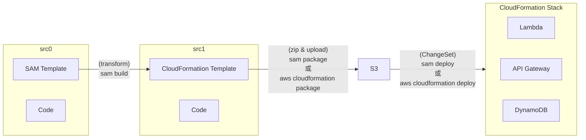

- [What is the AWS Serverless Application Model (AWS SAM)?](https://docs.aws.amazon.com/serverless-application-model/latest/developerguide/what-is-sam.html)
- SAM CLI 用來作為 Lambda 的抽象層, 用來包裹 Lambda runtime dependencies.
- SAM 與 CodeDeploy 已有高度整合, 可藉此來實現 Canary Deploy


# 流程




# SAM CLI

```bash
$# sam --version
SAM CLI, version 1.73.0


### 初始化 SAM project(吧!?)
$# sam init
# 可行選擇環境等等..., 會產生一堆東西, 其中包含:
#   template.yaml : SAM template, 裡頭記載著會用到的 AWS Resources
# 其他像是:
#    $# sam init --runtime python3.8
# 更多的 Sam Templates, 可參考:
#    https://github.com/aws/aws-sam-cli-app-templates


### Build application...
$# sam build
# (須在與 SAM template 同資料夾下此指令)
# 產生 .aws-sam/build (此為 staging folder), 裡頭有 executable(或 src codes)


### 跑測試 (cloud)
$# sam sync --stack-name ${StackName} --watch


### 本地測試(Docker Needed) - 可理解成運行本地 API Endpoint & Lambda
$# sam local start-api
# 跑在 Container(讓子彈飛一會兒...)


### 本地測試(Docker Needed) - 去尻上面的 API Endpoint
$# LambdaResource=  # 存放在 template.yaml 裏頭的 AWS::Serverless::Function
$# sam local invoke ${LambdaResource} -e events/event.json


### Deploy code -> AWS
$# sam deploy --guided


### (不知道怎麼解釋)
$# sam local generate-event apigateway aws-proxy \
    --body "" --path "hello" --method GET > api-event.json


$# diff api-event.json events/event.json
```


# SAR, Serverless Application Repository

- Managed repository for serverless applications
    - 可以直接理解成, SAR 是 Lambda 的 Repository 啦!!
    - 可以把 Lambda 上傳(使用 sam)到 Repo, 給其他人拿去 deploy