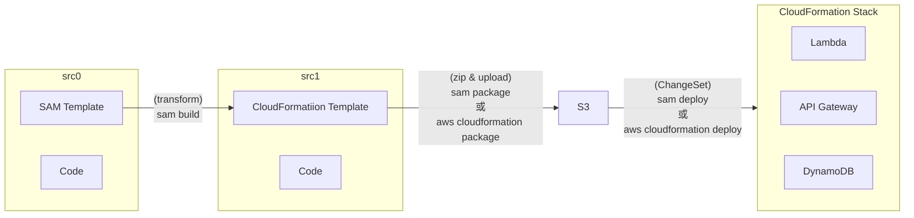

- [What is the AWS Serverless Application Model (AWS SAM)?](https://docs.aws.amazon.com/serverless-application-model/latest/developerguide/what-is-sam.html)
- SAM CLI 用來作為 Lambda 的抽象層, 用來包裹 Lambda runtime dependencies.
- SAM 與 CodeDeploy 已有高度整合, 可藉此來實現 Canary Deploy


# 流程




# SAR, Serverless Application Repository

- Managed repository for serverless applications
    - 可以直接理解成, SAR 是 Lambda 的 Repository 啦!!
    - 可以把 Lambda 上傳(使用 sam)到 Repo, 給其他人拿去 deploy


# SAM CLI

```bash
sam --version
#SAM CLI, version 1.78.0


### 初始化 SAM project
sam init
# 可行選擇環境等等..., 會產生一堆東西, 其中包含:
#   template.yaml : SAM template, 裡頭記載著會用到的 AWS Resources
# 其他像是:
#    $ sam init --runtime python3.8
# 更多的 Sam Templates, 可參考:
#    https://github.com/aws/aws-sam-cli-app-templates


### Build application...
sam build
# (須在與 SAM template 同資料夾下此指令)
# 產生 .aws-sam/build (此為 staging folder), 裡頭有 executable(或 src codes)
# 或
sam build --use-container
# build 產出物, 不是 zip 就是 image


### 驗證 template.yaml (CloudFormation Template)
sam validate
sam validate --lint  # 使用 cfn-lint 協助驗證
sam validate --lint --template $MyTemplate.yaml
# 多用無害, 隨時驗證


### 直接更新 underlying API Gateway, Lambda, StepFunction
sam sync --watch
sam sync --stack-name $StackName --watch
# IMPORTANT: 不要用在 prd 環境(會即時更新)
# --watch 會直接更新 API Gateway && StepFunction && Lambda (很像 dev server --reload)
#   並非會動態更新 all Resources, 因此可能造成 CloudFormation drift


### host API Gateway locally
sam local start-api
# 跑在 Container(讓子彈飛一會兒...)
# (Docker Needed) - 可理解成運行本地 API Endpoint & Lambda


### invoke Lambda Function locally
sam local invoke
sam local invoke $LambdaResource
sam local invoke $LambdaResource -e events/event.json
# $LambdaResource 為 存放在 template.yaml 裏頭的 AWS::Serverless::Function 的 Identifier
# 本地 一次性 調用測試(Docker Needed) - 直接尻 Cloud API Endpoint


### Deploy code -> AWS
sam deploy --guided
# 會有一系列的互動式詢問, 最後還會有個 approve 需要動作


### (deploy 完成後) 用來查看 CloudFormation Stack 的相關 Endpoints
sam list endpoints
sam list endpoints --output json
sam list endpoints --stack-name $StackName
#


### (不知道怎麼解釋)
sam local generate-event apigateway aws-proxy \
    --body "" --path "hello" --method GET > api-event.json


diff api-event.json events/event.json


### bye
sam delete

# ----------------------------------------------------

### 每個 deployment stage 都要個別優先跑過 (生成對應的 infra resources), 並且 connect to CI/CD system
sam pipeline bootstrap


### (bootstrap 之後再跑)用來 gen CI/CD 用來部署 SAM 所需的 pipeline configuration files
sam pipeline init


### 底下 CLI 則是結合上面兩者 (repl)
sam pipeline init --bootstrap

```
