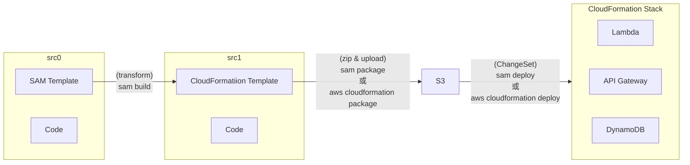

# [SAM](https://docs.aws.amazon.com/serverless-application-model/latest/developerguide/what-is-sam.html)

- SAM CLI 用來作為 Lambda 的抽象層, 用來包裹 Lambda runtime dependencies.
- SAM 與 CodeDeploy 已有高度整合, 可藉此來實現 Canary Deploy

## SAM - Lambda Function permissions

- [How do I give permissions to my Lambda functions by using policies and roles in AWS SAM templates?](https://www.youtube.com/watch?v=QbqqwZ9c1u8)
- SAM 用來與其他 AWS Resources 互動時的相關權限, 可藉由下列方式來做設定:
  - SAM connectors
  - SAM policy templates
  - CloudFormation mechanisms
- SAM CloudFormation 裡頭對於 `AWS::Serverless::Function` 權限的設定
  - Policies : 使用 plicy templates 的方式, 用此來建立一個新的 Execution Role
    - 可搭配 Permission Boundary
  - Role : 使用預先建立好的 IAM Role 來做 assume, 需給 Role ARN
    - 無法搭配 Permission Boundary
  - 上述兩者, Role 優先於 Policies, 兩者同時出現時, Policies 會被忽略

# 流程

# SAR, Serverless Application Repository

- Managed repository for serverless applications
  - 可以直接理解成, SAR 是 Lambda 的 Repository 啦!!
  - 可以把 Lambda 上傳(使用 sam)到 Repo, 給其他人拿去 deploy
