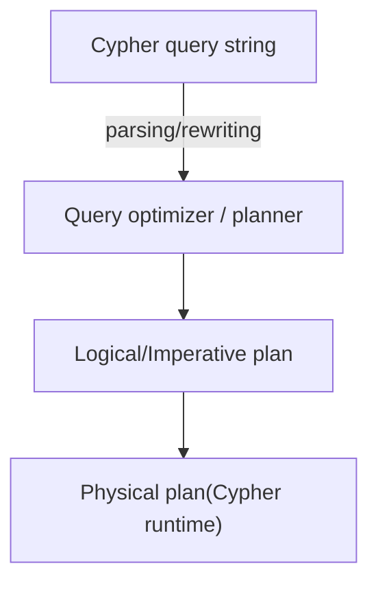

- lifecycle of a Cypher query
  - 由 `cypher query string` 出發, 藉由 `parsing/rewriting` 之後, 交給 `Query optimizer`
  - 再交給 `Logical plan`

```mermaid
flowchart TD

cql["Cypher query string"];
planner["Query optimizer / planner"];
logical["Logical/Imperative plan"];
physical["Physical plan(Cypher runtime)"];

cql -- "parsing/rewriting" --> planner;
planner --> logical;
logical --> physical;
```
