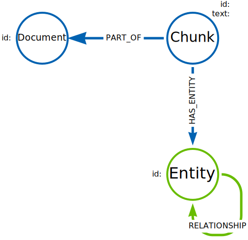

# GraphRAG

```cypher
// 
// 底下這樣的 Data model (僅為示意, 未必毫無瑕疵)
// 適用於所有的 Document 分割成 Chunk, 並且針對 Chunk 做成 Embedding 以後, 總共分成了哪些 Entity
// 
(:Document)-[:FIRST_CHUNK]->(:Chunk)-[:NEXT_CHUNK]->(:Chunk)
(:Document)<-[:PART_OF]-(:Chunk)-[:HAS_ENTITY]->(:Entity)

//
```

- https://graphacademy.neo4j.com/courses/llm-knowledge-graph-construction/3-explore/2-query-knowledge-graph/
  - 這連結在教, 如何使用 Cypher 查詢 GraphRAG

> Structured elements include the document and chunks. Unstructured elements include the entities and relationships extracted from the text.


