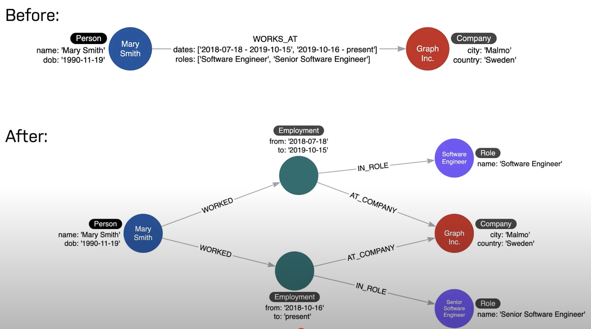

# Neo4j

- Neo4j Graph Data Science (GDS)
- 圖形化資料庫查詢標準 - GQL, Graphical Query Language
  - Cypher 為 Neo4j 對於 GQL 的實作
- 重點學習 `graph data modeling` v.s. `instance model`
- Cypher Best Practice
  - 將 create node 及 create relationship 分開處理(不要在同一個 CREATE/MERGE 裡頭完成)
  - Neo4j 的 GraphAcademy 的 modeling-fundamental 課程, 建議 Node 的 Labels 數量控制在 4 個以下
    - 如果 property 足夠使用, 則避免使用 Label
    - 善用 Label 的最主要用途, 是在 Runtime 查詢階段, 避免造訪過多的 Nodes(效能不佳)
- Neo4j data types:
  - BOOLEAN
  - DATE
  - DURATION
  - FLOAT
  - INTEGER
  - LIST
  - LOCAL DATETIME
  - LOCAL TIME
  - POINT
  - STRING
  - ZONED DATETIME
  - ZONED TIME

# Cypher

- Cypher syntax
- Pattern matching
  - MATCH - read data
  - MERGE - write data
    - MERGE 可以用來 create a pattern in the DB && only create the pattern if it doesn't already exists
- APOC library

# Install neo4j

```bash
### ===================== Docker Containerize =====================
docker pull neo4j:5.24-community

### ===================== Local Dev Test for macbook =====================
# https://neo4j.com/docs/operations-manual/current/installation/osx/
#
# Step1. 下載安裝 JDK17
# Step2. 下載安裝 Neo4j (解壓縮以後, 會是一包編譯完成後的 Dir, 內含 bin, lib, ...)
# Step3. 配置環境變數 & 同意服務條款
export NEO4J_HOME=${PATH_TO_STEP2_DIR_LOCATION}
export NEO4J_ACCEPT_LICENSE_AGREEMENT=yes
$NEO4J_HOME/bin/neo4j-admin server license --accept-commercial

# Step4. 前景啟動
$NEO4J_HOME/bin/neo4j console

# 執行 neo4j-shell
$NEO4J_HOME/bin/cypher-shell
```

# Neo4j 其他

Neo4j - intermediate nodes

- Connect more than two nodes in a single context
- Relate something to a relationship
- Share data in the graph



# Reference

- [Cypher v5 CheatSheet](https://neo4j.com/docs/cypher-cheat-sheet/5/all/)
