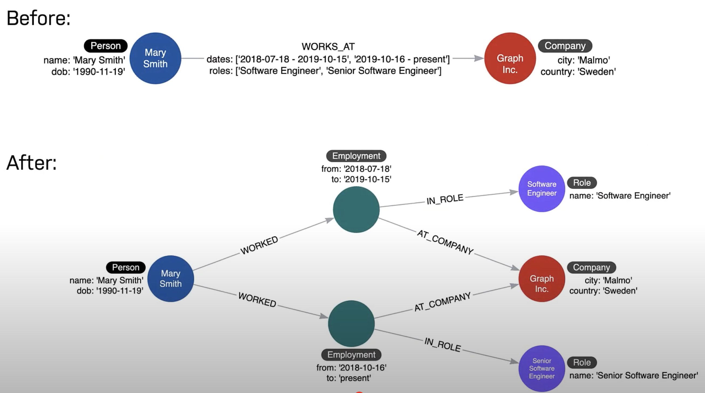

- The Power of the Path - Part1
  - https://neo4j.com/blog/developer/the-power-of-the-path-1/

# Neo4j

- 重點學習 `graph data modeling` v.s. `instance model`
- Cypher Best Practice
  - 將 create node 及 create relationship 分開處理(不要在同一個 CREATE/MERGE 裡頭完成)
  - Neo4j 的 GraphAcademy 的 modeling-fundamental 課程, 建議 Node 的 Labels 數量控制在 4 個以下
    - 如果 property 足夠使用, 則避免使用 Label
    - 善用 Label 的最主要用途, 是在 Runtime 查詢階段, 避免造訪過多的 Nodes(效能不佳)

# Cypher

- Cypher syntax
- Pattern matching
  - MATCH - read data
  - MERGE - write data
    - MERGE 可以用來 create a pattern in the DB && only create the pattern if it doesn't already exists
- APOC library

# Neo4j 其他

intermediate nodes

# Reference

- [Cypher v5 CheatSheet](https://neo4j.com/docs/cypher-cheat-sheet/5/all/)
