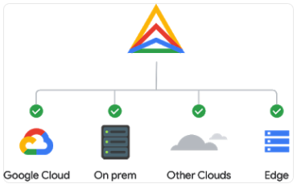
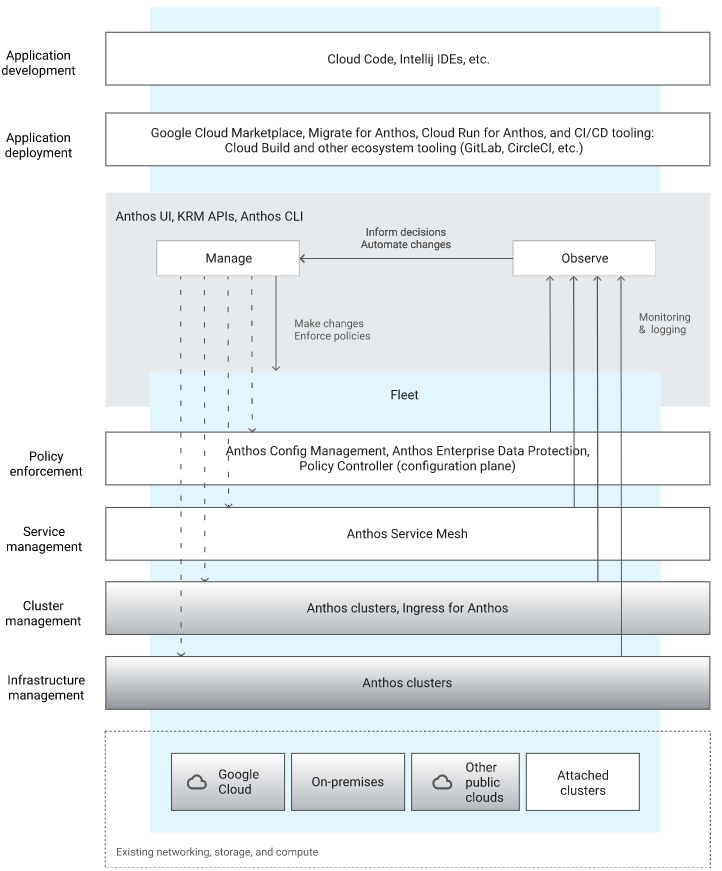

- 2022/09/15
- 接觸原因, 因為最近在面試, 有團隊要我做這部分的 Demo 來展示學習能力

# [GCP Anthos](https://cloud.google.com/anthos)

- 關於產品特色, 大概需要依照底下幾個方面去做了解
    - computing
    - networking
    - micro service
    - service mech communication
    - config
    - serverless
    - security
    - logging & monitoring
    - 3rd
- [tutorial](https://cloud.google.com/anthos/docs/tutorials/explore-anthos?hl=zh-tw)
    - 這手作範例需要先有底下概念會比較順暢些:
        - [Kubernetes basics](https://kubernetes.io/docs/tutorials/kubernetes-basics/)
        - [Prepare an application for Anthos Service Mesh](https://cloud.google.com/service-mesh/docs/prepare-app-for-anthos-service-mesh)
    - 