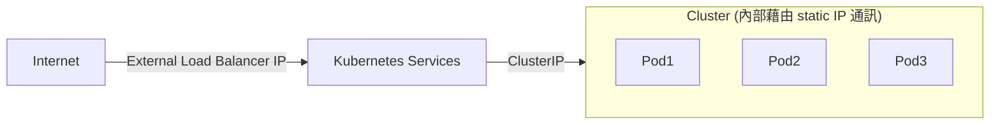

# [Deploying a containerized web application](https://cloud.google.com/kubernetes-engine/docs/tutorials/hello-app)

- 2022/09/18
- 將 APP 包成 image, 運行在 GKE, 搭配 load-balanced set of replicas 來因應 scaling
- 需要授權給
    - GKE
    - Artifact Registry
    - [Example Source](https://github.com/GoogleCloudPlatform/kubernetes-engine-samples/tree/main/hello-app)


```bash
$# export PROJECT_ID=lab0918-gke-app3
$# export REGION=asia-east1
$# gcloud config set project ${PROJECT_ID}
$# echo y | gcloud config set compute/region ${REGION}

### 建立 GCP Docker Registory
$# gcloud artifacts repositories create hello-repo \
   --project=$PROJECT_ID \
   --repository-format=docker \
   --location=${REGION} \
   --description="Docker repository0918"
Create request issued for: [hello-repo]
Waiting for operation [projects/lab0918-gke-app3/locations/asia-east1/operations/06991683-9f2d-46e4-99df-a1e3de1437fe] to complete...done.   
Created repository [hello-repo].


$# git clone https://github.com/GoogleCloudPlatform/kubernetes-engine-samples gke-app3
$# cd gke-app3/hello-app

$# docker build -t ${REGION}-docker.pkg.dev/${PROJECT_ID}/hello-repo/hello-app:v1 .
$# docker run --rm \
    -p 8080:8080 \
    ${REGION}-docker.pkg.dev/${PROJECT_ID}/hello-repo/hello-app:v1


### Configure the Docker command-line tool to authenticate to Artifact Registry
$# gcloud auth configure-docker ${REGION}-docker.pkg.dev
WARNING: Your config file at [/home/tonychoucc2022/.docker/config.json] contains these credential helper entries:

{
  "credHelpers": {
    "gcr.io": "gcloud",
    "us.gcr.io": "gcloud",
    "eu.gcr.io": "gcloud",
    "asia.gcr.io": "gcloud",
    "staging-k8s.gcr.io": "gcloud",
    "marketplace.gcr.io": "gcloud",
    "asia-east1-docker.pkg.dev": "gcloud"
  }
}
Adding credentials for: asia-east1-docker.pkg.dev
gcloud credential helpers already registered correctly.
# UNKNOWN: 大概知道幹嘛, 但還不曉得該怎麼解釋 (這應該是關於 GCP Services 之間的授權問題)
# 又仔細想想, 應該是授權 Docker 能訪問 ${REGION}-docker.pkg.dev


### docker push
$# docker push ${REGION}-docker.pkg.dev/${PROJECT_ID}/hello-repo/hello-app:v1
The push refers to repository [asia-east1-docker.pkg.dev/lab0918-gke-app3/hello-repo/hello-app]
fc36d1aaaf9b: Pushed
994393dc58e7: Pushed
v1: digest: sha256:fd3ce5f89239d6fe2bccbdd7a7b5d38f25f1c04f600b821986aeea4b581b3142 size: 739
# 記得確保一下 `echo $?` 是否成功XD  偶爾會錯字沒上傳成功, 導致後面 ImagePullBackOff
```


# GCP 的 Region 與 Zone

> Set your Compute Engine zone or region. Depending on the mode of operation that you choose to use in GKE, specify a default zone or region. 
> 
> If you use the Standard mode, your cluster is zonal (for this tutorial), so set your default compute zone.
> 
> If you use the Autopilot mode, your cluster is regional, so set your default compute region. 
> 
> Choose a zone or region that is closest to the Artifact Registry repository you created.

```bash
### Standard cluster, such as us-west1-a
$# gcloud config set compute/zone ${COMPUTE_ZONE}
$# gcloud container clusters create hello-cluster
#                            ^^^^^^ 使用 create

### Autopilot cluster, such as us-west1:
$# COMPUTE_REGION=asia-east1
$# gcloud config set compute/region ${COMPUTE_REGION}
$# gcloud container clusters create-auto hello-cluster
#                            ^^^^^^^^^^^ 使用 create-auto
```

QUESTION: `Standard cluster` 與 `Autopilot cluster` 差在哪邊?


# GKE cluster

```bash
### 此篇教學範例使用 zonal(Standard cluster), 因此用 create
$# COMPUTE_ZONE=asia-east1-a
$# gcloud config set compute/zone ${COMPUTE_ZONE}
Updated property [compute/zone].


### 建立 Standard cluster (需要花費 N mins)
$# gcloud container clusters create hello-cluster
Default change: VPC-native is the default mode during cluster creation for versions greater than 1.21.0-gke.1500. To create advanced routes based clusters, please pass the `--no-enable-ip-alias` flag
Default change: During creation of nodepools or autoscaling configuration changes for cluster versions greater than 1.24.1-gke.800 a default location policy is applied. For Spot and PVM it defaults to ANY, and for all other VM kinds a BALANCED policy is used. To change the default values use the `--location-policy` flag.
Note: Your Pod address range (`--cluster-ipv4-cidr`) can accommodate at most 1008 node(s).
Creating cluster hello-cluster in asia-east1-a... Cluster is being health-checked (master is healthy)...done.
Created [https://container.googleapis.com/v1/projects/lab0918-gke-app3/zones/asia-east1-a/clusters/hello-cluster].
To inspect the contents of your cluster, go to: https://console.cloud.google.com/kubernetes/workload_/gcloud/asia-east1-a/hello-cluster?project=lab0918-gke-app3
kubeconfig entry generated for hello-cluster.
NAME: hello-cluster
LOCATION: asia-east1-a
MASTER_VERSION: 1.22.11-gke.400
MASTER_IP: 104.199.206.59
MACHINE_TYPE: e2-medium
NODE_VERSION: 1.22.11-gke.400
NUM_NODES: 3
STATUS: RUNNING
# 似乎用 Standard cluster 模式的話, 在 Compute Engine Web Console 可以看到 VM 開起來
# NOTE: 之前用 Autopilot cluster 似乎沒看到機器? 不確定, 需再留意一下


### 
$# kubectl get nodes
NAME                                           STATUS   ROLES    AGE   VERSION
gke-hello-cluster-default-pool-6b7ff097-938r   Ready    <none>   90s   v1.22.11-gke.400
gke-hello-cluster-default-pool-6b7ff097-n3pw   Ready    <none>   91s   v1.22.11-gke.400
gke-hello-cluster-default-pool-6b7ff097-qq2v   Ready    <none>   90s   v1.22.11-gke.400

$# kubectl get services
NAME         TYPE        CLUSTER-IP   EXTERNAL-IP   PORT(S)   AGE
kubernetes   ClusterIP   10.68.0.1    <none>        443/TCP   3m29s
```


# Deploy APP to GKE

一開始 docker build && docker push, 剛剛也完成了 GKE Cluster 的建置 (有 3 台 VM), 接著要把 APP deploy -> Cluster

Usually, you deploy Pods as a set of replicas that can be scaled and distributed together across your cluster. One way to deploy a set of replicas is through a Kubernetes Deployment

```bash
### Ensure that you are connected to your GKE cluster.
$# gcloud container clusters get-credentials hello-cluster --zone ${COMPUTE_ZONE}
Fetching cluster endpoint and auth data.
kubeconfig entry generated for hello-cluster.
# QUESTION 不知道怎麼解釋 (處理 hello-cluster 與誰的權限? Artifact Registry 嗎?)


### Create a Kubernetes Deployment for your hello-app Docker image.
$# kubectl create deployment hello-app0918 \
  --image=${REGION}-docker.pkg.dev/${PROJECT_ID}/hello-repo/hello-app:v1
deployment.apps/hello-app0918 created


$# kubectl get deployments
NAME            READY   UP-TO-DATE   AVAILABLE   AGE
hello-app0918   1/1     1            1           53s


### Set the baseline number of Deployment replicas to 3.
$# kubectl scale deployment hello-app0918 --replicas=3
deployment.apps/hello-app0918 scaled


### 為 Deployment 建立一個 HorizontalPodAutoscaler resource, RepliSet 1~5
$# kubectl autoscale deployment hello-app0918 --cpu-percent=80 --min=1 --max=5
horizontalpodautoscaler.autoscaling/hello-app0918 autoscaled
# 屆時依照 CPU 來做 auto-scaling
```


# Create Service

上頭已經建了 Deployment, 之後就要把它 expose 出去

Pods 都有它們自己的 IP(但僅能在 Cluster 內部使用 且為 ephemeral). 因此這些 IPs 會動態變更, 因此藉由 Kubernetes Services 來處理底下 2 個問題:

1. group Pods together into one static hostname
2. expose a group of Pods outside the cluster, to the internet

Kubernetes Service 藉由一組 Static IP(Cluster 內部與 Pods 的通訊方式) 來與 Cluster 裏頭的 Pods 做通訊, 同時也為此 static IP 配置一個 DNS hostname, ex: hello-app.default.svc.cluster



後續要將 hello-app0918 Deployment expose 到 internet(using a Service of type LoadBalancer)

```bash
$# kubectl expose deployment hello-app0918 \
  --name=hello-app-service \
  --type=LoadBalancer \
  --port 80 \
  --target-port 8080
service/hello-app-service exposed
# --name : 建立起來的 k8s service name, 如果省略的話, service name 會等同於 deployment name


$# kubectl get service
NAME            TYPE           CLUSTER-IP    EXTERNAL-IP       PORT(S)        AGE
hello-app0918   LoadBalancer   10.68.1.187   104.199.216.251   80:31437/TCP   117s
kubernetes      ClusterIP      10.68.0.1     <none>            443/TCP        14m
```


# Deploy new version

服務更新~~ 要跑新的 image

藉由 k8s 的 rolling update 來避免 downtime

```bash
### 進去亂改 code 以後, 發布新版本
$# docker build -t ${REGION}-docker.pkg.dev/${PROJECT_ID}/hello-repo/hello-app:v2 .
$# docker push ${REGION}-docker.pkg.dev/${PROJECT_ID}/hello-repo/hello-app:v2

$# kubectl set image deployment/hello-app0918 hello-app=${REGION}-docker.pkg.dev/${PROJECT_ID}/hello-repo/hello-app:v2
deployment.apps/hello-app0918 image updated
# 此時會開始做 rolling update

$# watch kubectl get pods
```


# Clean up

```bash
$# kubectl delete service hello-app-service
$# gcloud container clusters delete hello-cluster --zone $COMPUTE_ZONE
The following clusters will be deleted. - [hello-cluster] in [asia-east1-a]
Do you want to continue (Y/n)?  Y  # yyyy
Deleting cluster hello-cluster...done.                                                                                                                                     
Deleted [https://container.googleapis.com/v1/projects/lab0918-gke-app3/zones/asia-east1-a/clusters/hello-cluster].


$# gcloud artifacts docker images delete \
    ${REGION}-docker.pkg.dev/${PROJECT_ID}/hello-repo/hello-app:v1 \
    --delete-tags --quiet
$# gcloud artifacts docker images delete \
    ${REGION}-docker.pkg.dev/${PROJECT_ID}/hello-repo/hello-app:v2 \
    --delete-tags --quiet
$# gcloud artifacts repositories delete hello-repo \
  --location=${REGION}
You are about to delete repository [hello-repo]

Do you want to continue (Y/n)?  Y  # yyyy

Delete request issued for: [hello-repo]
Waiting for operation [projects/lab0918-gke-app3/locations/asia-east1/operations/4343afed-7477-423e-97da-019b43e8b87b] to complete...done.   
Deleted repository [hello-repo].
```
