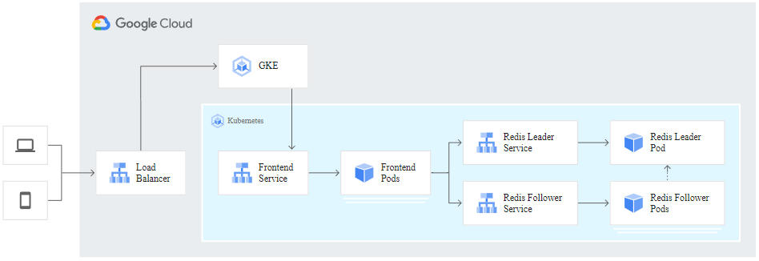

# [Create a guestbook with Redis and PHP](https://cloud.google.com/kubernetes-engine/docs/tutorials/guestbook)

- 2022/09/18
- 這個範例要跑一個 PHP guestbook, 背後有 redis cluster, 裏頭有幾個重點:
    - 撰寫 Declarative configuration yaml manifest files
    - 釐清 Kubernetes Deployments
    - 釐清 Kubernetes Services
- 
- [Source Code](https://github.com/GoogleCloudPlatform/kubernetes-engine-samples/tree/99fbbfb528462de6b9ffdfe68be4bd38ff3dd225/guestbook)

```bash
$# export PROJECT_ID=lab0918-app4
$# export COMPUTE_ZONE=asia-east1-a
$# gcloud config set project ${PROJECT_ID}
$# gcloud config set compute/zone ${COMPUTE_ZONE}
Updated property [compute/zone].


### 
$# gcloud container clusters create guestbook --num-nodes=4
Default change: VPC-native is the default mode during cluster creation for versions greater than 1.21.0-gke.1500. To create advanced routes based clusters, please pass the `--no-enable-ip-alias` flag
Default change: During creation of nodepools or autoscaling configuration changes for cluster versions greater than 1.24.1-gke.800 a default location policy is applied. For Spot and PVM it defaults to ANY, and for all other VM kinds a BALANCED policy is used. To change the default values use the `--location-policy` flag.
Note: Your Pod address range (`--cluster-ipv4-cidr`) can accommodate at most 1008 node(s).
Creating cluster guestbook in asia-east1-a... Cluster is being health-checked (master is healthy)...done.     
Created [https://container.googleapis.com/v1/projects/lab0918-app4/zones/asia-east1-a/clusters/guestbook].
To inspect the contents of your cluster, go to: https://console.cloud.google.com/kubernetes/workload_/gcloud/asia-east1-a/guestbook?project=lab0918-app4
kubeconfig entry generated for guestbook.
NAME: guestbook
LOCATION: asia-east1-a
MASTER_VERSION: 1.22.11-gke.400
MASTER_IP: 34.80.30.6
MACHINE_TYPE: e2-medium
NODE_VERSION: 1.22.11-gke.400
NUM_NODES: 4
STATUS: RUNNING


### 查看 cluster
$# gcloud container clusters list
$# gcloud container clusters describe guestbook


### retrieve cluster credentials and configure kubectl command-line tool
$# gcloud container clusters get-credentials guestbook
# 不適非常確定這的目的, 但說明有提到如果使用了 gcloud container clusters create
# 則可省略此步驟


### 
$# git clone https://github.com/GoogleCloudPlatform/kubernetes-engine-samples app4
$# cd app4/guestbook
```

```yml
# redis-leader-deployment.yaml
# 
apiVersion: apps/v1
kind: Deployment
metadata:
  name: redis-leader  # deployment name
  labels:
    app: redis
    role: leader
    tier: backend
spec:
  replicas: 1          # deployment 裏頭的 pods 數量
  selector:
    matchLabels:
      app: redis
  template:
    metadata:
      labels:
        app: redis
        role: leader
        tier: backend
    spec:
      containers:
      - name: leader
        image: "docker.io/redis:6.0.5"
        resources:
          requests:
            cpu: 100m
            memory: 100Mi
        ports:
        - containerPort: 6379
```

```bash
###
$# kubectl apply -f redis-leader-deployment.yaml
deployment.apps/redis-leader created


### 查看 deployment 詳細 log
$# kubectl logs deployment/redis-leader
1:C 18 Sep 2022 06:13:45.939 # oO0OoO0OoO0Oo Redis is starting oO0OoO0OoO0Oo
1:C 18 Sep 2022 06:13:45.939 # Redis version=6.0.5, bits=64, commit=00000000, modified=0, pid=1, just started
1:C 18 Sep 2022 06:13:45.939 # Warning: no config file specified, using the default config. In order to specify a config file use redis-server /path/to/redis.conf
1:M 18 Sep 2022 06:13:45.941 * Running mode=standalone, port=6379.
1:M 18 Sep 2022 06:13:45.941 # Server initialized
1:M 18 Sep 2022 06:13:45.942 # WARNING you have Transparent Huge Pages (THP) support enabled in your kernel. This will create latency and memory usage issues with Redis. To fix this issue run the command 'echo never > /sys/kernel/mm/transparent_hugepage/enabled' as root, and add it to your /etc/rc.local in order to retain the setting after a reboot. Redis must be restarted after THP is disabled.
1:M 18 Sep 2022 06:13:45.942 * Ready to accept connections


### 
$# kubectl get service
NAME         TYPE        CLUSTER-IP   EXTERNAL-IP   PORT(S)   AGE
kubernetes   ClusterIP   10.60.0.1    <none>        443/TCP   15m


### 
$# kubectl get pods
$# kubectl get deployments
NAME           READY   UP-TO-DATE   AVAILABLE   AGE
redis-leader   1/1     1            1           8m44s
```

```yaml
# redis-leader-service.yaml
# 
apiVersion: v1
kind: Service
metadata:
  name: redis-leader  # Service Name
  labels:
    app: redis
    role: leader
    tier: backend
spec:
  ports:
  - port: 6379
    targetPort: 6379
  selector:
    app: redis
    role: leader
    tier: backend
```

```bash
$# kubectl apply -f redis-leader-service.yaml
service/redis-leader created


$# kubectl get services
NAME           TYPE        CLUSTER-IP    EXTERNAL-IP   PORT(S)    AGE
kubernetes     ClusterIP   10.60.0.1     <none>        443/TCP    3h40m
redis-leader   ClusterIP   10.60.4.223   <none>        6379/TCP   4s
# redis-leader 這個 Service, 恩... 並非 LB, 不會有 External IP
```

```yaml
# redis-follower-deployment.yaml
apiVersion: apps/v1
kind: Deployment
metadata:
  name: redis-follower
  labels:
    app: redis
    role: follower
    tier: backend
spec:
  replicas: 2
  selector:
    matchLabels:
      app: redis
  template:
    metadata:
      labels:
        app: redis
        role: follower
        tier: backend
    spec:
      containers:
      - name: follower
        image: us-docker.pkg.dev/google-samples/containers/gke/gb-redis-follower:v2
        resources:
          requests:
            cpu: 100m
            memory: 100Mi
        ports:
        - containerPort: 6379
```

```bash
### create deployment for redis follower
$# kubectl apply -f redis-follower-deployment.yaml

$# kubectl get deployments
NAME             READY   UP-TO-DATE   AVAILABLE   AGE
redis-follower   2/2     2            2           8s
redis-leader     1/1     1            1           3h42m

$# kubectl get pods
NAME                              READY   STATUS    RESTARTS   AGE
redis-follower-594666cdcd-6nvd7   1/1     Running   0          25s
redis-follower-594666cdcd-tsn7n   1/1     Running   0          25s
redis-leader-7675996468-5pr7c     1/1     Running   0          3h42m
```

```yaml
# redis-follower-service.yaml
apiVersion: v1
kind: Service
metadata:
  name: redis-follower
  labels:
    app: redis
    role: follower
    tier: backend
spec:
  ports:
    # the port that this service should serve on
  - port: 6379
  selector:
    app: redis
    role: follower
    tier: backend
```

```bash
$# kubectl apply -f redis-follower-service.yaml
$# kubectl get services
NAME             TYPE        CLUSTER-IP    EXTERNAL-IP   PORT(S)    AGE
kubernetes       ClusterIP   10.60.0.1     <none>        443/TCP    3h51m
redis-follower   ClusterIP   10.60.10.72   <none>        6379/TCP   11s
redis-leader     ClusterIP   10.60.4.223   <none>        6379/TCP   11m
```

```yml
# frontend-deployment.yaml
apiVersion: apps/v1
kind: Deployment
metadata:
  name: frontend-php  # deployment name
spec:
  replicas: 3
  selector:
    matchLabels:
        app: guestbook
        tier: frontend
  template:
    metadata:
      labels:
        app: guestbook
        tier: frontend
    spec:
      containers:
      - name: php-redis
        image: us-docker.pkg.dev/google-samples/containers/gke/gb-frontend:v5
        env:
        - name: GET_HOSTS_FROM
          value: "dns"
        resources:
          requests:
            cpu: 100m
            memory: 100Mi
        ports:
        - containerPort: 80
```

```bash
$# kubectl apply -f frontend-deployment.yaml

$# kubectl get deployment
NAME             READY   UP-TO-DATE   AVAILABLE   AGE
frontend-php     3/3     3            3           41s
redis-follower   2/2     2            2           112m
redis-leader     1/1     1            1           5h34m


### 
$# kubectl get pods -l app=guestbook -l tier=frontend
NAME                            READY   STATUS    RESTARTS   AGE
frontend-php-64bcc69c4b-478hk   1/1     Running   0          109s
frontend-php-64bcc69c4b-9vd7x   1/1     Running   0          109s
frontend-php-64bcc69c4b-zszhc   1/1     Running   0          109s
# -l, --selector='xxx' : 可用 label 來做過濾


### 
$# kubectl get deployment -l frontend-php

$# kubectl apply -f frontend-service0.yaml
service/frontend created


$# kubectl get deployments
NAME             READY   UP-TO-DATE   AVAILABLE   AGE
frontend-php     3/3     3            3           3h18m
redis-follower   2/2     2            2           5h10m
redis-leader     1/1     1            1           8h


### manual scaling
$# kubectl scale deploy frontend-php --replicas=5
deployment.apps/frontend-php scaled


$# kubectl get deployments
NAME             READY   UP-TO-DATE   AVAILABLE   AGE
frontend-php     5/5     5            5           3h19m
redis-follower   2/2     2            2           5h10m
redis-leader     1/1     1            1           8h
```


# Clean up

```bash
$# kubectl delete service frontend
$# kubectl delete service redis-follower
$# kubectl delete service redis-leader
$# kubectl delete deploy frontend-php
$# kubectl delete deploy redis-follower
$# kubectl delete deploy redis-leader
$# gcloud container clusters delete guestbook
# ↑ 最後一步... 記得把 Cluster VM 也砍了
```
