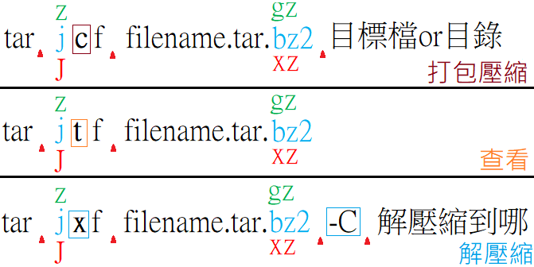

# Ch12 - Archiving and Copying Files Between Systems

1. 打包 及 壓縮
2. 跨站操作
3. 補充參考

## 1. 打包 及 壓縮

### 1-1. 壓縮格式

Linux 壓縮檔常見的附檔名 (用速度換空間 v.s. 用空間換速度)

- gz(gzip): 最快 && 輕輕的壓縮的概念
- bz2(bzip2): 速度中間 && 壓縮率也還好(感覺沒啥特色...)
- xz : 最慢 && 極致壓縮


### 1-2. 壓縮及解壓縮

#### 1-3-1. gz

此壓縮家族還有 zcat/zmore/zless/zgrep 等指令

```sh
### gz 的 壓縮 && 解壓縮
$ touch aa
$ ls
aa

$ gzip aa
$ ls
aa.gz

$ gunzip aa.gz
$ ls
aa
```

```sh
### zip 的 壓縮 && 解壓縮 (加密碼~)
$ touch a1 a2 a3

# 將 a1, a2, a3 壓縮為 aaa.zip, 並設定密碼
$ zip -er aaa.zip a1 a2 a3   # -er 設定 解壓縮密碼~
Enter password:
Verify password:
  adding: a1 (stored 0%)
  adding: a2 (stored 0%)
  adding: a3 (stored 0%)

$ rm a1 a2 a3

# 把 aaa.zip 裡面的檔案全部解壓縮出來
$ unzip aaa.zip
Archive:  aaa.zip
[aaa.zip] a1 password:   # 輸入 解壓縮密碼
 extracting: a1
 extracting: a2
 extracting: a3
```


#### 1-3-2. bz2

此壓縮家族還有 bzcat/bzmore/bzless/bzgrep 等指令

指令幾乎與 `gz` 家族一樣


#### 1-3-3. xz

此壓縮家族還有 xzcat/xzmore/xzless/xzgrep 等指令

指令幾乎與 `gz` 家族一樣


### 1-3. 打包檔的壓縮及解壓縮



* ====== zjJ ======
* z : 對應 gz
* j : 對應 bz2
* J : 對應 xz
* ====== f ======
* f : (後面一定得接檔名)
* ====== v ======
* v : 列出工作明細
* ====== 其他 ======
* p(小) : 保留原檔案的權限與屬性
* P(大) : 保留絕對路徑(慎用! 解壓縮會把原本的東西覆蓋掉!)
* --exclude=XX : 不打包 XX

- file 要能夠 r 才能 tar
- dir 要能夠 r && w 才能 tar


#### 1-2-1 打包格式的比較

```sh
### 各種壓縮格式的 壓縮時間 && 壓縮後容量 的比較
mkdir /root/compare
time tar zpcf /root/compare/etc.tar.gz /etc
time tar jpcf /root/compare/etc.tar.bz2 /etc
time tar Jpcf /root/compare/etc.tar.xz /etc
ll -h /root/compare/ | grep etc.tar.*
```


#### 1-2-2 打包系統檔案

```sh
### root
rm -rf /etcbackup
mkdir /etcbackup

# 比較下列兩者
tar czfP /etcbackup/etc1.tar.gz /etc
tar czf  /etcbackup/etc2.tar.gz /etc

ls -hl /etcbackup   # 兩個表面上, 看起來是一樣的!!

# 內在就有點差異了!! 比較下列兩者
tar ztf /etcbackup/etc1.tar.gz | head -n 3      # 若要解壓縮此檔, 需要非常非常清楚自己在幹嘛!!
tar ztf /etcbackup/etc2.tar.gz | head -n 3

rm -rf /etcbackup
```


## 2. 跨站操作

### 2-1 scp

- 得手動打密碼
- file 有 r 就能 scp
- 無法保留屬性


```sh
# 複製東西到遠端
scp /etc/hosts pome@192.168.124.81:/tmp/you_can_remove_me

# 從遠端複製東西
scp pome@192.168.124.81:/tmp/you_can_remove_me /tmp/please_remove_me

ll /tmp | grep please_remove_me
ll /etc/hosts
```


### 2-2 rsync

- 可保留屬性
- 可作目錄同步


rsync 的選項... 非常多

-l : symbolic links
-o : owner
-g : group owner
-p : premissions
-t : time stamps
-r : recursively
-a : (上面的都有 logptr )
-v : 列出同步過程
-H : hard links
-A : ACL
-X : SELinux


#### 範例: 比較 scp 與 rsync

```sh
### root
rm -rf /root/demo_rsync
rm -rf /root/demo_scp
mkdir /root/demo_rsync
mkdir /root/demo_scp

# scp 同步「/var/log」 與 「/root/demo_rsync」
scp -r /var/log /root/demo_scp

# rsync 同步「/var/log」與「/root/demo_rsync」
rsync -av /var/log /root/demo_rsync

# 模擬 log, 此會記錄到 「/var/log/messages」
logger "@@~"

# 各位觀眾~~~~ 同步!
rsync -av /var/log /root/demo_rsync

# 比較屬性這個東西(user, group, mtime)
ll /root/demo_scp/log
ll /root/demo_rsync/log

rm -rf /root/demo_scp
rm -rf /root/demo_rsync
```


#### 2-2-2 rsync 的坑

```sh
### root
rm -rf /tmp/a /tmp/b
mkdir /tmp/a
mkdir /tmp/b

rsync -av /var/log  /tmp/a
rsync -av /var/log/ /tmp/b
# 只差在一個「/」


# 把 log 資料夾, 整個 rsync 到 /tmp/a/log
ll /tmp/a
ll /tmp/b
# 把 log 內的所有東西, rsync 到 /tmp/b/


rm -rf /tmp/a /tmp/b
```


## 3. 補充參考

- [鳥哥 - tar](http://linux.vbird.org/linux_basic/0240tarcompress.php#pack)
- [Tony - 壓縮 && 解壓縮 && 打包](https://github.com/cool21540125/documentation-notes/blob/master/linux/system/compression.md)
- [Tony - 遠端連線伺服器SSH / XDMCP / VNC / RDP](https://github.com/cool21540125/documentation-notes/blob/master/linux/shell/ftp.md)
