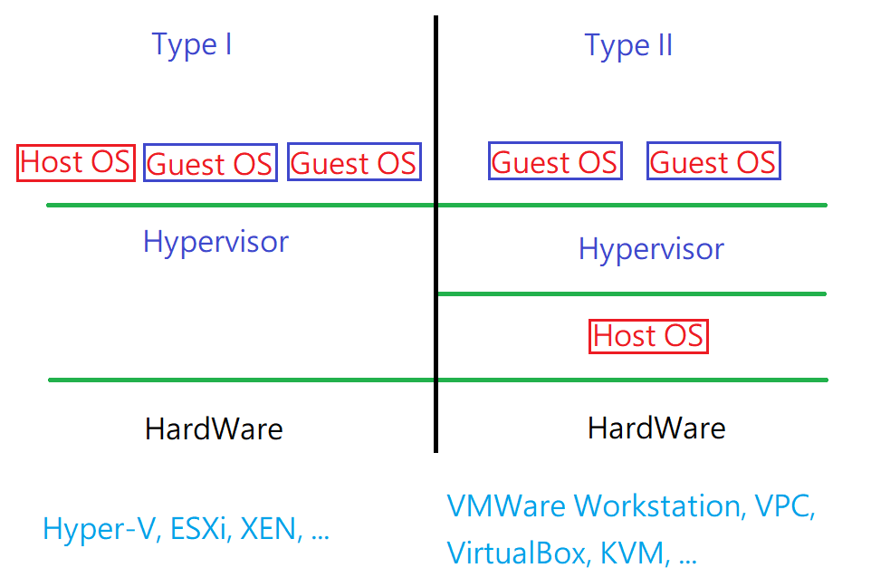
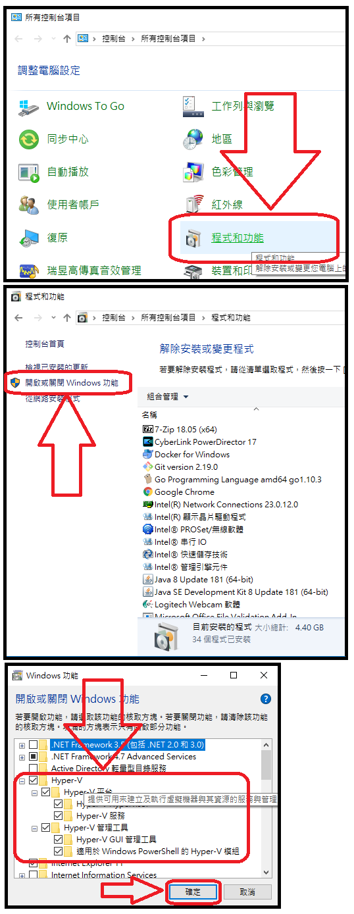

# Ch15 - Using Virtualized Systems

- [安裝 CentOS 核心支援的 kvm, 或是 安裝 Virtual Box](https://github.com/cool21540125/documentation-notes/blob/master/linux/install/installCentOS7.md)

# 若啟用 Hyper-V, Virtual 及 VMWare 等 Type II 的虛擬化軟體將無法再使用.

# Windows10 啟用 Hyper-V 流程(來亂的)

完
