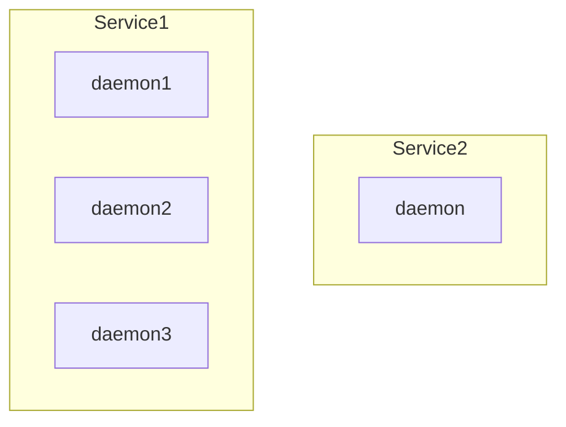

# Ch8  - Controlling Services and Daemons

1. Daemon
2. Controlling System Service


## 1. Daemon

### 1-1 名詞釐清(僅個人認知, 不保證完全正確)

Service 與 Daemon 與 Process 與 Program 之差異

- 執行中的 Program = Process
- Process 在處理的工作 = Daemon (把這兩個東西理解成是一樣的, 好像也是可以的)
- 一或多個 Daemon 組合起來所做的事情 = Service


#### Daemon 與 Process 示意圖

```sh
$ systemctl status sshd.service
● sshd.service - OpenSSH server daemon
   Loaded: loaded (/usr/lib/systemd/system/sshd.service; enabled; vendor preset: enabled)
   Active: active (running) since 四 2018-10-04 11:07:50 CST; 58min ago
     Docs: man:sshd(8)
           man:sshd_config(5)
 Main PID: 1410 (sshd)
    Tasks: 1
   Memory: 2.4M
   CGroup: /system.slice/sshd.service
           └─1410 /usr/sbin/sshd -D
### PID = 1410 (sshd)
```


#### Service 與 Daemon 示意圖




> 系統開機後, kernel 初始化 硬體, 然後喚醒 `systemd` (OS7第一支程式), 此程式在初始化各種服務. [詳細開機流程參考這裡](http://linux.vbird.org/linux_basic/0510osloader.php#startup)

`systemd objects` 又稱為 `units`, 而 units 又可分為各種 `type`, ex: `httpd.service`

```sh
# 列出所有的 unit types (共有13種)
systemctl -t help
```

常見的 `unit types` 如下:

1. `Service` units - 此類型的 unit 被用來管控 service(daemon).
2. `Socket` units - 連線建立後, 派送給 daemon 或 service 的東西 ; 程序之間的溝通管道(inter-process communication, IPC)


#### systemctl 的 status

Group | Keyword             | Description                       
----- | ------------------- | --------------------------------------------------------
1     | loaded              | 設定檔成功載入
2     | active (running)    | Continuing Processes 執行中, sshd.service
2     | active (exited)     | 一次性設定成功, network.service
2     | active (waiting)    | 成功, 現在正在等待事件, cups.service(印表機)
2     | inactive            | Not running
3     | enabled             | 下次開機後 執行
3     | disabled            | 下次開機後 不執行
3     | static              | 無法被直接 enabled; 但可能被其他 enabled unit 自動啟動

###### 上表的 Group 指是在講說, 同 Group 只會有一種狀態


### 1-2 新舊時代的比較

- OS6 第一支程式 : init (PID=1)
- OS7 第一支程式 : systemd (PID=1)

```sh
# 古老語法
service NAME command
# ex: service mysqld status

# 現代語法
systemctl command NAME
# ex: systemctl status mysqld
```

### 1-3 systemctl 指令

* enable 與 start 的差異
* 怎麼查服務的狀態, 怎麼啟動服務, 怎麼關閉服務

```sh
systemctl status sshd
systemctl start sshd
systemctl stop sshd

systemctl reload sshd                       # 關閉後, 再啟動
systemctl restart sshd                      # 重載組態(某些情況無效)

## 下面指令可不理會
systemctl is-active sshd                    # sshd start?
systemctl is-enabled sshd                   # sshd enabled?
systemctl --type=service                    # 列出所有 type=service 的 Unit 的狀態
systemctl list-units --type=service         # list-units 為 systemctl 的預設子指令, 此結果同上
systemctl list-unit-files --type=service    # 列出所有 type=service 的 Unit 的狀態
systemctl --failed --type=service           # 列出啟動失敗的程序
```


## 2. Controlling System Service

```sh
### 開發人員可能常用到
systemctl status sshd

systemctl stop sshd
systemctl start sshd
systemctl restart sshd
systemctl reload sshd

systemctl enable sshd
systemctl disable sshd

### 開發人員幾乎可以不用理會
systemctl mask sshd
systemctl unmask sshd

systemctl list-dependencies sshd
```
