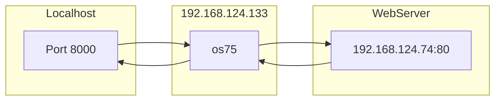

# Ch9  - Configuring and Securing OpenSSH Service

1. 遠端連線
2. 設定檔
3. 跳板(進階)

## 1. 遠端連線

- telnet(明文)
- ssh   (密文)

```sh
# 遠端電腦 IP 為 192.168.124.133
# 語法: ssh 帳號@位址
$ ssh tony@192.168.124.133
```

### 公/私金鑰基本概念

```mermaid
graph LR

Client -- Connection --> Server

subgraph Client
    Client[?? port]
end

subgraph Server
    Server[22 port]
end
```

- ssh 採用 `非對稱式加密` (Public Key && Private Key)
- 連線後, Client 與 Server 之間會建立一條 `channel`(參考 rhce1-Ch4), 後續便透過此 channel 來做溝通

### 相關檔案

```sh
$ ll ~/.ssh
-rw-------. 1 tony tony 3243  9月 17 16:52 id_rsa           # 自己的私鑰
-rw-r--r--. 1 tony tony  737  9月 17 16:52 id_rsa.pub       # 自己的公鑰
-rw-------. 1 tony tony 2942 10月  3 18:54 authorized_keys  # 別人的公鑰
-rw-r--r--. 1 tony tony 1690  9月 30 00:09 known_hosts      # 別人的公鑰
```


## 2. 設定檔

```sh
vim /etc/ssh/sshd_config

# 比較重要的幾個欄位 -----------
PasswordAuthentication      no

PermitRootLogin             yes
PermitRootLogin             without-password
# 比較重要的幾個欄位 -----------
```


## 3. 跳板(進階)



```sh
### SSH Tunnel 玩法
ssh -L 8000:192.168.124.74:80 pome@192.168.124.133
# ssh -L <本地port>:<要訪問的IP>:<要訪問的Port> <跳板user>@<跳板IP>
```
