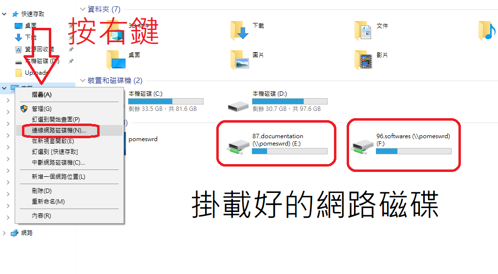

# Ch12 - Accessing Network Storage with SMB

1. 摘要
2. 掛載

## 1. 摘要

基本上, 公司用的 NAS 可以掛載到你電腦上的 D, E, F, G 槽, 八九不離十, 就是透過 SAMBA 這協定來作的



- Unix Like 玩 Unix Like -> NFS   (Network FileSystem)
- Windows   玩 Windows   -> CIFS  (Common Internet File System)
- Unix Like 玩 Windows   -> SAMBA (Server Message Block)

`總之我們門外漢, 只要知道 cifs = samba = smb, 並且知道怎麼把它掛載起來, 可以正常操作就行了!`, 其它的技術細節, 交由專家去實作就行了.

###### note: 不知道為啥, 可能是 smb 不好念還怎樣的, 大家也會念成 samba

## 2. 掛載

Tony 已經在 `192.168.124.118` 做好了 samba share, 裏頭只有約 32M (其實只有26M) 的空間可讓大家在 Windows10 及 Linux 練習掛載看看


### 2-1. 資源點

- URL : 192.168.124.118 (server22)
- username : howr
- password : howr
- share : smbShareGG

### 2-2. Windows 10 - SAMBA Client

連入 `\\192.168.124.118\smbShareGG`
輸入 帳號 && 密碼

開啟資料夾, 於 URL 區塊 (讓你輸入 `D:\secret_video` 的地方啦), 輸入 `\\192.168.124.118\smbShareGG`, 然後再輸入帳號密碼, 即可完成 `網路磁碟的掛載`

### 2-3. CentOS7 - SAMBA Client

#### 2-3-1. 套件

```sh
# SAMBA 客戶端必備套件
$# yum install -y cifs-utils
```

#### 2-3-2. 掛載

前置作業...

```sh
# 先把密碼文件寫到其它地方, 並且嚴格控管
echo 'username=howr' >> /root/howr.key
echo 'password=howr' >> /root/howr.key
chmod 600 /root/howr.key
ll /root/howr.key
```

##### 1. 手動掛載

```sh
mkdir /mnt/fromSMB
mount -t cifs -o credentials=/root/howr.key //server22/smbShareGG /mnt/fromSMB
# 之後再打密碼, 即可完成~
```

##### 2. 固定掛載

```sh
# 固定掛載~
mkdir /mnt/fromSMB
echo '//server22/smbShareGG   /mnt/fromSMB    cifs    credentials=/root/howr.key   0 0' >>  /etc/fstab
mount -a
# 不應出現錯誤或警告訊息

df -h /mnt/fromSMB/
# 如果看到 /mnt/fromSMB 出現在 Mounted on 底下, 表示掛載成功!!
```

##### 3. 自動掛載

```sh
$# yum install -y autofs

# 使用者自訂自動掛載設定檔, 一定得是 「/etc/auto.master.d/*.autofs」
echo '/-    /etc/auto.autosmb' >> /etc/auto.master.d/smb.autofs
echo '/mnt/autoSMB   -fstype=cifs,credentials=/root/howr.key          ://192.168.124.118/smbShareGG' >> /etc/auto.autosmb

mkdir /mnt/autoSMB

# 啟用自動掛載
systemctl start autofs
systemctl enable autofs

df -h /mnt/autoSMB
# 此時, /mnt/autoSMB 應該依然掛載在 / 底下

cd /mnt/autoSMB
ls
# 可以看到東西了~~

df -h /mnt/autoSMB
# 這時候, /mnt/autoSMB 就會變成掛載在 /mnt/autoSMB 底下了 (獨立的檔案系統!!)
```

