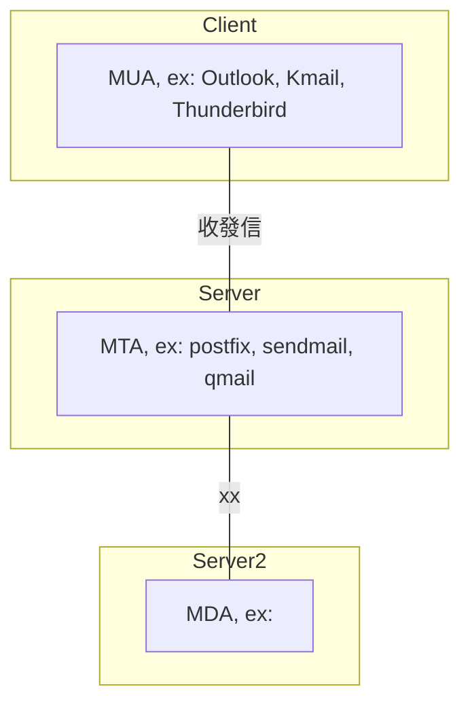
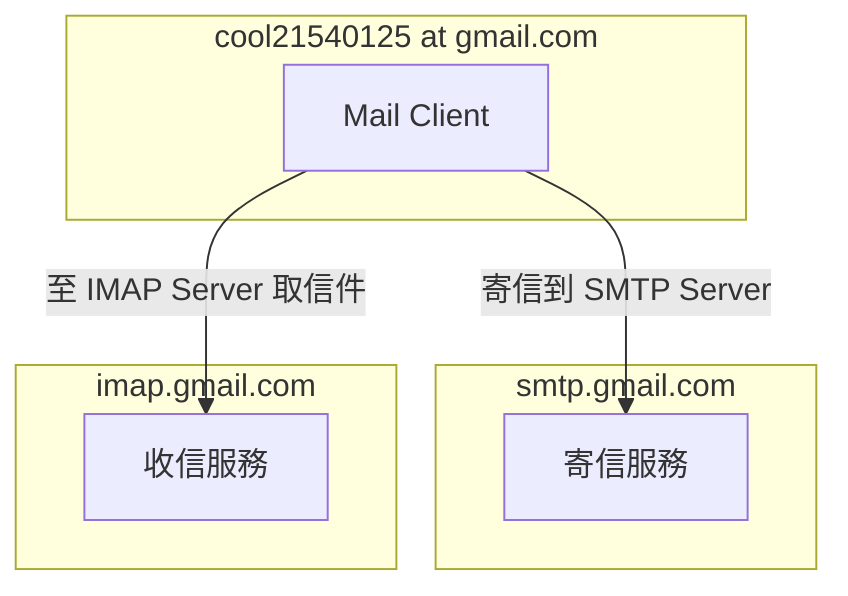

# Ch6  - Configuring Email Transmission

1. 概念
2. 故事
3. Postfix

## 1. 概念

```sh
/etc/
    /aliases                # 郵件別名/郵件群組
    /postfix/
        /main.cf                # postfix 設定主檔
        /master.cf              # postfix 每個程序的運作參數
        /access                 # Relay 黑/白 清單
/usr/
    /sbin/
        /postalias              # 設定別名資料庫的指令 (將 /etc/aliases -> /etc/aliases.db)
        /postcat                # 檢查 queue
        /postconf               # 組態 查閱/設定 指令
        /postfix                # postfix daemon
        /postmap                # (類似 postalias), 轉換 access db
        /postqueue              # (類似 mailq), 也可用 postqueue -p
```

常見的 `Mail Clients` : `Evolution` , `mutt` , `網頁版的 mail`...

終端使用者用來收發現件的 `mail client` 軟體 : `Evolution`, `mutt`, `網頁版的 mail(Gmail, Hotmail, ...)`

`null client` 是個 `client machine`, 可在 `未經認證` 的情況下, 使用 `local mail server(forward all emails to an outbound mail relay for delivery)` 來寄信. (想像一下, 你可以不打信箱的帳號密碼, 然後就直接寄信給其他人...)

收信服務使用 `POP3 server` or `IMAP server` 來收信, ex: `Dovecot`, `Cyrus`, ...


## 2. 故事

> tony 要寄信給 `tiffany@gmail.com`, 則 tony 要寄信到 `gmail.com` 這台主機. 然而 tony 電腦並無法平白無故把信寄給 `gmail.com`, 因為必須在 tony 電腦上設定 **幫忙轉信的郵件伺服器**. 也就是需要像某一台 **郵件伺服器註冊**(申請 hotmail 帳戶), 才能夠寄信. 

- tony : 本地MUA
- tiffany : 遠端MUA
- hotmail : 本地端使用的郵件伺服器(MTA)
- gmail : 遠端使用者使用的郵件伺服器(MTA)

### 1. MUA(Mail User Agent): 幫用戶 收受信件到 `郵件伺服器`

幫你跑郵局的管家啦!!


### 2. MTA(Mail Transfer Agent): 傳送信件的代理人 (郵差), 也就是一般我們所說的 `Mail Server`

* 把 `本地MUA送來的(待寄出)` && `遠端MTA(別人寄來)的` 信件收下來 (使用 SMTP 25 port)
* 如果要幫忙寄送的信件, 並非現在這台MTA所管轄的範圍, 那就得把這封信 `轉遞(relay)信件` 到其他 MTA
* 要把信寄出時, 按下傳送, 信件會丟到 `MTA柱列(寄件夾)啦`, 然後等著 MDA 來把它寄出去

> (寄信服務) 達成 MTA 的 SMTP 功能的主要軟體: sendmail, postfix 等 (而此兩款 MTA 都附有自己的 MDA)

`傳送信件時, MTA 需要啟動 smtp 25 port`


### 3. MDA(Mail Delivery Agent): 郵件遞送代理人 (過濾 郵遞區號 & 地址 的人員)

* 過濾垃圾郵件
* 自動回覆
* 真正送信跑腿的單位, 把信件丟到這封信所要寄送的地方
    * 放到本地的 Mailbox
    * 放到別的地方的 MTA(relay) 的 smtp(port 25) 發送出去


### 4. Mailbox (Linux預設放在 `/var/spool/mail/USER/`)

存放信件的地方, 就是收件匣啦!!

### 5. MRA(Mail Retrieval Agent):

- MRA 提供收信的方式:
    - 郵政服務協定(POP, Post Office Protocol)
    - 網路訊息存取協定 (IMAP, Internet Message Acess Protocol)

但是 `pop3`, `imap` 都是明碼傳輸..., 因而有了 `pop3s`, `imaps`

#### POP3 收信方式 (MRA 必須啟動 pop3)

1. MUA 可透過 POP3 (MRA 的 110 port), 使用帳密取得認證與授權
2. 認證通過後, 前往該使用者的 Mailbox(`/var/spool/mail`) 取得信件, 並傳送到 MUA 軟體上
3. 因為是 POP, 所以收信後, Mailbox 的信會消失

> 因為 MUA 程式透過 pop3 收信時, 實作上是從第一封信抓到最後一封信, 而抓到有病毒的信件時, 會被防毒軟體中斷(斷線), 導致某部分信件有抓下來, 而有部分沒抓到(mailbox依舊存在). 使用者在重新收信時, 收過的會再收一次, 然後斷線, for-loop...XD

#### IMAP 收件方式 (MRA 必須啟動 imap)

- 會把 mailbox 的信件, 轉存到 `/home/USER/` 底下 (會延伸出 quota 的問題)

> (收信服務) : Dovecot, Cyrus, Outlook


## 3. Postfix - MTA Server

很久很久以前, Linux 系統上寄信都是用 `/usr/sbin/sendmail`, 再由企業內部的 SMTP Server 來寄信. 但因為 `sendmail` 本身的設定檔非常複雜, 於是有人把它做了改良版, 也就是現在的 `postfix`(post fix : 修正之前的東西的意思), 但若把 `postfix` 和 `sendmail` 當成同樣的東西, 也不能說完全錯.

- `/etc/postfix/main.cf`   : 主要設定檔, 請使用 `postconf -e 'KEY=VALUE'` 來修改, 盡量別直接編輯
- `/etc/postfix/master.cf` : postfix 運作參數
- `/etc/aliases`           : 郵件別名用途, 也可做為 郵件群組使用
- `/usr/sbin/postconf`     : postconf 程式(用途如下)
- `/etc/postfix/access`    : mynetworks 的黑白名單

```sh
$# postfix check
$# postfix flush    # 強制寄出郵件佇列的信件

$# vim /etc/postfix/access
12.34.59.87     OK
33.44.55.66     REJECT
192.168.124.88  OK
```


### 指令

```sh
postconf -e "inet_interfaces = loopback-only"
postconf -e "relayhost = [smtp12.example.com]"
postconf -e "mynetworks = 127.0.0.0/8 [::1]/128"
postconf -e "myorigin = desktop12.example.com"
postconf -e "mydestination ="
postconf -e "local_transport = error: local delivery disabled"
```

### postconf 指令說明

以下設定檔若有多參數, 可用「 」或「, 」 分隔, 建議使用後者

#### 1. myhostname

- mail server 的 FQDN
- 此設定不可與 relayhost 相同
- ex: **myhostname = mail.tony.com**

#### 2. mydomain

- 設成 `$myhostname` 第一個「.」之後的東西就對了
- DNS MX 紀錄要指向這裡 (tony.com.  MX  10 mail.tony.com.)
- ex: **mydomain = tony.com**

#### 3. myorigin

- 可直接設成 `$myhostname` 或 `$mydomain`
- 寄信出去對方收到信時, 究竟要讓對方看到 mail.tony.com($myhostname) 或者 tony.com($mydomain)
- 改寫寄件者位置 (與 NAT 的 masquadered 同概念吧)
- ex: **myorigin = $mydomain**

#### 4. mynetworks

- 接收存取的網段 (信任哪些用戶端, 我這台 MTA 可以幫這些人進行 Relay)
- 與 DNS 的 access_control 同概念.
- 也可設成 mynetworks = ..., hash:/etc/postfix/access
    - 然後再把白名單建在 /etc/postfix/access
- ex: **mynetworks = 127.0.0.0/8, 172.31.32.0/20**

#### 5. relayhost

- 轉發所有的 mail 到此 外部寄件伺服器(Mail Server) 位置
- 格式為: [smtpXX.domain.com]. 加上 [] 是為了 不作 MX record lookup
- ex: **relayhost =** (空值)

#### 6. inet_interfaces

- 收信 && 轉發 介面. 接受來自哪個網路介面的 mail service. 
- 與 DNS 的 interface 同概念.
- ex: **inet_interfaces = all**

#### 7. local_transport

- 被寄往 $mydestination 的信件, 該如何被處理. 
    - ex1: 預設為 local:$myhostname, 表示使用 `**local** mail delivery agent` 來傳遞信件到 `/var/spool/mail` 裏頭.
    - ex2: 若設為 error: local delivery disabled, 表示 不讓 local null client 把信件歸類到 $mydestination 的 mailbox.
- ex: **local_transport = local:$myhostname**

#### 8. mydestination

- Mail Server 要寄送的終端端點 domains. 
- 要寄往此 domains 的信件, 都得先放到 `local mailboxes`
- `MX` 指向的位置, 一定要在這裡頭出現!
- ex: **mydestination = $mydomain**

#### 9. relay_domains(有點進階了)

- 可以幫忙 relay 的下一部 MTA 主機位址
- ex: **relay_domains = $mydestination** (default)

#### 10. mynetworks_style

- 三者則一: subnet, class, host
- 此設定會被 $mynetworks 設定的值給取代 (所以可以不用鳥這個設定)
- ex: **mynetworks_style = subnet**

#### 11. inet_protocols

- 三者則一: all, ipv4, ipv6
- ex: **inet_protocols = ipv4**


# 其他

```sh
# 寄信給 tony@smart.swrd.com
$# mail -s "早安" tony@smart.swrd.com
安安
早餐吃了沒
88
.       # 輸入此代表結束
EOT

# server 寄信到 desktop
# mail 主旨:test1
mail -s test1 root@desktop0.example.com
內容~~
.

echo 'haha' | mail -s 'from @@' tony


# 寄信佇列 re send
postqueue -f

# 
ss -ta

postconf | grep inet_interfaces

# 收信
mail
1

# 
postconf -e 'myorigin = 7-11.com.tw'

# 看預設
postconf -d | grep myorigin
```

```sh
### 查詢公司上層 DNS, MX record
$# dig -t MX portwell.com.tw

; <<<>> DiG 9.9.4-RedHat-9.9.4-61.el7 <<<>> -t MX portwell.com.tw
;; global options: +cmd
;; Got answer:
;; ->>HEADER<<<- opcode: QUERY, status: NOERROR, id: 27919
;; flags: qr aa rd ra; QUERY: 1, ANSWER: 5, AUTHORITY: 0, ADDITIONAL: 6

;; OPT PSEUDOSECTION:
; EDNS: version: 0, flags:; udp: 1280
;; QUESTION SECTION:
;portwell.com.tw.               IN      MX

;; ANSWER SECTION:
portwell.com.tw.        3600    IN      MX      15 ex11.portwell.com.tw.
portwell.com.tw.        3600    IN      MX      20 smtp.portwell.com.tw.
portwell.com.tw.        3600    IN      MX      10 ex10.portwell.com.tw.
portwell.com.tw.        3600    IN      MX      30 portmail.portwell.com.tw.
portwell.com.tw.        3600    IN      MX      40 ex1.portwell.com.tw.

;; ADDITIONAL SECTION:
ex11.portwell.com.tw.   1200    IN      A       192.168.2.58
smtp.portwell.com.tw.   3600    IN      A       192.168.2.56
ex10.portwell.com.tw.   1200    IN      A       192.168.2.59
portmail.portwell.com.tw. 3600  IN      A       192.168.2.235
ex1.portwell.com.tw.    1200    IN      A       192.168.2.56

;; Query time: 2 msec
;; SERVER: 192.168.2.115#53(192.168.2.115)
;; WHEN: Thu Dec 06 11:59:55 CST 2018
;; MSG SIZE  rcvd: 232
```


### 示意圖1




### 示意圖2




# mail

從 `mailq` 刪除待寄出信件

```sh
$# mailq
-Queue ID- --Size-- ----Arrival Time---- -Sender/Recipient-------
47D9280608D      443 Mon Jan  7 15:47:18  root@tonychoucc.com
                                     (mail for localhost loops back to myself)
                                         cool21540125@gmail.com

-- 0 Kbytes in 1 Request.

$# postsuper -d 47D9280608D

$# mailq
Mail queue is empty
```