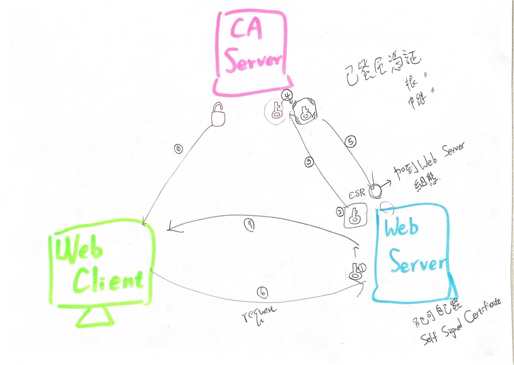

# https

- 2019/01/21
- [ssl參考](https://github.com/cool21540125/documentation-notes/blob/master/network/web%20server/ssl.md)

1. 觀念
2. Apache 實作
3. Nginx 實作
4. Letsencrypt 作業

## 1. 觀念

### 概念性架構

詳 Tony 手繪神作

### 概念性步驟:

1. Config Web Server (vhost && resources)
2. Firewall, Permission, SELinux(if Enforcing)
3. Routing (DNS or /etc/hosts)
4. Goto [SSL For Free](https://www.sslforfree.com/), Your FQDN
5. Manual Verification
    1. Download File (檔案裏頭一堆看不懂的 `HASH`), 假設該檔名為 Zr2Q7
    2. 放到 Web Server 站台的 {DocumentRoot}/.well-known/acme-challenge/Zr2Q7
    3. Restart Service
    4. Browser → `http://YOUR_FQDN/.well-known/acme-challenge/Zr2Q7`
    5. Download SSL Certificate
        1. Save `Certificate` → `/Path/To/Certificate/XXX.crt`
        2. Save `Private Key` → `/Path/To/Key/YYY.key`
        3. Save `CA Bundle`   → `/Path/To/CaBundle/zzz.crt` (不知道啥場合用得到它...)
6. Install SSL packages, set certificate path:
    1. SSL Certificate     : `/Path/TO/Certificate/XXX.crt`
    2. SSL Certificate Key : `/Path/TO/Key/YYY.key`
7. Restart Web Server
8. https://YOUR_FQDN   新鮮的 https 出爐~


## 2. Apache 實作

### 1. vhost (Step 1~3)

```sh
### 安裝
$# yum install -y httpd

### Service
$# systemctl start httpd

### Firewall / Security Group
### DNS / Route53

### vhost
$# vim /etc/httpd/conf.d/vhost.conf
# ------------ 內容如下 ------------
<VirtualHost *:80>
    ServerName          www1.tonychoucc.com
    DocumentRoot        /srv/tonychoucc1/www
</VirtualHost>
<Directory /srv/tonychoucc1/www>
    require all granted
</Directory>

<VirtualHost *:80>
    ServerName          www3.tonychoucc.com
    DocumentRoot        /srv/tonychoucc3/www
</VirtualHost>
<Directory /srv/tonychoucc3/www>
    require all granted
</Directory>
# ------------ 內容如上 ------------

### 資源 - tonychoucc1
$# mkdir -p                                         /srv/tonychoucc1/www/page
$# echo '<h1>www1</h1>' >>                          /srv/tonychoucc1/www/index.html
$# echo '<a href="/page/page1.html">page1</a>' >>   /srv/tonychoucc1/www/index.html
$# echo '<h1>This is Page1</h1>' >>                 /srv/tonychoucc1/www/page/page1.html
$# echo '<a href="/">index</a>' >>                  /srv/tonychoucc1/www/page/page1.html

### 資源 - tonychoucc3
$# mkdir -p /srv/tonychoucc3/www
$# echo 'www3' >> /srv/tonychoucc3/www/index.html

### SELinux
$# restorecon -RFv /srv

### Service
$# systemctl restart httpd
```

* http://www1.tonychoucc.com
* http://www3.tonychoucc.com


### 2. SSL For Free (Step 4~5)

- [SSL For Free](https://www.sslforfree.com/)
- 目標網頁 FQDN:「www1.tonychoucc.com」
- 依照指示... 一步一步作下去......

```sh
### acme challenge
$# mkdir -p /srv/tonychoucc1/www/.well-known/acme-challenge
$# cd       /srv/tonychoucc1/www/.well-known/acme-challenge

### 驗證檔
# 處理驗證碼部分

$# systemctl restart httpd

### 前往 Browser
# 可以看到這些神秘的 HASH
```

下載 `Certificate`, `Private Key`, `CA Bundle`

```sh
$# vim /etc/pki/tls/certs/www1.crt
$# vim /etc/pki/tls/private/www1.key
$# vim /etc/pki/tls/certs/www1-bundle.crt
```


### 3. https in Apache (Step 6~8)

```sh
### package
$# yum install -y mod_ssl

$# vim /etc/httpd/conf.d/vhost.conf
# ------------ 修改內容如下 ------------
# ↓↓↓ 第一種寫法 (AAA part) ↓↓↓
<VirtualHost *:80>
    ServerName          www1.tonychoucc.com
    Redirect    permanent       /       https://www1.tonychoucc.com/
</VirtualHost>
# ↑↑↑ 第一種寫法 (AAA part) ↑↑↑
<VirtualHost *:443>
    ServerName          www1.tonychoucc.com
    # ↓ ssl 部分 ↓
    SSLEngine           On
    SSLCertificateFile          /etc/pki/tls/certs/www1.crt
    SSLCertificateKeyFile       /etc/pki/tls/private/www1.key
    # ↑ ssl 部分 ↑
    DocumentRoot        /srv/tonychoucc1/www
</VirtualHost>

<Directory /srv/tonychoucc1/www>
    require all granted
</Directory>
# ------------ 修改內容如上 ------------

# ↓↓↓ 第二種寫法 (AAA part) ↓↓↓
<VirtualHost *:80>
    ServerName                  www1.tonychoucc.com
    RewriteEngine               On
    RewriteRule         ^(/.*)$ https://${HTTP_HOST}$1 [redirect=301]
</VirtualHost>
# ↑↑↑ 第二種寫法 (AAA part) ↑↑↑

$# systemctl restart httpd
```

新鮮的 https 出爐了~


## 3. Nginx 實作

### 1. vhost (Step 1~3)

```sh
### 安裝
$# curl http://nginx.org/keys/nginx_signing.key > nginx_signing.key
$# rpm --import nginx_signing.key
$# vim /etc/yum.repos.d/nginx.repo
# ------------ 內容如下 ------------
[nginx]
name=Nginx Repo
baseurl=http://nginx.org/packages/centos/7/$basearch/
gpgcheck=1
enabled=1
# ------------ 內容如上 ------------
$# yum install -y nginx

### Service
$# systemctl start nginx

### Firewall / Security Group
### DNS / Route53

### vhost
$# vim /etc/nginx/conf.d/vhost.conf
# ---------- 內容如下 ----------
server {
    listen          80;
    server_name     www5.tonychoucc.com;
    location ~ {    # URL 資源點
        root        /srv/tonychoucc5/www;  # 實體位置
    }
}

server {
    listen          80;
    server_name     www6.tonychoucc.com;
    location / {
        root        /srv/tonychoucc6/www;
        index       qoo.html;   # 修改預設首頁為此 (預設為 index.html)
    }
}
# ---------- 內容如上 ----------

### 資源 - tonychoucc5
$# mkdir -p                                         /srv/tonychoucc5/www/page
$# echo '<h1>www5</h1>' >                           /srv/tonychoucc5/www/index.html
$# echo '<a href="/page/page5.html">page5</a>' >>   /srv/tonychoucc5/www/index.html
$# echo '<h1>This is Page5</h1>' >                  /srv/tonychoucc5/www/page/page5.html
$# echo '<a href="/">index</a>' >>                  /srv/tonychoucc5/www/page/page5.html

### 資源 - tonychoucc6
$# mkdir -p /srv/tonychoucc6/www
$# echo '<h1>I am qoo.html</h1>' >                  /srv/tonychoucc6/www/qoo.html
$# echo '<h2>This is www6.tonychoucc.com</h2>' >>   /srv/tonychoucc6/www/qoo.html
$# echo '<a href="/index.html">index</a>' >>        /srv/tonychoucc6/www/qoo.html
$# echo '<h1>I am index.html</h1>' >                /srv/tonychoucc6/www/index.html
$# echo '<a href="/qoo.html">qoo</a>' >>            /srv/tonychoucc6/www/index.html

### SELinux
$# restorecon -RFv /srv

### Service
$# nginx -t
$# nginx -s reload
```

* http://www5.tonychoucc.com
* http://www6.tonychoucc.com

### 2. SSL For Free (Step 4~5)

- [SSL For Free](https://www.sslforfree.com/)
- 目標網頁 FQDN:「www5.tonychoucc.com」
- 依照指示... 一步一步作下去......

```sh
### acme challenge
$# mkdir -p /srv/tonychoucc5/www/.well-known/acme-challenge
$# cd       /srv/tonychoucc5/www/.well-known/acme-challenge

### 驗證檔
# 處理驗證碼部分

$# systemctl restart nginx

### 前往 Browser
# 可以看到這些神秘的 HASH
```

下載 `Certificate`, `Private Key`, `CA Bundle`

```sh
$# vim /etc/pki/tls/certs/www5.crt
$# vim /etc/pki/tls/private/www5.key
$# vim /etc/pki/tls/certs/www5-bundle.crt
```

### 3. https in Nginx (Step 6~8)

```sh
### vhost
$# vim /etc/nginx/conf.d/vhost.conf
# ------------ 修改內容如下 ------------
server {
    listen 80;
    server_name www5.tonychoucc.com;
    return 301 https://$host$request_uri;
}
server {
    listen 443 ssl default_server;
    server_name www5.tonychoucc.com;
    location / {
        root    /srv/tonychoucc5/www;
    }
}
# ------------ 修改如上 ------------

$# vim /etc/nginx/nginx.conf
# ------------ 修改如下 ------------
# ...(別動)
http {
    # ...(別動)
    ssl_certificate             /etc/pki/tls/certs/www5.crt;
    ssl_certificate_key         /etc/pki/tls/private/www5.key;
    # ...(別動)
}
# ------------ 修改如上 ------------

$# nginx -t
$# nginx -s reload
```

新鮮的 https 出爐了~

