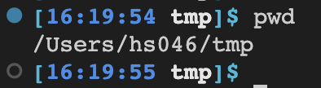
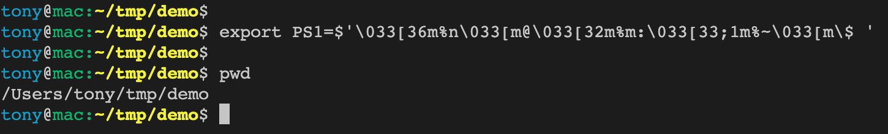

# bash



```bash
CYAN="\[\e[01;36m\]"
WHITE="\[\e[01;37m\]"
BLUE="\[\e[01;34m\]"
TEXT_RESET="\[\e[00m\]"
TIME="\t"
CURRENT_PATH="\W"
ROOT_OR_NOT="\$"
export PS1="${CYAN}[${BLUE}${TIME}${WHITE} ${CURRENT_PATH}${CYAN}]${ROOT_OR_NOT}${TEXT_RESET} "

```

```bash
CYAN="\[\e[01;36m\]"
BLUE="\[\e[01;34m\]"
TEXT_RESET="\[\e[00m\]"
export PS1="${CYAN}[${BLUE}\W${CYAN}]\$${TEXT_RESET} "

```


# zsh

- `\e[0;31m` turn on foreground to red
- `\e[0m` turn off character attributes
- `[01;36m` make bold



```sh
export PS1=$'\033[36m%n\033[m@\033[32m%m:\033[33;1m%~\033[m\$ '

### 僅絕對路徑(green)
export PS1=$'\033[32;1m%~\033[m\$ '

### 僅當前路徑(green)
export PS1=$'\033[32;1m%1d\033[m\$ '
```


```sh
### red
PS1=$'\e[0;31m$ \e[0m'

### green
PS1=$'\e[0;32m$ \e[0m'

```