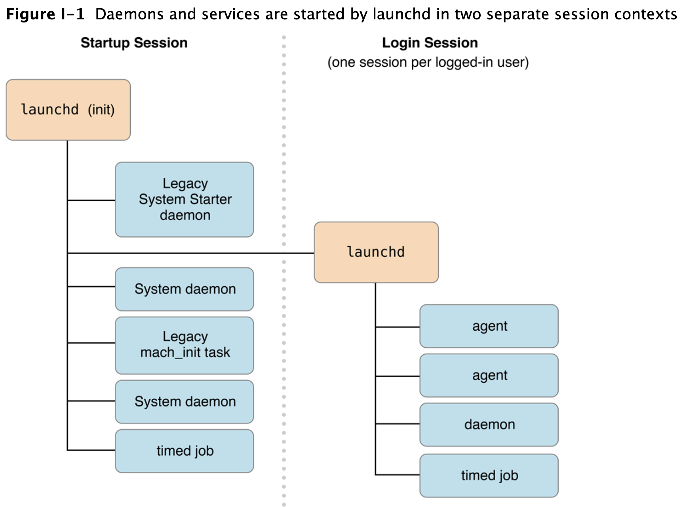

- https://developer.apple.com/library/archive/documentation/MacOSX/Conceptual/BPSystemStartup/Chapters/CreatingLaunchdJobs.html#//apple_ref/doc/uid/10000172i-SW7-BCIEDDBJ



```zsh
svc=com.datadoghq.agent.plist
plist=/Library/LaunchDaemons/$svc

### list all LaunchDaemons
launchctl list       # list user  launchdaemons
sudo launchctl list  # list system launchdaemons


sudo launchctl start $svc
sudo launchctl stop $svc

sudo launchctl list | grep "PID\|runner" | grep -v "grep"

launchctl enable $svc


sudo launchctl load -w $plist
sudo launchctl unload -w $plist
```
