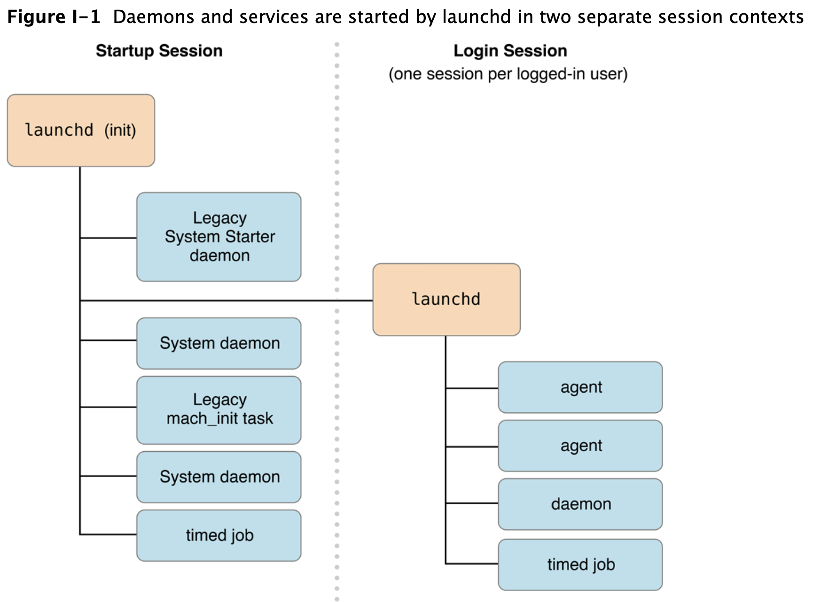

- https://developer.apple.com/library/archive/documentation/MacOSX/Conceptual/BPSystemStartup/Chapters/CreatingLaunchdJobs.html#//apple_ref/doc/uid/10000172i-SW7-BCIEDDBJ



```zsh
svc=com.datadoghq.agent.plist
plist=/Library/LaunchDaemons/$svc

### list all LaunchDaemons
launchctl list       # list user  launchdaemons
sudo launchctl list  # list system launchdaemons
# 第 1 欄 : process id
# 第 2 欄 : 前次的 exit code
# 第 3 欄 : label (plist 裡頭的 Label key string)


### 查詢
# launchctl print system/org.apache.httpd
# launchctl print <domain>/<item>
#   <domain>/<item> 可以是:
#     `system/<service>`
#     `user/<UID>`
#     `pid/<PID>`
#     `session/<asid>`


sudo launchctl start $svc
sudo launchctl stop $svc

sudo launchctl list | grep "PID\|runner" | grep -v "grep"

launchctl enable $svc


sudo launchctl load -w $plist
sudo launchctl unload -w $plist
```
