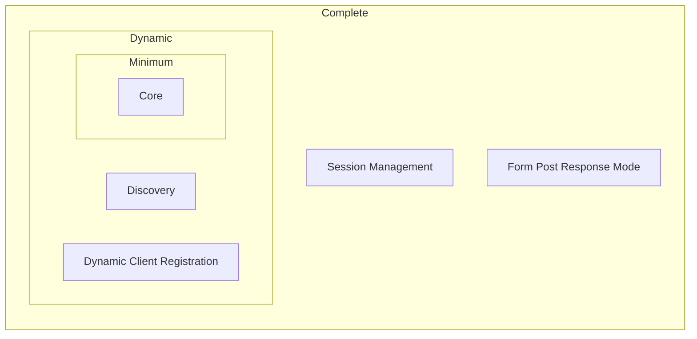

# OpenID

- https://openid.net/developers/how-connect-works/
- 簡稱
  - OP, OpenID Provider
  - IDP, Identity Provider
  - RP, Relying Party : 將用戶認證外包給 IdP 的 App Service Provider
- OpenID Connect 本身基於 OAuth 2.0 協議

# OpenID Connect Protocol Suite

