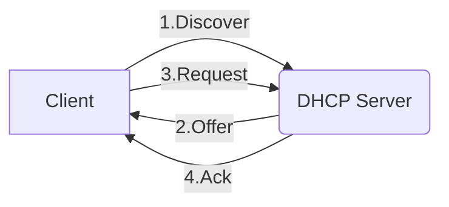

# DHCP 流程

- Client 開機後, 藉由 broadcast (因為此時還沒 IP) 找到 DHCP 請求 IP
- 區網可能有多個 DHCP, 會各自送 Offer (包含 IP, Mask, GW, DNS, 租多久, ...)
- Client 決定要跟誰租以後, 會送 Request
- DHCP 表示知道了, 會紀錄 Client 已租用該 Private IP
- 上頭這些皆為廣播封包

# DHCP 原理

`DHCP Client`(一開始沒有 IP) 向 `DHCP Server` 申請配發 IP 的過程如下:

1. Discover : 假裝自己是 0.0.0.0, 向 255.255.255.255 發送, 試圖找到 DHCP Server
2. Offer : DHCP Server 接收到請求後, 提供一個特定 IP addr 及 其他相關參數資訊
3. Request : DHCP Client 接收後, 請求 Server 出租 Offer 訊息中所提到的 IP
4. Acknowledgement : DHCP Server 接收後, 指派 `IP` && `mask` && `default GW` && `DNS Server IP`

↑ 假如 Client 與 DHCP Server 在同區網...

↓ 事實上, DHCP Server 會藏在層層 Router 後面..., 底下是實際概念流程

由於 Router 不會轉送 廣播訊框(發給 255.255.255.255 的這個位置)

先將 Client 發送的 Discover 的 _來源封包 IP_ 變更為 _Router IP_ (有點類似 masquerade)

(Router 會有個機制, 通常會利用 DHCP Client 的 MAC addr 作為 _用戶端 ID_ 紀錄起來)

再將之轉發給 DHCP Server (這邊的變更 IP & 轉發, 稱之為 `DHCP relay`)

(Router 藉由變更 封包標頭 的 IP 來轉送 DHCP 訊息)

DHCP Server 接收後, 發給 Router, Router 再 廣播給所在區網

而區網內的主機們, 會藉由 _用戶端 ID_ 連辨識是不是發給自己

# DHCP 配置模式

Server 提供 3 種配置模式:

- dynamic allocation(動態配置) : 網管們設定好一些規則(ex: IP 取得後的使用天數 等等), 依照這些規則配送給 Client
- automatic allocation(自動配置) : Server 直接從可配置的 IP 位置之中自動挑選可用 IP, 無使用期限的配發給 Client
- static allocation(靜態配置) : 事先規劃好 MAC addr 對應的 IP 來做配發
