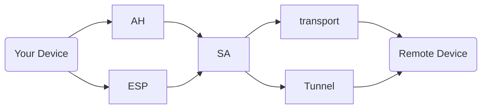

- [淺顯易懂, IPSec - Internet Protocol Security](https://www.firewall.cx/networking/network-protocols/ip-security-protocol.html)
- [Understanding VPN IPSec Tunnel Mode And IPSec Transport Mode](https://www.firewall.cx/networking/network-protocols/ipsec-modes.html)
- [Github - hwdsl2 / setup-ipsec-vpn](https://github.com/hwdsl2/setup-ipsec-vpn)

# IPSec, Internet Protocol Security

- IPsec VPN 表示是遵從 IPsec Protocol 來實作的一種 VPN
  - IPsec 使用 `UDP 500` 及 `UDP 4500`
  - IPSec protocol 的目標, 是用來提供 對於機敏資料 的 安全傳輸機制
    - 整個 IPsec 過程, 會經過雙方協議出 SA(如下):
      - encryption
        - 加密機制: des, aes
      - authentication
        - 驗證機制(強到弱): 憑證, PSK
      - integrity
        - 完整性機制(強到弱): sha, md5
      - keygen
        - 由 DH 產生
- ISAKMP(Internet Security Association and Key Management Protocol), 也被稱之為 IKE(Internet Key Exchange)
  - ISAKMP 用來讓 2 hosts 協議出用來建構 資料安全傳輸的方式. 而 ISAKMP 包含了 2 phases:
    - ISAKMP - Phase 1
      - 建構出 first tunnel, 用來保護 later ISAKMP negotiation messages
      - Phase 1 的實作環節, 著重在 2 peers 之間, 協議出 SA(Security Association), ex, 咱們 2 hosts 之間:
        - 要用啥方式來做認證, pre-shared key, password, 還是用 certificate
        - asymmetric encryption 機制是啥, symmetric key 是啥
    - ISAKMP - Phase 2
      - 建構出用來保護 data 的 tunnel
      - Phase 2 的實作環節, 著重在 配置 IPSec
- 打算架設 IPsec vpn 的 Router, 一定需要支援 IPsec VPN server
- IPSec 有 2 mechanisms (安全機制), 可個別使用 or 共同使用:
  - AH, Authentication Header
  - ESP, Encapsulating Security Payload
- IPSec 有 2 modes (傳輸模式), 是情況做最佳配置:
  - Tunnel Mode (default mode)
  - Transport mode

---



---

## AH 安全機制

- 由 sender, 在位於 L3 及 L4 之間, 添加上 _Authentication Header_
- **| IP Header | AH Header | TCP/UDP Header | Payload |**
  - 其中, 上述這一整包會做 checksum, 放置到 AH Header, 用以防止篡改

## ESP 安全機制

- 相較於 AH 複雜多了, ESP 提供了 認證, 重播驗證, 完整性檢查, 加密 等等
- **| IP Header | ESP Header | TCP/UDP Header | Payload | ESP Trailer | ESP Auth Trailer |**
  - 其中, `TCP/UDP Header | Payload` 分別為 L4 及 L5,6,7
  - 其中, `TCP/UDP Header | Payload | ESP Trailer` 由 ESP 做加密
  - 其中, `ESP Header | TCP/UDP Header | Payload | ESP Trailer` 是由 ESP Client 做 signs, 防止篡改

## Tunnel 傳輸模式

- 適用於 site-to-site communications
  - 用於 2 個 Routes 之間的配置
  - IPsec tunnel mode 之下, 包含 `Source IP Header` 也被加密了
- ESP
  - **| New IP Header | ESP Header | IP Header | TCP/UDP Header | Payload | ESP Trailer | ESP Auth Trailer |**
    - 其中, `IP Header | TCP/UDP Header | Payload` 為 Original IP Packet
    - 其中, `IP Header | TCP/UDP Header | Payload | ESP Trailer` 為 Encrypted with ESP Header
    - 其中, `ESP Header | IP Header | TCP/UDP Header | Payload | ESP Trailer` 為 Signed by ESP Auth Trailer
    - 其中, ESP is identified in the `New IP Header` with an IP protocol ID of 50.
- AH
  - **| New IP Header | Auth Header | IP Header | TCP/UDP Header | Payload |**
    - 其中, `IP Header | TCP/UDP Header | Payload` 為 Original IP Packet
    - 其中, `New IP Header | Auth Header | IP Header | TCP/UDP Header | Payload` 為 Signed by Authentication Header
    - 其中, AH is identified in the `New IP Header` with an IP protocol ID of 51.

## Transport 傳輸模式

- 適用於 end-to-end communications
  - `Source IP Header` 不會被加密
- ESP
  - **| Original IP Header | ESP Header | IP Header | TCP/UDP Header | Payload | ESP Trailer | ESP Auth Trailer |**
    - 其中, `Original IP Header` 等同於 `IP Header`
    - 其中, `IP Header | TCP/UDP Header | Payload` 為 Original IP Packet
    - 其中, `IP Header | TCP/UDP Header | Payload | ESP Trailer` 為 Encrypted with ESP Header
    - 其中, `ESP Header | IP Header | TCP/UDP Header | Payload | ESP Trailer` 為 Signed by ESP Auth Trailer
    - 其中, ESP is identified in the `Original IP Header` with an IP protocol ID of 50.
- AH
  - **| Original IP Header | Auth Header | IP Header | TCP/UDP Header | Payload |**
    - 其中, `IP Header | TCP/UDP Header | Payload` 為 Original IP Packet
    - 其中, `Original IP Header | Auth Header | IP Header | TCP/UDP Header | Payload` 為 Signed by Authentication Header
    - 其中, AH is identified in the `Original IP header` with an IP protocol ID of 51.

# Mac 上頭有 3 種 VPN Client 設定方式

- L2TP over IPSec
- Cisco IPSec
- IKEv2(Internet Key Exchange v2, 互聯網密鑰交換第二代) (似乎是比較好的方式)
  - IPsec 協定的 SA 部分中使用的協定
    - SA(Security Associate), 用於交涉加密金鑰和演算法的通訊協定
    - 封包經過加密以後為 ISAKMP
    - 與 VPN client 確認身份驗證後, 使用 `Diffie-Hellman 密鑰交換` 建立加密連線
  - IKEv2 是 IPsec protocol suite
  - `Libreswan` 可用來認證 IKEv2 client. 基於 X.509 Machine Certificates using RSA signatures
    - 不會要求 IPsec PSK, username or password
      - PSK: pre-shared keys

```bash
systemctl status ipsec
```
