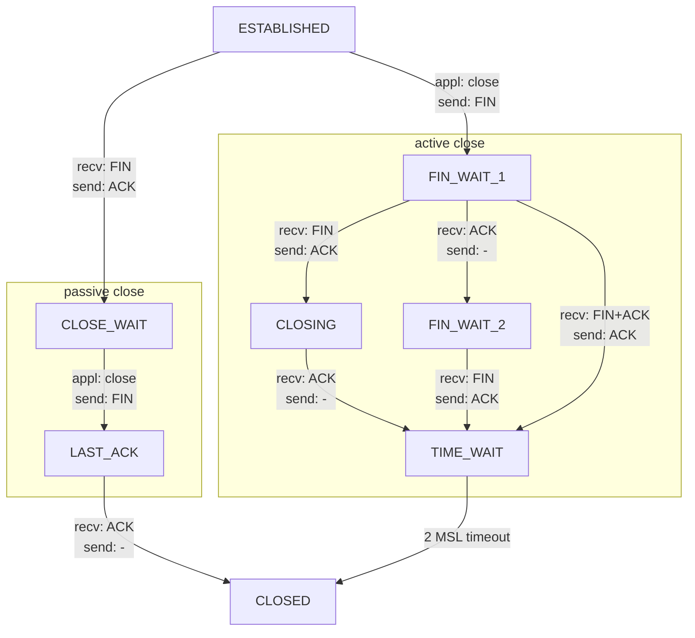

- https://learn.microsoft.com/en-us/answers/questions/230227/time-wait-from-netstat
- https://distributedsystemsblog.com/posts/tcp-connection-terminate/

---

---

- Server `accept()` 之後 => `LISTEN`
- Client `發送 SYN` 之後 => `SYN_SENT`
- Server `接收 SYN` 之後, `發送 SYN, ACK` => `LISTEN`
- Client `接收 SYN, ACK` 之後, `發送 ACK` => `ESTABLISHED`
- Server `接收 ACK` 之後 => `ESTABLISHED`
