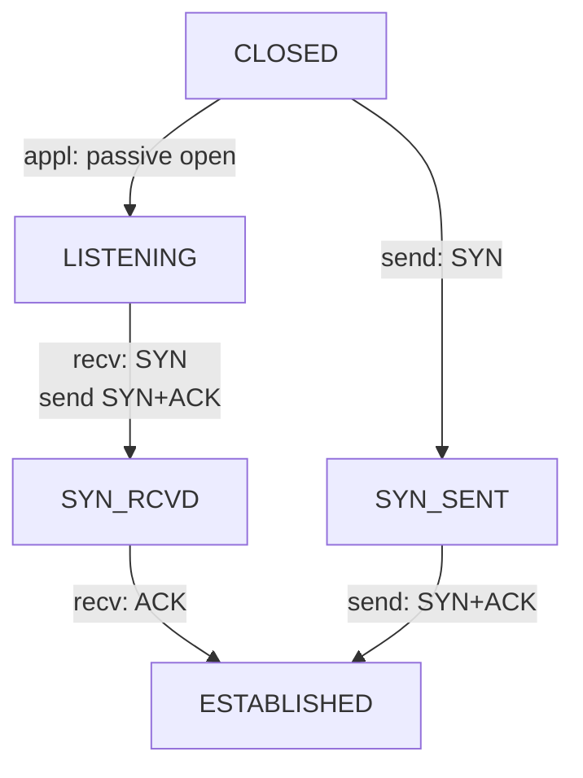

- https://distributedsystemsblog.com/posts/tcp-connection-establish/

# TCP 連線建立 - 狀態

---

- Server `accept()` 之後 => `LISTEN`
- Client `發送 SYN` 之後 => `SYN_SENT`
- Server `接收 SYN` 之後, `發送 SYN, ACK` => `LISTEN`
- Client `接收 SYN, ACK` 之後, `發送 ACK` => `ESTABLISHED`
- Server `接收 ACK` 之後 => `ESTABLISHED`
