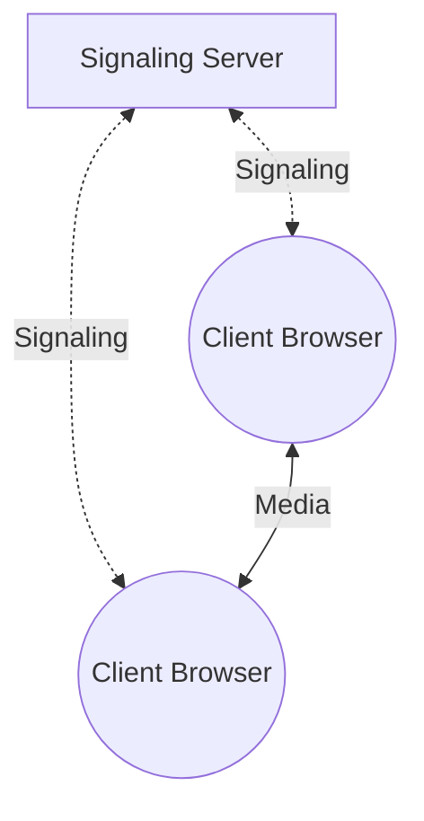

# HLS, HTTP Live Streaming

- HLS 將 video 拆分成 small chunks, 藉由 HTTP 傳輸, 跨平台兼容 (a streaming protocol)
    - 基本上一個 chunk 是個 10 secs 的東西
    - 而這些拆分後的 chunks 為 `playlist file`, 通常是 `M3U8` (此為 file format, 並非 codes)
    - Client Media Player 下載 playlist file && requests the segments from the server via HTTP
    - 最終這些 segments are downloaded and played back in sequence by the media player
- Apple 搞出來的 protocol
- HLS 的重點之一是 adaptive bitrate streaming(自適應比特率流)
    - Client 會因應當前的網路狀況, 自動調整 media quality
- 2023 年的現在, 廣泛應用於 live events && video-on-demand services

# DASH, Dynamic Adaptive Streaming over HTTP

- 類似於 HLS
- 對於 Live Streaming, Youtube 使用這個
    - 還有其他...(GPT 說的)
    - 像是 直播中 的 playback, 則支援了像是 RTMP 來做 Progressive Download for on-demand content

# RTMP, Real-Time Messaging Protocol

- 上古時代, 由 Adobe 搞出來的
    - 自從 HLS, DASH 出來以後, RTMP 使用量已經大幅減少
    - 不過某些 niche Apps 仍有在使用, 像是某些 Online Game 或是 Live Sports Streaming
- 用來在網路上 streaming audio, video, data
    - 當初的主要目的, 是要能夠在 `(Adobe Flash)Player` 及 `(Adobe Flash)Media Server` 之間能夠高效傳輸 audio/video
- Client 會與 Server 建立 persistent connection
- 支援 H.264, AAC, MP3, adaptive bitrate streaming(自適應比特率流, 可調整 quality 啦)

# WebRTC, Web Real-Time Communication (a technology)

- RTC, Real Time Communication(可見即時通訊)
- 讓 Web App 及 Sites 之間, 能夠 capture 及 optionally stream **stream audio and/or video media**, 以及在 browsers 之間 exchange arbitrary data (無需中介)
- 核心概念大概可分成: 
    - `Media Capture and Streams API`
        - 讓 Browser 可以直接存取 本地 的 多媒體串流(ex: 攝影機)
    - `peer-to-peer connection`
- Google Meet 的 audio/video 藉由 WebRTC 
    - 有使用到 `VP9 video codec` 使用 lower bitrates 來傳輸 high-performance video codes
- WebRTC 使用 `signaling protocol` 來協助處理 2 clients 之間的 exchange of `session description` information
    - session description 包含了像是 
        - codecs
        - transport protocols
        - network addresses that will be used to establish the media stream between the clients
    - WebRTC 所使用的 signaling protocol 並非標準 protocol, 像是可使用 SIP, XMPP, custom protocols 來替代
    -  signaling process 基本上會混合 TCP && UDP
        - TCP for handshake and negotiation
        - UDP for transmission

## WebRTC API

- getUserMedia()    : 用來取得用戶 local 的 Video 或 Audio
- MediaRecorder     : 錄製多媒體數據
- RTCPeerConnection : 代表一個 local 到 remote 的 WebRTC Connection

# Codes

- 此為 Video/Audio data 的 compression algorithm, 直接攸關:
    - desired quality
    - target platform
    - processing power
- popular codecs for `Video Streaming`
    - VP8        : Google 搞出來的 video codec(前身為 VP9)
    - HEVC/H.265 : 有著更佳的 compression performance, video codec (前身為 H.264)
    - AV1        : *Alliance for Open Media, AOMedia* 搞出來的 開源 video codec
- popular codecs for `Audio Streaming`
    - MP3        : 
    - Opus       : high compression performance && low latency. 適合用於 real-time Apps
    - AAC        : popular audio codec for streaming. 經常與 MP4 容器格式的 H.264 video codec 一起使用

# Other (還不知道怎麼分類)

- Bitrate
    - live streaming process 每秒的 data transfer amount
    - 影響 quality of streamed audio/video (ex: 流暢度, smoothness)
- Resolution
    - 螢幕顯示的 pixels
    - 直接攸關 bitrates && compression algorithms
- Frame rate
    - Video 的 frame rate, 每秒顯示的 frames 數量
    - 直接攸關 bitrates && processing power
- Keyframe interval
    - streaming process 的 Keyframe interval 用來設定 影像壓縮時每隔多少 frame 就要再加入一個完整的 Keyframe
        - 設太高, 會導致檔案過大, 影響傳輸流量
        - 設太低, 會影響映像品質, 甚至導致某些 編碼器 無法正常解碼
    - keyframe 也稱之為 Intra Frame
    - 影像壓縮的傳輸過程, 每個 frame 都是可以獨立進行壓縮, 兩個 frames 之間存在大量重複內容, 因而可透過 Keyframe 近一步壓縮視頻
    - Keyframe 通常由於場景切換 or 長時間間隔的因素而出現
        - Keyframe 後面的 Frame, 稱之為 Predictive Frame(P-Frame) 或是 Bidirectional Frame(B-Frame)
- Latency
    - 影像製造者 與 觀看者 差異的時間 (secs)
- Buffer Size
    - 影像播放前, 儲存在 memory 的資料量
- Encryption
    - 影像加密, 像是可搭配 AES && SSL/TLS