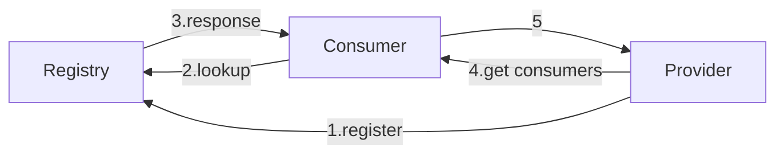
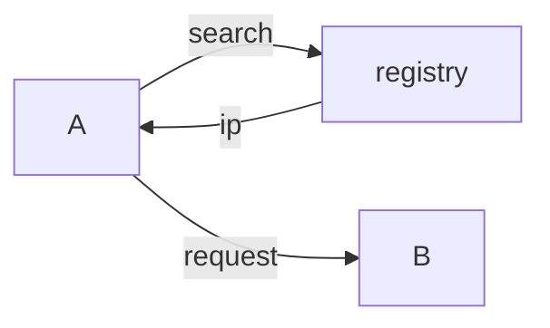
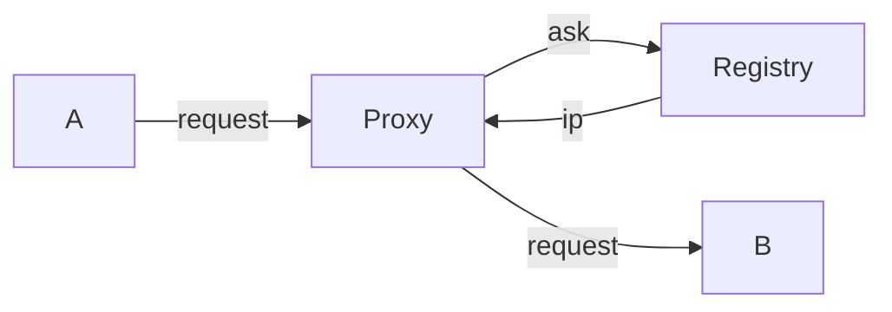
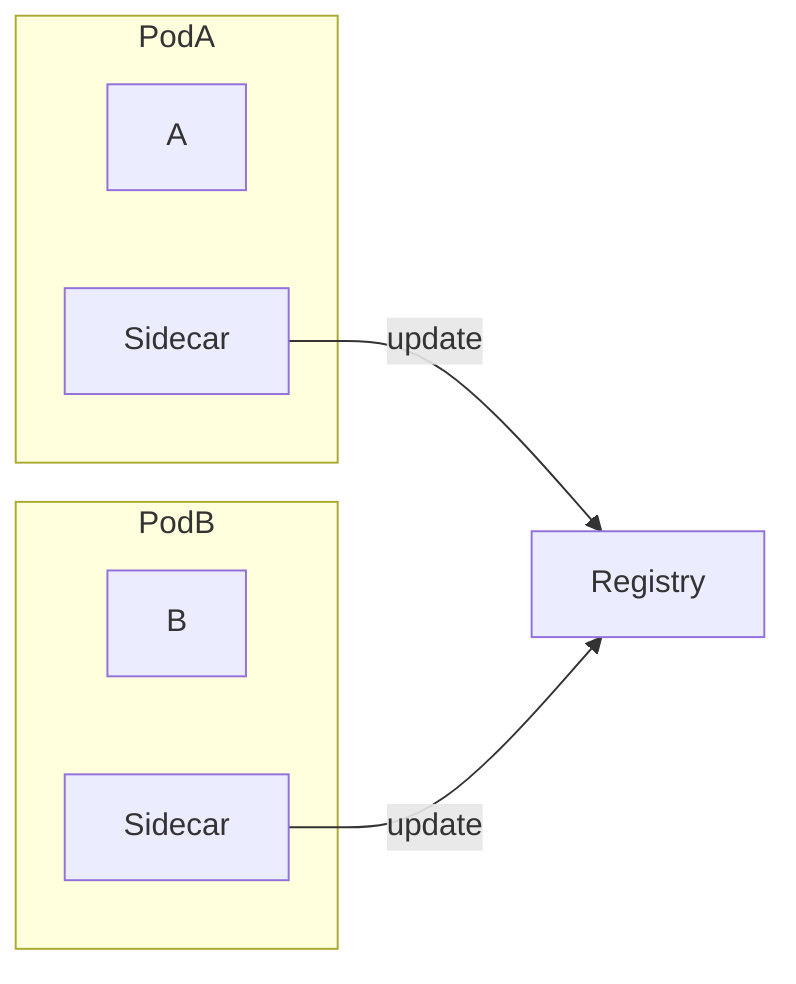

# Service Discovery Concepts

- Service Discovery 核心元件
    - Service Provider
        - 加入/離開 系統時, 都必須到 Registry 註冊
    - Service Consumer
        - 由 Registry 查出 Provider 的 location, 並且 connect to Provider
    - Service Registry
        - 記錄所有加入系統內的 Instances 的 location 的 DB
        - 必須為 HA (by Replicaiton)


------------------------------------------------------------

# Service Discovery Patterns

## Client Side Discovery



## Server Side Discovery

------------------------------------------------------------

# Service Registration Options

## Self-Registration / Sidecar Pattern


## 3rd-Party Registration / Orchestration
```mermaid
flowchart TB;

subgraph Cluster
    3rd["3rd Registrar"]
    3rd -- update --> Registry;
    3rd -- watch -.-> A["A"]
    3rd -- watch -.-> B[" "]
    3rd -- watch -.-> C["C"]
end

3rd -- "watch 不到" -.-> D["Ｄ"]
```

------------------------------------------------------------
