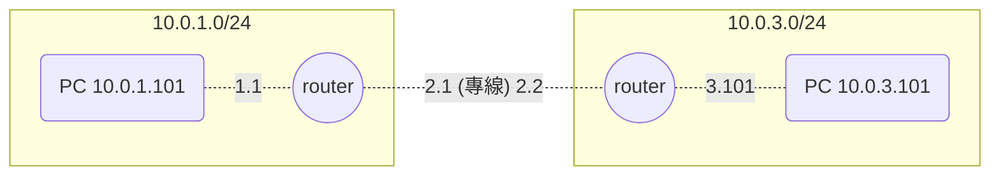
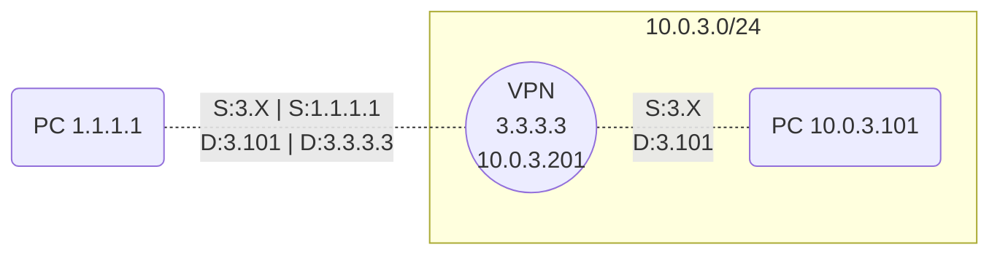
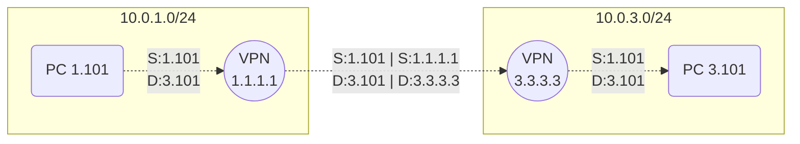
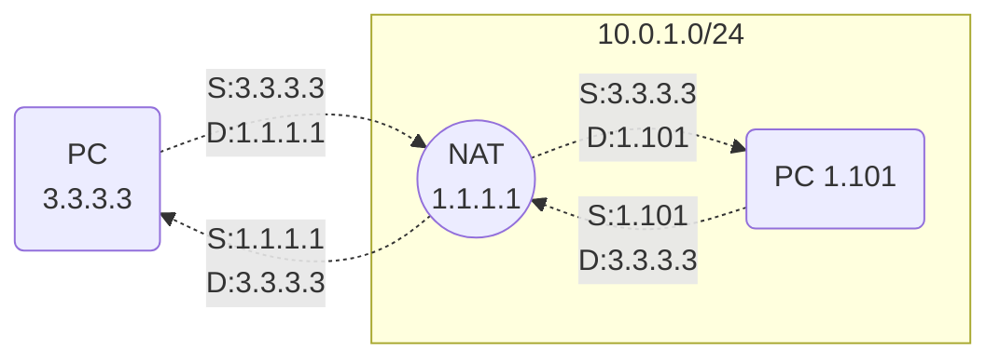

# VPN

- iOS 大概在 2020 年(2024 的現在我不曉得), 只支援了 IPsec vpn 及 openvpn
  - 而更早之前, 還有支援 PPTP, 不過似乎已經被視為不安全了?
- VPN 區分成 2 種:
  - Site-to-Site VPN / VPN Tunnel
    - 網段 對 網段
    - 本身做了 Encapsulation + Encryption
      - VPN 不要與 NAT 搞混!
        - VPN 會有 2 個 Header; NAT 只有 1 個 Header (??)
  - Point-to-Point VPN / Remote Access VPN
    - 點 對 點
- VPN 依照如何轉送流量(?)區分為 2 種方式
  - Policy-based VPN
    - 使用 Policy-Based VPN elements, 借助 firewall access rules 來定義流量
    - Policy-based VPN 建議使用情境:
      - 適合多裝置之間的傳輸, ex: full mesh, partial mesh, star, and hub topologies.
      - 適合 mobile VPN with IPsec tunnels, SSL VPN tunnels, 或 both IPsec and SSL VPN tunnels
  - Route-based VPN
    - 使用 Route-Based VPN Tunnel elements, 任何被路由到 防火牆介面 的流量, 都會進入 VPN Tunnel
    - Route-based VPN 建議使用情境:
      - 適合用於需要 動態路由(ex: OSPF, BGP), integrity, multicast 等場合
        - 本身藉由 GRE, IP-IP, SIT tunnels 封裝(但不加密)流量
- 各種不同的 VPN 比較
  - IPsec VPN
    - 運行於 L3 的網路層, 針對 IP packet 做加密
  - SSL VPN
    - 運行於 L7 的應用層, 針對 HTTP traffic 做加密

## VPN 各種實做

- [WireGuard VPN](https://github.com/hwdsl2/wireguard-install)
- [OpenVpn](https://github.com/hwdsl2/openvpn-install)
- [IPsecVpn](https://github.com/hwdsl2/setup-ipsec-vpn)
  - `libreswan` 為 IPser service 的實作, 在 OS 上面可能用 ipsec 作為體現
  - `xl2tpd` 為 L2TP provider 的實作
    - 依賴於 `/dev/ppp`

# 比較

## 專線

## Remote Access VPN / Point-toPoint VPN / 翻牆

- 送往 VPN 的請求, 可決定是否將 `S:3.X D:3.101 + Payload` 做加密
  - 不過 `S:1.1.1.1 D:3.3.3.3` 無法做加密, 因為加密了以後就無法識別 Source Destination
- PC 撥通 VPN 以後, VPN 會藉由 DHCP 給 PC 一組 `3.X` 的 Private IP

## Site-to-Site VPN

## NAT

- 口訣: 出去換來源, 回來換目的

