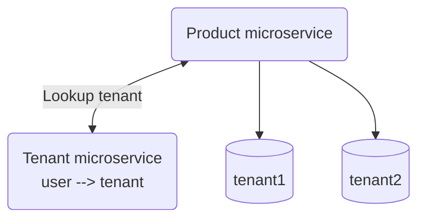
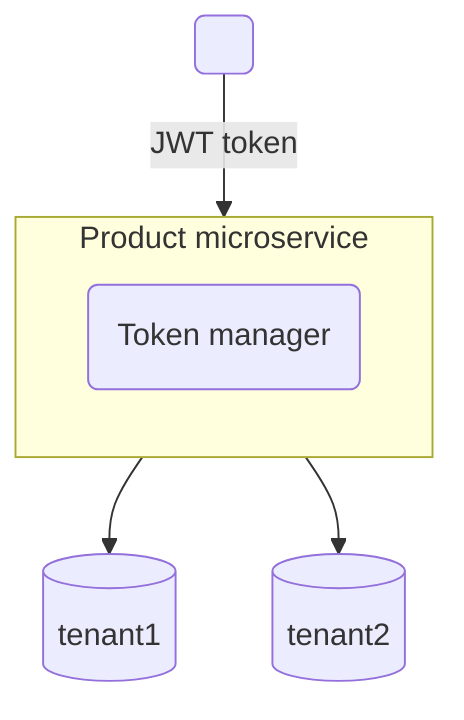

# JWT 架構

- https://jwt.io/
- jwt 組成, 由「.」分成 3 個部分的 Base64 編碼, ex: 「AA.BB.CC」
  - Header : base64(Token type && hash(Signature))
  - alg : 預設是 HMAC SHA256, HS256 ?
  - type : 為 Token 類型
  - Payload/Claims : base64(Information(ex: User info))
    - Decoded Payload 的欄位:
      - sub : 這就是
  - Signature : base64(hash(Header, Payload, Token))

## Externally resolved tenant context

---

## JWT with embedded tenant context

---
