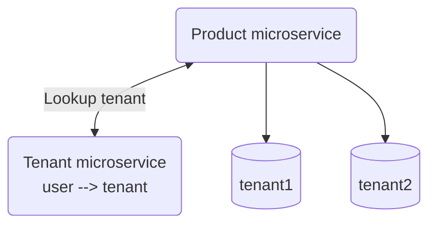
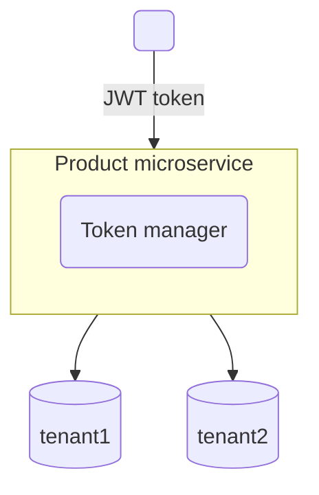

jwt 組成, 由「.」分成 3 個部分的 Base64 編碼, ex: 「AA.BB.CC」

- Header : base64(Token type && hash(Signature))
- Payload/Claims : base64(Information(ex: User info))
- Signature : base64(hash(Header, Payload, Token))

Header:

```js
{
    "typ": "JWT",
    "alg": "AES256"
}
```

Payload

```js
{
    "_id": "",
    "name": "TonyChou",
    "age": 30,
    "exp": 2147483647  // Token 到期的時間
}
```

Signature

---

# JWT 架構

---

## Externally resolved tenant context



---

## JWT with embedded tenant context



---
